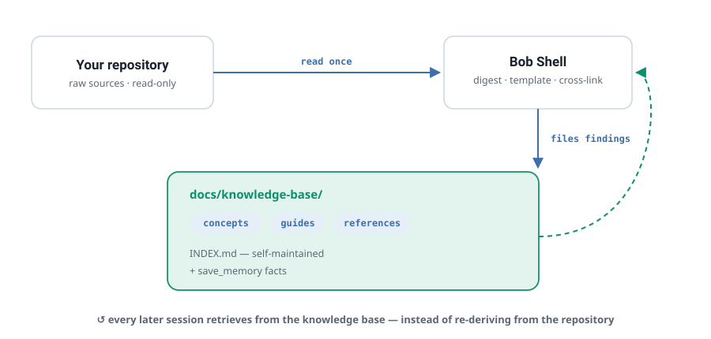

# Bob Shell Knowledge Manager

### Make your codebase's knowledge *compound* — instead of paying to rediscover it every session.

A native **IBM Bob Shell** implementation of Andrej Karpathy's **LLM-Wiki** pattern, engineered for **Bobcoin economy**.

`MIT licensed` · `Native Bob Shell mode` · `No MCP servers` · `No plugins` · `Pattern: LLM-Wiki (Karpathy)`

> **Executive summary.** Every Bob session re-reads and re-reasons about the same codebase — and pays
> Bobcoins to do it, again and again. The fix isn't a shorter prompt; it's a **memory**. Bob Shell
> Knowledge Manager turns Bob into a disciplined maintainer of a living, markdown knowledge base for your
> repository: knowledge is written down once and *retrieved* thereafter, so the bill falls because the work
> stops repeating. It ships as **two native Bob modes** — no plugin, no MCP server, nothing external in the
> loop. In one real run, it scaffolded the documentation strategy for a **94-module platform in six tool
> calls for 0.36 Bobcoins**.

---

## 1. The problem: you're paying to relearn what Bob already knew

IBM's own guidance is blunt about where a session's budget goes. Every turn burns **input**, **output**,
and **reasoning** tokens — and the two you can't see are the expensive ones.

Teams respond by trimming the visible line: disabling tools, pasting less, shortening prompts. That helps —
until it hits a floor. Because the largest recurring cost isn't the prompt. **It's re-derivation.** Session
after session, Bob re-reads your architecture, re-infers the same relationships, and re-explains the same
concepts — because nothing it learned last time survived the end of the thread.

> The cheapest session is the one that never has to think a thought twice.

## 2. The idea we implement: Karpathy's LLM-Wiki

Karpathy's *LLM-Wiki* pattern replaces "retrieve-from-scratch" with a **persistent, compounding artifact**:

> *"The wiki is a persistent, compounding artifact. The cross-references are already there. The
> contradictions have already been flagged."* — as opposed to RAG, where *"the LLM is rediscovering
> knowledge from scratch on every question. There's no accumulation."*

It has three layers:

1. **Raw sources** — your code and docs. Immutable; the model reads, never edits.
2. **The wiki** — LLM-owned markdown: concepts, guides, references, cross-links.
3. **The schema** — a config that makes the model *"a disciplined wiki maintainer rather than a generic chatbot."*

His load-bearing insight: *"the tedious part of maintaining a knowledge base is not the reading or the
thinking — it's the bookkeeping."* LLMs are extraordinary bookkeepers. Point one at your repo, and the
knowledge base maintains itself.

## 3. What this is: the pattern, made native to Bob Shell

Bob Shell Knowledge Manager is that pattern, built entirely on Bob's **native** capabilities — no plugin,
no MCP server, no external service in the loop:

- **📚 `knowledge-manager` mode** — turns Bob into a structured KB maintainer: concepts / guides /
  references / research, consistent templates, bidirectional cross-references, `save_memory`, and a
  self-updating `INDEX.md`.
- **🔍 `repo-analyzer` mode** — a 7-phase repository audit that runs analysis *scripts* and files digested
  findings into the KB, instead of dragging raw source through the context window.
- **The schema layer** — your `AGENTS.md` plus the mode definition *are* Karpathy's third layer: stable
  rules that make Bob both disciplined and cacheable.

<p align="center">
  
</p>

## 4. Why it saves Bobcoins: structure, not a benchmark

The savings aren't a number we ran once — they're **structural**. Each principle in IBM's token-economy
guidance has a concrete home in how the modes behave:

| IBM principle (*Save Bobcoins*) | The recurring waste | How the modes remove it |
|---|---|---|
| **Catalog tax** | Every enabled MCP server re-sends its full tool catalog *every turn* | Native Bob mode — **no plugin, no MCP** to load |
| **Payload tax** | A 2,000-line file attached when 20 lines matter | `repo-analyzer` runs scripts that **summarise**; the KB stores digested reports you *cite*, not raw source |
| **Compression trap** | Stripping meaning to save input backfires (a study measured **+67% cost**) | Templates **preserve** meaning — rationale, real names, cross-refs — structured, not stripped |
| **Short threads** | Turn 15 re-pays 14 turns of stale history | Knowledge persists in KB files + `save_memory`; a fresh thread **retrieves** it instead of re-deriving it |
| **Let caching work** | Reworded prefixes miss the cache | Fixed mode definition + `AGENTS.md` + KB layout = a **cacheable prefix** |
| **Trim output** | Verbose narration is paid on every reply | Bounded artifacts: templates, `INDEX.md`, reports — not essays |
| **The three budget columns** | Output & reasoning cost more than input | A curated KB shrinks all three: less to **read**, less to **reason** about, less to **write** |

**So what:** the mode makes the cheap path the *default* path. You don't have to remember the discipline —
the mode **is** the discipline.

## 5. Proof point: a 94-module platform, documented for 0.36 coins

A real run on **HCD At Its Core** — IBM's Hyper-Converged Database teaching platform: 94 interactive demo
modules, a decorator-based Python engine, an adversarial "Audit Arena" test framework. The prompt: *act as
knowledge manager for this codebase; analyse it and propose the first five documents worth writing.*

Bob's answer, in **six tool calls**:

- Correctly read the architecture — V3 engine, the `@demo_module` decorator, context-fixture injection,
  the Audit Arena tribunal.
- Proposed **five targeted, correctly-typed documents** (two concepts, two guides, one API reference) —
  each with a rationale and a content outline.
- **Cost: 0.36 Bobcoins** — under 1% of a session budget. ~2 minutes. No retries.

One run is one data point, not a benchmark — but it's the *shape* of the value: **structured, accurate, and
cheap enough to run on every repo you touch.** Full transcript: `evaluation/LIVE_EXAMPLE_HCD_ANALYSIS.md`.

## 6. How it compares: the thesis, the engine, and the native port

Three points on one line — from an idea, to a full research engine, to a frugal Bob-native port:

| | **Karpathy's LLM-Wiki** · the thesis | **nvk/llm-wiki** · the engine | **Bob Shell KM** · this project |
|---|---|---|---|
| **Nature** | The blueprint / pattern | A full multi-agent implementation | The pattern, native to Bob Shell |
| **Platform** | Any LLM (concept) | Claude Code, Codex, OpenCode… | **IBM Bob Shell** |
| **Mechanism** | 3 layers: raw / wiki / schema | Plugin + `/wiki:*` commands, a hub of topic wikis | Two modes + templates + KB + scripts |
| **Research** | You curate | 5–10 parallel agents, auto-compile, thesis mode | Single-agent, natural language, script-assisted |
| **Setup** | DIY | Install a plugin | `install.sh` — **no plugin, no MCP** |
| **Cost posture** | Frugal by design | Powerful; heavier per run | **Engineered for Bobcoin economy** |
| **Reach for it when…** | You want the idea | You want a research hub in Claude Code | **You live in Bob Shell and optimise Bobcoins** |

**So what:** this project doesn't try to out-feature nvk's research engine. It brings Karpathy's
compounding-knowledge idea to Bob Shell users **natively and cheaply** — frugality is the design centre,
not an afterthought.

## 7. Get started in 5 minutes

No custom mode required. Point three scripts at your project, then let any Bob mode do the thinking.

```bash
# 1 · Scaffold the knowledge base in your project
cd ~/your-project
~/Projects/bob-llmwiki-knowledge-manager/scripts/init-project.sh

# 2 · Let the scripts do the reading — a full automated analysis,
#     filed straight into docs/knowledge-base/
~/Projects/bob-llmwiki-knowledge-manager/scripts/run-full-analysis.sh

# 3 · Validate the knowledge-base structure
~/Projects/bob-llmwiki-knowledge-manager/scripts/validate-kb.sh
```

Now stay in **whatever Bob mode you're already using** (Ask, Code, …) and paste this prompt:

```text
I want you to act as a knowledge manager for this codebase.

Your role:
- Document code in docs/knowledge-base/
- Use templates from /Users/david.leconte/Projects/bob-llmwiki-knowledge-manager/config/templates/
- Create concept documents for core ideas
- Create guides for how-to instructions
- Create references for API documentation
- Create research notes for investigations
- Maintain INDEX.md with all documents
- Add cross-references between related documents

Start by analyzing the codebase and suggesting 5 initial documents to create
```

The scripts have already filed digested reports into `docs/knowledge-base/`, so Bob proposes documents
**grounded in evidence it didn't have to re-read** — the same prompt that produced the 0.36-coin result in §5.

> *Optional:* the `knowledge-manager` mode packages this prompt into a one-liner (`./scripts/install.sh` to
> register it). Handy later — not required for the flow above.

## 8. What's in the box

- **2 native Bob modes** — `knowledge-manager`, `repo-analyzer`.
- **4 document templates** — concept · guide · reference · research.
- **A knowledge-base structure** with a self-maintained `INDEX.md` and `save_memory` integration.
- **Core scripts** — `install`, `init-project`, `validate-kb`, `export-kb` (markdown / Obsidian / HTML / PDF).
- **An analysis suite** — scan, dependencies, metrics, security, test-coverage, git-history, docs, and a
  consolidated report.
- **3 worked example knowledge bases** — a software project, a research project, and a personal wiki.

## 9. Maturity: what's proven, what's experimental

Intellectual honesty is part of the pitch. Here is the real maturity map:

- ✅ **Proven & usable today** — the two Bob modes, the templates, the KB workflow, and the analysis
  scripts. *This is the product.*
- 🧪 **Experimental / roadmap** — a Python token-optimization toolkit (exact + semantic cache, prompt
  optimizer, truncation strategies). Promising primitives, **not yet validated end-to-end** on live Bob
  workloads. Treat any performance figure as a **target, not a measurement**.
- ⛔ **Not claimed** — enterprise SLAs, and automated multi-agent research (for that, use `nvk/llm-wiki`).

## References

- **Andrej Karpathy — the LLM-Wiki pattern** · `https://gist.github.com/karpathy/442a6bf555914893e9891c11519de94f`
- **IBM Bob Shell — Save Tokens, Save Bobcoins** · `https://bob.ibm.com/docs/shell`
- **nvk/llm-wiki — a full multi-agent implementation** · `https://github.com/nvk/llm-wiki`
- **Live example — HCD codebase analysis (0.36 coins)** · `evaluation/LIVE_EXAMPLE_HCD_ANALYSIS.md`

---

*Built on Bob Shell's native modes. Inspired by Karpathy's LLM-Wiki and nvk's implementation. Frugal by design.*
