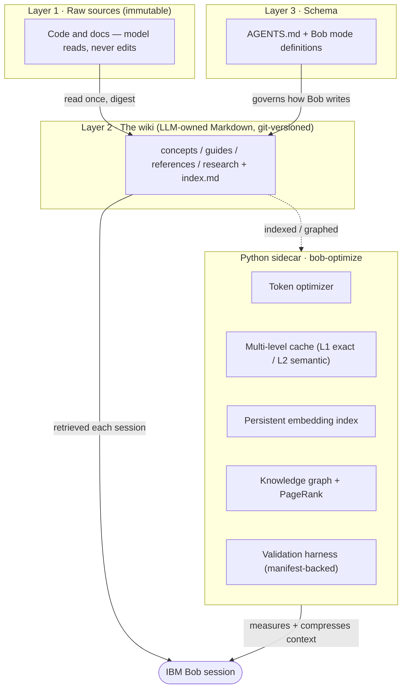
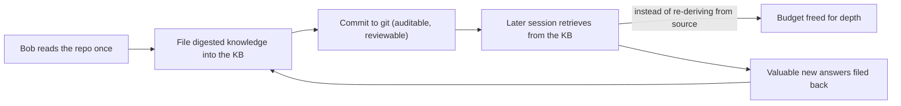

# Mnemox

### *Give IBM Bob a memory. Make your knowledge compound.*

> **Mnemox** — from *Mnemosyne* (Μνημοσύνη), the Greek Titaness of memory and mother of the nine Muses,
> the source from which all knowledge and discovery flow. Before you can create, you must remember; before you
> can go deeper, you must not re-pay for what you already know. **Mnemox is the persistent memory layer IBM Bob
> was missing** — the layer that lets every session start from everything the team already learned, so the budget
> otherwise lost to forgetting is freed for the work that matters: going deeper, thinking broader, attempting the
> problems that were previously too expensive to try.
>
> *Mnemox your workspace. The impossible gets closer with every session.*

A native **IBM Bob** implementation of Andrej Karpathy's **LLM-Wiki** pattern, engineered for the **Bobcoin
economy**: a git-versioned Markdown knowledge base, a schema layer, and a Python sidecar that measures and
compresses what a session spends. Built by **Team BobjectifLune** for the 2026 IBMer watsonx Challenge. Works
identically in **Bob IDE** and **Bob Shell CLI** — same modes, same KB, same compounding benefit.


-success)

`MIT licensed` · `Native Bob modes` · `No MCP servers required` · `No plugins` · `Pattern: LLM-Wiki (Karpathy)` · `Bob Shell CLI` · `Bob IDE`

> 💡 **What is a Bobcoin?** IBM Bob runs on a token-based budget called **Bobcoins** — the internal unit that
> measures how much AI computation each session consumes. Every question, every file Bob reads, every answer costs
> Bobcoins, and the budget is finite and shared. Spending it on *re-derivation* — re-reading files Bob already
> processed, re-reasoning decisions it already made — is waste. Mnemox eliminates that waste structurally.

> **Status in one line.** Mnemox is **Beta — Not Production Ready.** Two verified remediation waves landed through
> 2026-07-20 (retrieval wired into production, integrity gates green, optimizer hardened, path containment applied,
> and — the decisive change — trust now **verified at the read boundary**, see [§13](#13-security-posture)); the main
> remaining work is the retrieval-quality upside and an end-to-end impact benchmark.
> **[STATUS.md](STATUS.md) is the single source of truth for maturity** — any number here defers to it.

---

## Table of contents

1. [The problem: re-derivation consumes the budget](#1-the-problem-re-derivation-consumes-the-budget)
2. [The pattern: Karpathy's LLM-Wiki](#2-the-pattern-karpathys-llm-wiki)
3. [What Mnemox is (and is not)](#3-what-mnemox-is-and-is-not)
4. [The innovative approach — why Mnemox is different](#4-the-innovative-approach--why-mnemox-is-different)
5. [Quick start — `mnemox your workspace`](#5-quick-start--mnemox-your-workspace)
6. [Daily use — starting a session](#6-daily-use--starting-a-session)
7. [What's in the box](#7-whats-in-the-box)
8. [Who this is for](#8-who-this-is-for)
9. [Using the sidecar (Token Optimization System)](#9-using-the-sidecar-token-optimization-system)
10. [Architecture & how it works](#10-architecture--how-it-works)
11. [What is actually measured](#11-what-is-actually-measured)
12. [Status & known limitations](#12-status--known-limitations)
13. [Security posture](#13-security-posture)
14. [Roadmap — where it is going](#14-roadmap--where-it-is-going)
15. [Development](#15-development)
16. [Provenance & honesty policy](#16-provenance--honesty-policy)
17. [Project documents](#17-project-documents)
18. [License](#18-license)

---

## 1. The problem: re-derivation consumes the budget

IBM's own guidance is blunt about where a session's budget goes: every turn burns **input**, **output**, and
**reasoning** tokens, and the two you can't see are the expensive ones. Teams respond by trimming the visible line
— disabling tools, pasting less, shortening prompts — but that hits a floor, because the largest recurring cost
isn't the prompt. **It's re-derivation.** Session after session, Bob re-reads the same architecture, re-infers the
same relationships, and re-explains the same concepts, because nothing it learned last time survived the end of the
thread. Every Bobcoin spent re-deriving what the team already knows is a Bobcoin unavailable for going deeper. The
question teams eventually cannot ask is not *"can Bob do this?"* — it's *"can we afford to let Bob try?"*

> The cheapest session is the one that never has to think a thought twice — but the real prize is what you can do
> with the budget you recover.

## 2. The pattern: Karpathy's LLM-Wiki

Karpathy's *LLM-Wiki* pattern ([gist, 2026-04-04](https://gist.github.com/karpathy/442a6bf555914893e9891c11519de94f))
replaces "retrieve-from-scratch" with a **persistent, compounding artifact** in three layers:

1. **Raw sources** — your code and docs. Immutable; the model reads, never edits.
2. **The wiki** — LLM-owned Markdown: concepts, guides, references, research, cross-links.
3. **The schema** — an `AGENTS.md` + mode definition that makes the model *a disciplined wiki maintainer rather than a generic chatbot.*

His load-bearing insight: *the tedious part of a knowledge base is not the reading or the thinking — it is the
bookkeeping,* and LLMs are extraordinary bookkeepers. Point one at your repo and the knowledge base maintains itself.

## 3. What Mnemox is (and is not)

**Mnemox is** a native Bob implementation of that pattern: a git-versioned Markdown knowledge base
(`docs/knowledge-base/` — concepts / guides / references / research) with a self-maintained `index.md`; two native
Bob modes (`knowledge-manager` and `repo-analyzer`); and a Python sidecar (`bob-optimize`) providing a token
optimizer, a multi-level cache, a persistent embedding index, a pure-Python knowledge graph, and a manifest-backed
validation harness. This repository actually contains **two independently-operable systems** — the Bash-based
Knowledge Manager (stable) and the Python Token Optimization System (Beta) — connected by opt-in, fallback-safe
integration points; either works without the other (see [`INTEGRATIONS.md`](INTEGRATIONS.md)).

**Mnemox is *not*** (deliberately not claimed): not production-hardened, and not covered by an SLA or a guaranteed
savings percentage; not, on its default embedding backend, a *higher-quality-than-keyword* retrieval engine yet
(retrieval is wired, but the default backend measures at parity with keyword search — use the optional MiniLM
backend for a quality lift, see [§11](#11-what-is-actually-measured)); not a hardened multi-tenant trust boundary
(verify-at-read is now enforced for signed content, but the provenance key is a local integrity secret and the KB
should still be reviewed like code — see [§13](#13-security-posture)); not Windows-supported; and not
an automated multi-agent research system.

## 4. The innovative approach — why Mnemox is different

The novelty is not any single component; it is the **combination of a version-controlled memory substrate with
measurement discipline**. Where most agent-memory products force a choice between memory that is *shareable but
static* (instruction files) or *adaptive but locked in a SaaS/local silo* (Cursor, Windsurf, Copilot memories),
Mnemox occupies the quadrant neither fills: **adaptive memory that is also git-native, auditable, and portable.**
Six ideas carry that difference; each is tagged **✔ shipped**, **◐ partial**, or **○ proposed** against the verified
current tree.

- **Memory as version-controlled code** *(✔ shipped).* Knowledge lives as Markdown in git, so it is **diffable**
  (review a memory change like a code change), **auditable** (`git log --follow` on any fact), **reversible**
  (`git revert` a bad memory), and **portable** (Markdown + frontmatter reads in any assistant). No opaque vector
  store, no lock-in, no unshareable per-user cache.
- **The compounding loop** *(✔ shipped).* Bob reads the repo once, files a digest, and every later session
  *retrieves* instead of *re-deriving*. This reframes token spend as an **investment** rather than a recurring tax —
  the compression it enables is measured and manifest-backed; the larger re-derivation saving is a preliminary signal
  being measured properly next ([§11](#11-what-is-actually-measured)).
- **Three-layer discipline** *(✔ shipped).* Immutable raw sources, an LLM-owned wiki, and a stable schema keep the
  model a *disciplined maintainer* — consistent templates, bidirectional cross-references, a self-updating index —
  and make the loaded context **cache-stable** across a team.
- **Graph-over-Markdown, without a graph database** *(✔ shipped, blend proposed).* A knowledge graph is derived from
  frontmatter and cross-links; PageRank runs in **pure Python** with zero external infrastructure, wired into
  retrieval today. Its value is currently *structural* (orphan/hub/broken-link analysis); score-blending uplift
  (query-seeded PPR) is proposed. The graph is a first-class artifact (`.bob/kb-graph.json`) you can diff.
- **The compact-summary vs comprehensive taxonomy** *(✔ shipped).* Mnemox recognizes that *only a digest that
  replaces the source saves tokens*, tags those documents explicitly, and gates savings claims on that tag — sharper
  than RAG (chunk everything) or memory files (append everything).
- **Measurement & provenance as a design property** *(✔ shipped).* A manifest-backed validation harness with a null
  test, mechanism separation, and a documented retraction policy makes every published number reproducible
  ([§16](#16-provenance--honesty-policy)).

**Grounding, honestly.** The field has since converged on Mnemox's core bets — files-as-memory is now endorsed by
first-party tooling (Anthropic's memory tool and Agent Skills; the `AGENTS.md` standard), and graph-plus-PageRank
retrieval is academically validated (HippoRAG 2, ICML 2025). Where a capability is still *proposed* rather than
*shipped*, this document says so.

## 5. Quick start — `mnemox your workspace`

> **One word. That is the entire command.** Type `mnemox your workspace` (or just `mnemox`) in any
> **🧠 Mnemox Knowledge Builder** session — Bob IDE or Bob Shell CLI — and Mnemox does the right thing automatically:
>
> - **Fresh workspace** (no KB yet) → scaffolds `docs/knowledge-base/`, runs the 7-phase analysis suite, and
>   validates the structure. *Your workspace is Mnemoxed.*
> - **Already Mnemoxed** → refreshes the analysis, captures lessons learned from `git log` + KB diff into a dated
>   research note, rebuilds the knowledge graph, and commits `docs/knowledge-base/`. Bob synthesises the lessons
>   **in the same session**, immediately after the script completes.

### Requirements

Python **3.11 or 3.12** · Git (the knowledge base *is* a git-tracked directory) · optional
[`uv`](https://github.com/astral-sh/uv) for locked installs. macOS / Linux (Bash scripts; Windows not supported).

### Install once

```bash
git clone https://github.com/davidleconte/bob-llmwiki-knowledge-manager.git
cd bob-llmwiki-knowledge-manager

# Bob Shell CLI — install the `mnemox` shell function + KB tooling
./scripts/install.sh          # writes ~/.bob/mnemox.sh, adds the shell function
source ~/.bashrc              # or ~/.zshrc

# Python sidecar (optional but recommended — enables compression, index, graph)
uv sync --frozen             # reproducible install …or:  pip install -e ".[monitoring]"
```

> Set `MNEMOX_HOME` to this repo's path to run `mnemox` from any project. **Bob IDE** users need no install:
> the mode is bundled in `.bob/custom_modes.yaml` — just pick **🧠 Mnemox Knowledge Builder** from the mode picker.

### Two speeds when refreshing

| Command | What runs | When to use |
|---|---|---|
| `mnemox` / `mnemox --full` | 7-phase analysis (scan · deps · metrics · security · coverage · git history · docs) + lessons + graph + commit | New source, schema changes, or architectural decisions this session |
| `mnemox --quick` | lessons + graph + commit only | Doc edits, daily refresh — finishes in seconds |

<details>
<summary><strong>What happens under the hood (the scripts <code>mnemox</code> calls)</strong></summary>

```bash
scripts/init-project.sh        # (fresh path) scaffold docs/knowledge-base/
scripts/run-full-analysis.sh   # 7-phase analysis → dated research snapshots (~200-line digests)
scripts/validate-kb.sh         # structure + link check (fails closed on broken links)
scripts/mnemox-lessons.sh      # (refresh path) lessons-learned note from git log + KB diff
bob-optimize graph-build --kb-path docs/knowledge-base --with-semantic
git add docs/knowledge-base/ && git commit -m "mnemox: update KB $(date +%Y-%m-%d)"
```

> **Full-stack setup (recommended):** run `./scripts/setup.sh` once — it installs the Token Optimization System,
> builds the KB embedding index, and prints an integration health report (`bob-optimize kb-status`). The KB Manager
> works without it; `setup.sh` only activates the optional Python integrations.
</details>

## 6. Daily use — starting a session

Bob Shell sessions start fresh — the mode does not persist across restarts. After the one-time setup, every new
session takes one step. Pick the path that fits your workflow:

**Path E — Bob IDE mode picker** *(no CLI)*: open the workspace, click the mode picker in the status bar, and select
**🧠 Mnemox Knowledge Builder**. Bob loads `.bob/skills/knowledge-manager/SKILL.md` automatically.

**Path A — wrapper script (Bob Shell CLI, recommended):**

```bash
alias kb='~/Projects/bob-llmwiki-knowledge-manager/scripts/start-kb.sh'
kb                           # start a KB session in the current directory
kb ~/Projects/other-project  # …or in another project
```

`start-kb.sh` verifies the KB exists, prints the document count, and launches `bob --chat-mode=knowledge-manager`.

**Path B — direct flag:** `bob --chat-mode=knowledge-manager` · **Path C — switch inside a session:**
`/mode knowledge-manager` · **Path D — no mode installed:** paste a short "you are the knowledge manager for this
project; KB is at `docs/knowledge-base/`; follow the 7-step filing process" primer at the start of any Bob mode.

**Standard resume prompt** (first message of every session):

```text
What did we document most recently? Summarise the KB and suggest what to work on next.
```

Bob scans `index.md` (auto-loaded via `.bob/settings.json`), recalls any `save_memory` facts from prior sessions
*(Bob Shell CLI only — Bob IDE uses file persistence in `docs/knowledge-base/`)*, and proposes the next documents.

> **Mode switching and the KB.** Switching mid-session (e.g. `/mode agent` to write code) does **not** delete KB
> files — they stay on disk. What pauses is the *maintenance discipline* (templates, cross-references, `index.md`
> updates), which the `knowledge-manager` mode enforces. Recommended pattern: work in `agent`/`plan` mode for code,
> then `/mode knowledge-manager` to file what you learned.

## 7. What's in the box

**Knowledge Manager (the Bash system, stable):** 2 native Bob modes (`knowledge-manager`, `repo-analyzer`);
4 document templates (concept · guide · reference · research); a KB structure with a self-maintained `index.md`;
core scripts (`install`, `init-project`, `validate-kb`, `export-kb` → Markdown / Obsidian / HTML / PDF); a 7-phase
analysis suite; and 3 worked-example knowledge bases (software project, research project, personal wiki).

**Token Optimization System (the Python system `src/`, Beta):** the `TokenOptimizer` facade + `bob-optimize` CLI
(16 subcommands); a multi-level cache (L1 exact `<1 ms`, L2 semantic `<100 ms`); the prompt optimizer (~20% mean
compression, near-lossless, tiktoken-counted — manifest-backed, [§11](#11-what-is-actually-measured)); truncation (lossy budget-fit, reported separately); structured
monitoring (JSON logging, metrics, health, cost tracking); the knowledge graph (`src/graph/` — orphan/hub
detection, multi-hop BFS, PageRank re-ranking; `graph-build / graph-query / graph-health`); and a provenance layer
(HMAC signing, quarantine, `kb-promote`, and `attest` — the governed-memory auditor that reports which `trust_tier`
claims survive signature verification at read).

## 8. Who this is for

The pattern works wherever accumulated knowledge has value.

| Role | The problem | What the KB makes possible |
|---|---|---|
| **Product Specialist / Tiger Team** | Client scenarios re-answered from scratch each engagement; expertise trapped in Slack | A living KB of patterns, decisions, and findings — every engagement starts from the team's full accumulated expertise |
| **Software team (SDLC)** | Sprint knowledge decays between sessions; design rationale re-derived on every onboarding | Architecture decisions and test findings compound across sprints — new members get a KB tour, not an archaeology project |
| **Researcher** | Experiment context, negative results, and methodology notes don't survive session boundaries | A persistent research KB where each experiment builds on the last; hypotheses and findings are cross-referenced, not re-derived |
| **Agentic team lead** | Real-time multi-agent deployments are Bobcoin-prohibitive when every agent re-pays the full re-derivation cost | Pre-loaded KB context lowers per-agent input cost, making it rational to deploy deeper agent teams on broader scopes |

> **The economic thesis.** Bobcoin economy is not just about spending less — it is about *spending on what matters.*
> When re-derivation cost approaches zero, the budget previously consumed by repetition becomes available for depth,
> breadth, and agentic ambition. The KB is a lever that moves the frontier of what is affordable.

## 9. Using the sidecar (Token Optimization System)

The Python system is **independent** — it works without a KB, and the KB works without it. It is a *pre-processing*
step: it compresses text before it reaches the LLM; it is not a chat interface and sends nothing to an LLM.

### Why it saves Bobcoins: structure, not a benchmark

Each IBM token-economy principle has a concrete home in how the modes behave:

| IBM principle | The recurring waste | How Mnemox removes it |
|---|---|---|
| **Catalog tax** | Every MCP server re-sends its full tool catalog each turn | Native Bob mode — no plugin, no MCP required |
| **Payload tax** | A 2,000-line file attached when 20 lines matter | `repo-analyzer` summarises; the KB stores digested reports you *cite*, not raw source |
| **Compression trap** | Stripping meaning can *raise* effective cost | Templates preserve meaning — rationale, real names, cross-refs |
| **Short threads** | Turn 15 re-pays 14 turns of stale history | Knowledge persists in git-backed KB files; a fresh thread always *retrieves* |
| **Let caching work** | Reworded prefixes miss the cache | Fixed mode definition + `AGENTS.md` + KB layout = a cacheable prefix |
| **Trim output** | Verbose narration is paid on every reply | Bounded artifacts: templates, `index.md`, reports — not essays |

### The `bob-optimize` CLI

```bash
python -m src --help            # or: bob-optimize --help   (16 subcommands)

bob-optimize kb-status                         # KB / index / graph health
bob-optimize kb-search "cache thread safety"   # search the KB (index + graph wired)
bob-optimize graph-build  --kb-path docs/knowledge-base   # build + persist the graph
bob-optimize graph-health --kb-path docs/knowledge-base   # orphans, hubs, broken links
bob-optimize attest       --kb-path docs/knowledge-base   # trust posture: which 'verified' claims are validly signed
bob-optimize cost-report                        # Bobcoin / token accounting
python -m src.validation --corpus repo          # reproduce the savings measurement
```

**Example A — compress a prompt before an LLM call (zero code):**

```bash
echo "Your verbose system prompt here..." | bob-optimize optimize - --json
# → {"optimized_text": "...", "compression_ratio": 0.80, "token_count_before": 450, "token_count_after": 360}
```

**Example B — reuse results across a session with the cache (Python):**

```python
from src.facade import TokenOptimizer
optimizer = TokenOptimizer()                       # L1 exact + L2 semantic cache wired automatically
r1 = optimizer.optimize("Summarise the auth module architecture.")   # runs, result cached in L1
r2 = optimizer.optimize("Summarise the auth module architecture.")   # L1 hit — no recompute, <1 ms
r3 = optimizer.optimize("Give me the architecture summary for auth.")# L2 hit if cosine ≥ 0.85
```

**How it runs inside Bob.** In **Bob Shell CLI** you never type a `bob-optimize` command — the `knowledge-manager`
mode runs it as a background subprocess when assembling KB context; if it is absent, the mode skips it silently and
retrieval continues unchanged. In **Bob IDE**, ask Bob directly — *"Use TokenOptimizer to compress this text: …"* —
and it runs `from src.facade import TokenOptimizer` in the workspace environment.

### Optional: MiniLM semantic backend (higher retrieval quality)

`EmbeddingGenerator(backend="minilm")` resolves via a priority fallback chain, so retrieval is **never blocked** by a
missing install:

1. **`mlx-embeddings`** — Apple MLX, Apple Silicon only, fastest (~2–4 ms warm) — `pip install -e ".[mlx]"`
2. **`sentence-transformers`** — cross-platform CPU/GPU (~5–20 ms warm) — `pip install sentence-transformers`
3. **`"hashing"` fallback** — always available, no deps, 1000-dim bag-of-ngrams (the shipped default)

> Full API, CLI flags, and integration contracts: **[INTEGRATIONS.md](INTEGRATIONS.md)**.

## 10. Architecture & how it works

### 10.1 The three layers plus the sidecar

Layers 1–3 are Karpathy's pattern; the **sidecar** is Mnemox's measurement-and-retrieval engine wrapped around them.



### 10.2 The compounding loop (data flow)



The system runs three paths over that loop. The **write path**: the `knowledge-manager` mode files knowledge using
consistent templates and cross-references, updating `index.md`. The **read path**: a session auto-loads the schema
and index, then consults the KB before raw source (`kb-search`, now index+graph-wired). The **maintenance path**: a
close-of-session routine (`scripts/mnemox.sh`) rebuilds the graph, distills lessons, and records health — the "lint"
step that keeps a compounding wiki from rotting.

### 10.3 Repository layout

```
bob-llmwiki-knowledge-manager/
├── AGENTS.md               # the schema layer (Karpathy's third layer)
├── STATUS.md               # single source of truth for maturity
├── .bob/                   # native Bob modes, skills, settings, kb-index, kb-graph.json
├── docs/knowledge-base/    # the wiki: concepts / guides / references / research + index.md
├── src/                    # the sidecar (python -m src / bob-optimize)
│   ├── facade.py           #   TokenOptimizer facade (holds no business logic)
│   ├── provenance.py       #   HMAC signing, quarantine, kb-promote (trust tier)
│   ├── cold_start.py       #   bounded, budget-gated cold-start map
│   ├── cache/              #   L1 exact + L2 semantic + multi-level cache
│   ├── optimizer/          #   prompt optimizer + token counter
│   ├── truncation/         #   budget-enforcing truncation strategies
│   ├── embeddings/         #   persistent embedding index + Markdown chunker
│   ├── graph/              #   pure-Python knowledge graph + PageRank
│   ├── tools/              #   KnowledgeBaseQuery, safe-path containment
│   ├── delegation/         #   analysis pipeline
│   ├── monitoring/         #   metrics, cost (Bobcoin) tracking
│   └── validation/         #   manifest-backed measurement harness
├── scripts/                # init, install, KB maintenance, CI gates
├── tests/                  # unit / integration / validation / load / security / gates / retrieval
└── evaluation/             # golden tasks, results, validation disclaimer
```

### 10.4 Design principles

The facade holds no business logic and the dependency graph is acyclic. Persistence is atomic (`os.replace`) and
pickle-free (`allow_pickle=False`). Path containment (`resolve_within`) guards tool entry points (including the
retrieval read path); trust is verified at the read boundary — the retrieval path checks the provenance signature
before honouring a `verified` tier. Embeddings are deterministic by default (a stateless hashing
backend, with an optional MiniLM backend). The Markdown-first store is the load-bearing choice: memory that is
diffable, reviewable, and portable rather than trapped in a proprietary index.

## 11. What is actually measured

Every published number cites a reproducible run with a manifest (data hash, code SHA, seed, library versions,
`git_dirty`). Numbers without provenance are not published — a policy adopted after an early fabricated figure was
detected and withdrawn ([§16](#16-provenance--honesty-policy)).

| Metric | Value | Basis |
|---|---|---|
| **Optimizer compression** | **~20% mean** (95% CI [18.9%, 21.2%], N = 183 real in-repo docs; null test passing; token-weighted ~23%) | `evaluation/results/validation-2026-07-14/`; reproduce with `python -m src.validation` |
| **Retrieval quality (default backend)** | **p@3 = 0.84**, at parity with the keyword baseline (0.84) — no net lift | `evaluation/results/retrieval-2026-07-19/` (116-doc golden set) |
| Retrieval quality (MiniLM, lab) | **p@3 = 0.88** — *not* reproducible in CI (needs the optional MiniLM backend) | ADR-014 / ADR-017; graph-validation report |
| Read-boundary trust | a forged `trust_tier: verified` document is withheld; a validly-signed one is served | `tests/security/` (re-verified by re-running the forgery exploit) |
| Test suite | **1,386 passing**, 23 skipped (CI-green, ex load/perf) | `docs/project-management/plans/wave3-status.md` |
| Coverage | **≈89%** global; gate **≥80%** with per-package floors | `STATUS.md`; `pyproject.toml` (`fail_under = 80`) |

> These figures are **not additive**; cache recompute-avoidance and lossy truncation are reported **separately** from
> compression, never blended into a single headline. The honest retrieval story: the stack is *wired*, but on the
> shipped hashing backend it is at keyword parity — the quality upside requires the MiniLM backend plus the proposed
> ranking work (query-seeded PPR, RRF fusion, contextual chunking). The graph's present value is structural
> (orphan/hub/broken-link analysis), not score-blending, at the current corpus size.

> **The bigger prize — and why it is not a headline number yet.** Compression is only a proxy; the larger effect is
> *not re-deriving at all* — retrieving a filed digest instead of re-reading source. A preliminary compact-summary
> comparison on a handful of matched pairs is suggestive of a much larger effect, but with a sample that small and no
> reproducibility manifest it stays a *signal*, not a published result — exactly what this project's provenance policy
> ([§16](#16-provenance--honesty-policy)) demands of any number. Measuring it properly, with a paired, pre-registered
> A/B on real developer tasks, is the open instrument work ([§14](#14-roadmap--where-it-is-going)).

## 12. Status & known limitations

Mnemox is **Beta — Not Production Ready**. Two remediation waves landed through 2026-07-20 and were independently
re-verified by re-running the original exploits
(see [`docs/knowledge-base/research/master-engagement-reaudit-2026-07-20.md`](docs/knowledge-base/research/master-engagement-reaudit-2026-07-20.md));
the independent audit score moved **2.9 → 3.8 → 4.2/5** (a formal independent re-grade is pending). Honest current state:

**Fixed and verified (two waves, through 2026-07-20):** retrieval is wired into production (`kb-search`,
`research_agent`); the optimizer is never-empty and structure-preserving; `validate-kb.sh` fails closed on broken
links and the broken cross-references were repaired; ranking is normalized (retrieval-gaming ratio 18× → 1.48×);
denial-of-service vectors (PageRank complexity, graph edge explosion) are bounded; **trust is now verified at the
read boundary** (a forged `trust_tier: verified` document is withheld); the **L2 semantic-cache contract**
(collision, TTL, metadata aliasing) and the **optimizer's budget-aware cache key** are closed; and all CI honesty
gates are green with planted-defect tests proving they can fail.

**Known residuals (tracked):**

- **Retrieval quality is at keyword parity on the default backend** (p@3 = 0.84). Higher quality needs the optional
  MiniLM backend and the proposed PPR / RRF / contextual-chunking work ([§11](#11-what-is-actually-measured)).
- **Cold-start context cost** is bounded and budget-gated but still ~11.3k tokens (the sub-3k target is proposed),
  and most tests use tiktoken rather than live LLM APIs.
- **Minor, non-security:** a date filter is fail-open on the index read path (LOW); the per-node graph edge cap
  counts only originated edges (the global cap still bounds total edges); a clean checkout can raise a spurious
  "index stale" warning. Tracked, not dismissed.

**Not claimed:** enterprise SLAs, production support, guaranteed savings percentages, automated multi-agent research,
or Windows compatibility.

## 13. Security posture

> **A trust boundary for signed content — but still review the KB like code, and don't point it at secrets.**

Because Mnemox loads Markdown from the knowledge base directly into the agent's context, the KB is, in effect, an
**instruction channel** into the model. Two verified remediation waves closed the exploits the 2026-07-19 adversarial
audit confirmed: path containment is applied on the retrieval read path (a symlinked KB entry can no longer disclose
files outside the KB), retrieved content is delimited and exfiltration-flagged at the boundary, and a
provenance/quarantine layer plus a poisoning red-team suite run in CI. **The decisive change:** the retrieval trust
decision now **verifies the HMAC signature, not the plaintext `trust_tier:` field.** A document's `verified` claim is
honoured only when `verify_document` validates an authentic signature over its signed fields; a hand-forged,
bogus-signature, or tamper-after-sign `trust_tier: verified` document is **withheld** at read on both the scan and
index paths (re-verified by re-running the forgery exploit). This is what converts the git-native substrate from a
liability into a genuine security control.

The posture is now *load-bearing*, not *hardened*: the provenance key is a **local integrity secret** — it proves a
document was produced by something holding this repo's key and detects tampering, but it is not a public-key identity
or a multi-tenant boundary. So **do not run Mnemox against secrets or as a multi-tenant trust boundary without
review**, prefer a reviewed pull-request workflow for KB changes, and note one LOW residual (a date filter is
fail-open on the index read path). Full analysis:
[`adversarial-audit-2026-07-19.md`](docs/knowledge-base/research/adversarial-audit-2026-07-19.md) and the re-audit.
Report vulnerabilities per [SECURITY.md](SECURITY.md); the STRIDE threat model is at
[`docs/security/threat-model.md`](docs/security/threat-model.md).

## 14. Roadmap — where it is going

Organized into six opportunity spaces and three horizons (full detail in the innovation portfolio under
`docs/knowledge-base/research/`, re-scored after the 2026-07-20 re-audit). Status is honest to the verified tree —
**✔ shipped**, **◐ partial**, **○ proposed**:

- **✔ Reconnect the retrieval stack** *(shipped)* — index + graph PageRank blend wired into production; identifier
  defect fixed; ranking normalized. **○ Reachable next:** query-seeded PPR, reciprocal-rank fusion, contextual
  chunking (the quality upside).
- **◐ Compact cold-start index** *(partial)* — bounded and budget-gated; the sub-3k-token target is not yet met.
- **✔ Trust & memory safety** *(shipped)* — signing, quarantine, `kb-promote`, **and verify-at-read at the read
  boundary** (a forged `verified` tier is withheld); the L2 cache contract and the optimizer's budget-aware cache key
  are closed. What remains here is hardening: one LOW date-filter residual, and a multi-key/identity model.
- **○ Lifecycle intelligence** *(proposed)* — a between-sessions consolidation pass (dedup, episodic→semantic
  distillation, temporal supersession).
- **○ Reach & ecosystem** *(proposed)* — an optional **MCP server** surface (native core preserved), plus first-class
  **watsonx** integration (Docling ingestion, Milvus / OpenSearch+JVector scale-out backends, KB analytics in
  watsonx.data).
- **○ Impact benchmark** *(proposed — protocol defined)* — an end-to-end, paired, pre-registered A/B measuring
  cost-per-resolved-task with vs. without memory; the protocol is committed
  ([`AB-velocity-measurement-protocol.md`](2026_IBMer_Watsonx_Challenge/AB-velocity-measurement-protocol.md)) and
  running it is the open work. Until it produces a number, roadmap items are ranked by *hypothesized* impact.

## 15. Development

```bash
uv sync --frozen                       # locked dev environment
pytest -q                              # run the suite (1,386 passing, ex load/perf)
pytest --cov=src --cov-report=term     # coverage (gate ≥80%, ≈89% measured)
ruff check . && ruff format --check .   # lint + format
mypy src                               # type check
python -m src.validation --corpus repo # reproduce the savings measurement
```

CI runs a 3.11 / 3.12 matrix with a coverage gate and per-package floors, ruff, mypy, a flag-gated e2e suite, the
manifest-backed validation harness (null + provenance gates), an SBOM with a blocking `pip-audit --strict`, bandit
SAST, a `src → scripts` layering gate, and provenance/consistency/gate-integrity validators (the honesty gates carry
planted-defect tests that prove they can fail). See [CONTRIBUTING.md](CONTRIBUTING.md),
[GOVERNANCE.md](GOVERNANCE.md), and [SUPPORT.md](SUPPORT.md).

## 16. Provenance & honesty policy

This project holds itself to a documented standard: **every published savings/cost number must cite a reproducible
run with a manifest, and numbers without provenance are not published.** An early headline figure (a "68.96%"
savings number) was produced by a simulation that never invoked the optimizer; it was **detected, withdrawn, and
documented** — see [`evaluation/validation-disclaimer.md`](evaluation/validation-disclaimer.md). The replacement
harness includes a null test, refuses to gate on savings *magnitude* (which would re-incentivise inflation), and
reports each mechanism separately. In the same spirit, the earlier self-assessed "A+" grade has been **withdrawn** —
self-grading is not a substitute for independent verification; the on-file independent verdicts are the counter-audit
(2.9/5) and the post-remediation re-audits (3.8 → 4.2/5 across two verified waves; a formal independent re-grade is
pending). `STATUS.md` is the one home for the maturity status, enforced by
`scripts/check_status_consistency.py`.

## 17. Project documents

| Document | Purpose |
|---|---|
| [STATUS.md](STATUS.md) | **Canonical maturity status** (defer to this) |
| [AGENTS.md](AGENTS.md) | The schema layer / KB-first protocol |
| [docs/quick-start.md](docs/quick-start.md) · [docs/INSTALLATION.md](docs/INSTALLATION.md) · [docs/USAGE.md](docs/USAGE.md) | Getting started, install, usage (with workflow diagrams) |
| [docs/BOB-IDE-GUIDE.md](docs/BOB-IDE-GUIDE.md) | Bob IDE complete reference (activation, tool groups, skill, troubleshooting) |
| [docs/kb-manager/ARCHITECTURE.md](docs/kb-manager/ARCHITECTURE.md) · [docs/architecture/ARCHITECTURE.md](docs/architecture/ARCHITECTURE.md) | arc42 architecture (KB Manager · Python system) |
| [INTEGRATIONS.md](INTEGRATIONS.md) | The three opt-in KB ↔ TOS integration points (fallback-safe) |
| [docs/sla.md](docs/sla.md) · [docs/security/threat-model.md](docs/security/threat-model.md) · [docs/adr/](docs/adr/) | SLA v1.0 · STRIDE threat model · 19 ADRs |
| [SECURITY.md](SECURITY.md) · [CONTRIBUTING.md](CONTRIBUTING.md) · [GOVERNANCE.md](GOVERNANCE.md) · [SUPPORT.md](SUPPORT.md) | Vulnerability reporting, contribution, governance, support |
| [`docs/knowledge-base/research/`](docs/knowledge-base/research/) | Dated audits: counter-audit & adversarial audit (07-19), re-audit (07-20), innovation portfolio (v1 07-19 + v2 07-20) |
| [`evaluation/validation-disclaimer.md`](evaluation/validation-disclaimer.md) | The fabricated-figure retraction record |

## 18. License

[MIT](LICENSE) © 2026 **David Leconte** — Watsonx.data Global Product Specialist | IBM Worldwide Watsonx Tiger Team / Team BobjectifLune, for the 2026 IBMer Watsonx Challenge.

---

<sub>Mnemox implements the LLM-Wiki pattern by Andrej Karpathy (inspired also by nvk's implementation). Built on IBM
Bob's native capabilities; it composes with the wider Bob ecosystem but requires no external MCP servers or plugins.
Maturity: **Beta — Not Production Ready**; see [STATUS.md](STATUS.md).</sub>
