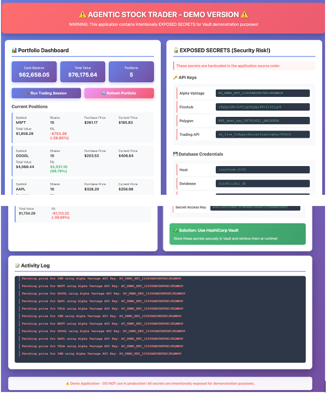
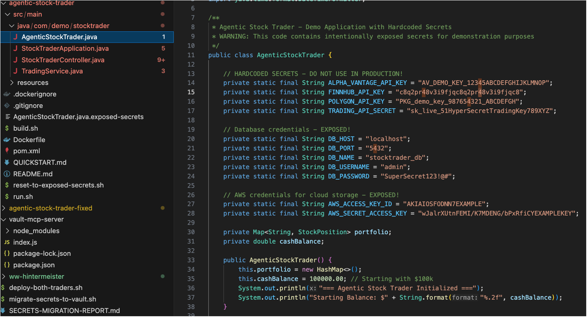
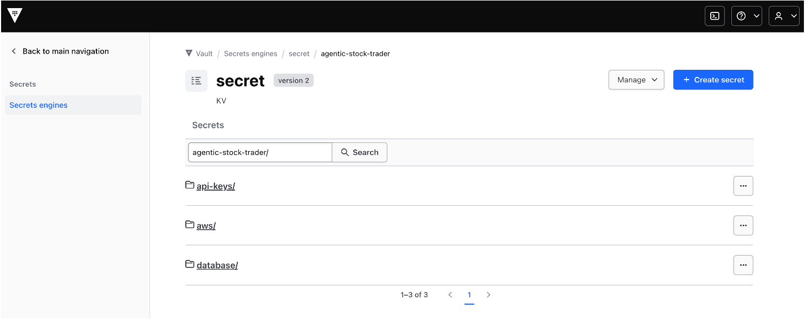
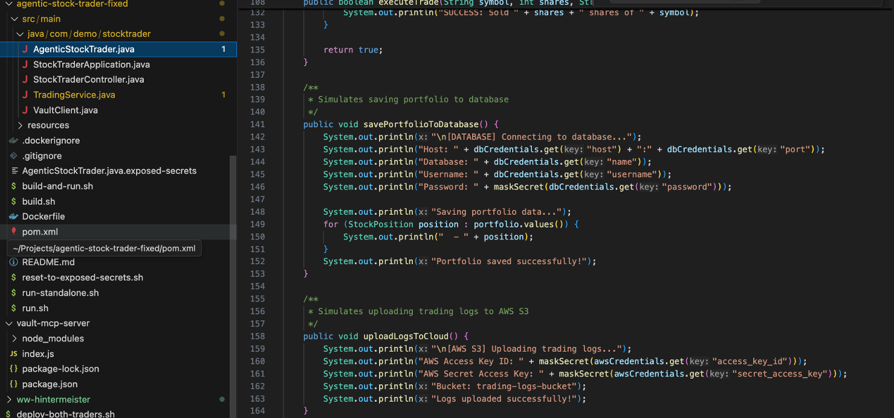
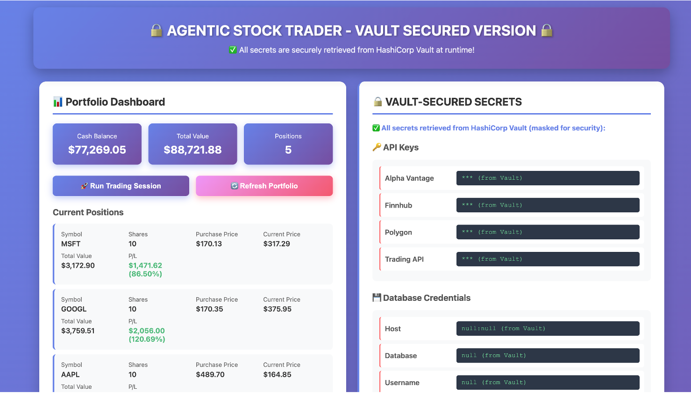

# Secure by Design – Vault to Store Secrets via MCP

## Message

Many apps can have exposed or hard-coded secrets. This demo shows what Bob can do:

- Deploy Vault
- Create and configure MCP server
- Scan, identify, and use a Vault MCP server to store the secrets
- Update the code to use Vault to retrieve secrets
- Run both the "before and after" to demonstrate the difference

---

## Setup

You can either set up everything yourself or use the provided artifacts.

### Install Vault
**Prompt:**
```
can you help me install opensource vault onto my laptop so i can use an mcp server to access it?
```

### Vault MCP Server

- Initial attempt using Marketplace MCP server failed due to Docker dependency (not allowed)
- Error observed:
```
spawn docker ENOENT
```
- Bob identifies Docker dependency and creates an alternative solution

**Prompt:**
```
I tried to install vault MCP server but got this error. can you fix?
```

### App Creation

**Prompt:**
```
I want to demonstrate vault, so i need you to write a "Fake" Java program that helps me manage my stocks. Call it "Agentic Stock Trader".
Fill the code with stub API calls with hard-coded secrets (API keys), and a database call with a userid/password pair.
Make sure it can run as a container, and build and run it locally on my podman instance.
```

### Pre-created Apps

- Original app (with exposed secrets):  
  https://ibm.box.com/s/ja62iwpx8d9hd0dqukctp3za4gkw61a8
- Fixed app (using Vault):  
  https://ibm.box.com/s/sh3vv0hme6y4qfha8r4w4c8ecj3pvwgp

---

## Prepare

- Start Vault using `VAULT-INSTALLATION-GUIDE.md`
- Ensure MCP server is running
- Verify Vault:
```
Please add the following key value pair into vault: gregh   iloveVault
```

- Run both applications:
  - `agentic-stock-trader`
  - `agentic-stock-trader-fixed`

- Build and run using Podman via Bob

---

## Demo Flow

1. Show the original application (`agentic-stock-trader`)
   - Highlight exposed API keys
   - Show logs with exposed credentials



2. In Bob:
   - Display the code

   

   - Prompt:
```
Please scan this code repo /Users/greghintermeister/Projects/agentic-stock-trader, identify all manually added secrets. Then duplicate the code into a new repo (-fixed), store secrets in Vault, and update the code to retrieve them.
```

3. Show Vault UI with stored secrets:


URL:
```
http://127.0.0.1:8200/ui/vault/secrets-engines/secret/kv/list/agentic-stock-trader/
```

4. Show updated (fixed) code



5. Show updated application behavior and UI


---

## Key Takeaway

- Demonstrates automatic identification and remediation of exposed secrets
- Highlights secure-by-design development practices
- Shows policy-driven modernization using Vault and MCP


---

## Key Takeaway

- Secrets removed from code
- Centralized secure storage in Vault
- Automated remediation using Bob + MCP
- Demonstrates secure-by-design principles
