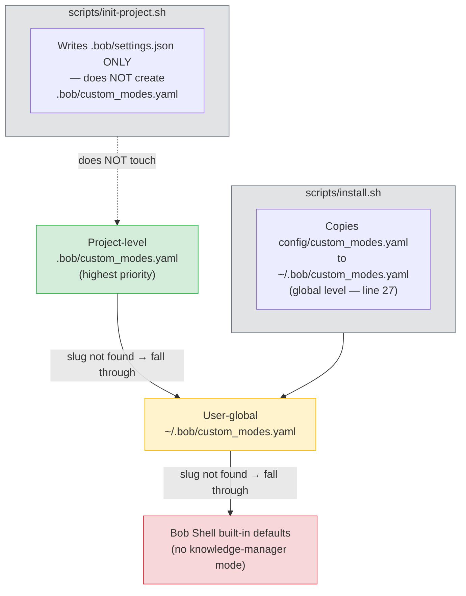
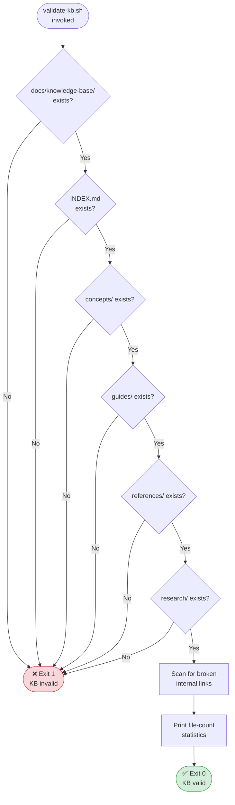

# CUSTOMIZATION — Bob Shell Knowledge Manager

| Attribute     | Value                                                 |
|---------------|-------------------------------------------------------|
| Version       | 2.1                                                   |
| Last Updated  | 2026-07-16                                            |
| Standard      | arc42 / Tier-1                                        |
| Scope         | All supported customization points for mode behaviour, document templates, and KB categories. Documents invariants that must not be changed without breaking the KB contract. |
| Authors       | Knowledge Manager team                                |
| Status        | Active                                                |

> **Scope note — Bob Shell CLI:** This document covers Bob Shell CLI customization (`config/custom_modes.yaml` → `~/.bob/custom_modes.yaml`).
> **Bob IDE users:** group names differ (`execute`/`skill` vs `command`/`browser`), `save_memory` is not available,
> and workspace modes live in `.bob/custom_modes.yaml`. See [docs/bob-ide-guide.md](BOB-IDE-GUIDE.md).

---

## Table of Contents

1. [Context — What Can and Cannot Be Changed](#1-context--what-can-and-cannot-be-changed)
2. [Configuration Resolution Chain](#2-configuration-resolution-chain)
3. [Annotated Mode YAML](#3-annotated-mode-yaml)
4. [Customizing Mode Behaviour](#4-customizing-mode-behaviour)
5. [Customizing Templates](#5-customizing-templates)
6. [Adding a New Document Category](#6-adding-a-new-document-category)
7. [KB Contract](#7-kb-contract)
8. [Team Customization](#8-team-customization)
9. [Quality Scenarios](#9-quality-scenarios)
10. [Risk Register](#10-risk-register)
11. [Glossary](#11-glossary)

---

## 1. Context — What Can and Cannot Be Changed

### 1.1 Scope

Bob Shell Knowledge Manager is a custom-mode plugin for Bob Shell that imposes structure on a project's documentation. Customization is the act of changing that structure in a controlled way. This section draws a firm boundary between the **variable surface** (things you may safely change) and the **KB contract** (the invariants you must not violate without accepting stated consequences).

### 1.2 What CAN be customized

| Customization point | How | Where |
|---|---|---|
| Mode display name | Edit `name:` field in a `custom_modes.yaml` | `~/.bob/` or `.bob/` |
| Mode role instructions | Edit `roleDefinition:` | `~/.bob/` or `.bob/` |
| When-to-use hint shown in mode picker | Edit `whenToUse:` | `~/.bob/` or `.bob/` |
| Operational instructions given to Bob at session start | Edit `customInstructions:` | `~/.bob/` or `.bob/` |
| File types Bob can edit in this mode | Edit `groups[].fileRegex:` | `~/.bob/` or `.bob/` |
| Template structure for new documents | Edit files in `config/templates/` | Repository clone |
| Add new template types | Add a new `*.md` file to `config/templates/` | Repository clone |
| Add extra document categories (subdirectories) | Create `docs/knowledge-base/<new-dir>/` manually | Per-project |

### 1.3 What CANNOT be changed without breaking the KB contract

The following four subdirectory names are **hardcoded** in [`scripts/validate-kb.sh` lines 20–26](../scripts/validate-kb.sh):

```bash
# scripts/validate-kb.sh  lines 20–26
for dir in concepts guides references research; do
    if [ ! -d "$KB_DIR/$dir" ]; then
        echo "❌ Missing directory: $dir"
        exit 1
    fi
    echo "✅ Directory exists: $dir"
done
```

| Invariant | Consequence of violation |
|---|---|
| `docs/knowledge-base/concepts/` must exist | `validate-kb.sh` exits with code 1 |
| `docs/knowledge-base/guides/` must exist | `validate-kb.sh` exits with code 1 |
| `docs/knowledge-base/references/` must exist | `validate-kb.sh` exits with code 1 |
| `docs/knowledge-base/research/` must exist | `validate-kb.sh` exits with code 1 |
| `docs/knowledge-base/index.md` must exist | `validate-kb.sh` exits with code 1 (line 13–16) |

Renaming or removing any of these directories causes CI-level failures wherever `validate-kb.sh` is invoked. Additionally, the `customInstructions` in the mode YAML (see §3) reference these exact paths by name — removing them would cause Bob to write documents outside the expected structure.

---

## 2. Configuration Resolution Chain

Bob Shell resolves `custom_modes.yaml` files using a priority cascade. A higher-priority file **completely overrides** the lower-priority entry for any `slug` that appears in both.



**Key observations:**

- [`scripts/install.sh` line 27](../scripts/install.sh) writes to `~/.bob/custom_modes.yaml` (global scope).
- [`scripts/init-project.sh` lines 81–92](../scripts/init-project.sh) writes `.bob/settings.json` for context-file injection, but does **not** create `.bob/custom_modes.yaml`. A project-level mode override must be created manually (see §4).
- If `~/.bob/custom_modes.yaml` does not exist (e.g., fresh install with `$HOME/.config/bob`), `install.sh` detects the correct config directory at lines 7–15.

---

## 3. Annotated Mode YAML

The following is the complete `knowledge-manager` entry from [`config/custom_modes.yaml` lines 158–211](../config/custom_modes.yaml), reproduced with inline annotations.

```yaml
# ─────────────────────────────────────────────────────────────
# Each entry in the customModes list defines one selectable mode
# inside Bob Shell. The list entry begins with a mapping key.
# ─────────────────────────────────────────────────────────────

  - slug: knowledge-manager
    # slug ──────────────────────────────────────────────────────
    # Machine identifier used by Bob Shell to look up the mode.
    # • Used in: bob --chat-mode=<slug>
    # • Must be unique across ALL files in the resolution chain.
    # • Changing the slug is a BREAKING CHANGE for any script or
    #   alias that references it by name.
    # • Allowed characters: lowercase letters, digits, hyphens.

    name: 🧠 Mnemox Knowledge Builder
    # name ──────────────────────────────────────────────────────
    # Human-readable display name shown in the Bob Shell mode
    # picker UI. The leading emoji is cosmetic and optional.
    # Safe to change; does not affect slug resolution.

    roleDefinition: >-
      You are a knowledge management specialist who helps organize, document, and maintain
      structured knowledge bases. You excel at researching topics, creating comprehensive
      documentation, organizing information logically, and maintaining cross-references.
      
      You work with a standardized knowledge base structure:
      - docs/knowledge-base/concepts/ - Core concepts and definitions
      - docs/knowledge-base/guides/ - How-to guides and tutorials
      - docs/knowledge-base/references/ - API docs and specifications
      - docs/knowledge-base/research/ - Research notes and findings
      - docs/knowledge-base/index.md - Master index of all content
    # roleDefinition ────────────────────────────────────────────
    # System-prompt fragment injected at session start, before any
    # user message. Tells Bob WHO it is in this mode.
    # • The 4 directory paths listed here MUST match the 4 dirs
    #   validated by validate-kb.sh (KB contract — see §7).
    # • YAML scalar type >- = folded block, strip trailing newline.
    #   Newlines inside the value become spaces in the final prompt.

    whenToUse: >-
      Use this mode when you need to:
      - Research and document new topics
      - Organize existing documentation
      - Create or update knowledge base entries
      - Search for information across the knowledge base
      - Maintain the knowledge base structure and cross-references
    # whenToUse ─────────────────────────────────────────────────
    # Short description shown in the Bob Shell mode picker tooltip.
    # Not part of the system prompt. Pure UI metadata.
    # Safe to rewrite for clarity without operational effect.

    customInstructions: |-
      ## Knowledge Management Framework
      
      ### Core Principles
      1. Structured Organization: Consistent categorization
      2. Cross-Referencing: Bidirectional links between documents
      3. Memory Persistence: Save key facts using save_memory tool (Bob Shell CLI only)
      4. Template-Driven: Use standard templates for consistency
      5. Index Maintenance: Keep INDEX.md current
      
      ### Document Creation Workflow
      1. Determine category (concept/guide/reference/research)
      2. Use appropriate template
      3. Follow naming convention: lowercase-with-hyphens.md
      4. Include all standard sections
      5. Save key facts to memory
      6. Add cross-references
      7. Update INDEX.md
      
      ### Naming Conventions
      - Concepts: concept-name.md
      - Guides: task-name-guide.md
      - References: api-name-reference.md
      - Research: topic-YYYY-MM.md
    # customInstructions ────────────────────────────────────────
    # Operational rules appended to the system prompt AFTER
    # roleDefinition. Tells Bob HOW to behave, step-by-step.
    # • YAML scalar type |- = literal block, strip trailing newline.
    #   Newlines are preserved, so markdown headings render correctly.
    # • This is the PRIMARY extension point for teams that want to
    #   add project-specific conventions without changing roleDefinition.
    # • The "Document Creation Workflow" steps 1 & 2 implicitly depend
    #   on the 4 category names; changing those names here without
    #   updating validate-kb.sh creates a KB contract violation.

    groups:
      - read
      # read ──────────────────────────────────────────────────────
      # Grants Bob permission to read any file in the project.
      # No fileRegex restriction; necessary for cross-reference work.

      - - edit
        - fileRegex: \.md$
          description: Markdown documentation files
      # edit/fileRegex ────────────────────────────────────────────
      # Restricts Bob's write/edit permission to files whose path
      # matches the regex \.md$ (any Markdown file, any directory).
      # • To also allow Bob to edit YAML front-matter files, change
      #   to: fileRegex: \.(md|yaml|yml)$
      # • To restrict editing to the KB only, change to:
      #   fileRegex: ^docs/knowledge-base/.*\.md$
      # • description is a UI label only; no functional effect.

      - command
      # command ───────────────────────────────────────────────────
      # Grants Bob permission to run shell commands (e.g., grep,
      # find, validate-kb.sh). Remove this group if you want a
      # read/write-only mode with no shell execution.

      - browser
      # browser ───────────────────────────────────────────────────
      # Grants Bob permission to fetch URLs for research tasks.
      # Remove this group in air-gapped environments.
```

---

## 4. Customizing Mode Behaviour

### 4.1 Strategy: project-level override

Create a file at `.bob/custom_modes.yaml` in your project root. Bob Shell will resolve this file at highest priority (see §2), so any `slug` defined here shadows the global entry.

**You do not need to copy the entire `custom_modes.yaml`.** Only include the mode(s) you want to override.

### 4.2 Concrete example: renaming the mode and extending instructions

Suppose you want to:
1. Rename the mode display name from `🧠 Mnemox Knowledge Builder` to `📚 ACME Wiki Manager`.
2. Add a project-specific instruction: all documents must include an ACME ticket reference in the footer.

Create `.bob/custom_modes.yaml`:

```yaml
# .bob/custom_modes.yaml  — project-level override
customModes:
  - slug: knowledge-manager          # must match the global slug exactly
    name: 📚 ACME Wiki Manager       # ← changed display name

    roleDefinition: >-
      You are a knowledge management specialist who helps organize, document, and maintain
      structured knowledge bases. You excel at researching topics, creating comprehensive
      documentation, organizing information logically, and maintaining cross-references.

      You work with a standardized knowledge base structure:
      - docs/knowledge-base/concepts/ - Core concepts and definitions
      - docs/knowledge-base/guides/ - How-to guides and tutorials
      - docs/knowledge-base/references/ - API docs and specifications
      - docs/knowledge-base/research/ - Research notes and findings
      - docs/knowledge-base/index.md - Master index of all content

    whenToUse: >-
      Use this mode when you need to manage the ACME project wiki.

    customInstructions: |-
      ## Knowledge Management Framework

      ### Core Principles
      1. Structured Organization: Consistent categorization
      2. Cross-Referencing: Bidirectional links between documents
      3. Memory Persistence: Save key facts using save_memory tool (Bob Shell CLI only)
      4. Template-Driven: Use standard templates for consistency
      5. Index Maintenance: Keep INDEX.md current

      ### Document Creation Workflow
      1. Determine category (concept/guide/reference/research)
      2. Use appropriate template
      3. Follow naming convention: lowercase-with-hyphens.md
      4. Include all standard sections
      5. Save key facts to memory
      6. Add cross-references
      7. Update INDEX.md

      ### Naming Conventions
      - Concepts: concept-name.md
      - Guides: task-name-guide.md
      - References: api-name-reference.md
      - Research: topic-YYYY-MM.md

      ### ACME Project Requirements              # ← new section
      - Every document footer MUST include an ACME ticket reference.
      - Footer format: *ACME Ticket: ACME-XXXX*
      - If no ticket exists, use: *ACME Ticket: N/A — [reason]*

    groups:
      - read
      - - edit
        - fileRegex: \.md$
          description: Markdown documentation files
      - command
      - browser
```

**Diff summary** compared to the global entry:
- `name:` changed to `📚 ACME Wiki Manager`
- `whenToUse:` replaced with project-specific text
- `customInstructions:` has an appended `### ACME Project Requirements` section

### 4.3 Choosing a new slug (separate mode)

If you need an entirely separate mode rather than an override (e.g., to run both modes on the same machine), use a distinct slug:

```yaml
customModes:
  - slug: acme-wiki               # new, non-conflicting slug
    name: 📚 ACME Wiki Manager
    # ... full definition ...
```

Invoke it with `bob --chat-mode=acme-wiki`. The original `knowledge-manager` mode continues to work from the global config unchanged.

---

## 5. Customizing Templates

### 5.1 Existing template extension points

Templates live in [`config/templates/`](../config/templates/). There are four templates, one per standard category:

| File | Category | Mandatory sections |
|---|---|---|
| [`config/templates/concept.md`](../config/templates/concept.md) | `concepts/` | Overview, Key Points, Details, Examples, Related Documents, References |
| [`config/templates/guide.md`](../config/templates/guide.md) | `guides/` | Overview, Prerequisites, Steps, Verification, Troubleshooting, Related Documents, References |
| [`config/templates/reference.md`](../config/templates/reference.md) | `references/` | *(see file)* |
| [`config/templates/research.md`](../config/templates/research.md) | `research/` | *(see file)* |

Both `concept.md` and `guide.md` share a common footer pattern:

```markdown
---
*Last Updated: YYYY-MM-DD*
*Category: <CategoryName>*
```

This footer is referenced by `INDEX.md` generation logic in Bob's `customInstructions` (step 7: "Update INDEX.md"). Do not remove it.

### 5.2 Modifying an existing template

**Tutorial: add a "Decision Rationale" section to the concept template**

**Step 1.** Open [`config/templates/concept.md`](../config/templates/concept.md) in your editor.

**Step 2.** Locate the `## Examples` section (line 19). Insert the new section immediately after `## Details` and before `## Examples`:

```markdown
## Decision Rationale
*Why was this approach chosen? What alternatives were considered?*

- Option considered: ...
- Reason rejected: ...
- Chosen approach: ...
```

**Step 3.** Save the file.

**Step 4.** Verify the template renders correctly by asking Bob to create a new concept:

```
Bob: Research [any topic] and create a concept document
```

Check that the generated file in `docs/knowledge-base/concepts/` contains the `## Decision Rationale` section.

**Step 5.** Run the KB validator to confirm no structural regressions:

```bash
bash scripts/validate-kb.sh
```

Expected output includes:
```
✅ INDEX.md exists
✅ Directory exists: concepts
✅ Directory exists: guides
✅ Directory exists: references
✅ Directory exists: research
```

### 5.3 Adding a new template type

Use this procedure when you add a new document category (see §6 for the category itself).

**Step 1.** Decide on the category name (e.g., `decisions`) and its slug convention (e.g., `decision-name-YYYY-MM-DD.md`).

**Step 2.** Create `config/templates/decisions.md` by copying an existing template as a starting point:

```bash
cp config/templates/concept.md config/templates/decisions.md
```

**Step 3.** Edit `config/templates/decisions.md`. At minimum, update:
- The H1 title placeholder: `# [Decision Title]`
- The `*Category: Decision*` footer line
- Add decision-specific sections such as `## Status`, `## Context`, `## Decision`, `## Consequences`

Example minimal template:

```markdown
# [Decision Title]

## Status
Proposed | Accepted | Deprecated | Superseded

## Context
What is the issue we are trying to solve?

## Decision
What is the change we are proposing or have agreed to?

## Consequences
What becomes easier or harder as a result of this change?

## Related Documents
- [Related Concept](../concepts/related-concept.md)

## References
- [ADR format](https://adr.github.io)

---
*Last Updated: YYYY-MM-DD*
*Category: Decision*
```

**Step 4.** Update the `customInstructions` in your `.bob/custom_modes.yaml` (see §4) to tell Bob about the new template and naming convention:

```yaml
### Naming Conventions
- Concepts: concept-name.md
- Guides: task-name-guide.md
- References: api-name-reference.md
- Research: topic-YYYY-MM.md
- Decisions: decision-title-YYYY-MM-DD.md   # ← add this line
```

**Step 5.** Read §6 carefully. The new `decisions/` category directory **will not be validated** by `validate-kb.sh` unless you also modify that script.

---

## 6. Adding a New Document Category

### 6.1 Creating the directory

```bash
mkdir -p docs/knowledge-base/decisions
```

Bob will be able to create files there once you update `customInstructions` (§4) and add a template (§5.3).

### 6.2 ⚠ Validation gap — hardcoded directory list

**`scripts/validate-kb.sh` lines 20–26 hardcode exactly four directory names:**

```bash
# scripts/validate-kb.sh  lines 20–26
for dir in concepts guides references research; do
    if [ ! -d "$KB_DIR/$dir" ]; then
        echo "❌ Missing directory: $dir"
        exit 1
    fi
    echo "✅ Directory exists: $dir"
done
```

This loop will **not** iterate over `decisions` or any other new directory you create. Consequences:

- The new directory is **never checked** for existence by the validator.
- If the directory is accidentally deleted, `validate-kb.sh` will report `✅ All checks passed` — a false negative.
- The per-category file count at lines 55–58 also covers only the four original dirs; your new category is excluded from the statistics.

### 6.3 Optional: extending validate-kb.sh to cover custom categories

If you want the validator to enforce your new category, edit [`scripts/validate-kb.sh`](../scripts/validate-kb.sh) and add the category name to the loop:

```bash
# Before (line 20):
for dir in concepts guides references research; do

# After:
for dir in concepts guides references research decisions; do
```

Also add a count line at the end:

```bash
echo "  Decisions: $(find "$KB_DIR/decisions" -name "*.md" -type f 2>/dev/null | wc -l)"
```

Commit this change together with the new directory and template so the KB contract remains consistent.

### 6.4 INDEX.md update

`init-project.sh` generates a static `INDEX.md` with sections only for the four original categories. After adding `decisions/`, manually add a section:

```markdown
### Decisions
<!-- Automatically updated by knowledge-manager mode -->
```

---

## 7. KB Contract

The **KB contract** is the set of structural invariants that `scripts/validate-kb.sh` enforces. Any state that satisfies these invariants is a valid KB; any state that violates them causes the script to exit non-zero.



**What breaks if the contract is violated:**

| Violation | Immediate effect | Downstream effect |
|---|---|---|
| `docs/knowledge-base/` missing | `validate-kb.sh` exits 1 on line 9 | Any CI job running the script fails |
| `INDEX.md` missing | `validate-kb.sh` exits 1 on line 14 | Bob's step 7 (update index) writes to a non-existent file |
| Any of the 4 dirs missing | `validate-kb.sh` exits 1 on line 23 | Bob's `roleDefinition` references a non-existent path; Bob may create files at wrong locations |
| `fileRegex` in mode YAML removed | No validator failure | Bob gains write access to all file types, not just `.md` |

---

## 8. Team Customization

### 8.1 Committing a shared team configuration

To ensure all team members use the same mode behaviour:

1. Create `.bob/custom_modes.yaml` in the project root (see §4 for the format).
2. Commit the file to the repository:

```bash
git add .bob/custom_modes.yaml
git commit -m "chore: add project-level knowledge-manager mode customization"
```

3. Ensure `.bob/custom_modes.yaml` is **not** in `.gitignore`. (Note: `.bob/settings.json` may contain machine-specific paths — review before committing.)

When any team member pulls the branch, Bob Shell will automatically pick up the project-level override at highest resolution priority.

### 8.2 Individual developer override

A developer who needs a personal variation (e.g., a different display name, or a temporarily extended `fileRegex` during template work) can create or edit `~/.bob/custom_modes.yaml`. Since the project-level file takes priority over the global file, the developer must place their override in `.bob/custom_modes.yaml` locally and ensure it is excluded from git:

```bash
# Add to .gitignore if personal changes must not be committed:
echo ".bob/custom_modes.yaml" >> .gitignore
```

Alternatively, use a distinct slug (§4.3) for the personal variant so both the team mode and personal mode coexist.

### 8.3 Resolution summary for a team setup

| Priority | File | Who controls it |
|---|---|---|
| 1 (highest) | `.bob/custom_modes.yaml` | Team (committed to git) |
| 2 | `~/.bob/custom_modes.yaml` | Individual developer |
| 3 (lowest) | Bob Shell built-in defaults | Bob Shell install |

---

## 9. Quality Scenarios

The following scenarios are **verifiable outcomes** — each can be confirmed with a concrete test step.

### QS-1: Custom mode activates

**Scenario.** A project-level `.bob/custom_modes.yaml` defines `slug: knowledge-manager` with `name: 📚 ACME Wiki Manager`.

**Expected outcome.** When Bob Shell is started in the project directory, the mode picker displays `📚 ACME Wiki Manager` instead of `🧠 Mnemox Knowledge Builder`.

**Verification.**
```bash
# In the project root with .bob/custom_modes.yaml present:
bob --chat-mode=knowledge-manager
# Observe the mode label shown in the session header.
```

**Pass criterion.** Session header shows `ACME Wiki Manager`.

---

### QS-2: New template is used by Bob

**Scenario.** A `config/templates/decisions.md` template has been added (§5.3) and `customInstructions` references it.

**Expected outcome.** When asked to create a decision document, Bob produces a file matching the structure of `decisions.md`.

**Verification.**
```
User prompt: "Create a decision document for choosing our database engine"
```
Check `docs/knowledge-base/decisions/` for a new `.md` file containing the `## Status`, `## Context`, `## Decision`, and `## Consequences` sections.

**Pass criterion.** Generated file contains all four sections from the template; footer reads `*Category: Decision*`.

---

### QS-3: Custom category created but not automatically validated

**Scenario.** `docs/knowledge-base/decisions/` has been created and populated. `validate-kb.sh` has **not** been modified to include `decisions`.

**Expected outcome.** `validate-kb.sh` exits 0 even if the `decisions/` directory is accidentally deleted.

**Verification.**
```bash
rm -rf docs/knowledge-base/decisions
bash scripts/validate-kb.sh
echo "Exit code: $?"
```

**Pass criterion.** Exit code is `0` and the script prints no error about `decisions/`. This **confirms** the validation gap documented in §6.2.

---

## 10. Risk Register

| ID | Risk | Likelihood | Impact | Mitigation |
|---|---|---|---|---|
| R-01 | **Naming convention drift** — Documents accumulate with inconsistent names (e.g., `MyTopic.md` instead of `my-topic.md`) because `customInstructions` naming rules are overridden in a project config but the enforcement convention is not stated explicitly | Medium | Medium | Pin the naming convention in a project `.bob/custom_modes.yaml` `customInstructions` section. Add a `grep` check to a pre-commit hook: `git diff --cached --name-only \| grep -P 'knowledge-base/[A-Z]'` to reject uppercase filenames at commit time. |
| R-02 | **Mode collision (duplicate slug)** — Two `custom_modes.yaml` files in the resolution chain both define `slug: knowledge-manager`. The project-level file wins silently; the global entry is completely shadowed. | High (common team scenario) | Medium | Document which slug is authoritative. Use distinct slugs for personal variants (§4.3). Include a `grep` check in `install.sh` that warns if the target `custom_modes.yaml` already contains the slug being installed. |
| R-03 | **Template drift from INDEX.md expectations** — A template section is renamed or removed (e.g., `## Related Documents` → `## See Also`) but Bob's `customInstructions` step 6 still says "Add cross-references" using the old heading. Bob generates documents with inconsistent section names, breaking any tooling that parses section headings. | Low | High | Treat templates as a versioned contract. When renaming a section in a template, update the `customInstructions` in the same commit. Add a note to the template file header: `<!-- Template version: X.Y — update customInstructions if sections change -->`. |
| R-04 | **Custom category not validated by validate-kb.sh** — A new category directory (e.g., `decisions/`) is added and populated, but `validate-kb.sh` is not updated. The directory is silently deleted or never created on a fresh clone, but CI reports green. | High (consequence of §6.2) | High | Immediately after adding a category, extend the `for dir in ...` loop in `validate-kb.sh` (§6.3). Make this a checklist item in the pull-request template for any PR that creates a new KB subdirectory. |

---

## 11. Glossary

| Term | Definition |
|---|---|
| **slug** | The machine-readable identifier for a Bob Shell mode. Used as the value of `--chat-mode=<slug>` on the command line and as the lookup key during configuration resolution. Must be unique across all `custom_modes.yaml` files active in a session. Allowed characters: lowercase ASCII letters, digits, and hyphens. Example: `knowledge-manager`. |
| **customInstructions** | A YAML scalar field (type `\|-`, literal block) whose value is appended to the system prompt after `roleDefinition`. It provides operational rules, workflows, and naming conventions that govern Bob's behaviour within a mode. It is the primary extension point for project-specific customization because it can be extended section-by-section without touching `roleDefinition`. |
| **roleDefinition** | A YAML scalar field (type `>-`, folded block) whose value forms the opening part of the system prompt. It defines Bob's persona and the structural context it operates in (the 4 KB directories). Changing this field changes who Bob thinks it is. It references the 4 KB directories by name and must stay consistent with `validate-kb.sh`. |
| **KB contract** | The set of structural invariants that a valid knowledge base must satisfy. Currently enforced by `scripts/validate-kb.sh`: the root dir `docs/knowledge-base/` must exist, `INDEX.md` must exist, and the four category directories `concepts/`, `guides/`, `references/`, `research/` must exist. Any repository state that fails these checks causes `validate-kb.sh` to exit non-zero. Custom categories added beyond these four are outside the KB contract unless `validate-kb.sh` is explicitly extended. |
| **fileRegex** | A POSIX extended regular expression placed inside the `edit` permission group of a mode's `groups:` list. It restricts the files Bob Shell is permitted to write or modify during a session to only those paths matching the pattern. The default for the `knowledge-manager` mode is `\.md$`, limiting edits to Markdown files. Broadening this regex increases the attack surface of the mode. |

---

*This document conforms to arc42 Tier-1. For the system architecture, see [ARCHITECTURE.md](./ARCHITECTURE.md). For day-to-day usage, see [USAGE.md](./USAGE.md).*
