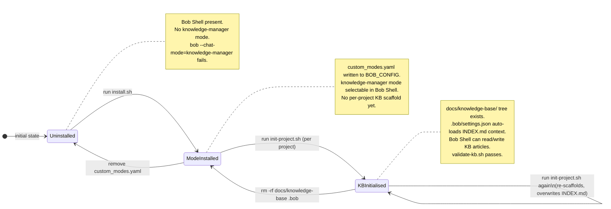
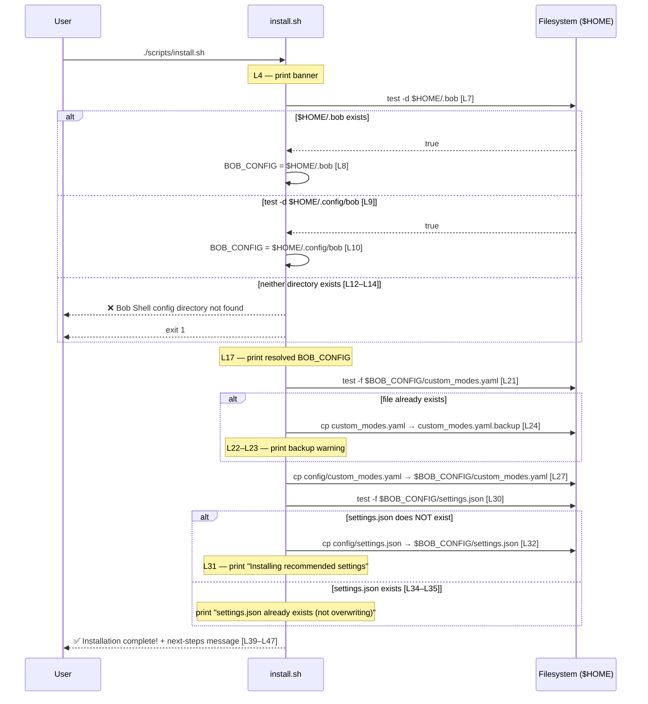
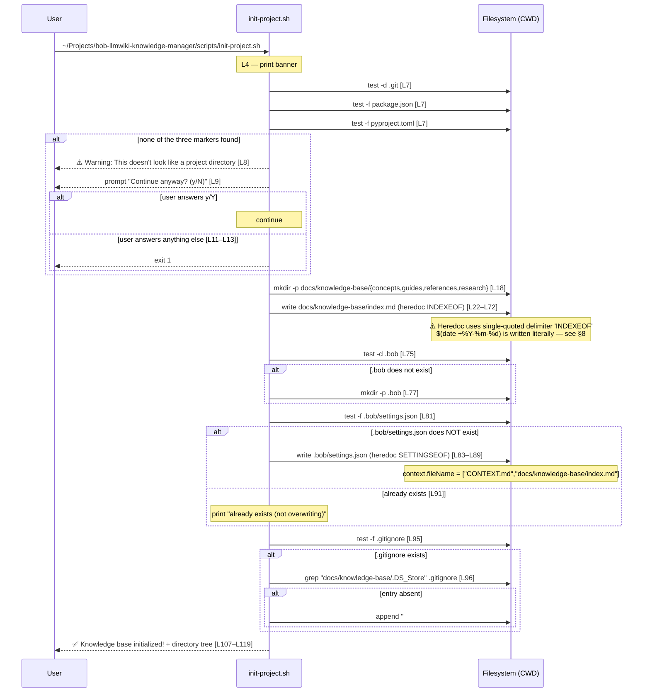

# Installation Guide

> **Version**: 2.1
> **Last updated**: 2026-07-16
> **Standard**: arc42 / Tier-1 (Grade A)
> **Scope**: This document covers **Bob Shell CLI installation** — the complete lifecycle of installing, verifying, updating, and removing the Bob Shell Knowledge Manager integration via `scripts/install.sh` and `scripts/init-project.sh`. **For Bob IDE users, see [§14 Bob IDE Installation](#14-bob-ide-installation)** — no scripts are required.

---

## Table of Contents

1. [Context](#1-context)
2. [Constraints](#2-constraints)
3. [System States](#3-system-states)
4. [`install.sh` Walkthrough](#4-installsh-walkthrough)
5. [`init-project.sh` Walkthrough](#5-init-projectsh-walkthrough)
6. [Verification](#6-verification)
7. [Failure Modes](#7-failure-modes)
8. [Known Bug — `INDEX.md` Date Not Expanding](#8-known-bug--indexmd-date-not-expanding)
9. [Updating](#9-updating)
10. [Uninstallation](#10-uninstallation)
11. [Quality Scenarios](#11-quality-scenarios)
12. [Risk Register](#12-risk-register)
13. [Glossary](#13-glossary)
14. [Bob IDE Installation](#14-bob-ide-installation)

---

## 1. Context

### 1.1 What Installation Achieves

Running [`scripts/install.sh`](../scripts/install.sh) registers the `knowledge-manager` custom mode with Bob Shell by writing two files into Bob Shell's config home directory:

| Artefact written | Source | Condition |
|---|---|---|
| `$BOB_CONFIG/custom_modes.yaml` | `config/custom_modes.yaml` | Always (after optional backup) |
| `$BOB_CONFIG/settings.json` | `config/settings.json` | Only if not already present |

Running [`scripts/init-project.sh`](../scripts/init-project.sh) scaffolds a knowledge-base directory tree inside a **target project** (any directory you `cd` into):

| Artefact written | Condition |
|---|---|
| `docs/knowledge-base/index.md` | Always (overwrites) |
| `docs/knowledge-base/concepts/` | Always |
| `docs/knowledge-base/guides/` | Always |
| `docs/knowledge-base/references/` | Always |
| `docs/knowledge-base/research/` | Always |
| `.bob/settings.json` | Only if not already present |
| Appends `docs/knowledge-base/.DS_Store` entry to `.gitignore` | Only if `.gitignore` exists and entry is absent |

### 1.2 What Installation Does NOT Do

- **Does not install Bob Shell itself.** Bob Shell must already be installed and have been run at least once so that its config home directory (`~/.bob` or `~/.config/bob`) exists.
- **Does not create any knowledge-base content.** `install.sh` installs the mode definition; actual KB articles are created later by Bob Shell in `knowledge-manager` mode.
- **Does not require root / `sudo`.** All writes target the current user's home directory or current working directory.
- **Does not modify system paths, `$PATH`, or shell profiles.**
- **Does not install Bob Shell's `settings.json` if one already exists** — the existing file is preserved without even a backup.

---

## 2. Constraints

| # | Constraint | Source |
|---|---|---|
| C-1 | **Operating system**: macOS or Linux. Windows is unsupported unless running under WSL. Bash on Windows (MSYS2/Git Bash) is untested. | [`install.sh` L2](../scripts/install.sh) uses `set -e` and standard POSIX paths. |
| C-2 | **Bash ≥ 3.2**. The scripts use `[[ $REPLY =~ ^[Yy]$ ]]` (ERE in `[[`), which requires Bash 3.2+. macOS ships Bash 3.2.57 on Intel; it satisfies this constraint. | [`init-project.sh` L11](../scripts/init-project.sh) |
| C-3 | **Bob Shell config directory must exist before `install.sh` is run.** The script detects `~/.bob` or `~/.config/bob` (in that order) and exits 1 if neither is present. | [`install.sh` L7–L15](../scripts/install.sh) |
| C-4 | **The repository must be present locally** at a path accessible to the current user. `install.sh` references `config/custom_modes.yaml` and `config/settings.json` as relative paths from the repository root, so it must be invoked from that directory. | [`install.sh` L27, L32](../scripts/install.sh) |
| C-5 | **`init-project.sh` must be invoked from the target project's root directory.** All created paths (`docs/`, `.bob/`, `.gitignore`) are relative to `$PWD`. | [`init-project.sh` L7, L18, L75](../scripts/init-project.sh) |
| C-6 | **No root required.** Both scripts write exclusively to paths inside `$HOME` or the current working directory. | — |
| C-7 | **`pandoc` is optional.** It is needed only for HTML/PDF export functionality within the knowledge-manager mode itself, not for installation. | `config/settings.json` (export stanza) |

---

## 3. System States

The installation process moves the system through three well-defined states. Each state enables a distinct set of capabilities.



> **Note**: `ModeInstalled` is a global (per-user) state. `KBInitialised` is a per-project state — many projects can be in `KBInitialised` simultaneously while sharing the single `ModeInstalled` user-level installation.

---

## 4. `install.sh` Walkthrough

[`scripts/install.sh`](../scripts/install.sh) is 48 lines. The following sequence diagram reflects the exact logic, with line-number citations.



### Artefacts produced by `install.sh`

| Artefact | Always written? | Notes |
|---|---|---|
| `$BOB_CONFIG/custom_modes.yaml` | **Yes** | Previous file backed up first if it existed ([L21–L25](../scripts/install.sh)) |
| `$BOB_CONFIG/custom_modes.yaml.backup` | Only if previous `custom_modes.yaml` existed | Created by `cp`, not `mv` — original is preserved as backup and then **overwritten** ([L24, L27](../scripts/install.sh)) |
| `$BOB_CONFIG/settings.json` | Only if absent ([L30](../scripts/install.sh)) | Never overwrites an existing file |

---

## 5. `init-project.sh` Walkthrough

[`scripts/init-project.sh`](../scripts/init-project.sh) is 120 lines. Run from the root of any target project.



### Artefacts produced by `init-project.sh`

| Artefact | Always written? | Notes |
|---|---|---|
| `docs/knowledge-base/concepts/` | **Yes** | Empty directory ([L18](../scripts/init-project.sh)) |
| `docs/knowledge-base/guides/` | **Yes** | Empty directory ([L18](../scripts/init-project.sh)) |
| `docs/knowledge-base/references/` | **Yes** | Empty directory ([L18](../scripts/init-project.sh)) |
| `docs/knowledge-base/research/` | **Yes** | Empty directory ([L18](../scripts/init-project.sh)) |
| `docs/knowledge-base/index.md` | **Yes (overwrites)** | See [§8](#8-known-bug--indexmd-date-not-expanding) for date bug |
| `.bob/settings.json` | Only if absent ([L81](../scripts/init-project.sh)) | Sets `context.fileName` to load INDEX.md automatically |
| `.gitignore` (appended) | Only if file exists and entry absent ([L95–L96](../scripts/init-project.sh)) | Adds `.DS_Store` exclusion |

---

## 6. Verification

After running `install.sh`, verify each artefact that the script actually creates.

### 6.1 Verify mode installation

```bash
# 1. Confirm Bob Shell's config directory was detected correctly.
#    (Replace ~/.bob with ~/.config/bob if that is your layout.)
ls -la ~/.bob/custom_modes.yaml

# 2. Confirm the knowledge-manager slug appears in the file.
grep "knowledge-manager" ~/.bob/custom_modes.yaml

# 3. If settings.json was installed, confirm it is valid JSON.
python3 -m json.tool ~/.bob/settings.json > /dev/null && echo "valid JSON"
```

### 6.2 Verify the mode is selectable in Bob Shell

```bash
bob --chat-mode=knowledge-manager
```

Bob Shell should start without an "unknown mode" error.

### 6.3 Verify KB scaffold (after `init-project.sh`)

```bash
# Run from the target project root.

# Directories
ls -d docs/knowledge-base/{concepts,guides,references,research}

# INDEX.md
ls -la docs/knowledge-base/index.md

# Per-project Bob context
cat .bob/settings.json
```

Expected `.bob/settings.json` content (written by [`init-project.sh` L83–L89](../scripts/init-project.sh)):

```json
{
  "context": {
    "fileName": ["CONTEXT.md", "docs/knowledge-base/index.md"]
  }
}
```

### 6.4 Bob IDE verification

If you are using **Bob IDE**, the CLI verification commands above do not apply. Verify the Bob IDE setup with these checks:

**① Mode picker shows 🧠 Mnemox Knowledge Builder**

Open this workspace in Bob IDE. Click the **mode picker** in the bottom-left status bar. Scroll to and confirm that **🧠 Mnemox Knowledge Builder** is listed. Select it.

**② Skill activation succeeds**

With the knowledge-manager mode active, send:
```
use_skill("knowledge-manager")
```
Expected: the skill loads without error and the agent confirms it has loaded the document templates and cross-reference protocol.

**③ Tool group validation (shell)**

Send this prompt:
```
Run this shell command: echo "KB shell access OK"
```
Expected output: `KB shell access OK`

**④ Tool group validation (read)**

Send this prompt:
```
Read docs/knowledge-base/index.md and confirm it exists
```
Expected: the agent reads and summarises the file without error.

**⑤ Custom instructions validation**

Send this prompt:
```
What are the document categories in this knowledge base?
```
Expected: the agent answers using the knowledge-manager `customInstructions` (concepts, guides, references, research) — not from a web search.

---

## 7. Failure Modes

The table below covers every `exit 1` and every printed warning in both scripts.

| # | Script | Exact message (from script) | Cause | Recovery |
|---|---|---|---|---|
| F-1 | `install.sh` | `❌ Bob Shell config directory not found` / `Please ensure Bob Shell is installed` ([L12–L13](../scripts/install.sh)) | Neither `~/.bob` nor `~/.config/bob` exists at the time `install.sh` runs. Bob Shell has never been started, or was installed to a non-standard path. | Start Bob Shell once so it creates its config directory, then re-run `install.sh`. If Bob Shell uses a custom path, create a symlink: `ln -s /custom/bob/path ~/.bob`. |
| F-2 | `install.sh` | `⚠️  custom_modes.yaml already exists` / `Backing up to custom_modes.yaml.backup` ([L22–L23](../scripts/install.sh)) | A `custom_modes.yaml` was already present in Bob Shell's config directory. | This is a **non-fatal warning**. The existing file is copied to `.backup` and then **overwritten** by the new `custom_modes.yaml`. If you had custom modes, merge them back manually: `cat ~/.bob/custom_modes.yaml.backup >> ~/.bob/custom_modes.yaml`. |
| F-3 | `install.sh` | `ℹ️  settings.json already exists (not overwriting)` / `See config/settings.json for recommended settings` ([L34–L35](../scripts/install.sh)) | `$BOB_CONFIG/settings.json` already exists. | **Non-fatal, informational.** The existing file is left untouched. Compare with `config/settings.json` and merge any desired keys manually. |
| F-4 | `install.sh` | *(no message — `set -e` aborts)* `cp: config/custom_modes.yaml: No such file or directory` | `install.sh` was not invoked from the repository root. The relative path `config/custom_modes.yaml` ([L27](../scripts/install.sh)) does not resolve. | `cd ~/Projects/bob-llmwiki-knowledge-manager && ./scripts/install.sh` |
| F-5 | `install.sh` | `Permission denied` (from `cp`) | The script file itself is not executable. | `chmod +x scripts/install.sh && ./scripts/install.sh` |
| F-6 | `init-project.sh` | `⚠️  Warning: This doesn't look like a project directory` + prompt ([L8–L9](../scripts/init-project.sh)) | No `.git`, `package.json`, or `pyproject.toml` found in the current directory. | If you intend to initialise a KB in a non-project directory, answer `y`. Otherwise `cd` to the correct project root first. |
| F-7 | `init-project.sh` | *(exit 1 with no additional message, after prompt)* | User answered `N` (or Enter) at the "not a project directory" prompt ([L11–L13](../scripts/init-project.sh)). | Expected behaviour. Navigate to the correct project directory and re-run. |
| F-8 | `init-project.sh` | `ℹ️  .bob/settings.json already exists (not overwriting)` ([L91](../scripts/init-project.sh)) | `.bob/settings.json` already exists in the target project. | **Non-fatal, informational.** The existing file is preserved. Ensure `docs/knowledge-base/index.md` is listed in your `context.fileName` array if you want Bob Shell to auto-load it. |

---

## 8. Known Bug — `INDEX.md` Date Not Expanding

### Description

[`init-project.sh` line 22](../scripts/init-project.sh) writes `docs/knowledge-base/index.md` using a heredoc with a **single-quoted** delimiter:

```bash
cat > docs/knowledge-base/index.md << 'INDEXEOF'
...
Last Updated: $(date +%Y-%m-%d)
...
INDEXEOF
```

In Bash, single-quoting the heredoc delimiter (`'INDEXEOF'`) **suppresses all parameter expansion and command substitution** inside the body. The literal string `$(date +%Y-%m-%d)` is written verbatim to the file — it is never evaluated.

### Observable effect

```bash
grep "Last Updated" docs/knowledge-base/index.md
# Output:
# Last Updated: $(date +%Y-%m-%d)
```

### Workaround

After running `init-project.sh`, manually replace the placeholder with today's date:

```bash
TODAY=$(date +%Y-%m-%d)
sed -i.bak "s/\$(date +%Y-%m-%d)/$TODAY/" docs/knowledge-base/index.md
rm docs/knowledge-base/index.md.bak   # macOS sed creates a backup
```

Or edit the file directly:

```bash
# Replace the literal string with today's date
sed -i '' "s/\$(date +%Y-%m-%d)/$(date +%Y-%m-%d)/" docs/knowledge-base/index.md
```

### Root cause

The single-quoted delimiter was likely chosen to prevent `$(...)` expressions in the heredoc body from being evaluated by the shell when `init-project.sh` itself is sourced or executed with `set -e`. The fix is to either use an unquoted delimiter (`INDEXEOF`) and escape other dollar-signs in the body, or to compute the date before the heredoc and use a variable.

---

## 9. Updating

To update the knowledge-manager integration to a newer version of this repository:

```bash
cd ~/Projects/bob-llmwiki-knowledge-manager

# 1. Pull the latest changes.
git pull origin main

# 2. Re-run install.sh from the repository root.
#    Any existing custom_modes.yaml will be backed up automatically
#    before being replaced (see §4 and F-2 in §7).
./scripts/install.sh
```

> **KB content is not affected.** The `docs/knowledge-base/` directories inside individual projects are independent of this repository and are not touched by `install.sh`.

> **settings.json is not updated.** Because `install.sh` never overwrites an existing `$BOB_CONFIG/settings.json`, any settings changes in `config/settings.json` must be merged manually after updating. Compare with `diff $BOB_CONFIG/settings.json config/settings.json`.

---

## 10. Uninstallation

### 10.1 Remove the mode registration (user-level)

```bash
# Remove the installed custom mode.
rm ~/.bob/custom_modes.yaml

# If you had previous modes that were backed up, restore them.
mv ~/.bob/custom_modes.yaml.backup ~/.bob/custom_modes.yaml

# Optionally remove the installed settings (only if install.sh wrote it).
rm ~/.bob/settings.json
```

Use `~/.config/bob/` in place of `~/.bob/` if that is your Bob Shell config home.

### 10.2 Remove the KB scaffold from a project (per-project)

```bash
# Run from inside the target project root.
rm -rf docs/knowledge-base
rm -rf .bob

# Remove the .gitignore entry added by init-project.sh (if applicable).
grep -v "docs/knowledge-base/.DS_Store" .gitignore > .gitignore.tmp
mv .gitignore.tmp .gitignore
```

### 10.3 Remove the repository itself

```bash
rm -rf ~/Projects/bob-llmwiki-knowledge-manager
```

---

## 11. Quality Scenarios

These are verifiable success criteria. Each maps to a specific observable state after a clean installation.

| # | Scenario | Success criterion | How to verify |
|---|---|---|---|
| QS-1 | `install.sh` completes on a machine where Bob Shell is installed | `custom_modes.yaml` exists in `$BOB_CONFIG` and contains `knowledge-manager` | `grep -l "knowledge-manager" ~/.bob/custom_modes.yaml` exits 0 |
| QS-2 | `install.sh` does not destroy a pre-existing `custom_modes.yaml` | `custom_modes.yaml.backup` exists after a reinstall and matches the file content before the reinstall | `diff ~/.bob/custom_modes.yaml.backup <(git stash show -p)` or manual `md5sum` comparison |
| QS-3 | `install.sh` does not overwrite a pre-existing `settings.json` | After reinstall on a system with a `settings.json`, the file is byte-for-byte identical to the pre-install version | `md5sum ~/.bob/settings.json` before vs. after |
| QS-4 | `init-project.sh` produces all four subdirectories | `docs/knowledge-base/{concepts,guides,references,research}` all exist | `ls -d docs/knowledge-base/{concepts,guides,references,research}` exits 0 |
| QS-5 | Bob Shell loads the mode without error | `bob --chat-mode=knowledge-manager` starts a session | Invocation exits 0 and prints no "unknown mode" error |

---

## 12. Risk Register

| # | Risk | Likelihood | Impact | Mitigation |
|---|---|---|---|---|
| R-1 | **Config overwrite** — `install.sh` unconditionally overwrites `$BOB_CONFIG/custom_modes.yaml` ([L27](../scripts/install.sh)). A backup is created ([L24](../scripts/install.sh)), but any modes that existed only in the previous `custom_modes.yaml` are silently lost if the user does not notice the `⚠️` warning and merge manually. | Medium (anyone with pre-existing custom modes) | High (loss of custom Bob Shell modes) | Before installing, manually back up: `cp ~/.bob/custom_modes.yaml ~/custom_modes.yaml.mine`. After install, merge: `cat ~/custom_modes.yaml.mine >> ~/.bob/custom_modes.yaml`. |
| R-2 | **Hardcoded template path assumption** — the "Next steps" message printed by `install.sh` ([L43–L44](../scripts/install.sh)) tells the user to run the `init-project.sh` via `~/Projects/bob-llmwiki-knowledge-manager/scripts/init-project.sh`. If the repository was cloned to any other path, this instruction is wrong and the user may invoke the script from the wrong directory. | Low–Medium | Low (misleading output only; scripts still work if invoked correctly) | Always invoke `init-project.sh` using its actual path or from an alias. The path in the printed message is illustrative, not prescriptive. |
| R-3 | **Bash 3.2 on macOS** — macOS ships Bash 3.2 (due to GPLv2 licensing constraints). Both scripts use `set -e` and `[[ ]]` with ERE, which work on 3.2, but any future additions using associative arrays (`declare -A`), `mapfile`, or `${var^^}` will silently fail or error on macOS without Homebrew's Bash 5.x. | Low (stable scripts today) | Medium (silent breakage if scripts are extended) | Test any script changes on macOS with Bash 3.2 before committing. Add `bash --version` check to `install.sh` if new syntax is introduced. |
| R-4 | **Single-user install only** — `install.sh` writes to `$HOME/.bob` (or `~/.config/bob`). There is no system-wide install path. In shared-machine or CI environments where `$HOME` is not a writable personal directory, installation will fail or pollute a shared config. | Low | Medium | For CI: pass a custom `BOB_CONFIG` path or use the mode flag directly without installing. For shared machines: each user must install independently. |

---

## 13. Glossary

| Term | Definition |
|---|---|
| **Bob Shell config home** | The directory where Bob Shell stores its user-level configuration. Detected by [`install.sh` L7–L10](../scripts/install.sh) as `~/.bob` (preferred) or `~/.config/bob` (fallback). Referred to in this document as `$BOB_CONFIG`. |
| **Custom mode** | A named set of instructions, context, and behaviour rules for Bob Shell, declared in `custom_modes.yaml`. The `knowledge-manager` mode is the one installed by this project. Activated with `bob --chat-mode=knowledge-manager`. |
| **Knowledge-manager slug** | The string `knowledge-manager` used as the mode identifier in `custom_modes.yaml` and on the `bob --chat-mode=` command line. Must match exactly. |
| **pandoc** | An optional command-line document converter used by the knowledge-manager mode to export KB articles to HTML or PDF. Not required for installation; required only for export operations. Install via `brew install pandoc` (macOS) or `apt-get install pandoc` (Debian/Ubuntu). |
| **KB scaffold** | The directory structure (`docs/knowledge-base/{concepts,guides,references,research}/`) and supporting files (`INDEX.md`, `.bob/settings.json`) created by [`init-project.sh`](../scripts/init-project.sh) inside a target project. |
| **`set -e`** | A Bash option (`errexit`) active in both scripts ([`install.sh` L2](../scripts/install.sh), [`init-project.sh` L2](../scripts/init-project.sh)) that causes the script to abort immediately if any command returns a non-zero exit code. |

---

## 14. Bob IDE Installation

> **Cross-reference:** For a 5-minute walkthrough, see [docs/quick-start.md](QUICK_START.md). For full Bob IDE reference documentation, see [docs/bob-ide-guide.md](BOB-IDE-GUIDE.md).

### 14.1 Overview

Bob IDE users have a **zero-step installation**. No scripts are required. The mode definition and skill are already present in the workspace:

| Artefact | Path | Purpose |
|---|---|---|
| Workspace mode config | [`.bob/custom_modes.yaml`](../.bob/custom_modes.yaml) | Registers `knowledge-manager` mode in Bob IDE |
| Lazy-load skill | [`.bob/skills/knowledge-manager/SKILL.md`](../.bob/skills/knowledge-manager/SKILL.md) | Full templates + cross-reference protocol |

Bob IDE picks up `.bob/custom_modes.yaml` automatically when the workspace is opened. Changes to that file are hot-reloaded — no restart required.

### 14.2 Activation

1. Open the `bob-llmwiki-knowledge-manager` workspace in Bob IDE (VS Code or Cursor with the Bob IDE extension installed).
2. Click the **mode picker** in the bottom-left status bar.
3. Scroll to and select **🧠 Mnemox Knowledge Builder**.

The mode is now active. The agent is constrained to the `execute`, `skill`, `read`, and `edit[\.md$]` tool groups defined in `.bob/custom_modes.yaml`.

### 14.3 Skill activation

The knowledge-manager skill is **lazy-loaded** — it is not automatically injected into every session. At the start of each knowledge-management session, activate it explicitly by sending:

```
use_skill("knowledge-manager")
```

This loads the full document templates, cross-reference protocol, and INDEX.md maintenance instructions from `.bob/skills/knowledge-manager/SKILL.md` into the agent's context.

> **When to call `use_skill`:** Call it once per session, before your first document-creation or research request. You do not need to call it again unless the context window is compacted.

### 14.4 Persistence

Bob IDE does **not** have the `save_memory` tool (Bob Shell CLI only). All knowledge is persisted by writing markdown files directly to `docs/knowledge-base/`. Commit changes to Git to make them durable across sessions.

### 14.5 Verification

After activation, confirm the setup with the checks in [§6.4](#64-bob-ide-verification) of this document.

### 14.6 Troubleshooting

| Symptom | Fix |
|---|---|
| **🧠 Mnemox Knowledge Builder not in mode picker** | Reload the window (**Cmd+Shift+P → Developer: Reload Window**), or make a trivial edit to `.bob/custom_modes.yaml` and save (Bob IDE hot-reloads on file change) |
| **`use_skill` returns an error** | Confirm `.bob/skills/knowledge-manager/SKILL.md` exists: `ls .bob/skills/knowledge-manager/SKILL.md` |
| **Agent cannot run shell commands** | Confirm the active mode is 🧠 Mnemox Knowledge Builder, not the default Agent mode. Only knowledge-manager mode has the `execute` group wired to this workspace |
| **Agent cannot write markdown files** | The `edit[\.md$]` fileRegex restricts edits to `.md` files. This is intentional — use the knowledge-manager mode for all KB writes |
