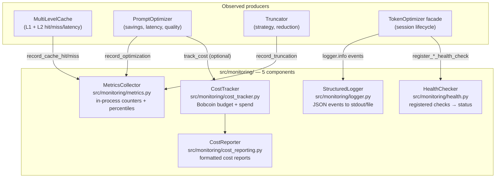
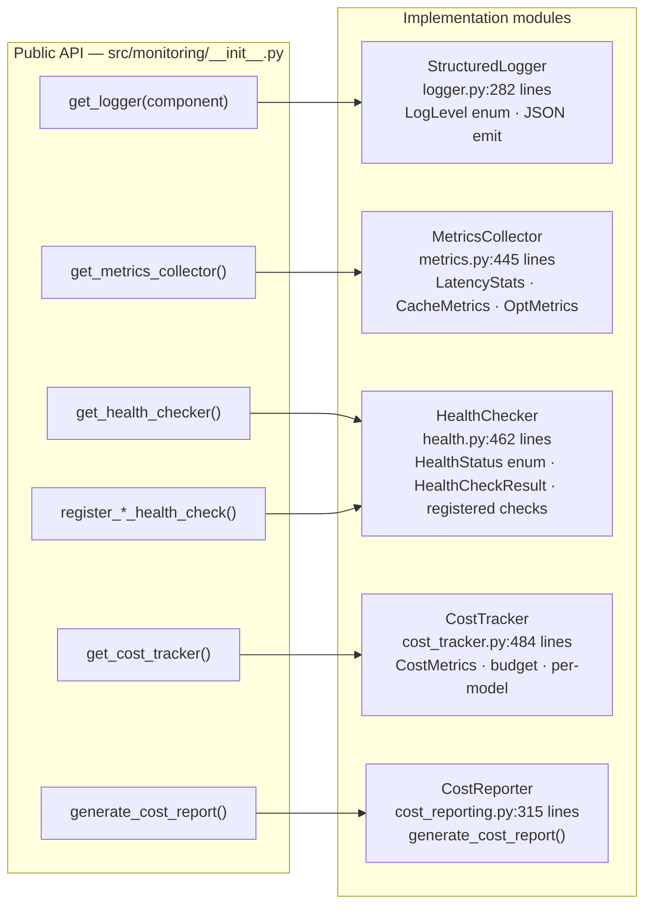
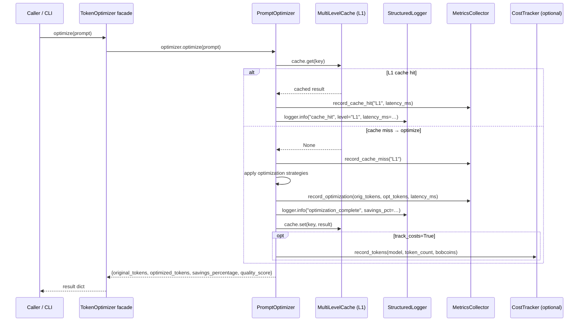
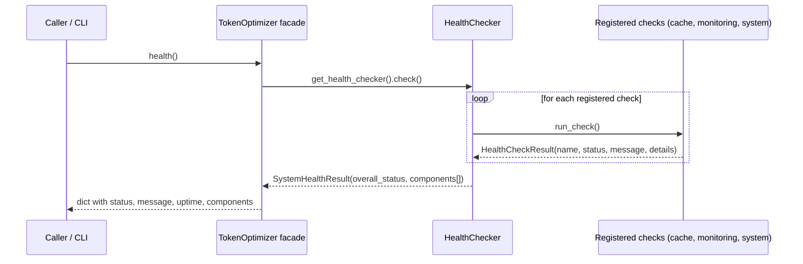

# Monitoring and Observability

**Version:** 2.0 (authoritative)  
**Last updated:** 2026-07-14  
**Standard:** arc42 / Tier-1 Software Vendor bar  
**Scope:** The `src/monitoring/` subsystem of the Python Token Optimization System (~2,041 lines across 6 files).  
Not applicable to the Bob Shell Knowledge Manager (Bash product).

---

## Table of Contents

1. [Context and Scope](#1-context-and-scope)
2. [Constraints](#2-constraints)
3. [Component Architecture](#3-component-architecture)
4. [Runtime Views](#4-runtime-views)
5. [Structured Logging](#5-structured-logging)
6. [Metrics Collection](#6-metrics-collection)
7. [Health Checking](#7-health-checking)
8. [Cost Tracking](#8-cost-tracking)
9. [Integration Example](#9-integration-example)
10. [Architecture Decisions](#10-architecture-decisions)
11. [Quality Scenarios](#11-quality-scenarios)
12. [Risks and Known Limitations](#12-risks-and-known-limitations)
13. [Glossary](#13-glossary)

---

## 1. Context and Scope

### What the monitoring subsystem observes



### What the monitoring subsystem does NOT do

| Not in scope | Reason |
|---|---|
| External APM (Datadog, New Relic, OpenTelemetry) | No network calls from `src/`; local-only system |
| Distributed tracing | Single-process, single-user; no distributed context to propagate |
| Alerting | No daemon, no event loop; health is checked on demand |
| Disk-persisted metrics | In-memory only; cache state is not persisted (by design — ADR-006) |
| Multi-tenant isolation | Single local user; no authentication model |
| Log aggregation | Logs to stdout or a local file; no log shipper |

---

## 2. Constraints

| Constraint | Value | Source |
|---|---|---|
| **In-process only** | All 5 components live in the same Python process; no sidecar, no agent | `src/monitoring/__init__.py` |
| **Thread-safe** | `MetricsCollector` and `CostTracker` use `Lock`/`RLock`; double-checked locking for singletons | `src/monitoring/metrics.py:Lock`, `src/monitoring/cost_tracker.py:Lock` |
| **psutil optional** | System-resource health checks (CPU, memory) degrade gracefully if `psutil` is not installed | `src/monitoring/health.py` |
| **No disk persistence** | Metrics and cost data are lost on process exit | In-memory design |
| **Singleton singletons** | `get_metrics_collector()` and `get_cost_tracker()` return module-level singletons; state is shared within a process | `src/monitoring/metrics.py`, `src/monitoring/cost_tracker.py` |
| **Log format contract** | JSON with fixed top-level keys: `timestamp`, `level`, `component`, `event` + arbitrary kwargs | `src/monitoring/logger.py:StructuredLogger` |
| **Bobcoin formula** | Single home in `src/pricing.py`; re-exported by `cost_tracker.py` | `src/monitoring/cost_tracker.py:TOKENS_PER_BOBCOIN` |

---

## 3. Component Architecture

### Static component view



### Component responsibilities

| Component | File | Lines | Responsibility |
|---|---|---|---|
| **StructuredLogger** | `src/monitoring/logger.py` | 282 | JSON log emission to stdout/file; per-component loggers; specialized `log_cache_hit`, `log_optimization`, `log_truncation` methods |
| **MetricsCollector** | `src/monitoring/metrics.py` | 445 | Thread-safe in-process counters; L1/L2 hit/miss rates; latency deque (1000-entry sliding window); p50/p95/p99 percentiles |
| **HealthChecker** | `src/monitoring/health.py` | 462 | Registry of named health checks; `check()` runs all registered checks; returns `HealthCheckResult` with `HealthStatus` enum |
| **CostTracker** | `src/monitoring/cost_tracker.py` | 484 | Bobcoin budget tracking; per-model token spend; cumulative savings; re-exports pricing constants from `src/pricing.py` |
| **CostReporter** | `src/monitoring/cost_reporting.py` | 315 | Formats `CostTracker` state into human-readable and machine-readable cost reports |

---

## 4. Runtime Views

### Sequence: `optimize()` call → monitoring events



### Sequence: Health check on demand



### Facade wires health checks at construction

```mermaid
sequenceDiagram
    participant FAC as TokenOptimizer.__init__
    participant HLT as HealthChecker (singleton)

    FAC->>HLT: register_cache_health_check("multi_level", self.cache)
    FAC->>HLT: register_monitoring_health_check()
    FAC->>HLT: register_system_health_check()
    Note over HLT: 3 checks registered; health() now returns live data
```

---

## 5. Structured Logging

### Features

- JSON-formatted output for easy parsing
- Multiple log levels (DEBUG, INFO, WARNING, ERROR, CRITICAL)
- Automatic timestamp and context enrichment
- Optional file output with rotation
- Component-specific loggers (`src/monitoring/logger.py:StructuredLogger`)

### Usage

```python
from src.monitoring import get_logger, configure_logging

# Configure global logging
configure_logging(log_level="INFO", log_dir=Path("logs"))

# Get component-specific logger
logger = get_logger("cache")

# Log events
logger.info("cache_hit", key="abc123", latency_ms=0.5)
logger.error("cache_error", error_type="ValueError", message="Invalid key")

# Specialized logging methods
logger.log_cache_hit("L1", "key123", 0.5)
logger.log_optimization(1000, 800, 20.0, 5.5)
logger.log_truncation("priority", 1000, 600, 10.0)
```

### Log Format

```json
{
  "timestamp": "2026-07-12T13:30:00.000Z",
  "level": "INFO",
  "component": "cache",
  "event": "cache_hit",
  "cache_level": "L1",
  "key_hash": 1234,
  "latency_ms": 0.5
}
```

---

## 6. Metrics Collection

### Features

- Cache metrics (L1, L2, combined) — `src/monitoring/metrics.py:CacheMetrics`
- Optimization metrics (token savings, latency) — `src/monitoring/metrics.py:LatencyStats`
- Truncation metrics (strategy usage, reduction)
- Latency statistics (p50, p95, p99) over a 1,000-entry sliding window
- Thread-safe operations via `RLock` (`src/monitoring/metrics.py:RLock`)

### Usage

```python
from src.monitoring import get_metrics_collector

# Get global metrics collector
collector = get_metrics_collector()

# Record cache operations
collector.record_cache_hit("L1", 0.5)
collector.record_cache_miss("L2")
collector.update_cache_size("L1", 100)

# Record optimization
collector.record_optimization(1000, 800, 10.0)

# Record truncation
collector.record_truncation("priority", 1000, 600, 5.0)

# Get metrics
metrics = collector.get_metrics()
summary = collector.get_summary()
```

### Metrics Output

```json
{
  "timestamp": "2026-07-12T13:30:00.000Z",
  "uptime_seconds": 3600.0,
  "cache": {
    "L1": {
      "hits": 750,
      "misses": 250,
      "hit_rate_percent": 75.0,
      "latency": {
        "avg_ms": 0.5,
        "p95_ms": 1.2,
        "p99_ms": 2.5
      }
    },
    "L2": {
      "hits": 200,
      "misses": 50,
      "hit_rate_percent": 80.0
    },
    "combined_hit_rate_percent": 76.0
  },
  "optimization": {
    "count": 500,
    "avg_savings_percent": 22.5,
    "latency": {
      "avg_ms": 10.5
    }
  },
  "truncation": {
    "count": 300,
    "strategy_usage": {
      "priority": 200,
      "simple": 100
    },
    "avg_reduction_percent": 35.0
  }
}
```

---

## 7. Health Checking

### Features

- Named, registered health checks — `src/monitoring/health.py:HealthChecker`
- Three status levels: `healthy`, `degraded`, `unhealthy` — `src/monitoring/health.py:HealthStatus`
- System resource monitoring (CPU, memory) — requires optional `psutil`
- Facade registers all checks at construction time (`src/facade.py:94-96`)

### Usage

```python
from src.monitoring import get_health_checker

checker = get_health_checker()
result = checker.check()
print(result.status)      # HealthStatus.HEALTHY
print(result.to_dict())   # Full JSON-serialisable health report
```

### Health Status Levels

| Status | Meaning | Trigger |
|---|---|---|
| `healthy` | All registered checks pass | All checks return `HealthStatus.HEALTHY` |
| `degraded` | One or more checks degraded but system operable | High cache miss rate, high latency, low memory |
| `unhealthy` | Critical failure — system may not be operating correctly | Component exception, resource exhaustion |
| `unknown` | Health check has not yet run | Initial state before first `check()` call |

### Health Output

```json
{
  "timestamp": "2026-07-12T13:30:00.000Z",
  "status": "healthy",
  "message": "All components healthy",
  "uptime_seconds": 3600.0,
  "components": [
    {
      "name": "cache_l1",
      "status": "healthy",
      "message": "Operating normally",
      "latency_ms": 0.5,
      "details": {
        "hit_rate": 75.0,
        "size": 100
      }
    },
    {
      "name": "system_resources",
      "status": "healthy",
      "message": "Normal resource usage",
      "details": {
        "cpu_percent": 45.0,
        "memory_percent": 60.0
      }
    }
  ]
}
```

---

## 8. Cost Tracking

### Features

- Bobcoin budget tracking — `src/monitoring/cost_tracker.py:CostTracker`
- Per-model token spend accounting
- Cumulative savings reporting — `src/monitoring/cost_reporting.py`
- Pricing constants re-exported from single home `src/pricing.py` — `src/monitoring/cost_tracker.py:TOKENS_PER_BOBCOIN`

### Enabling cost tracking

```python
# Via facade (recommended)
optimizer = TokenOptimizer(track_costs=True)
report = optimizer.cost_report(include_breakdown=True)

# Direct access
from src.monitoring import get_cost_tracker
tracker = get_cost_tracker()
summary = tracker.get_summary()
```

---

## 9. Integration Example

```python
from pathlib import Path
from src.monitoring import (
    configure_logging,
    get_logger,
    get_metrics_collector,
    configure_health_checker
)

# Configure monitoring
configure_logging(log_level="INFO", log_dir=Path("logs"))
logger = get_logger("main")
collector = get_metrics_collector()

# Use facade (recommended — wires health checks automatically)
from src.facade import TokenOptimizer
optimizer = TokenOptimizer(track_costs=True)

# High-level usage
result = optimizer.optimize("Your prompt here")
logger.info("optimization_complete", savings=result["savings_percentage"])

# Read monitoring state
health = optimizer.health()          # dict with status + components
metrics = optimizer.metrics()        # dict with cache/opt/truncation metrics
costs = optimizer.cost_report()      # dict with Bobcoin spend/savings
```

---

## 10. Architecture Decisions

### MON-ADR-001: Structured JSON logging over plaintext

**Decision:** All log output is JSON-formatted (`src/monitoring/logger.py:StructuredLogger`).  
**Rationale:** JSON logs are machine-parseable without a custom parser; the `event` field enables log-based metrics; log lines can be grepped, jq-filtered, or streamed to any log aggregator.  
**Consequence:** Logs are less readable by naked eye in development. Mitigation: `configure_logging(log_level="DEBUG")` or pipe through `jq .`.  
**Status:** Accepted.

### MON-ADR-002: In-process metrics over Prometheus / external APM

**Decision:** `MetricsCollector` stores metrics in memory within the process (`src/monitoring/metrics.py`). No Prometheus endpoint, no StatsD, no external agent.  
**Rationale:** The system is a local CLI library — no network, no daemon. Adding a Prometheus endpoint would require a background thread, a port, and a dependency. The system's usage model (batch invocations, not a long-lived server) makes pull-based metrics inappropriate.  
**Consequence:** Metrics are lost on process exit; no historical trending across invocations; no integration with existing APM stacks without wrapping.  
**Upgrade path:** A future `export_metrics_to_prometheus()` function could serialise the in-memory state to a Prometheus text format on demand.  
**Status:** Accepted.

### MON-ADR-003: Singleton MetricsCollector and CostTracker with double-checked locking

**Decision:** Both `get_metrics_collector()` and `get_cost_tracker()` return a single module-level instance, protected by a `Lock` with double-checked locking (`src/monitoring/metrics.py`, `src/monitoring/cost_tracker.py`).  
**Rationale:** All components in the process must write to the same counters; a new instance per call would produce siloed, non-additive metrics.  
**Consequence:** Singleton state persists across test calls unless explicitly reset; `MetricsCollector.reset()` and `CostTracker.reset()` exist for this reason. The double-checked locking pattern prevents race conditions in concurrent initialisation (50-thread regression test: `tests/monitoring/test_metrics.py`, `tests/monitoring/test_cost_tracker.py`).  
**Status:** Accepted.

### MON-ADR-004: Optional psutil dependency

**Decision:** System-resource health checks (CPU%, memory%) use `psutil` if available; degrade gracefully to "psutil not available" status if not (`src/monitoring/health.py`).  
**Rationale:** `psutil` is a C extension; some deployment environments (minimal containers, WASM) cannot install it. The core token-optimization functionality does not require it.  
**Status:** Accepted.

---

## 11. Quality Scenarios

| ID | Stimulus | Expected response | Measurable target |
|---|---|---|---|
| QS-1 | `optimizer.optimize(prompt)` called in a tight loop 1,000 times | Each call emits one `optimization_complete` log line; metrics counter increments by 1 per call | After 1,000 calls: `collector.get_metrics()["optimization"]["count"] == 1000` |
| QS-2 | `optimizer.health()` called with all 3 checks registered | Returns `status: healthy` when cache is operating and no resource pressure | `result["status"] == "healthy"` and `len(result["components"]) >= 3` |
| QS-3 | Log format contract: any log line emitted by `get_logger("x")` | Line is valid JSON with keys `timestamp`, `level`, `component`, `event` | `json.loads(line)` succeeds; all 4 keys present |
| QS-4 | `MetricsCollector.record_cache_hit("L1", 0.5)` called from 50 concurrent threads | No data loss, no race condition, final count accurate | `collector.get_metrics()["cache"]["L1"]["hits"] == 50`; no exception |
| QS-5 | `psutil` not installed | Health check for system resources returns `status: degraded` with message "psutil not available" | No `ImportError` raised; health check returns structured degraded result |
| QS-6 | `optimizer.cost_report()` called after 100 `optimize()` calls with `track_costs=True` | Report includes total tokens, total Bobcoins, per-model breakdown | `report["total_bobcoins_spent"] > 0`; `report["models"]` non-empty |

---

## 12. Risks and Known Limitations

| ID | Risk | Severity | Status | Mitigation |
|---|---|---|---|---|
| R-1 | **Singleton state between tests** — `MetricsCollector` and `CostTracker` are singletons; state leaks between tests that use them | Medium | Accepted | Call `.reset()` in test teardown; see `tests/monitoring/` for the pattern |
| R-2 | **No persistence** — all metrics and cost data lost on process exit | Low | Accepted | By design (in-memory, local CLI); add `export_metrics()` if persistence is needed |
| R-3 | **Latency window bounded at 1,000 entries** — `LatencyStats.recent` is a `deque(maxlen=1000)`; percentiles are computed over the last 1,000 observations only | Low | Accepted | For short-lived CLI invocations this is the full history; for long-running use, percentiles are sliding-window estimates |
| R-4 | **No alerting** — health status is computed on demand, not continuously monitored | Low | Accepted | The system has no event loop; health checks are a diagnostic tool, not a watchdog |
| R-5 | **psutil optional gap** — if `psutil` is not installed, CPU/memory health is reported as degraded even when the system is healthy | Low | Accepted | `MonitoringConfig.health_check_interval` is declared but not yet wired to any timer; health is fully on-demand |

---

## 13. Glossary

| Term | Definition | Source |
|---|---|---|
| **Bobcoin** | Internal cost unit: `token_count × price_per_token × 1000`. Single home in `src/pricing.py`; re-exported by `cost_tracker.py`. | `src/monitoring/cost_tracker.py:TOKENS_PER_BOBCOIN` |
| **StructuredLogger** | Logger that emits JSON lines with fixed keys (`timestamp`, `level`, `component`, `event`) and arbitrary kwargs. | `src/monitoring/logger.py:StructuredLogger` |
| **MetricsCollector** | In-process singleton that accumulates cache, optimization, and truncation counters + latency percentiles. | `src/monitoring/metrics.py:MetricsCollector` |
| **HealthChecker** | Registry of named check functions; `check()` runs all registered checks and returns an aggregated `HealthStatus`. | `src/monitoring/health.py:HealthChecker` |
| **HealthStatus** | Enum with values `healthy`, `degraded`, `unhealthy`, `unknown`. | `src/monitoring/health.py:HealthStatus` |
| **CostTracker** | In-process singleton that accumulates Bobcoin spend and savings per model. | `src/monitoring/cost_tracker.py:CostTracker` |
| **double-checked locking** | Thread-safety pattern for singleton initialisation: check instance is None outside and inside a lock to avoid redundant locking on every call. | `src/monitoring/metrics.py`, `src/monitoring/cost_tracker.py` |
| **psutil** | Optional Python library for system resource metrics (CPU%, memory%). The health checker degrades gracefully without it. | `src/monitoring/health.py` |
| **LatencyStats** | Dataclass tracking count, min, max, total, and a 1,000-entry sliding deque for p50/p95/p99 computation. | `src/monitoring/metrics.py:LatencyStats` |
| **sliding window** | The `LatencyStats.recent` deque retains the last 1,000 latency observations; percentiles are computed over this window, not over all-time data. | `src/monitoring/metrics.py` |

---

*Authoritative monitoring and observability documentation for the Python Token Optimization System.*  
*System architecture: see [`docs/architecture/ARCHITECTURE.md`](architecture/ARCHITECTURE.md).*
*Maintained by: Architecture Team · Last reviewed: 2026-07-14*
