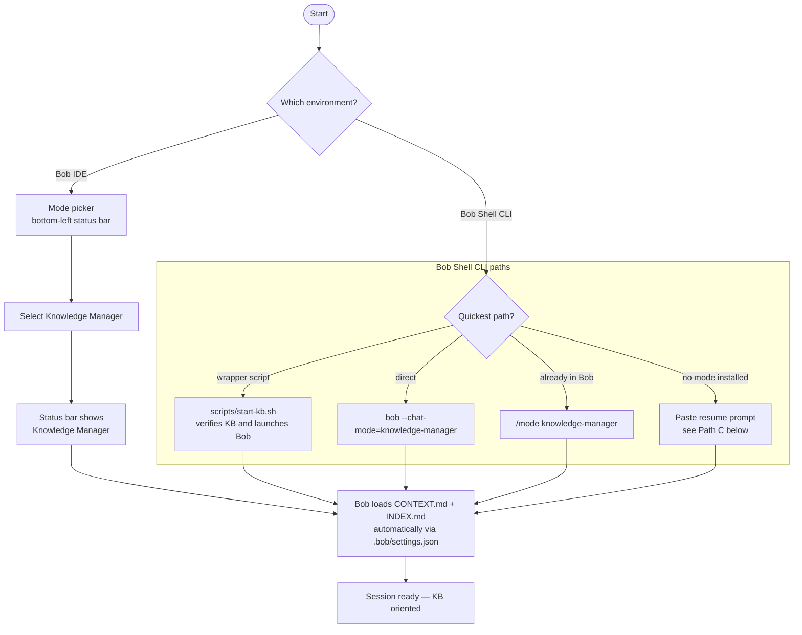
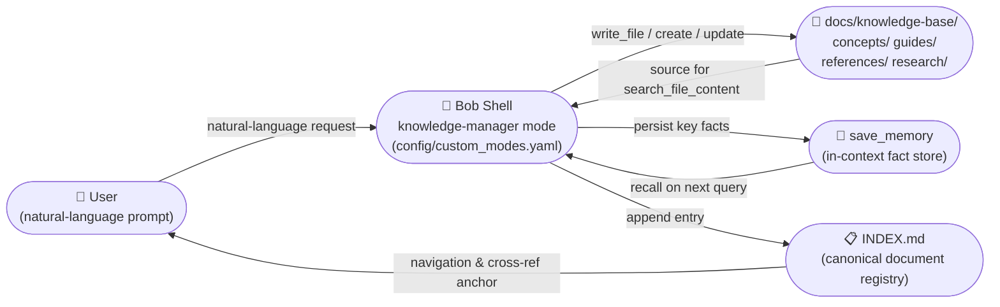
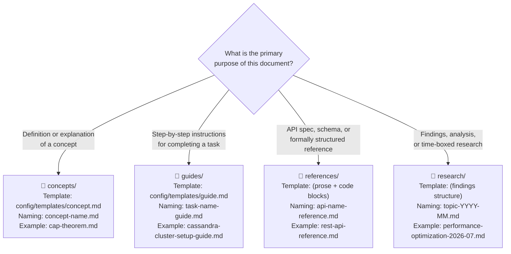
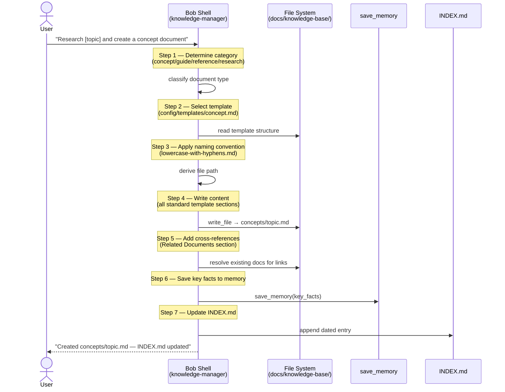
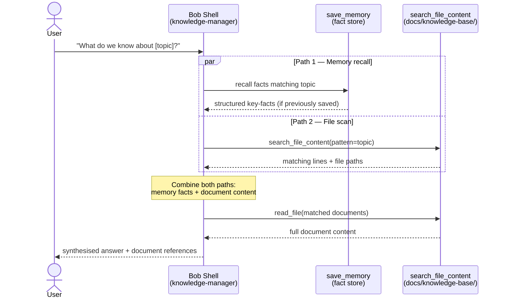
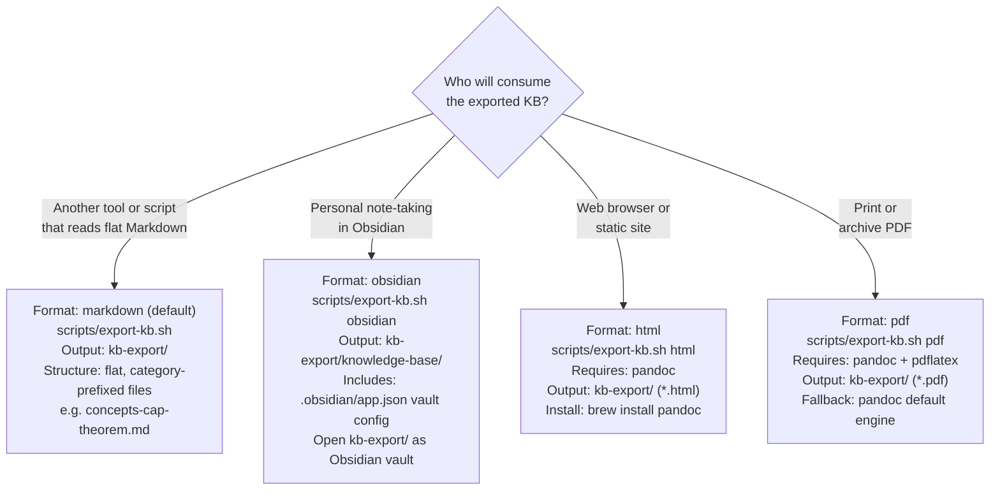

# Knowledge Manager — Usage Guide

| Attribute | Value |
|---|---|
| **Version** | 2.1 |
| **Last Updated** | 2026-07-16 |
| **Standard** | arc42 / Tier-1 |
| **Scope** | Operational reference for all interactions with the `knowledge-manager` mode in both **Bob Shell CLI** and **Bob IDE**: document creation, querying, updating, organizing, exporting, and validating the `docs/knowledge-base/` directory tree. |

> **Bob IDE users:** see [BOB-IDE-GUIDE.md](BOB-IDE-GUIDE.md) for the IDE-specific reference.
> Key differences: activation via mode picker (not `--chat-mode=`); `save_memory` is **not available**
> (file persistence only); shell group is `execute` (not `command`).

---

## Table of Contents

0. [Starting a Session](#0-starting-a-session)
1. [System Context](#1-system-context)
2. [Document Type Decision Tree](#2-document-type-decision-tree)
3. [Creating Documents](#3-creating-documents)
4. [Querying the Knowledge Base](#4-querying-the-knowledge-base)
5. [Updating Documents](#5-updating-documents)
6. [Organizing the Knowledge Base](#6-organizing-the-knowledge-base)
7. [Advanced Usage](#7-advanced-usage)
8. [Exporting](#8-exporting)
9. [Validation](#9-validation)
10. [Best Practices](#10-best-practices)
11. [Quality Scenarios](#11-quality-scenarios)
12. [Risk Register](#12-risk-register)
13. [Glossary](#13-glossary)

---

## 0. Starting a Session

Every Bob Shell session starts fresh — the mode must be activated and Bob must be oriented. Two mechanisms work together automatically once the project is initialised:

| Mechanism | What it does | How it's set up |
|---|---|---|
| **Mode activation** | Loads the knowledge-manager instructions into Bob | `bob --chat-mode=knowledge-manager` or `/mode knowledge-manager` |
| **Context auto-load** | Pre-loads `CONTEXT.md` + `INDEX.md` into the context window | `.bob/settings.json` (written by `init-project.sh`) |

### Activation paths



### Path E — Bob IDE mode picker (verified on Bob IDE 1.121.0+bob2.0.1)

No install step required. The mode is registered in `.bob/custom_modes.yaml`.

1. Open this workspace in Bob IDE.
2. Click the **mode picker** in the bottom-left of the chat panel (shows the current mode name).
3. Scroll to **🧠 Mnemox Knowledge Builder** and select it.
4. Confirm the status bar shows `Mode: 🧠 Mnemox Knowledge Builder`.

Bob IDE differences vs Bob Shell CLI:

| Feature | Bob Shell CLI | Bob IDE |
|---|---|---|
| `save_memory` tool | available | **not available** — use `write_file` instead |
| Shell group name | `command` | `execute` |
| Skill lazy-load | not supported | `use_skill("knowledge-manager")` |
| Writes outside workspace | allowed | workspace-constrained |

For the complete Bob IDE reference see [BOB-IDE-GUIDE.md](BOB-IDE-GUIDE.md).

---

### Path A — Wrapper script (recommended daily driver, Bob Shell CLI)

```bash
cd ~/your-project
~/Projects/bob-llmwiki-knowledge-manager/scripts/start-kb.sh
```

Verifies the KB exists, prints document count, then launches Bob. Optionally takes a path argument:

```bash
# Start KB session in a different project
~/Projects/bob-llmwiki-knowledge-manager/scripts/start-kb.sh ~/Projects/other-project
```

### Path B — Direct CLI flag

```bash
cd ~/your-project
bob --chat-mode=knowledge-manager
```

### Path C — No mode installed (prompt injection)

If the mode is not installed globally, paste this into any Bob mode at the start of the session:

```
You are acting as the knowledge manager for this project.
KB location: docs/knowledge-base/  (INDEX.md is loaded in context)
Resume: summarise what exists in the KB, what was most recently documented, and suggest what to work on next.
Workflow: follow the 7-step document creation process (determine category → select template → apply naming convention → write content → add cross-references → save to memory → update INDEX.md).
```

### Standard resume prompt (first message of any session)

After activation, open with this to orient Bob immediately:

```
What did we document most recently? Summarise the KB and suggest what to work on next.
```

Bob will:
1. Scan `INDEX.md` (already in context via `.bob/settings.json`)
2. Recall any facts saved with `save_memory` in prior sessions *(Bob Shell CLI only — not available in Bob IDE)*
3. Propose the next logical documents or updates

### What `CONTEXT.md` provides

`init-project.sh` generates a `CONTEXT.md` at the project root. Bob auto-loads it alongside `INDEX.md` at every session start (declared in `.bob/settings.json`). It contains:
- Project name and KB location
- The four standard quick-start prompts
- A KB summary section you update as the KB grows

Edit `CONTEXT.md` directly to add project-specific guidance, constraints, or terminology that Bob should know at the start of every session.

---

## 1. System Context

The knowledge manager is a custom mode defined in [`config/custom_modes.yaml`](../config/custom_modes.yaml:180). It wraps the LLM interaction layer with a fixed workflow and a set of tool bindings. All persistent output lands in `docs/knowledge-base/` and its four sub-directories.

**Tool bindings by target:**

| Tool | Bob Shell CLI | Bob IDE |
|---|---|---|
| `save_memory` | available — persists key facts across turns | **not available** |
| `search_file_content` | available | available |
| `write_file` | available | available (workspace-constrained) |



**Arrow semantics**

| Arrow | Meaning |
|---|---|
| User → Bob Shell | Natural-language prompt (question, instruction, or command) |
| Bob Shell → KB directory | `write_file` call that creates or modifies a Markdown document |
| Bob Shell → `save_memory` | Structured key-fact persistence across conversation turns |
| `save_memory` → Bob Shell | Automatic recall injected into subsequent prompts |
| KB directory → Bob Shell | `search_file_content` scan during query resolution |
| Bob Shell → INDEX.md | Append of a dated entry (`YYYY-MM-DD: [Title](path) — Category`) |
| INDEX.md → User | Browsable index for direct navigation and cross-reference resolution |

### Quick Start

```bash
# 1. Initialise a project (first time only)
cd ~/Projects/your-project
~/Projects/bob-llmwiki-knowledge-manager/scripts/init-project.sh

# 2. Start Bob Shell in knowledge-manager mode
bob --chat-mode=knowledge-manager

# 3. Create your first document
# (inside the Bob Shell session)
Research Cassandra's gossip protocol and create a concept document
```

Bob Shell will:
- Research the topic using `web_fetch`
- Create `docs/knowledge-base/concepts/gossip-protocol.md`
- Follow the [`config/templates/concept.md`](../config/templates/concept.md) template
- Save key facts with `save_memory` *(Bob Shell CLI only)*
- Append an entry to [`docs/knowledge-base/index.md`](knowledge-base/INDEX.md)

---

## 2. Document Type Decision Tree

Every new document requires a category decision before a file name can be chosen. The decision is enforced by the mode's `customInstructions` ([`config/custom_modes.yaml:191`](../config/custom_modes.yaml:191)).



**Naming rules** (from [`config/custom_modes.yaml:199-203`](../config/custom_modes.yaml:199)):

| Category | Pattern | Live example from INDEX.md |
|---|---|---|
| Concepts | `concept-name.md` | [`multi-level-caching.md`](knowledge-base/concepts/multi-level-caching.md) |
| Guides | `task-name-guide.md` | [`cost-tracking-guide.md`](knowledge-base/guides/cost-tracking-guide.md) |
| References | `api-name-reference.md` | [`cache-api.md`](knowledge-base/references/cache-api.md) |
| Research | `topic-YYYY-MM.md` | [`codebase-analysis-2026-07-14.md`](knowledge-base/research/codebase-analysis-2026-07-14.md) |

All names use **lowercase-with-hyphens** only — no spaces, no uppercase, no underscores.

---

## 3. Creating Documents

### 3.1 The 7-Step Workflow

Every document creation follows the seven-step workflow defined in [`config/custom_modes.yaml:191-197`](../config/custom_modes.yaml:191). The sequence diagram below shows the actors and messages:



### 3.2 Document Type Examples

#### Concept Documents

```
Research [topic] and create a concept document
```

Example:
```
Research CAP theorem and create a concept document
```

Result: `docs/knowledge-base/concepts/cap-theorem.md`

Template structure applied ([`config/templates/concept.md`](../config/templates/concept.md)):
- **Overview** — 2–3 sentence description
- **Key Points** — bullet list of main ideas
- **Details** — subsections for depth
- **Examples** — code or scenario examples
- **Related Documents** — cross-references
- **References** — external sources

#### Guide Documents

```
Create a guide for [task]
```

Example:
```
Create a guide for setting up a Cassandra cluster
```

Result: `docs/knowledge-base/guides/cassandra-cluster-setup-guide.md`

Template structure applied ([`config/templates/guide.md`](../config/templates/guide.md)):
- **Overview** — scope and audience
- **Prerequisites** — required knowledge/tools
- **Steps** — numbered, each with example commands
- **Verification** — command + expected output block
- **Troubleshooting** — symptom / cause / solution triples
- **Related Documents** — cross-references

#### Reference Documents

```
Create a reference document for [API/component]
```

Example:
```
Create a reference document for the REST API
```

Result: `docs/knowledge-base/references/rest-api-reference.md`

Live example in INDEX.md: [`cache-api.md`](knowledge-base/references/cache-api.md) — complete API documentation for all cache classes, methods, and usage examples.

#### Research Documents

```
Research [topic] and document findings
```

Example:
```
Research performance optimization techniques and document findings
```

Result: `docs/knowledge-base/research/performance-optimization-2026-07.md`

Live example in INDEX.md: [`codebase-analysis-2026-07-14.md`](knowledge-base/research/codebase-analysis-2026-07-14.md) — complete repository analysis including code quality metrics, testing analysis, and production readiness.

---

## 4. Querying the Knowledge Base

### 4.1 Two-Path Query Architecture

Bob Shell uses two complementary retrieval paths on every query. The diagram below shows how they are combined:



**Path 1 — Memory recall** is fast (in-context lookup) and returns structured facts that were explicitly saved during previous creation or update operations. It is the primary source for key definitions, conclusions, and metrics.

**Path 2 — File scan** uses `search_file_content` to scan every `.md` file under `docs/knowledge-base/`. It catches documents whose facts were never saved to memory (e.g., imported documents, documents created outside the mode).

Bob always combines both paths before answering — memory provides structure, file scan provides completeness.

### 4.2 Query Examples

Basic query:
```
What do we know about [topic]?
```

Example:
```
What do we know about Cassandra consistency levels?
```

Bob Shell will:
1. Recall saved facts from memory
2. Search knowledge base files with `search_file_content`
3. Read relevant documents in full
4. Synthesize a comprehensive answer
5. Provide document references with relative paths

Targeted query (single document):
```
Summarise the findings in research/codebase-analysis-2026-07-14.md
```

Cross-category query:
```
What guides and concepts relate to token optimization?
```

Result will draw from:
- [`concepts/token-optimization.md`](knowledge-base/concepts/token-optimization.md)
- [`guides/setup-token-optimization.md`](knowledge-base/guides/setup-token-optimization.md)
- [`guides/using-both-systems-together.md`](knowledge-base/guides/using-both-systems-together.md)

---

## 5. Updating Documents

### 5.1 Update Command

```
Update [document] with [new information]
```

Example:
```
Update the gossip-protocol concept with information about failure detection
```

### 5.2 What Bob Does When You Update

When an update is requested, Bob Shell performs the following internal sequence:

1. **Reads current document** — fetches the full content of the target file so no existing information is lost
2. **Applies the change** — integrates the new information into the appropriate section (adds a subsection, extends an existing one, or appends to Key Points)
3. **Saves updated facts to memory** — calls `save_memory` with the revised key facts, overwriting stale entries *(Bob Shell CLI only — Bob IDE skips this step)*
4. **Re-checks cross-references** — scans the Updated Documents section; if the new information is related to other existing documents, adds or updates the "Related Documents" links
5. **Updates the `Last Updated` footer** — changes the date stamp at the bottom of the file
6. **Does not touch INDEX.md** unless the document's title or category changes

Example of an update that triggers cross-reference addition:
```
Update the gossip-protocol concept with information about failure detection
```

Bob will:
- Add a "Failure Detection" subsection to the concept
- Check whether a `failure-detection.md` or related guide exists in `docs/knowledge-base/`
- If it exists, add it to the "Related Documents" section of the gossip-protocol document and add the gossip-protocol document to the related document's "Related Documents" section

### 5.3 Common Workflows

**Daily Research Notes**:

```bash
bob --chat-mode=knowledge-manager
```

```
Research today's topics:
1. Cassandra's new features in 4.1
2. Best practices for schema design
3. Performance tuning guidelines

Create appropriate documents for each topic.
```

Bob Shell CLI automatically uses `save_memory` to persist important facts. *(Bob IDE does not have `save_memory` — all persistence is via `write_file` to `docs/knowledge-base/`.)*

**Review Later**:
```
What did we learn about Cassandra 4.1 today?
```

---

## 6. Organizing the Knowledge Base

### 6.1 Organize Command

```
Review and organize all [category] documents
```

Example:
```
Review and organize all concept documents
```

Bob Shell will:
- List all documents in the category
- Check for missing cross-references
- Add "Related Documents" sections where absent
- Update [`docs/knowledge-base/index.md`](knowledge-base/INDEX.md)

### 6.2 Architectural Context: What "Organize" Means

Organizing the knowledge base has two concrete artifacts:

**INDEX.md** is the canonical document registry at [`docs/knowledge-base/index.md`](knowledge-base/INDEX.md). It has three structural parts:

| Section | Purpose |
|---|---|
| **Quick Navigation** | Four category links (`concepts/`, `guides/`, `references/`, `research/`) |
| **Recent Additions** | Reverse-chronological list of new documents with ⭐ NEW marker |
| **All Documents** | Full enumeration grouped by category, one line per document |

During "organize", Bob Shell ensures:
- Every file under `docs/knowledge-base/*/` has a corresponding entry in INDEX.md
- Every entry in INDEX.md has a valid relative path (no dead links)
- The "Recent Additions" section is sorted by date descending
- Each document's "Related Documents" section references at least one other document in the KB (where relationships exist)

**Cross-references** are bidirectional relative Markdown links. The principle is stated in [`config/custom_modes.yaml:185`](../config/custom_modes.yaml:185): "Bidirectional links between documents." When Bob adds a link from document A to document B, it also checks whether document B should link back to document A.

Example of a correct bidirectional cross-reference (live in KB):
- [`concepts/token-optimization.md`](knowledge-base/concepts/token-optimization.md) links to [`concepts/multi-level-caching.md`](knowledge-base/concepts/multi-level-caching.md)
- [`concepts/multi-level-caching.md`](knowledge-base/concepts/multi-level-caching.md) links back to [`concepts/token-optimization.md`](knowledge-base/concepts/token-optimization.md)

### 6.3 Building a Concept Library

**Step 1: Identify Core Concepts**

```
Create concept documents for:
- CAP theorem
- Eventual consistency
- Quorum reads
- Hinted handoff
```

**Step 2: Link Concepts**

```
Update all consistency-related concepts to cross-reference each other
```

**Step 3: Verify Organization**

```
Review the concepts directory and ensure all documents are properly organized
```

### 6.4 Creating Project Documentation

**Step 1: System Architecture**

```
Create a concept document for our system architecture
```

**Step 2: Setup Guide**

```
Create a guide for setting up the development environment
```

**Step 3: API Reference**

```
Create a reference document for our REST API endpoints
```

**Step 4: Link Everything**

```
Update INDEX.md to include all new documents with proper categorization
```

### 6.5 Research Project Workflow

**Define Research Objective**:
```
Research distributed consensus algorithms and document findings
```

**Gather Sources**:
```
Research Paxos, Raft, and compare their approaches
```

**Document Analysis**:
```
Create a research document analyzing the trade-offs between Paxos and Raft
```

Bob Shell automatically saves key findings to memory.

---

## 7. Advanced Usage

### 7.1 Custom Templates

Reference the templates explicitly when creating documents:

```
Create a concept document for [topic] following the standard template
```

Templates are at:
- [`config/templates/concept.md`](../config/templates/concept.md)
- [`config/templates/guide.md`](../config/templates/guide.md)

### 7.2 Batch Operations

Create multiple documents at once:

```
Create concept documents for the following topics:
1. Distributed transactions
2. Two-phase commit
3. Saga pattern

Ensure they're all cross-referenced.
```

Bob Shell will execute the full 7-step workflow for each document in sequence and then link them all in their respective "Related Documents" sections.

### 7.3 Weekly Review

```
Review all documents created this week and:
1. Check for broken links
2. Ensure proper cross-referencing
3. Update INDEX.md
4. Identify documentation gaps
```

### 7.4 Monthly Audit

```
Audit the entire knowledge base:
1. Check for outdated information
2. Identify documents that need updates
3. Suggest new documents based on gaps
4. Verify all cross-references are valid
```

### 7.5 Verifying Cross-References with validate-kb.sh

The shell script [`scripts/validate-kb.sh`](../scripts/validate-kb.sh) performs a structural integrity check independent of Bob Shell. Run it at any time from the project root:

```bash
~/Projects/bob-llmwiki-knowledge-manager/scripts/validate-kb.sh
```

The script checks:

1. That `docs/knowledge-base/` directory exists
2. That `docs/knowledge-base/index.md` exists
3. That all four required subdirectories (`concepts/`, `guides/`, `references/`, `research/`) exist
4. That every relative Markdown link in every `.md` file resolves to an existing file

For broken-link detection, it uses a `grep -oP` regex to extract link targets and then checks `[ -f "$target" ]` for each non-HTTP link (see [`scripts/validate-kb.sh:33-47`](../scripts/validate-kb.sh:33)).

After the structural check, the script emits a document count summary.

### 7.6 Git Versioning for the Knowledge Base

Commit knowledge base changes after each session to maintain a verifiable history:

```bash
# After creating new documents
git add docs/knowledge-base/
git commit -m "Add concept: CAP theorem"
git push

# After a bulk organize session
git add docs/knowledge-base/index.md docs/knowledge-base/concepts/
git commit -m "Organize: add cross-references to consistency concepts"
git push

# After a monthly audit
git add docs/knowledge-base/
git commit -m "Monthly audit 2026-07: update 4 stale docs, fix 2 broken links"
git push
```

Recommended commit message conventions:

| Operation | Prefix | Example |
|---|---|---|
| New document | `Add` | `Add concept: gossip-protocol` |
| Update existing | `Update` | `Update guide: cassandra-setup — add TLS section` |
| Cross-reference pass | `Organize` | `Organize: link consistency concepts` |
| Validation fix | `Fix` | `Fix: broken link in cache-api reference` |
| Bulk audit | `Audit` | `Audit: monthly review 2026-07` |

---

## 8. Exporting

### 8.1 Export Decision Tree

Choose a format based on the intended consumer. The decision tree below is grounded in [`scripts/export-kb.sh`](../scripts/export-kb.sh):



### 8.2 Export Commands

```bash
# Export as flat markdown (default)
~/Projects/bob-llmwiki-knowledge-manager/scripts/export-kb.sh

# Export for Obsidian
~/Projects/bob-llmwiki-knowledge-manager/scripts/export-kb.sh obsidian

# Export as HTML (requires pandoc)
~/Projects/bob-llmwiki-knowledge-manager/scripts/export-kb.sh html

# Export as PDF (requires pandoc)
~/Projects/bob-llmwiki-knowledge-manager/scripts/export-kb.sh pdf
```

### 8.3 Export Output

All formats write to `kb-export/` in the project root (created automatically by [`scripts/export-kb.sh:15`](../scripts/export-kb.sh:15)).

After export, the script prints:

```
📊 Export Statistics:
  Total files: <n>
  Output directory: kb-export
```

### 8.4 Export Troubleshooting

**Issue**: Export script fails for HTML or PDF

**Cause**: `pandoc` is not installed

**Solution**:
```bash
# macOS
brew install pandoc

# Linux
apt-get install pandoc
```

**Issue**: PDF conversion fails silently

**Cause**: `pdflatex` engine not present. The script falls back to `pandoc`'s default engine (see [`scripts/export-kb.sh:105-107`](../scripts/export-kb.sh:105)); if that also fails, it prints a warning and continues.

---

## 9. Validation

### 9.1 Running the Validator

```bash
~/Projects/bob-llmwiki-knowledge-manager/scripts/validate-kb.sh
```

### 9.2 Exact Output Format

The following shows the complete output produced by [`scripts/validate-kb.sh`](../scripts/validate-kb.sh) on a healthy knowledge base:

```
🔍 Validating Knowledge Base...
✅ INDEX.md exists
✅ Directory exists: concepts
✅ Directory exists: guides
✅ Directory exists: references
✅ Directory exists: research

🔗 Checking for broken links...
✅ No broken links found

📊 Knowledge Base Statistics:
  Concepts: <n>
  Guides: <n>
  References: <n>
  Research: <n>
  Total: <n>
```

On failure, the script exits with code `1` and prints one of:

```
❌ Knowledge base directory not found: docs/knowledge-base
❌ INDEX.md not found
❌ Missing directory: concepts
❌ Broken link in docs/knowledge-base/concepts/foo.md: ../guides/missing.md
```

The broken-link check is performed by the loop at [`scripts/validate-kb.sh:33-47`](../scripts/validate-kb.sh:33). It extracts all `[text](target)` link targets, skips `https?://` URLs, and tests each relative path with `-f`.

### 9.3 Validation Checks Summary

| Check | Script Line | Pass Condition |
|---|---|---|
| KB directory exists | L7–10 | `docs/knowledge-base/` is a directory |
| INDEX.md present | L13–16 | `docs/knowledge-base/index.md` is a file |
| `concepts/` exists | L20–26 | directory present |
| `guides/` exists | L20–26 | directory present |
| `references/` exists | L20–26 | directory present |
| `research/` exists | L20–26 | directory present |
| No broken relative links | L33–47 | all `[ -f "$target" ]` checks pass |

### 9.4 Troubleshooting Validation Failures

**Mode not available**

**Issue**: `knowledge-manager` mode not found

**Solution**: Reinstall the mode:
```bash
cd ~/Projects/bob-llmwiki-knowledge-manager
./scripts/install.sh
```

**Documents not created**

**Issue**: Bob Shell doesn't create documents

**Solution**: Verify you're in knowledge-manager mode:
```
/mode knowledge-manager
```

**Search not finding documents**

**Issue**: Search doesn't find existing documents

**Solution**: Ensure documents are in the correct location:
```bash
ls -la docs/knowledge-base/
```

---

## 10. Best Practices

### 10.1 Naming Conventions

Enforced by the mode's `customInstructions` at [`config/custom_modes.yaml:199-203`](../config/custom_modes.yaml:199). Bob Shell will refuse or correct names that don't match.

- **Concepts**: `concept-name.md` (e.g., `cap-theorem.md`)
- **Guides**: `task-name-guide.md` (e.g., `setup-guide.md`)
- **References**: `api-name-reference.md` (e.g., `rest-api-reference.md`)
- **Research**: `topic-YYYY-MM.md` (e.g., `performance-2026-07.md`)

All names: lowercase, hyphens only, no spaces, no uppercase.

### 10.2 Cross-Referencing

Enabled by the mode's "Cross-Referencing" core principle at [`config/custom_modes.yaml:185`](../config/custom_modes.yaml:185). Always include "Related Documents" sections:

```markdown
## Related Documents
- [Related Concept](./related-concept.md)
- [Related Guide](../guides/related-guide.md)
```

Links must be relative to the file's own directory. The validator ([`scripts/validate-kb.sh:33-47`](../scripts/validate-kb.sh:33)) will flag any broken relative link.

### 10.3 Memory Management

Enabled by the `save_memory` tool binding in the mode at [`config/custom_modes.yaml:186`](../config/custom_modes.yaml:186). Bob Shell CLI automatically persists key facts *(Bob Shell CLI only — not available in Bob IDE)*:

- Include context in facts (not just values)
- Be specific and concise
- State relationships between concepts

### 10.4 Regular Maintenance

Aligned with the "Index Maintenance" principle at [`config/custom_modes.yaml:188`](../config/custom_modes.yaml:188):

- **Daily**: Save new facts, update INDEX.md
- **Weekly**: Review recent documents, check links (use `validate-kb.sh`)
- **Monthly**: Audit entire knowledge base, update outdated info

### 10.5 Version Control

Commit knowledge base changes regularly (see §7.6 for full conventions):

```bash
git add docs/knowledge-base/
git commit -m "Add concept: CAP theorem"
git push
```

### 10.6 Template Adherence

Enabled by the "Template-Driven" principle at [`config/custom_modes.yaml:187`](../config/custom_modes.yaml:187). Using the standard templates in [`config/templates/`](../config/templates/) ensures:
- Every concept has a "Key Points" section that `search_file_content` can find
- Every guide has a "Verification" section with expected output
- Every document has a `Last Updated` footer date for temporal reasoning

---

## 11. Quality Scenarios

The following six scenarios define verifiable success criteria for each major operation. Each scenario follows the arc42 quality scenario format: **stimulus → system response → measurable outcome**.

| # | Operation | Stimulus | Expected System Response | Measurable Outcome |
|---|---|---|---|---|
| QS-1 | **Create** | User says "Research CAP theorem and create a concept document" | Bob Shell executes all 7 steps from §3.1 | File exists at `docs/knowledge-base/concepts/cap-theorem.md`; entry present in INDEX.md; `save_memory` called at least once; file passes `validate-kb.sh` |
| QS-2 | **Query** | User asks "What do we know about token optimization?" | Bob Shell activates both retrieval paths (§4.1) | Response cites at least one file path from `docs/knowledge-base/`; answer synthesizes memory facts and file content; no hallucinated paths |
| QS-3 | **Update** | User says "Update gossip-protocol with failure detection information" | Bob reads current file, applies change, saves updated facts, re-checks cross-references (§5.2) | Target file modified; `Last Updated` date changed; `save_memory` called; no previously existing content deleted |
| QS-4 | **Organize** | User says "Review and organize all concept documents" | Bob audits `concepts/` directory, adds missing cross-references, updates INDEX.md (§6.2) | INDEX.md contains entries for all files in `concepts/`; every concept file has a non-empty "Related Documents" section; `validate-kb.sh` exits 0 |
| QS-5 | **Export** | User runs `./scripts/export-kb.sh obsidian` | Script copies KB structure and creates `.obsidian/app.json` | `kb-export/knowledge-base/` directory exists; `.obsidian/app.json` is valid JSON; exit code 0; statistics printed |
| QS-6 | **Validate** | User runs `./scripts/validate-kb.sh` on a healthy KB | Script checks directory structure, INDEX.md, and all relative links | Exit code 0; all six `✅` lines printed; `📊 Knowledge Base Statistics` block present with non-zero Total |

---

## 12. Risk Register

| ID | Risk | Likelihood | Impact | Mitigation |
|---|---|---|---|---|
| R-1 | **INDEX.md staleness** — A document is created directly (e.g., by copying a file) without going through Bob Shell, so INDEX.md is never updated. The document exists on disk but is invisible to navigation and cross-reference checks. | Medium | High | Run `validate-kb.sh` weekly (§9); use "Organize" command (§6.1) to audit and repair INDEX.md; commit INDEX.md in every git commit that touches `docs/knowledge-base/`. |
| R-2 | **Search false-negatives** — A document exists on disk but was never indexed in memory (`save_memory` not called) and is not found by `search_file_content` because the search pattern doesn't match its content. | Low | Medium | Path 2 of the query architecture (§4.1) scans all `.md` files regardless of memory state; ensure document titles and key terms appear in the first paragraph so pattern matches succeed. |
| R-3 | **Naming convention drift** — Documents accumulate with inconsistent names (`CAPTheorem.md`, `cap_theorem.md`) over time, breaking relative cross-references and making `validate-kb.sh` broken-link checks unreliable. | Medium | Medium | The mode enforces `lowercase-with-hyphens` at creation time ([`config/custom_modes.yaml:193`](../config/custom_modes.yaml:193)); run a monthly audit prompt (§7.4) to catch any files created outside the mode; use `validate-kb.sh` to surface broken links from misnamed targets. |
| R-4 | **Memory limit / saturation** — After a very large number of `save_memory` calls, the in-context fact store approaches its capacity limit. New facts may be silently dropped or earlier facts may be evicted, causing Path 1 query results to degrade. | Low | Medium | Prefer concise, factual memory entries over long narratives; rely on Path 2 (`search_file_content`) as the authoritative completeness guarantee; periodically start a fresh session to reset the memory state for a domain area. |
| R-5 | **Export format incompatibility** — HTML or PDF export fails because `pandoc` is not installed or `pdflatex` is absent, blocking the export pipeline. | Medium | Low | The script detects missing `pandoc` and exits with a clear error ([`scripts/export-kb.sh:61-65`](../scripts/export-kb.sh:61)); use `markdown` or `obsidian` formats (no dependencies) as fallback; document `pandoc` as a required dependency in project README. |

---

## 13. Glossary

| Term | Definition |
|---|---|
| **Bob mode** | A named configuration unit in [`config/custom_modes.yaml`](../config/custom_modes.yaml) that binds a system prompt, a tool set, and `customInstructions` to a Bob Shell `--chat-mode` flag. The `knowledge-manager` mode activates the 7-step document creation workflow and all KB-specific tool bindings. |
| **`search_file_content`** | A Bob Shell built-in tool that performs a regex or substring scan across all files in a specified directory tree. In the knowledge-manager mode it is used during query resolution (Path 2, §4.1) to find documents whose facts were not saved to memory. |
| **`save_memory`** | A Bob Shell CLI built-in tool that persists a key-value or structured fact into the session's in-context memory store. Facts saved with this tool are automatically recalled on subsequent turns. Used in Step 6 of the document creation workflow ([`config/custom_modes.yaml:195`](../config/custom_modes.yaml:195)) and after every update operation. **Not available in Bob IDE** — use `write_file` to `docs/knowledge-base/` instead. |
| **INDEX.md** | The canonical document registry at [`docs/knowledge-base/index.md`](knowledge-base/INDEX.md). Contains three sections: Quick Navigation (category links), Recent Additions (reverse-chronological), and All Documents (full enumeration by category). It is the single source of truth for what documents exist in the knowledge base and is updated in Step 7 of every document creation. |
| **Cross-reference** | A bidirectional relative Markdown link between two documents in the knowledge base. Cross-references appear in each document's "Related Documents" section and are validated by [`scripts/validate-kb.sh`](../scripts/validate-kb.sh). The mode's core principles require bidirectionality ([`config/custom_modes.yaml:185`](../config/custom_modes.yaml:185)): if document A links to document B, document B should link back to document A. |
| **knowledge-manager workflow** | The 7-step sequence defined at [`config/custom_modes.yaml:191-197`](../config/custom_modes.yaml:191): (1) determine category, (2) select template, (3) apply naming convention, (4) write content, (5) add cross-references, (6) save key facts to memory, (7) update INDEX.md. Every document creation and significant update follows this sequence. |

---

## Examples

### Example 1: Software Development Project

```
# Initialize
cd ~/Projects/my-app
~/Projects/bob-llmwiki-knowledge-manager/scripts/init-project.sh

# Start Bob Shell
bob --chat-mode=knowledge-manager

# Create architecture documentation
Create a concept document for our microservices architecture

# Create setup guide
Create a guide for setting up the development environment

# Create API reference
Create a reference document for our REST API

# Link everything
Update INDEX.md to include all new documents
```

### Example 2: Research Project

```
# Start Bob Shell
bob --chat-mode=knowledge-manager

# Research and document
Research machine learning optimization techniques and create a research document

# Save key findings
# (Bob Shell automatically saves to memory)

# Create related concepts
Create concept documents for:
- Gradient descent
- Backpropagation
- Learning rate scheduling

# Link research to concepts
Update the research document to reference the concept documents
```

### Example 3: Personal Wiki

```
# Start Bob Shell
bob --chat-mode=knowledge-manager

# Document learning
Create a concept document for Docker containers

# Create how-to guides
Create a guide for deploying applications with Docker

# Build knowledge over time
What do we know about containerization?

# Export for offline reading
~/Projects/bob-llmwiki-knowledge-manager/scripts/export-kb.sh obsidian
```

---

## Next Steps

- **Customize**: See [Customization Guide](CUSTOMIZATION.md)
- **Workflows**: See [Workflows Guide](WORKFLOWS.md)
- **Compare**: See [Comparison with LLM-Wiki](COMPARISON.md)

## Support

For issues or questions:

- [GitHub Issues](https://github.com/davidleconte/bob-llmwiki-knowledge-manager/issues)
- [Documentation](https://github.com/davidleconte/bob-llmwiki-knowledge-manager/tree/main/docs)
