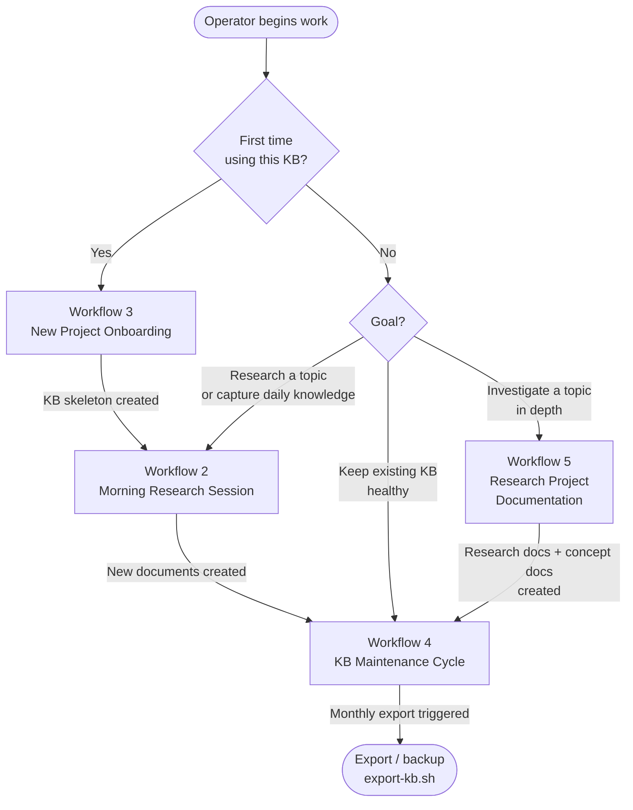
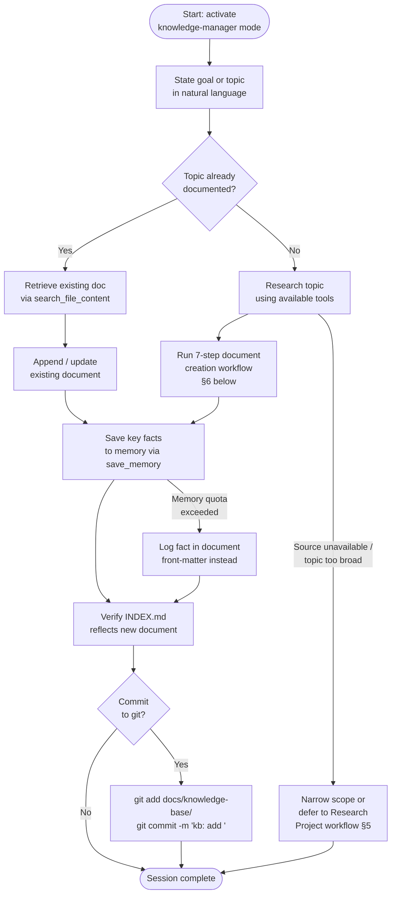
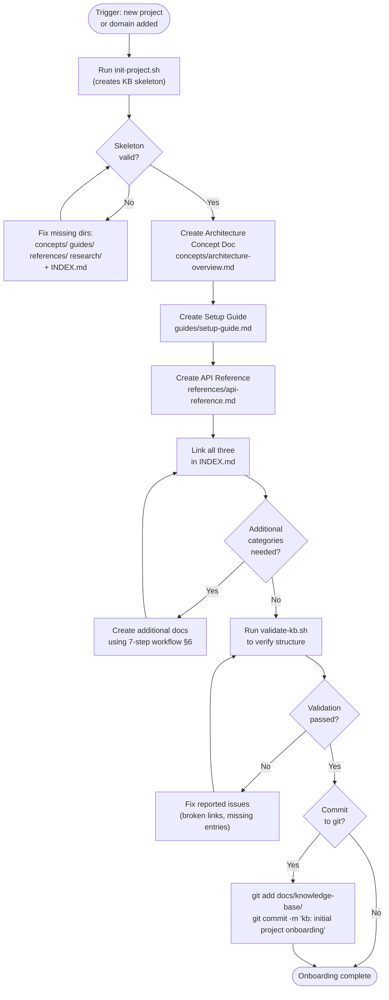
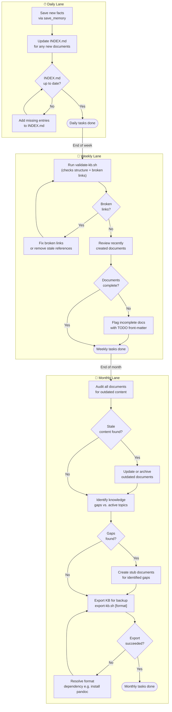
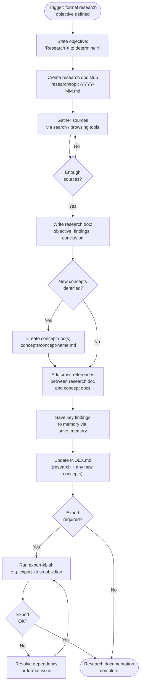

# Workflows

| Attribute | Value |
|-----------|-------|
| **Version** | 2.1 |
| **Last Updated** | 2026-07-16 |
| **Standard** | arc42 / Tier-1 |
| **Scope** | End-to-end operational workflows for the Bob Shell LLM Wiki Knowledge Manager — covering document creation, project onboarding, KB maintenance, and research documentation. Each workflow is grounded in the system's actual mode configuration ([`config/custom_modes.yaml`](../config/custom_modes.yaml)) and supporting scripts ([`scripts/validate-kb.sh`](../scripts/validate-kb.sh), [`scripts/export-kb.sh`](../scripts/export-kb.sh)). |

> **Scope note — Bob Shell CLI:** These workflows are written for Bob Shell CLI (`bob --chat-mode=knowledge-manager`).
> **Bob IDE users:** activate via the mode picker (🧠 Mnemox Knowledge Builder) and see [docs/bob-ide-guide.md](BOB-IDE-GUIDE.md).
> Key difference: `save_memory` is **not available** in Bob IDE — all persistence is via `write_file` to `docs/knowledge-base/`.

---

## Table of Contents

1. [Workflow Overview](#1-workflow-overview)
2. [Workflow: Morning Research Session](#2-workflow-morning-research-session)
3. [Workflow: New Project Onboarding](#3-workflow-new-project-onboarding)
4. [Workflow: KB Maintenance Cycle](#4-workflow-kb-maintenance-cycle)
5. [Workflow: Research Project Documentation](#5-workflow-research-project-documentation)
6. [The 7-Step Document Creation Workflow](#6-the-7-step-document-creation-workflow)
7. [Anti-Patterns](#7-anti-patterns)
8. [Quality Scenarios](#8-quality-scenarios)
9. [Risk Register](#9-risk-register)
10. [Glossary](#10-glossary)

---

## 1. Workflow Overview

The system supports four primary workflows. The diagram below shows each workflow, its trigger event, and how they relate to each other over time.



**Workflow trigger summary**

| Workflow | Trigger | Frequency |
|----------|---------|-----------|
| Morning Research Session | Operator starts a work session and has a topic to explore | Daily / ad-hoc |
| New Project Onboarding | A new software project or domain is added to the KB | On demand |
| KB Maintenance Cycle | Calendar-based or when `validate-kb.sh` produces warnings | Daily / Weekly / Monthly |
| Research Project Documentation | A formal research objective is defined | On demand |

---

## 2. Workflow: Morning Research Session

### Trigger

The operator opens Bob Shell and wants to research a topic, capture new knowledge, or continue work from a previous session.

### Pre-conditions

| # | Condition |
|---|-----------|
| P1 | Bob Shell is installed and the `knowledge-manager` custom mode is available in `config/custom_modes.yaml` |
| P2 | `docs/knowledge-base/` exists with the four standard subdirectories (`concepts/`, `guides/`, `references/`, `research/`) |
| P3 | `docs/knowledge-base/index.md` exists |
| P4 | The operator has activated the `knowledge-manager` mode in the Bob Shell UI |

### End-to-End Flowchart



### Success Criteria

| # | Criterion |
|---|-----------|
| S1 | At least one new or updated document exists in the correct `docs/knowledge-base/<category>/` subdirectory |
| S2 | The document follows the naming convention defined in §6, Step 3 |
| S3 | Key facts extracted during the session are persisted via `save_memory` (Bob Shell CLI) or recorded in document front-matter |
| S4 | `INDEX.md` contains an entry for every document created or updated during the session |

### Failure Paths

| Failure | Trigger | Resolution |
|---------|---------|------------|
| Topic scope too large | Research produces more than one logical document | Split into one concept doc + one research doc; link them |
| INDEX.md not updated | Operator exits mode before step 7 | Re-open `knowledge-manager` mode; run step 7 manually or use `validate-kb.sh` to identify missing entries |
| Duplicate document | `search_file_content` reveals an existing doc on the same topic | Merge content; delete duplicate; update `INDEX.md` |

---

## 3. Workflow: New Project Onboarding

### Trigger

A new software project, technical domain, or team joins the KB. An empty or skeletal `docs/knowledge-base/` directory exists (e.g. just created by `init-project.sh`).

### Pre-conditions

| # | Condition |
|---|-----------|
| P1 | `scripts/init-project.sh` (or manual directory creation) has produced the four-directory KB skeleton |
| P2 | `knowledge-manager` mode is active |
| P3 | The operator has access to primary source material: architecture diagrams, READMEs, or team documentation |

### End-to-End Flowchart



### Success Criteria

| # | Criterion |
|---|-----------|
| S1 | `validate-kb.sh` exits 0 with no broken-link errors |
| S2 | `INDEX.md` lists at minimum one entry per category that was populated |
| S3 | Each document created passes the naming conventions in §6, Step 3 |
| S4 | Architecture, setup, and API reference documents exist and are cross-linked |

---

## 4. Workflow: KB Maintenance Cycle

### Trigger

Calendar-based (daily, weekly, monthly) or reactive when `validate-kb.sh` reports errors.

### Pre-conditions

| # | Condition |
|---|-----------|
| P1 | A populated `docs/knowledge-base/` exists |
| P2 | `scripts/validate-kb.sh` is executable (`chmod +x scripts/validate-kb.sh`) |
| P3 | `scripts/export-kb.sh` is executable (`chmod +x scripts/export-kb.sh`) for monthly export |

### Three-Lane Temporal Flowchart



### Decision Gates

| Gate | Condition | Pass action | Fail action |
|------|-----------|-------------|-------------|
| INDEX.md up to date | All `*.md` files in subdirs have a matching entry in `INDEX.md` | Continue | Add missing entries |
| Broken links | `validate-kb.sh` reports 0 broken links | Continue | Fix or remove the offending link |
| Documents complete | No document contains a `TODO` or empty required section | Continue | Flag for follow-up |
| Stale content | Content references versions or dates > 6 months old | Archive or update | — |
| Export succeeded | `export-kb.sh` exits 0 and output dir is non-empty | Archive output | Check for missing `pandoc` or permissions |

---

## 5. Workflow: Research Project Documentation

### Trigger

The operator has a formal research objective — a question to answer, a technology to evaluate, or a hypothesis to test — that requires gathering and synthesizing multiple sources.

### Pre-conditions

| # | Condition |
|---|-----------|
| P1 | `knowledge-manager` mode is active |
| P2 | The research objective can be stated as a single sentence |
| P3 | At least two independent sources are accessible |

### End-to-End Flowchart



### Success Criteria

| # | Criterion |
|---|-----------|
| S1 | A research document exists at `docs/knowledge-base/research/topic-YYYY-MM.md` with a stated objective, findings, and conclusion |
| S2 | Every concept introduced in the research doc has a corresponding concept document |
| S3 | Cross-references between the research doc and concept docs are bidirectional |
| S4 | `INDEX.md` is updated; `validate-kb.sh` exits 0 |

---

## 6. The 7-Step Document Creation Workflow

This workflow is the core of the `knowledge-manager` mode. It is defined in [`config/custom_modes.yaml` lines 190–197](../config/custom_modes.yaml) under `customInstructions → Document Creation Workflow`. Every document Bob creates in that mode follows these seven steps in order.

```
### Document Creation Workflow
1. Determine category (concept/guide/reference/research)
2. Use appropriate template
3. Follow naming convention: lowercase-with-hyphens.md
4. Include all standard sections
5. Save key facts to memory
6. Add cross-references
7. Update INDEX.md
```

The table below expands each step with what Bob does internally and what the operator observes.

---

### Step 1 — Determine Category

| | Detail |
|--|--------|
| **What Bob does** | Analyses the operator's request and classifies the intended document into one of four categories: `concept`, `guide`, `reference`, or `research`. |
| **Classification rules** | `concept` = explanatory/definitional; `guide` = procedural/instructional; `reference` = lookup/API; `research` = investigative/exploratory |
| **What the operator sees** | Bob states the chosen category and destination subdirectory before writing any content, e.g. *"This will be a concept document in `concepts/`."* |
| **Decision gate** | If the topic spans two categories (e.g. concept + guide), Bob creates two documents and links them. |

---

### Step 2 — Select Template

| | Detail |
|--|--------|
| **What Bob does** | Selects the standard template for the identified category. Templates define required sections (e.g. a concept doc includes Summary, Context, Key Points, Related Concepts). |
| **What the operator sees** | The generated document contains all mandatory headings, even if some are initially empty or contain placeholder text. |
| **Failure path** | If no template matches the category, Bob defaults to a generic Markdown structure with H2 sections and notes the deviation. |

---

### Step 3 — Apply Naming Convention

| | Detail |
|--|--------|
| **What Bob does** | Constructs the filename following the convention defined in [`config/custom_modes.yaml` lines 199–203](../config/custom_modes.yaml): |
| | • Concepts → `concept-name.md` |
| | • Guides → `task-name-guide.md` |
| | • References → `api-name-reference.md` |
| | • Research → `topic-YYYY-MM.md` |
| **What the operator sees** | Bob states the full target path, e.g. `docs/knowledge-base/concepts/event-sourcing.md`, before writing. |
| **Anti-pattern** | Using mixed-case or spaces in filenames breaks glob patterns and cross-references. See §7, Anti-pattern 3. |

---

### Step 4 — Write Content

| | Detail |
|--|--------|
| **What Bob does** | Fills all template sections with synthesised content. Applies the rule: *include all standard sections* — no section is silently omitted. |
| **What the operator sees** | A complete document body. Sections that genuinely have no content carry an explicit `> *TODO: expand this section.*` marker rather than being deleted. |
| **Quality bar** | Each section must contain at least one meaningful sentence. A document with only headings fails Step 4. |

---

### Step 5 — Save Key Facts to Memory

| | Detail |
|--|--------|
| **What Bob does** | Identifies two to five atomic facts from the document (definitions, version numbers, decision rationales) and calls `save_memory` for each. *(Bob Shell CLI only — Bob IDE skips this step.)* |
| **What the operator sees** | Bob confirms which facts were saved, e.g. *"Saved: 'Event sourcing stores state as a sequence of events.'"* |
| **Failure path** | If `save_memory` fails (quota, connectivity), Bob records the facts in a `## Key Facts` front-matter section inside the document itself. |
| **Note** | Step 5 intentionally precedes Step 6 so that cross-references can reference already-persisted facts. |

---

### Step 6 — Add Cross-References

| | Detail |
|--|--------|
| **What Bob does** | Uses `search_file_content` to locate related documents already in the KB, then adds a `## Related Documents` (or equivalent) section with relative Markdown links. |
| **What the operator sees** | The finished document ends with a section listing links to related concept docs, guides, or research. Where relevant, the *linked* documents are also updated to add a back-reference (bidirectional linking). |
| **Anti-pattern** | Omitting this step produces isolated documents that `search_file_content` cannot surface through graph traversal. See §7, Anti-pattern 4. |

---

### Step 7 — Update INDEX.md

| | Detail |
|--|--------|
| **What Bob does** | Opens `docs/knowledge-base/index.md`, adds an entry for the new document under the correct category heading, and increments the Statistics counter. |
| **What the operator sees** | Bob confirms: *"INDEX.md updated — total documents: N."* The INDEX.md now lists the new document with a relative link. |
| **Anti-pattern** | Skipping this step causes INDEX.md drift — the index becomes stale and search-by-index fails. See §7, Anti-pattern 2. |
| **Verification** | Run `scripts/validate-kb.sh` at any time to confirm INDEX.md completeness and check for broken links. |

---

## 7. Anti-Patterns

Anti-patterns are documented failure modes observed when operators deviate from the standard workflows. Each entry describes the pattern, its consequence, and the correction.

---

### AP-1 — Creating Documents Outside KB Manager Mode

| Attribute | Detail |
|-----------|--------|
| **Description** | The operator creates or edits a `*.md` file in `docs/knowledge-base/` using a plain text editor, another AI mode, or a direct `git` operation — bypassing the `knowledge-manager` mode entirely. |
| **Consequence** | Step 7 (update INDEX.md) is never executed. The new document exists on disk but is invisible to index-based navigation and to other operators using the INDEX. `validate-kb.sh` will not detect this because it checks for *broken links*, not for *files missing from the index*. |
| **Correction** | Re-open `knowledge-manager` mode, use `search_file_content` to find documents not listed in INDEX.md, and manually run step 7 for each orphaned file. |

---

### AP-2 — Skipping Step 7 (INDEX.md Staleness)

| Attribute | Detail |
|-----------|--------|
| **Description** | The operator interrupts the document creation workflow after step 6 (cross-references added) but before step 7 (INDEX.md update). This can happen after a session timeout, context switch, or premature session close. |
| **Consequence** | INDEX.md drift accumulates over time. The index becomes an unreliable navigation aid. New operators consulting INDEX.md receive an incomplete picture of KB contents. |
| **Correction** | Run the weekly maintenance task: diff `find docs/knowledge-base -name "*.md"` against INDEX.md entries. Add any missing entries. |

---

### AP-3 — Flat Naming (Breaks Naming Conventions)

| Attribute | Detail |
|-----------|--------|
| **Description** | Documents are saved with filenames that use uppercase letters, spaces, underscores, or non-hyphen separators (e.g. `EventSourcing.md`, `event sourcing.md`, `event_sourcing.md`). |
| **Consequence** | Breaks glob patterns used internally by `validate-kb.sh` and `export-kb.sh`. Breaks cross-reference links on case-sensitive filesystems (Linux). Produces inconsistent INDEX.md entries. Confuses `search_file_content` when operators search using the expected kebab-case path. |
| **Correction** | Rename files to `event-sourcing.md` (kebab-case), update all inbound cross-references, and update the INDEX.md entry. Run `validate-kb.sh` to confirm no broken links remain. |

---

### AP-4 — Duplicate Documents (Search Confusion)

| Attribute | Detail |
|-----------|--------|
| **Description** | Two or more documents cover the same topic under different filenames (e.g. `docker-containers.md` and `container-overview.md`). This occurs when step 1 or step 2 of the 7-step workflow is executed without first searching the KB for an existing document. |
| **Consequence** | `search_file_content` returns multiple results for the same concept. Operators update one copy while the other becomes stale. Cross-references diverge. Memory facts saved in step 5 point to different source documents. |
| **Correction** | Identify duplicates with `search_file_content`. Choose a canonical document (prefer the one with more content and more inbound references). Merge content into the canonical doc, delete the duplicate, update all cross-references and INDEX.md. |

---

### AP-5 — Committing Without Validating (Broken Links in Git)

| Attribute | Detail |
|-----------|--------|
| **Description** | The operator runs `git commit` on `docs/knowledge-base/` before running `scripts/validate-kb.sh`. This happens when the commit step is treated as the final action of a session. |
| **Consequence** | Broken internal links are permanently recorded in git history. Other operators who pull the branch encounter `404`-equivalent navigation failures. If the KB is published (e.g. as a GitHub Pages site), broken links are publicly visible. |
| **Correction** | Make `validate-kb.sh` a required pre-commit step: add it to `.git/hooks/pre-commit` or the CI pipeline. Resolve all reported broken links before committing. |

---

## 8. Quality Scenarios

Each scenario is mapped to one primary workflow and expresses a verifiable, measurable success condition.

| # | Workflow | Scenario | Stimulus | Expected Response | Measurable Criterion |
|---|----------|----------|----------|-------------------|----------------------|
| QS-1 | Morning Research Session | Operator creates a new concept document during a 20-minute session | Operator activates `knowledge-manager` mode and states: *"Document the concept of event sourcing"* | Bob executes all 7 steps; document is written, facts saved, INDEX.md updated | `find docs/knowledge-base/concepts -name "event-sourcing.md"` returns exactly one file; INDEX.md contains the entry; `save_memory` confirmation is shown |
| QS-2 | New Project Onboarding | A new microservices project KB is initialised from scratch | Operator runs `init-project.sh` then activates `knowledge-manager` mode | Three documents created (architecture concept, setup guide, API reference); INDEX.md updated; `validate-kb.sh` passes | `validate-kb.sh` exits 0; INDEX.md Statistics shows ≥ 3 documents; no broken links |
| QS-3 | KB Maintenance Cycle | Weekly validation detects and fixes a broken link | Operator runs `scripts/validate-kb.sh` | Script reports broken link, operator fixes the reference, re-runs script | Second run of `validate-kb.sh` exits 0 with message `✅ No broken links found` |
| QS-4 | Research Project Documentation | Operator completes a research session and exports to Obsidian | Operator runs `scripts/export-kb.sh obsidian` after finishing a research doc | Export directory `kb-export/knowledge-base/` is created containing all KB files plus `.obsidian/app.json` | `ls kb-export/knowledge-base/research/` shows the new research document; `ls kb-export/.obsidian/app.json` exists |

---

## 9. Risk Register

Each risk is stated at the workflow level and includes a likelihood/impact rating, early warning indicators, and a mitigation strategy.

---

### R-1 — Incomplete Research Session (Partial Documents)

| Attribute | Detail |
|-----------|--------|
| **Risk** | A research or Morning Research session is interrupted (context window limit, network drop, operator context switch) after document content is written but before steps 5–7 are completed. |
| **Affected workflows** | §2 Morning Research Session, §5 Research Project Documentation |
| **Likelihood** | Medium — LLM context windows and session timeouts make mid-workflow interruption routine |
| **Impact** | Medium — document exists but key facts are not in memory and INDEX.md is stale |
| **Early warning** | Document file exists in `docs/knowledge-base/` but has no corresponding INDEX.md entry; no `save_memory` confirmation in session log |
| **Mitigation** | Weekly maintenance task (§4) diffs filesystem against INDEX.md. Incomplete documents are identifiable by the presence of `TODO` markers. Re-opening `knowledge-manager` mode and resuming from step 5 is sufficient to complete the workflow. |

---

### R-2 — INDEX.md Drift (Stale Index)

| Attribute | Detail |
|-----------|--------|
| **Risk** | Over multiple sessions, INDEX.md accumulates missing or incorrect entries until it no longer reflects the actual KB contents. |
| **Affected workflows** | All four primary workflows — INDEX.md is the primary navigation surface |
| **Likelihood** | High — any violation of AP-1 or AP-2 directly causes drift |
| **Impact** | High — operators rely on INDEX.md as the entry point; a stale index degrades discoverability for all documents |
| **Early warning** | `find docs/knowledge-base -name "*.md" | wc -l` is greater than the Statistics counter in INDEX.md |
| **Mitigation** | Run `validate-kb.sh` at weekly cadence (§4 Weekly Lane). Automate INDEX.md regeneration as a pre-commit hook or CI step. Consider the INDEX.md Statistics counter as a health metric: if it does not increment after a document-creation session, the session was incomplete. |

---

### R-3 — Search False-Negatives (Document Exists but Not Found)

| Attribute | Detail |
|-----------|--------|
| **Risk** | An operator searches for a topic using `search_file_content` or browses INDEX.md and concludes no document exists — when in fact a document does exist under a different name, category, or with different terminology. |
| **Affected workflows** | §2 Morning Research Session (duplicate creation), §5 Research Project Documentation (reinventing existing knowledge) |
| **Likelihood** | Medium — grows as KB size increases and naming conventions are applied inconsistently |
| **Impact** | Medium — results in duplicate documents (AP-4), wasted effort, and divergent fact stores |
| **Early warning** | Two documents with overlapping content discovered during the weekly review; `search_file_content` returns multiple results for semantically identical queries |
| **Mitigation** | Enforce naming conventions rigorously (§6 Step 3). Add synonyms and alternative terms to a document's front-matter or `## Related Concepts` section so that `search_file_content` matches on alternative phrasing. Run a monthly deduplication review as part of the Monthly Maintenance Lane (§4). |

---

### R-4 — Export Format Compatibility

| Attribute | Detail |
|-----------|--------|
| **Risk** | `scripts/export-kb.sh` is invoked with `html` or `pdf` format on a system where `pandoc` is not installed, causing the export to fail silently or exit with an error. |
| **Affected workflows** | §4 KB Maintenance Cycle (Monthly Lane), §5 Research Project Documentation (export step) |
| **Likelihood** | Low-Medium — `pandoc` is not installed by default on all systems; CI environments are particularly likely to lack it |
| **Impact** | Low — only affects backup/sharing; core KB authoring is unaffected |
| **Early warning** | `export-kb.sh html` prints `❌ pandoc is required for HTML export` and exits non-zero |
| **Mitigation** | Default export format is `markdown` (no external dependencies). Document the `pandoc` dependency requirement in setup documentation. For automated monthly exports, use `export-kb.sh markdown` or `export-kb.sh obsidian` which have no external dependencies. Pin `pandoc` installation in CI/CD pipeline if HTML/PDF export is required. |

---

## 10. Glossary

**knowledge-manager mode**
The custom Bob Shell operational mode defined in [`config/custom_modes.yaml`](../config/custom_modes.yaml) (slug: `knowledge-manager`). When active, Bob applies the Knowledge Management Framework: structured organisation, cross-referencing, memory persistence, template-driven authoring, and index maintenance. All document creation in this mode follows the 7-step workflow described in §6.

---

**save_memory** *(Bob Shell CLI only — not available in Bob IDE)*
A Bob Shell CLI tool call that persists a piece of text (a fact, definition, or decision) to Bob's long-term memory store. Facts saved via `save_memory` are retrievable across sessions without re-reading source documents. In the 7-step workflow, `save_memory` is invoked in Step 5 for each key fact identified in the newly created document. Bob IDE users rely on file-based persistence to `docs/knowledge-base/` instead.

---

**search_file_content**
A Bob Shell tool call that performs a full-text search across files in the workspace. Used in Step 6 of the document creation workflow to locate existing documents that should be cross-referenced with the document being created. Also used at the start of a Morning Research Session to check whether a topic is already documented before creating a new file.

---

**INDEX.md**
A special Markdown file located at `docs/knowledge-base/index.md` that serves as the human-readable navigation hub for the entire KB. It contains a Quick Navigation section (links to the four category directories), an All Documents section (one entry per document, grouped by category), and a Statistics block (document counts). Examples:  [`examples/personal-wiki/docs/knowledge-base/index.md`](../examples/personal-wiki/docs/knowledge-base/index.md) and [`examples/software-project/docs/knowledge-base/index.md`](../examples/software-project/docs/knowledge-base/index.md). INDEX.md is updated in Step 7 of every document creation workflow.

---

**cross-reference**
A relative Markdown link from one document in the KB to another. Cross-references are added in Step 6 of the document creation workflow and are checked for validity by [`scripts/validate-kb.sh`](../scripts/validate-kb.sh). A high-quality cross-reference is bidirectional: document A links to document B and document B links back to document A.

---

**research session**
A single continuous Bob Shell session in which the operator uses the `knowledge-manager` mode to research a topic, synthesise findings, and produce one or more KB documents. A session begins when the operator activates the mode and states a goal, and ends when INDEX.md is updated (Step 7) and optionally a `git commit` is made. An incomplete session — one that exits before Step 7 — is the primary cause of INDEX.md drift (R-2).
