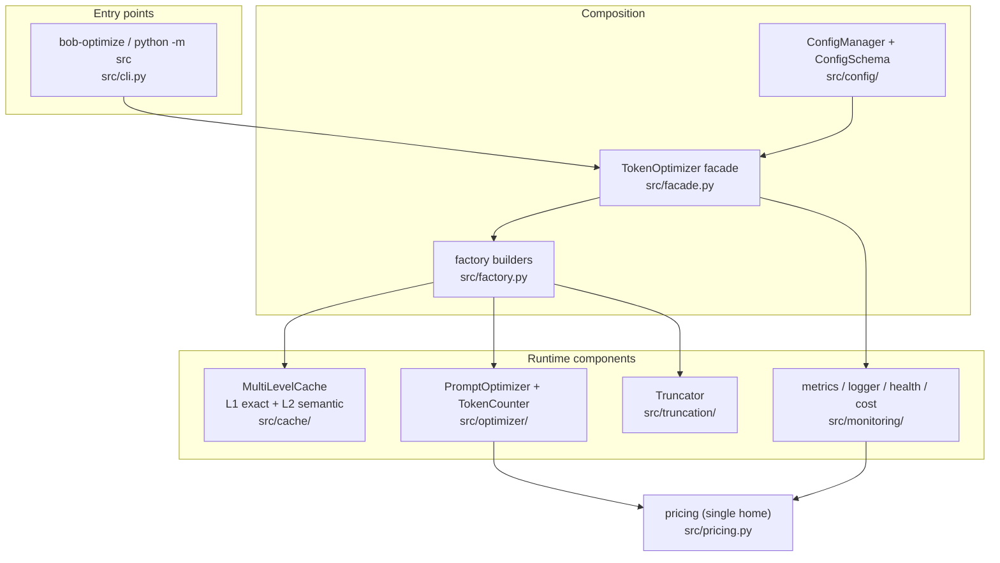
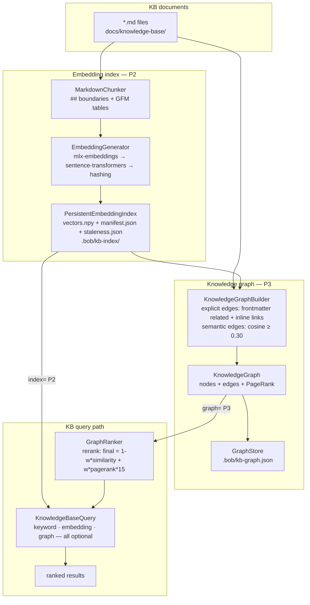
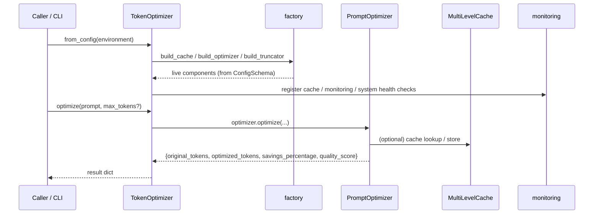
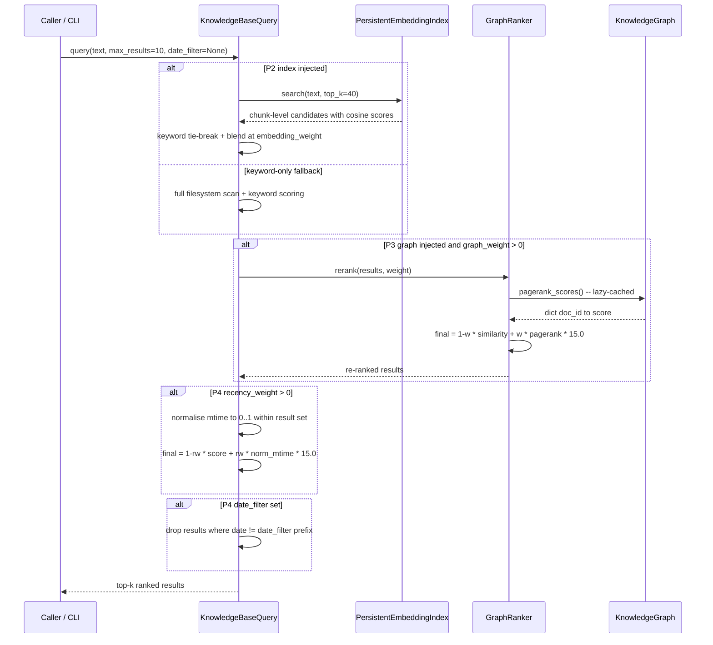
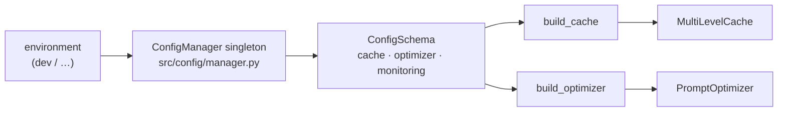
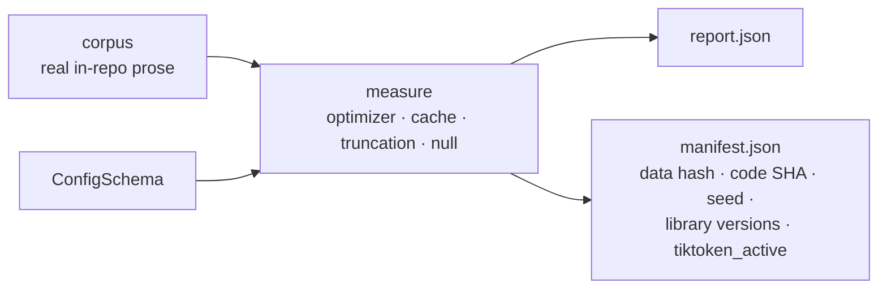

# Architecture

**Status:** Current (authoritative) · **Last updated:** 2026-07-18 · **Maturity:** see [`STATUS.md`](../../STATUS.md)

This is the **single authoritative architecture document** for the Python
token-optimization system in this repository. It supersedes
[`ACTUAL_SYSTEM_ARCHITECTURE.md`](ACTUAL_SYSTEM_ARCHITECTURE.md) (v1.0, deprecated)
and [`UNIFIED_ARCHITECTURE.md`](UNIFIED_ARCHITECTURE.md) (v2.0, superseded); both
predate the Phase-4 facade and no longer describe the running system. Decision
records live in [`../adr/`](../adr/); the generated API reference in
[`../api/`](../api/README.md).

> The repository also ships a separate Bash product, the **Bob Shell Knowledge
> Manager** (~500 lines), whose architecture is documented in
> [`docs/kb-manager/architecture.md`](../kb-manager/ARCHITECTURE.md). The two share
> a repo but are not one system. This document is about the Python
> token-optimization system (`src/`).

---

## 1. Context and goals

The token-optimization system reduces the tokens an LLM prompt costs, three ways,
each measured **separately** (never blended — blending is how the retracted
"68.96%" was manufactured):

- **Optimizer compression** — near-lossless removal of redundancy. The only
  "savings" headline: **~20% mean** on real in-repo prose (95% CI ≈ [19%, 21%],
  N=183), manifest-backed at `evaluation/results/validation-2026-07-14/`.
- **Cache recompute-avoidance** — a hit returns a prior result for 0 tokens;
  workload-dependent (a property of the request stream's repeat rate).
- **Truncation** — lossy budget-fit; reported, but excluded from savings.

Quality attributes that shape the design: determinism (reproducible cache and
validation), honesty (every published number cites a manifest), and a clean
layering boundary (`src/` never imports from `scripts/`).

## 2. Component overview



Not shown, deliberately separate:

- **`src/validation/`** — the manifest-backed measurement harness (`python -m
  src.validation`). It *invokes* the runtime components to measure them; it is
  not on the request path. See §6.
- **`src/tools/`** — operational CLI utilities (batch file reader, component
  analyzer, KB query) relocated out of `scripts/` in Phase 4 to keep the
  `src → scripts` layering clean. Included in the coverage and type gates with a
  per-package floor of 85% (`scripts/check_coverage_by_package.py`).
- **`src/delegation/`** — the parallel analysis pipeline subsystem (ADR-019).
  `src/delegation/pipeline.py` is the integration surface: it runs 6 agents in
  parallel (`DelegationCoordinator`), compresses each report through `TokenOptimizer`,
  and writes KB research documents to `output_dir`. Accessed via `bob-optimize analyze`.
  Coverage floor 70%; measured 84% (see [`../../src/delegation/experimental.md`](../../src/delegation/experimental.md)).
- **`src/embeddings/`** — the KB persistent embedding index subsystem
  (`MarkdownChunker`, `PersistentEmbeddingIndex`, `KBIndexer`). Opt-in, not on
  the `optimize()` request path; injected into `KnowledgeBaseQuery` when a
  persistent index is needed (ADR-015). Stores `[N × dim]` float32 vectors in
  `.bob/kb-index/` (split: `manifest.json` for chunk rows, `staleness.json` for
  file-level mtime/hash sentinels). See §5 for details.
- **`src/graph/`** — the KB knowledge-graph layer (P3). `KnowledgeGraphBuilder`
  derives a property graph over KB documents from explicit frontmatter links and
  semantic cosine similarity; `GraphRanker` provides PageRank-based re-ranking;
  `GraphStore` persists the graph atomically to `.bob/kb-graph.json`. Opt-in;
  injected into `KnowledgeBaseQuery` via `graph=` parameter (ADR-017). See §3b
  and §5 for details.

### KB subsystem overview (opt-in, not on the optimize() path)



## 3. Runtime dataflow

The facade holds no business logic — every operation delegates to an
already-tested component method (`src/facade.py:9`).



The facade's public surface — each method backs a CLI subcommand
(`src/facade.py:87`): `optimize`, `truncate`, `count`, `cache_stats`, `metrics`,
`cost_report`, `health`.

## 3b. KB query dataflow (P2 + P3 + P4, opt-in)

The KB query path is **not** on the `optimize()` request path. It is a separate
opt-in pipeline, activated by injecting an `index` (P2) and/or `graph` (P3) into
`KnowledgeBaseQuery`, and further tuned via P4 scoring parameters.



CLI entry points:
- `bob-optimize graph-build` — builds and persists the graph
- `bob-optimize graph-query <doc_id>` — neighbourhood context for a document
- `bob-optimize graph-health` — orphan/hub/broken-link report
- `bob-optimize kb-search <query>` — KB search with `--recency-weight` / `--date-filter` (P4)

**P4 query parameters** (all default to off, backward-compatible):

| Parameter | Default | Effect |
|---|---|---|
| `recency_weight` (constructor) | `0.0` | Blend relative mtime into score |
| `date_filter` (`query()`) | `None` | ISO prefix filter on frontmatter `date:` |

## 4. Configuration → runtime

Configuration has **one home** (`src/config/schema.py`) and reaches the runtime
through the factory, so the config-field → constructor-kwarg mapping cannot drift
(`src/factory.py:3`).



`ConfigSchema` (`src/config/schema.py`) bundles three dataclasses; the defaults
that matter to the architecture:

| Section | Field | Default | Effect | Scope |
|---|---|---|---|---|
| `CacheConfig` | `l1_max_size` | 1000 | L1 capacity | `optimize()` + `cache.get()` |
| `CacheConfig` | `l2_max_size` | 10000 | L2 capacity | `cache.get()` only¹ |
| `CacheConfig` | `l2_similarity_threshold` | 0.85 | L2 semantic-hit floor | `cache.get()` only¹ |
| `OptimizerConfig` | `max_tokens` | 4096 | output cap (a truncation lever) | `optimize()` |
| `OptimizerConfig` | `target_reduction` | 0.3 | compression target ratio | `optimize()` |
| `OptimizerConfig` | `min_quality_score` | 0.8 | reject over-aggressive optimization | `optimize()` |
| `MonitoringConfig` | `health_check_interval` | 60 | health cadence (seconds) | `health()` |

> ¹ **`l2_*` fields do not affect `optimize()`.** The optimizer uses exact (L1) matching only;
> an L2 semantic hit could return a *different* prompt's optimized text (wrong content). See
> `src/facade.py` module docstring and §5 below.

`build_cache` maps every `CacheConfig` field onto the cache constructor;
`build_optimizer` maps `OptimizerConfig` via `PromptOptimizer.from_config`;
`build_truncator` takes plain arguments (truncation has no config section yet).

## 5. Components

- **Cache (`src/cache/`).** `MultiLevelCache` orchestrates **L1** `ExactCache`
  (exact-key fast path) and **L2** `SemanticCache` (cosine similarity via
  `EmbeddingGenerator`, hit floor 0.85). A hit returns a stored result for 0 tokens.
  Deterministic; the C-5 colliding-key correctness bug is fixed.
  `EmbeddingGenerator` supports two backends resolved via a priority fallback chain:
  - `"hashing"` (default / final fallback) — stateless `HashingVectorizer`, 1000-dim,
    <1 ms, no extra dependencies, all platforms.
  - `"minilm"` (optional) — `sentence-transformers/all-MiniLM-L6-v2`, 384-dim. Loaded
    via **`mlx-embeddings`** first (Apple Silicon, ~2–4 ms warm,
    `pip install -e ".[mlx]"`), then via **`sentence-transformers`** as a cross-platform
    fallback (~5–20 ms, `pip install sentence-transformers`). Falls back silently to
    `"hashing"` when neither is installed. MiniLM p@3=0.88 vs hashing p@3=0.60 on the
    KB golden set. See ADR-014.
- **KB Embedding Index (`src/embeddings/`).** Disk-backed semantic search layer for
  KB documents (opt-in, not on the `optimize()` path). `MarkdownChunker` splits `.md`
  files on `##`-boundaries and extracts GFM tables as standalone chunks, each assigned
  a `file.md#slug` doc_id. `PersistentEmbeddingIndex` stores an `[N × dim]` float32
  matrix in `.bob/kb-index/` with incremental mtime/hash rebuild — **split storage**:
  `manifest.json` holds chunk-level vector rows only; `staleness.json` holds file-level
  mtime/hash sentinels (AF-1 fix; ensures `matrix.shape[0] == len(manifest)` invariant).
  `KBIndexer` drives the sync. Injected into `KnowledgeBaseQuery` via `index=` parameter.
  See ADR-015.
- **Knowledge Graph (`src/graph/`).** Pure-Python property graph over KB documents
  (opt-in, not on the `optimize()` path). Four modules:
  - `graph.py` — `KnowledgeGraph` (adjacency dict, BFS traversal, PageRank power
    method, `orphans()`, `hubs()`), `NodeProps` (10 fields — see table below),
    `Edge` (source, target, type, weight, label).

    **NodeProps fields** (P3 original + P4 additions):

    | Field | Type | Default | Source |
    |---|---|---|---|
    | `title` | `str` | `"Untitled"` | Frontmatter or `# H1` |
    | `category` | `str` | `""` | KB directory name |
    | `tags` | `List[str]` | `[]` | Frontmatter `tags:` |
    | `date` | `str` | `""` | Frontmatter `date:` |
    | `type` | `str` | `""` | Frontmatter `type:` |
    | `status` | `str` | `""` | Frontmatter `status:` |
    | `mtime_epoch` *(P4)* | `float` | `0.0` | `path.stat().st_mtime` |
    | `content_length` *(P4)* | `int` | `0` | `len(content)` chars |
    | `description` *(P4)* | `str` | `""` | First body paragraph ≤ 200 chars |
    | `related_refs` *(P4)* | `List[str]` | `[]` | Raw frontmatter `related:` list |

    P4 fields have backward-compatible defaults; old `kb-graph.json` files load cleanly.

  - `builder.py` — `KnowledgeGraphBuilder`: walks KB filesystem, parses frontmatter
    `related:` lists and inline `[text](path)` links for **explicit** edges; queries
    `PersistentEmbeddingIndex` per document and applies max-aggregation to derive
    **semantic** edges above `semantic_threshold=0.30`. Broken links detected and stored
    as type `"broken"` (weight 0.0, excluded from PageRank).
  - `ranker.py` — `GraphRanker`: lazy PageRank cache (damping=0.85, tol=1e-6),
    `rerank()` blend formula: `final = (1-w)*similarity + w*pagerank*PAGERANK_SCALE`
    where `PAGERANK_SCALE = 15.0`. Default `graph_weight=0.0` (ADR-017 validated:
    p@3 neutral on this corpus; safe default pending a richer corpus or model change).
  - `store.py` — `GraphStore`: atomic `os.replace`-based JSON persistence to
    `.bob/kb-graph.json`. See ADR-017.

  ```mermaid
  flowchart TD
      subgraph build [Graph build -- KnowledgeGraphBuilder]
          MDF["KB *.md files"] --> FM["parse frontmatter related + inline links"]
          FM --> EX["explicit edges\nweight=1.0"]
          MDF --> QRY["PersistentEmbeddingIndex.search\nper-document content as query"]
          QRY --> AGG["max-aggregate chunk scores\nper document pair"]
          AGG --> SEM["semantic edges\ncosine >= 0.30, weight=score"]
          EX --> GR["KnowledgeGraph\nnodes + edges"]
          SEM --> GR
      end
      subgraph persist [Persistence]
          GR --> GST["GraphStore\n.bob/kb-graph.json\natomic os.replace"]
      end
      subgraph rank [Re-ranking -- GraphRanker]
          GR --> PR["pagerank() power method\ndamping=0.85 tol=1e-6"]
          PR --> BL["rerank(results, weight)\nfinal = 1-w*sim + w*PR*15.0"]
      end
  ```
- **Optimizer (`src/optimizer/`).** `PromptOptimizer` applies whitespace
  normalization and redundancy removal to `target_reduction`, gated by
  `min_quality_score`. `TokenCounter` counts real tokens via tiktoken, with a
  `chars/4` fallback (the `tiktoken_active` honesty flag distinguishes them).
- **Truncation (`src/truncation/`).** `Truncator` fits text to a token budget by
  a chosen strategy (default `semantic`). Lossy; no fidelity gate — reported
  separately, never counted as savings.
- **Monitoring (`src/monitoring/`).** Structured `logger`, `metrics` collector,
  `health` checker (wired to the live cache/monitoring/system by the facade), and
  `cost_tracker`/`cost_reporting` for Bobcoin cost accounting.
- **Pricing (`src/pricing.py`).** The **single home** for model rates
  (USD-per-1K) and Bobcoin conversion; the optimizer's cost estimate and the cost
  tracker both read it, so the two cannot drift.

## 6. Validation harness (`src/validation/`)

The harness is off the request path: it measures the real product and writes a
reproducibility manifest per run.



The three mechanisms are measured and reported separately; a **null test**
(optimizer over shuffled/high-entropy text) must collapse to ≈0% or the
measurement is an artefact. CI gates on the null test + manifest completeness +
`tiktoken_active`, **not** on savings magnitude (gating a measurement would
re-incentivise fabrication). See [`../../src/validation/README.md`](../../src/validation/README.md).

## 7. Cross-cutting invariants (enforced in CI)

- **Layering.** `src/` never imports from `scripts/` (`check_layering.py`, AST-based).
- **One home per value.** Version, Python floor, pricing, coverage gate, and
  maturity status each have one canonical source, machine-checked
  (`check_value_homes.py`, `check_status_consistency.py`).
- **Manifest-backed numbers.** Every published savings/cost percentage cites a
  reproducible manifest (`check_savings_claims.py`).
- **Doc freshness.** `docs/api/` is regenerated from source docstrings and
  CI-checked (`generate_api_docs.py --check`).

## 8. Quality scenarios

Verifiable acceptance criteria for the system's cross-cutting quality attributes.

| ID | Attribute | Stimulus | Measurable response | Verification |
|:--:|-----------|----------|---------------------|--------------|
| QS-1 | Performance (L1 cache) | Single exact-match lookup with 1,000-entry cache | Mean latency < 1 ms | `pytest tests/cache/test_exact_cache.py -m slow -v` |
| QS-2 | Performance (L2 cache) | Single semantic lookup with 50-entry cache | Mean latency < 100 ms | `pytest tests/cache/test_semantic_cache.py -m slow -v` |
| QS-3 | Performance (optimizer) | `optimize()` call on a 1,000-token prompt | Latency < 50 ms (p95) | Benchmark suite: `pytest tests/ --benchmark-only` |
| QS-4 | Accuracy (savings) | Optimizer compression over N=183 real in-repo docs | Mean ≥ 19% (95% CI lower bound); null test collapses to < 5% | `python -m src.validation` → `evaluation/results/validation-2026-07-14/manifest.json` |
| QS-5 | Correctness (C1–C8) | Revert any of the 8 known bug fixes | Dedicated regression test fails immediately | `uv run pytest tests/ -k "regression or c1 or c5 or c7 or c8 or rlock or deadlock" -v` |
| QS-6 | Thread safety | Two concurrent `cache.get()` / `cache.set()` calls on the same key | No data corruption; no deadlock | `uv run pytest tests/cache/ -k "concurrent or thread" -v` |
| QS-7 | Coverage | Full test suite including `src/tools/` and `src/monitoring/` | Global ≥ 80%; per-package floors enforced | `uv run pytest tests/ --cov=src --cov-report=term-missing` + `python scripts/check_coverage_by_package.py` |

## 9. Where to go next

- Decisions and their rationale: [`../adr/`](../adr/README.md) (ADR 001–019).
- Per-module API: [`../api/`](../api/README.md) (generated, drift-checked; includes `src/graph/` and `src/delegation/`).
- Maturity, coverage, and the measured savings snapshot: [`STATUS.md`](../../STATUS.md).
- KB integration guide: [`../../INTEGRATIONS.md`](../../INTEGRATIONS.md) (P1–P3 + delegation code examples).
- Knowledge graph design: [`../adr/017-knowledge-graph-layer.md`](../adr/017-knowledge-graph-layer.md) (ADR-017).
- Delegation pipeline design: [`../adr/019-delegation-pipeline-activation.md`](../adr/019-delegation-pipeline-activation.md) (ADR-019).
- Graph live validation results: [`../knowledge-base/research/graph-validation-2026-07-17.md`](../knowledge-base/research/graph-validation-2026-07-17.md).
- SLA: [`../SLA.md`](../SLA.md) — latency/throughput targets, measurement methodology.

---

## 10. Deployment

**Runtime context:** Local Python library and CLI. No server, no daemon, no container
required. Single-user, single-process.

| Constraint | Value | Source |
|---|---|---|
| **Python** | ≥ 3.11 (3.11 and 3.12 tested in CI) | `pyproject.toml:requires-python` · `.github/workflows/ci.yml` matrix |
| **OS** | macOS, Linux | CI matrix (ubuntu-latest, macOS available); Bash scripts are macOS/Linux only |
| **Core deps** | `numpy ≥ 1.24`, `scikit-learn ≥ 1.3`, `tiktoken ≥ 0.5` | `pyproject.toml:dependencies` |
| **Optional deps** | `psutil` (system metrics in health checks); gracefully absent if not installed | `pyproject.toml:[optional-dependencies].monitoring` |
| **Concurrency** | Single-process, synchronous. `ThreadPoolExecutor` used only in `src/delegation/` (analysis pipeline, not on the `optimize()` path) | `src/facade.py` — all operations sync |
| **Persistence** | In-memory only. No disk cache, no database, no external state store | `src/cache/exact_cache.py`, `src/cache/semantic_cache.py` |
| **Network** | None required at runtime. `tiktoken` downloads its BPE vocabulary on first use (one-time, cacheable offline) | `src/optimizer/token_counter.py` |
| **Install** | `pip install -e ".[dev,monitoring]"` or `uv sync` | `pyproject.toml` |
| **CLI** | `python -m src <subcommand>` or `bob-optimize <subcommand>` | `src/__main__.py` |

---

## 11. Glossary

| Term | Definition | Source |
|---|---|---|
| **Bobcoin** | Internal unit for estimated LLM cost: `token_count × price_per_token × 1000`. Enables a model-agnostic cost metric. | `src/pricing.py` |
| **tiktoken_active** | Boolean flag in the validation manifest: `True` when tiktoken's BPE encoder is available and used for token counting; `False` when the character-count fallback is active. A `False` value means token counts are approximate. | `src/optimizer/token_counter.py`, `src/validation/manifest.py` |
| **manifest-backed** | A savings or cost figure is "manifest-backed" when it is accompanied by a `manifest.json` that records the data hash, code SHA, config, random seed, library versions, and `tiktoken_active`. This makes the measurement reproducible and auditable. | `src/validation/manifest.py:45-58` |
| **L1 cache** | The exact-match cache layer (`ExactCache`). Uses SHA-256 hashing for O(1) lookup. Governed by `CacheConfig.l1_max_size` and `CacheConfig.l1_ttl_seconds`. | `src/cache/exact_cache.py` |
| **L2 cache** | The semantic-match cache layer (`SemanticCache`). Uses TF-IDF + cosine similarity for approximate matching. Governed by `CacheConfig.l2_similarity_threshold`. Not used in the `optimize()` path (exact matching only there). | `src/cache/semantic_cache.py` |
| **Facade** | `TokenOptimizer` (`src/facade.py`). The single public composition point: accepts a `ConfigSchema`, builds all components via the factory, and exposes five high-level operations. Holds no business logic. | `src/facade.py:37` |
| **Factory** | `src/factory.py`. Three builder functions (`build_cache`, `build_optimizer`, `build_truncator`) that are the single home for the config-field → constructor-kwarg mapping. | `src/factory.py:25-70` |
| **Null test** | A validation run of the optimizer over shuffled, high-entropy text. A legitimate optimizer should produce ≈0% compression on random input. A failing null test indicates the measurement is an artefact of the test fixture, not the optimizer. | `src/validation/` |
| **target_reduction** | `OptimizerConfig` field: the optimizer's compression target as a ratio (0.0–1.0). Default 0.3 (30% token reduction). The optimizer uses this as a soft target, not a hard cap. | `src/config/schema.py:49` |
| **quality_score** | A float (0.0–1.0) returned by `PromptOptimizer.optimize()` representing estimated semantic preservation of the optimized output. Must meet or exceed `OptimizerConfig.min_quality_score` (default 0.8) for the optimization to be accepted. | `src/optimizer/prompt_optimizer.py` |
| **MECE** | Mutually Exclusive, Collectively Exhaustive. A framework (from McKinsey) for structuring analysis so that categories neither overlap nor have gaps. Used in this project's architecture audit framework. | `docs/knowledge-base/research/architecture-audit-mece-2026-07-14.md` |
