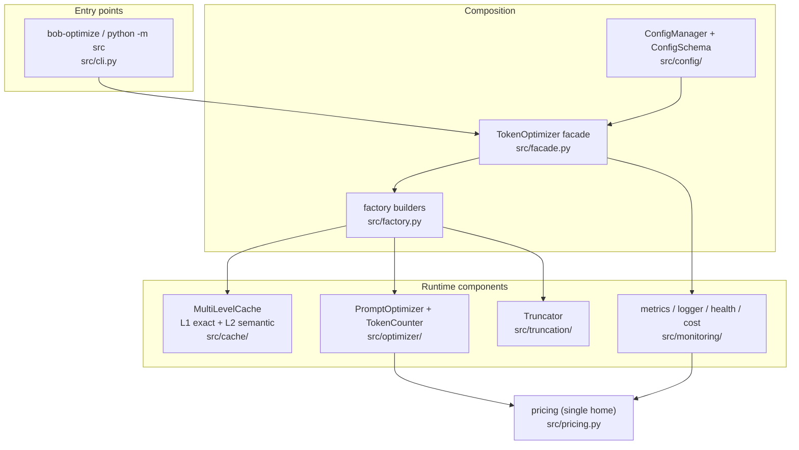
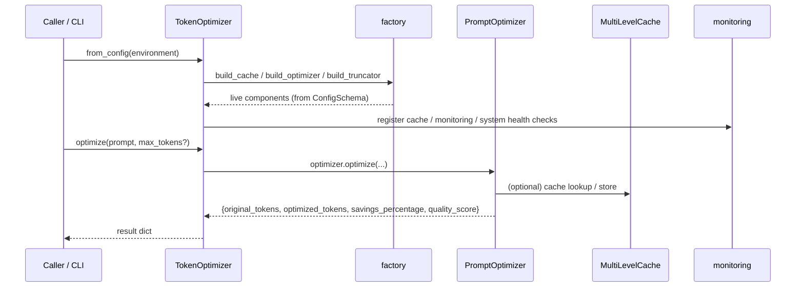
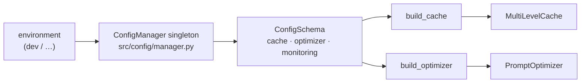
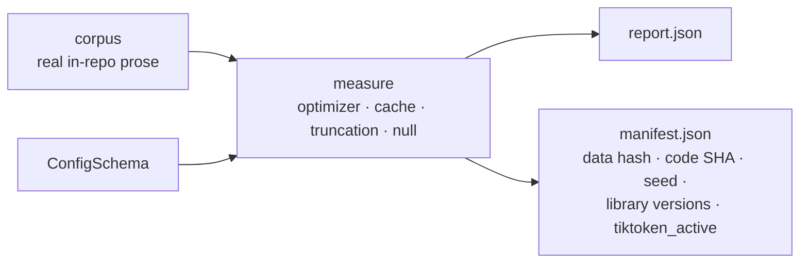

# Architecture

**Status:** Current (authoritative) · **Last updated:** 2026-07-14 · **Maturity:** see [`STATUS.md`](../../STATUS.md)

This is the **single authoritative architecture document** for the Python
token-optimization system in this repository. It supersedes
[`ACTUAL_SYSTEM_ARCHITECTURE.md`](ACTUAL_SYSTEM_ARCHITECTURE.md) (v1.0, deprecated)
and [`UNIFIED_ARCHITECTURE.md`](UNIFIED_ARCHITECTURE.md) (v2.0, superseded); both
predate the Phase-4 facade and no longer describe the running system. Decision
records live in [`../adr/`](../adr/); the generated API reference in
[`../api/`](../api/README.md).

> The repository also ships a separate Bash product, the **Bob Shell Knowledge
> Manager** (~500 lines), whose architecture is documented in
> [`../ARCHITECTURE.md`](../ARCHITECTURE.md). The two share a repo but are not one
> system. This document is about the Python token-optimization system (`src/`).

---

## 1. Context and goals

The token-optimization system reduces the tokens an LLM prompt costs, three ways,
each measured **separately** (never blended — blending is how the retracted
"68.96%" was manufactured):

- **Optimizer compression** — near-lossless removal of redundancy. The only
  "savings" headline: **~20% mean** on real in-repo prose (95% CI ≈ [19%, 21%],
  N=183), manifest-backed at `evaluation/results/validation-2026-07-14/`.
- **Cache recompute-avoidance** — a hit returns a prior result for 0 tokens;
  workload-dependent (a property of the request stream's repeat rate).
- **Truncation** — lossy budget-fit; reported, but excluded from savings.

Quality attributes that shape the design: determinism (reproducible cache and
validation), honesty (every published number cites a manifest), and a clean
layering boundary (`src/` never imports from `scripts/`).

## 2. Component overview

Not shown, deliberately separate:

- **`src/validation/`** — the manifest-backed measurement harness (`python -m
  src.validation`). It *invokes* the runtime components to measure them; it is
  not on the request path. See §6.
- **`src/tools/`** — operational CLI utilities (batch file reader, component
  analyzer, KB query) relocated out of `scripts/` in Phase 4 to keep the
  `src → scripts` layering clean. Tooling, not library runtime; excluded from the
  coverage and type gates.
- **`src/delegation/`** — an **experimental**, layering-clean subsystem that is
  *not* wired into the facade (see [`../../src/delegation/EXPERIMENTAL.md`](../../src/delegation/EXPERIMENTAL.md)).

## 3. Runtime dataflow

The facade holds no business logic — every operation delegates to an
already-tested component method (`src/facade.py:9`).

The facade's public surface — each method backs a CLI subcommand
(`src/facade.py:87`): `optimize`, `truncate`, `count`, `cache_stats`, `metrics`,
`cost_report`, `health`.

## 4. Configuration → runtime

Configuration has **one home** (`src/config/schema.py`) and reaches the runtime
through the factory, so the config-field → constructor-kwarg mapping cannot drift
(`src/factory.py:3`).

`ConfigSchema` (`src/config/schema.py`) bundles three dataclasses; the defaults
that matter to the architecture:

| Section | Field | Default | Effect |
|---|---|---|---|
| `CacheConfig` | `l1_max_size` / `l2_max_size` | 1000 / 10000 | L1/L2 capacity |
| `CacheConfig` | `l2_similarity_threshold` | 0.85 | L2 semantic-hit floor |
| `OptimizerConfig` | `max_tokens` | 4096 | output cap (a truncation lever) |
| `OptimizerConfig` | `target_reduction` | 0.3 | compression target ratio |
| `OptimizerConfig` | `min_quality_score` | 0.8 | reject over-aggressive optimization |
| `MonitoringConfig` | `health_check_interval` | 60 | health cadence (seconds) |

`build_cache` maps every `CacheConfig` field onto the cache constructor;
`build_optimizer` maps `OptimizerConfig` via `PromptOptimizer.from_config`;
`build_truncator` takes plain arguments (truncation has no config section yet).

## 5. Components

- **Cache (`src/cache/`).** `MultiLevelCache` orchestrates **L1** `ExactCache`
  (exact-key fast path) and **L2** `SemanticCache` (TF-IDF similarity, hit floor
  0.85). A hit returns a stored result for 0 tokens. Deterministic (stateless
  `HashingVectorizer`); the C-5 colliding-key correctness bug is fixed.
- **Optimizer (`src/optimizer/`).** `PromptOptimizer` applies whitespace
  normalization and redundancy removal to `target_reduction`, gated by
  `min_quality_score`. `TokenCounter` counts real tokens via tiktoken, with a
  `chars/4` fallback (the `tiktoken_active` honesty flag distinguishes them).
- **Truncation (`src/truncation/`).** `Truncator` fits text to a token budget by
  a chosen strategy (default `semantic`). Lossy; no fidelity gate — reported
  separately, never counted as savings.
- **Monitoring (`src/monitoring/`).** Structured `logger`, `metrics` collector,
  `health` checker (wired to the live cache/monitoring/system by the facade), and
  `cost_tracker`/`cost_reporting` for Bobcoin cost accounting.
- **Pricing (`src/pricing.py`).** The **single home** for model rates
  (USD-per-1K) and Bobcoin conversion; the optimizer's cost estimate and the cost
  tracker both read it, so the two cannot drift.

## 6. Validation harness (`src/validation/`)

The harness is off the request path: it measures the real product and writes a
reproducibility manifest per run.

The three mechanisms are measured and reported separately; a **null test**
(optimizer over shuffled/high-entropy text) must collapse to ≈0% or the
measurement is an artefact. CI gates on the null test + manifest completeness +
`tiktoken_active`, **not** on savings magnitude (gating a measurement would
re-incentivise fabrication). See [`../../src/validation/README.md`](../../src/validation/README.md).

## 7. Cross-cutting invariants (enforced in CI)

- **Layering.** `src/` never imports from `scripts/` (`check_layering.py`, AST-based).
- **One home per value.** Version, Python floor, pricing, coverage gate, and
  maturity status each have one canonical source, machine-checked
  (`check_value_homes.py`, `check_status_consistency.py`).
- **Manifest-backed numbers.** Every published savings/cost percentage cites a
  reproducible manifest (`check_savings_claims.py`).
- **Doc freshness.** `docs/api/` is regenerated from source docstrings and
  CI-checked (`generate_api_docs.py --check`).

## 8. Where to go next

- Decisions and their rationale: [`../adr/`](../adr/README.md) (ADR 001–012).
- Per-module API: [`../api/`](../api/README.md) (generated, drift-checked).
- Maturity, coverage, and the measured savings snapshot: [`STATUS.md`](../../STATUS.md).
