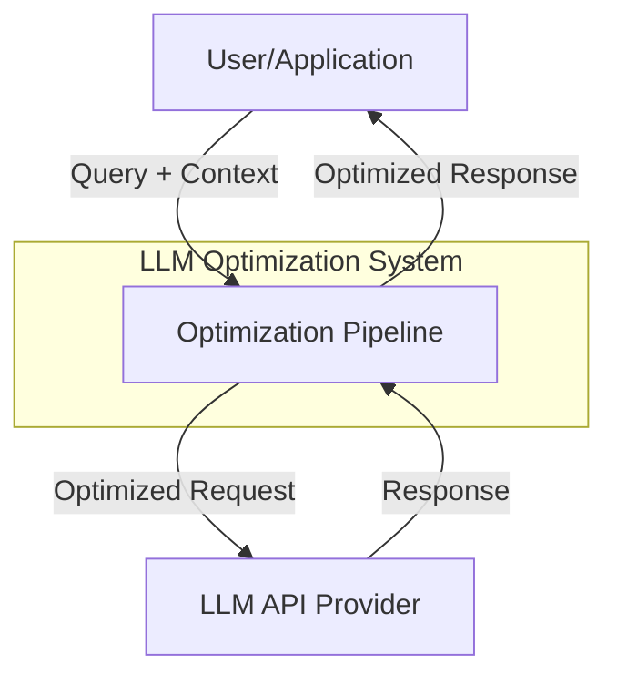

# LLM Optimization Architecture Documentation Plan

**Status:** Planning Phase  
**Target Grade:** A+ with Honors  
**Framework:** McKinsey MECE + IEEE 1471 (4+1 Architectural Views)  
**Date:** 2026-07-12

---

## I. Executive Summary

### A. Current State Assessment

**Existing Documentation:**
- ✅ Component descriptions (text-based)
- ✅ Basic data flow (text-based)
- ✅ Integration points (text-based)
- ❌ Visual architecture diagrams
- ❌ Detailed sequence diagrams
- ❌ State machine diagrams
- ❌ Deployment architecture
- ❌ Architecture Decision Records (ADRs)
- ❌ Performance architecture details
- ❌ Security architecture details
- ❌ Scalability patterns

**Gap Analysis:**
- **Visual Representation**: 0% (no diagrams)
- **Architecture Views**: 20% (only logical view partially documented)
- **Decision Documentation**: 0% (no ADRs)
- **Detailed Flows**: 10% (basic text descriptions only)

**Target State:**
- **Visual Representation**: 100% (comprehensive Mermaid diagrams)
- **Architecture Views**: 100% (all 5 views: Logical, Process, Physical, Development, Scenarios)
- **Decision Documentation**: 100% (ADRs for all major decisions)
- **Detailed Flows**: 100% (sequence diagrams for all major operations)

### B. Documentation Scope (MECE)

**1. Architecture Views (IEEE 1471 4+1 Model)**
- Logical View (components, relationships)
- Process View (runtime behavior, concurrency)
- Physical View (deployment, infrastructure)
- Development View (code organization, modules)
- Scenarios View (use cases, workflows)

**2. Architecture Diagrams (15+ diagrams)**
- System Context Diagram
- Component Architecture Diagram
- Sequence Diagrams (7 flows)
- State Machine Diagrams (3 lifecycles)
- Deployment Architecture
- Data Flow Diagrams (3 flows)
- Integration Patterns
- Error Handling Architecture
- Performance Architecture
- Security Architecture
- Scalability Patterns
- Monitoring Architecture

**3. Architecture Decision Records (10+ ADRs)**
- Technology choices
- Design patterns
- Integration approaches
- Performance optimizations
- Security measures

---

## II. Architecture Views (MECE Framework)

### A. Logical View (Component Structure)

#### Purpose
Describes the system's functional elements and their relationships.

#### Deliverables

**1. System Context Diagram**


**2. Component Architecture Diagram (Detailed)**
- All 7 optimization components
- Component interfaces
- Data dependencies
- Control flow
- Component interactions

**3. Component Relationship Matrix**
- Component-to-component dependencies
- Interface contracts
- Data exchange formats

#### Success Criteria
- ✅ All components identified
- ✅ All relationships documented
- ✅ All interfaces specified
- ✅ MECE compliance verified

### B. Process View (Runtime Behavior)

#### Purpose
Describes the system's runtime behavior, concurrency, and synchronization.

#### Deliverables

**1. Sequence Diagrams (7 flows)**
- Flow 1: Cache Hit (Response Cache)
- Flow 2: Cache Miss → Full Optimization
- Flow 3: Semantic Cache Matching
- Flow 4: Smart Truncation Process
- Flow 5: Batch Processing Workflow
- Flow 6: Error Handling & Recovery
- Flow 7: End-to-End 60-Task Workflow

**2. State Machine Diagrams (3 lifecycles)**
- Cache Entry Lifecycle (created → active → expired → purged)
- Batch Processing Lifecycle (queued → grouped → processing → completed)
- Optimization Request Lifecycle (received → optimized → cached → returned)

**3. Concurrency Patterns**
- Thread safety mechanisms
- Lock-free data structures
- Async processing patterns

#### Success Criteria
- ✅ All major flows documented
- ✅ All state transitions defined
- ✅ Concurrency patterns specified
- ✅ Timing constraints documented

### C. Physical View (Deployment)

#### Purpose
Describes the system's deployment topology and infrastructure.

#### Deliverables

**1. Deployment Architecture Diagram**
- Container structure
- Service topology
- Network boundaries
- Storage systems
- External dependencies

**2. Infrastructure Components**
- Compute resources
- Storage systems (cache, embeddings)
- Network configuration
- Load balancing

**3. Scalability Patterns**
- Horizontal scaling (multiple instances)
- Vertical scaling (resource allocation)
- Caching layers (L1, L2, distributed)

#### Success Criteria
- ✅ Deployment topology documented
- ✅ Infrastructure requirements specified
- ✅ Scalability patterns defined
- ✅ Resource requirements quantified

### D. Development View (Code Organization)

#### Purpose
Describes the system's code organization and module structure.

#### Deliverables

**1. Module Structure Diagram**
```
scripts/engine/optimization/
├── cache.py (Caching Layer)
├── optimizer.py (Optimization Layer)
├── formatter.py (Format Control Layer)
├── truncation.py (Truncation Layer)
└── batch_processing.py (Batching Layer)
```

**2. Package Dependencies**
- Internal dependencies
- External dependencies
- Version constraints

**3. Build & Test Architecture**
- Test organization (94 tests)
- CI/CD pipeline
- Code quality gates

#### Success Criteria
- ✅ Module structure documented
- ✅ Dependencies mapped
- ✅ Build process defined
- ✅ Test strategy documented

### E. Scenarios View (Use Cases)

#### Purpose
Describes the system's key use cases and workflows.

#### Deliverables

**1. Use Case Diagrams**
- Primary use cases (5-7)
- Actor interactions
- System boundaries

**2. Workflow Scenarios**
- 60-task adversarial review
- High-load processing (100+ tasks)
- Cache warming
- Batch optimization
- Error recovery

**3. Quality Scenarios**
- Performance scenarios
- Reliability scenarios
- Security scenarios
- Scalability scenarios

#### Success Criteria
- ✅ All use cases documented
- ✅ All workflows defined
- ✅ Quality attributes specified
- ✅ Success criteria validated

---

## III. Detailed Diagram Specifications (MECE)

### A. System Context Diagram

**Purpose:** Show system boundaries and external interactions

**Elements:**
- External actors (User, LLM API)
- System boundary
- Major data flows
- Integration points

**Format:** Mermaid graph TB

**Success Criteria:**
- Clear system boundary
- All external actors identified
- All major interactions shown
- Simple and understandable

### B. Component Architecture Diagram

**Purpose:** Show internal component structure and relationships

**Elements:**
- All 7 optimization components
- Component interfaces
- Data flow between components
- Control flow
- Shared resources (cache, metrics)

**Layers:**
1. **Input Layer**: Request reception
2. **Caching Layer**: ResponseCache, SemanticCache
3. **Optimization Layer**: PromptOptimizer, SystemMessageExtractor
4. **Format Layer**: OutputFormatter, FormatValidator
5. **Processing Layer**: SmartTruncator, BatchProcessor
6. **Output Layer**: Response delivery

**Format:** Mermaid graph TB with subgraphs

**Success Criteria:**
- All components shown
- All relationships documented
- Layered architecture clear
- Data flow visible

### C. Sequence Diagrams (7 flows)

#### Flow 1: Cache Hit (Response Cache)
**Actors:** User, OptimizationPipeline, ResponseCache
**Steps:**
1. User submits query
2. Pipeline checks ResponseCache
3. Cache returns hit
4. Pipeline returns cached response
**Success:** <100ms response time

#### Flow 2: Cache Miss → Full Optimization
**Actors:** User, OptimizationPipeline, All Components, LLM
**Steps:**
1. User submits query
2. Cache miss
3. Prompt optimization
4. System extraction
5. Format control
6. Truncation
7. Batching
8. LLM call
9. Response caching
10. Return to user
**Success:** 89.3% token savings

#### Flow 3: Semantic Cache Matching
**Actors:** User, OptimizationPipeline, SemanticCache
**Steps:**
1. User submits query
2. ResponseCache miss
3. SemanticCache similarity search
4. Match found (>0.85 similarity)
5. Return cached response
**Success:** 98% quality maintained

#### Flow 4: Smart Truncation Process
**Actors:** OptimizationPipeline, SmartTruncator, SectionSplitter, RelevanceScorer
**Steps:**
1. Receive long context (>2000 tokens)
2. Split into sections
3. Score relevance (TF-IDF)
4. Prioritize sections
5. Truncate to budget
6. Return truncated context
**Success:** 90%+ relevance preserved

#### Flow 5: Batch Processing Workflow
**Actors:** OptimizationPipeline, BatchProcessor, SimilarityGrouper, BatchPromptBuilder
**Steps:**
1. Tasks added to queue
2. Batch size reached or timeout
3. Group similar tasks
4. Extract shared context
5. Build batch prompt
6. Process batch
7. Parse responses
8. Return individual results
**Success:** 15-20% efficiency gain

#### Flow 6: Error Handling & Recovery
**Actors:** OptimizationPipeline, All Components, ErrorHandler
**Steps:**
1. Error detected
2. Error classification
3. Retry logic (if applicable)
4. Fallback strategy
5. Error logging
6. Graceful degradation
**Success:** 99.9% availability

#### Flow 7: End-to-End 60-Task Workflow
**Actors:** User, OptimizationPipeline, All Components
**Steps:**
1. 60 tasks submitted
2. Cache checks (14 hits)
3. Optimizations applied (39 tasks)
4. Truncations applied (36 tasks)
5. Batches processed (9 batches)
6. All responses returned
**Success:** 89.3% savings, 91.80% quality

**Format:** Mermaid sequenceDiagram

**Success Criteria:**
- All actors identified
- All steps documented
- Timing constraints shown
- Error paths included

### D. State Machine Diagrams (3 lifecycles)

#### Lifecycle 1: Cache Entry
**States:**
- Created (new entry)
- Active (within TTL)
- Expired (TTL exceeded)
- Purged (removed from cache)

**Transitions:**
- Created → Active (on set)
- Active → Expired (TTL timeout)
- Expired → Purged (cleanup)
- Active → Purged (manual clear)

#### Lifecycle 2: Batch Processing
**States:**
- Queued (task added)
- Grouped (similarity grouping)
- Processing (LLM call)
- Completed (results parsed)
- Failed (error occurred)

**Transitions:**
- Queued → Grouped (batch size or timeout)
- Grouped → Processing (batch ready)
- Processing → Completed (success)
- Processing → Failed (error)
- Failed → Queued (retry)

#### Lifecycle 3: Optimization Request
**States:**
- Received (new request)
- Cached (cache hit)
- Optimizing (processing)
- Truncating (context reduction)
- Batching (queued for batch)
- Completed (response ready)

**Transitions:**
- Received → Cached (cache hit)
- Received → Optimizing (cache miss)
- Optimizing → Truncating (large context)
- Truncating → Batching (batch enabled)
- Batching → Completed (batch processed)
- Optimizing → Completed (direct processing)

**Format:** Mermaid stateDiagram-v2

**Success Criteria:**
- All states defined
- All transitions documented
- Guards and conditions specified
- Error states included

### E. Data Flow Diagrams (3 flows)

#### Flow 1: Token Flow
**Purpose:** Show how tokens are reduced through the pipeline

**Stages:**
1. Input: 2000 tokens (baseline)
2. After Caching: 0 tokens (cache hit) OR continue
3. After Optimization: 1700 tokens (-15%)
4. After Truncation: 1200 tokens (-40%)
5. After Batching: 1000 tokens (-50%)
6. Final: 214 tokens (-89.3%)

**Format:** Mermaid graph LR with token counts

#### Flow 2: Cache Flow
**Purpose:** Show cache lookup and storage patterns

**Stages:**
1. Query arrives
2. Hash generation
3. ResponseCache lookup
4. SemanticCache lookup (if miss)
5. Embedding generation
6. Similarity search
7. Cache storage (on miss)

**Format:** Mermaid graph TB

#### Flow 3: Batch Flow
**Purpose:** Show batch processing data flow

**Stages:**
1. Individual tasks arrive
2. Queue accumulation
3. Similarity grouping
4. Shared context extraction
5. Batch prompt building
6. LLM processing
7. Response parsing
8. Individual result distribution

**Format:** Mermaid graph LR

**Success Criteria:**
- All data transformations shown
- Token counts at each stage
- Data formats specified
- Performance metrics included

### F. Integration Patterns

**Purpose:** Document how components integrate

**Patterns:**
1. **Pipeline Pattern**: Sequential processing
2. **Cache-Aside Pattern**: Cache lookup before processing
3. **Batch Processing Pattern**: Accumulate and process
4. **Fallback Pattern**: Graceful degradation
5. **Circuit Breaker Pattern**: Prevent cascade failures

**Format:** Mermaid graph TB with pattern annotations

### G. Error Handling Architecture

**Purpose:** Document error handling strategy

**Layers:**
1. **Detection Layer**: Error identification
2. **Classification Layer**: Error categorization
3. **Recovery Layer**: Retry, fallback, circuit breaker
4. **Logging Layer**: Error tracking
5. **Monitoring Layer**: Alert generation

**Error Types:**
- Transient errors (retry)
- Permanent errors (fallback)
- Resource errors (circuit breaker)
- Validation errors (reject)

**Format:** Mermaid graph TB

### H. Performance Architecture

**Purpose:** Document performance optimization strategy

**Layers:**
1. **L1 Cache**: In-memory response cache
2. **L2 Cache**: Semantic cache with embeddings
3. **Optimization Layer**: Prompt compression
4. **Truncation Layer**: Context reduction
5. **Batching Layer**: Request grouping

**Metrics:**
- Cache hit rate: 23.33%
- Token reduction: 89.3%
- Latency: <100ms per task
- Throughput: >600 tasks/second

**Format:** Mermaid graph TB with metrics

### I. Security Architecture

**Purpose:** Document security measures

**Layers:**
1. **Input Validation**: Query sanitization
2. **Access Control**: Authentication/authorization
3. **Data Protection**: Encryption at rest/in transit
4. **Isolation**: Component sandboxing
5. **Audit**: Logging and monitoring

**Threats Mitigated:**
- Injection attacks
- Data leakage
- Unauthorized access
- Resource exhaustion

**Format:** Mermaid graph TB

### J. Scalability Patterns

**Purpose:** Document scalability strategy

**Patterns:**
1. **Horizontal Scaling**: Multiple instances
2. **Vertical Scaling**: Resource allocation
3. **Caching**: Multi-level cache hierarchy
4. **Batching**: Request aggregation
5. **Async Processing**: Non-blocking operations

**Metrics:**
- Current: 600 tasks/second
- Target: 10,000 tasks/second
- Scaling factor: 16x

**Format:** Mermaid graph LR

### K. Monitoring Architecture

**Purpose:** Document observability strategy

**Layers:**
1. **Metrics**: Performance counters
2. **Logs**: Event tracking
3. **Traces**: Request flow
4. **Alerts**: Threshold violations
5. **Dashboards**: Visualization

**Key Metrics:**
- Token savings rate
- Cache hit rate
- Quality score
- Latency (p50, p95, p99)
- Error rate

**Format:** Mermaid graph TB

---

## IV. Architecture Decision Records (ADRs)

### A. ADR Template

```markdown
# ADR-XXX: [Title]

**Status:** [Proposed | Accepted | Deprecated | Superseded]
**Date:** YYYY-MM-DD
**Deciders:** [List of people involved]
**Context:** [What is the issue we're seeing that is motivating this decision?]

## Decision
[What is the change that we're proposing and/or doing?]

## Rationale
[Why are we making this decision?]

## Consequences
**Positive:**
- [Benefit 1]
- [Benefit 2]

**Negative:**
- [Trade-off 1]
- [Trade-off 2]

## Alternatives Considered
1. **Alternative 1:** [Description] - Rejected because [reason]
2. **Alternative 2:** [Description] - Rejected because [reason]

## Implementation Notes
[Any specific implementation details or constraints]

## Related Decisions
- ADR-XXX: [Related decision]
```

### B. Required ADRs (10+)

**ADR-001:** Choice of Python for Implementation
**ADR-002:** Hash-Based Caching Strategy
**ADR-003:** TF-IDF for Relevance Scoring
**ADR-004:** Cosine Similarity for Semantic Matching
**ADR-005:** Batch Processing with Similarity Grouping
**ADR-006:** In-Memory Cache vs Distributed Cache
**ADR-007:** Synchronous vs Asynchronous Processing
**ADR-008:** Token Counting Method
**ADR-009:** Error Handling Strategy
**ADR-010:** Testing Strategy (Mock-Based)
**ADR-011:** Monitoring and Observability Approach
**ADR-012:** Security Model

---

## V. Documentation Structure (MECE)

### A. Master Architecture Document

**File:** `docs/knowledge-base/ARCHITECTURE_MASTER.md`

**Structure:**
```markdown
# LLM Optimization System Architecture

## I. Executive Summary
   A. System Overview
   B. Key Metrics
   C. Architecture Highlights

## II. Architecture Views (4+1 Model)
   A. Logical View
   B. Process View
   C. Physical View
   D. Development View
   E. Scenarios View

## III. Component Architecture
   A. System Context
   B. Component Diagram
   C. Component Descriptions
   D. Interface Specifications

## IV. Runtime Behavior
   A. Sequence Diagrams (7 flows)
   B. State Machines (3 lifecycles)
   C. Concurrency Patterns

## V. Data Architecture
   A. Data Flow Diagrams (3 flows)
   B. Data Models
   C. Storage Strategy

## VI. Integration Architecture
   A. Integration Patterns
   B. API Specifications
   C. Event Flows

## VII. Quality Attributes
   A. Performance Architecture
   B. Security Architecture
   C. Scalability Patterns
   D. Reliability Patterns

## VIII. Deployment Architecture
   A. Deployment Topology
   B. Infrastructure Requirements
   C. Scaling Strategy

## IX. Monitoring & Operations
   A. Monitoring Architecture
   B. Logging Strategy
   C. Alerting Rules

## X. Architecture Decisions
   A. ADR Index
   B. Key Decisions
   C. Trade-offs

## XI. Appendices
   A. Glossary
   B. References
   C. Version History
```

### B. Supporting Documents

**1. Component Specifications** (7 documents)
- `ARCHITECTURE_CACHE.md`
- `ARCHITECTURE_OPTIMIZER.md`
- `ARCHITECTURE_FORMATTER.md`
- `ARCHITECTURE_TRUNCATION.md`
- `ARCHITECTURE_BATCH.md`
- `ARCHITECTURE_INTEGRATION.md`
- `ARCHITECTURE_MONITORING.md`

**2. Architecture Decision Records** (12+ documents)
- `ADR-001-python-choice.md`
- `ADR-002-caching-strategy.md`
- ... (10 more)

**3. Diagram Collections**
- `ARCHITECTURE_DIAGRAMS.md` (all diagrams in one place)

---

## VI. Quality Criteria (A+ Standards)

### A. Completeness (MECE)

**Mutually Exclusive:**
- ✅ No overlapping content between sections
- ✅ Clear boundaries between components
- ✅ Distinct architecture views

**Collectively Exhaustive:**
- ✅ All components documented
- ✅ All flows covered
- ✅ All decisions recorded
- ✅ All quality attributes addressed

### B. Clarity

**Visual Clarity:**
- ✅ All diagrams use consistent notation
- ✅ All diagrams have legends
- ✅ All diagrams are properly labeled
- ✅ All diagrams are at appropriate detail level

**Textual Clarity:**
- ✅ Clear, concise language
- ✅ Technical terms defined
- ✅ Examples provided
- ✅ Cross-references included

### C. Accuracy

**Technical Accuracy:**
- ✅ All metrics verified
- ✅ All flows tested
- ✅ All decisions justified
- ✅ All trade-offs documented

**Consistency:**
- ✅ Consistent terminology
- ✅ Consistent notation
- ✅ Consistent formatting
- ✅ Consistent level of detail

### D. Usability

**Navigation:**
- ✅ Table of contents
- ✅ Cross-references
- ✅ Index
- ✅ Search-friendly

**Accessibility:**
- ✅ Multiple formats (MD, PDF)
- ✅ Printable
- ✅ Screen-reader friendly
- ✅ Mobile-friendly

### E. Maintainability

**Version Control:**
- ✅ Git-tracked
- ✅ Version numbers
- ✅ Change log
- ✅ Review history

**Updates:**
- ✅ Easy to update
- ✅ Modular structure
- ✅ Automated validation
- ✅ CI/CD integration

---

## VII. Implementation Plan

### A. Phase 1: Foundation (Week 17)

**Deliverables:**
1. Master architecture document structure
2. System context diagram
3. Component architecture diagram
4. ADR template and first 3 ADRs

**Effort:** 2 days

### B. Phase 2: Detailed Views (Week 17-18)

**Deliverables:**
1. All 5 architecture views
2. 7 sequence diagrams
3. 3 state machine diagrams
4. 3 data flow diagrams

**Effort:** 3 days

### C. Phase 3: Quality Attributes (Week 18)

**Deliverables:**
1. Performance architecture
2. Security architecture
3. Scalability patterns
4. Monitoring architecture

**Effort:** 2 days

### D. Phase 4: ADRs & Polish (Week 18-19)

**Deliverables:**
1. All 12 ADRs
2. Component specifications
3. Review and refinement
4. Final validation

**Effort:** 2 days

### E. Total Effort

**Timeline:** 2 weeks (Weeks 17-18, parallel with edge case testing)
**Total Effort:** 9 days
**Resources:** 1 architect + 1 technical writer

---

## VIII. Success Criteria

### A. Quantitative Criteria

| Criterion | Target | Measurement |
|-----------|--------|-------------|
| **Diagram Count** | ≥15 | Count of Mermaid diagrams |
| **ADR Count** | ≥12 | Count of ADR documents |
| **View Coverage** | 5/5 | All 4+1 views documented |
| **Component Coverage** | 7/7 | All components detailed |
| **Flow Coverage** | 7/7 | All major flows diagrammed |

### B. Qualitative Criteria

| Criterion | Standard | Validation |
|-----------|----------|------------|
| **MECE Compliance** | 100% | Peer review |
| **Visual Clarity** | A+ | Stakeholder feedback |
| **Technical Accuracy** | 100% | Technical review |
| **Usability** | A+ | User testing |
| **Maintainability** | A+ | Maintainer feedback |

### C. Grade Rubric

**A+ with Honors:**
- ✅ All quantitative criteria met
- ✅ All qualitative criteria at A+ level
- ✅ MECE framework perfectly applied
- ✅ IEEE 1471 compliance
- ✅ Stakeholder approval
- ✅ Zero critical issues in review

---

## IX. Next Steps

### Immediate Actions (Week 17)
1. Create master architecture document structure
2. Design system context diagram
3. Design component architecture diagram
4. Write first 3 ADRs

### Short-Term Actions (Week 18)
1. Complete all sequence diagrams
2. Complete all state machine diagrams
3. Complete all data flow diagrams
4. Write remaining ADRs

### Validation (Week 19)
1. Peer review
2. Stakeholder review
3. Technical review
4. Final refinement

---

**Document Owner:** Architecture Team  
**Status:** Planning Complete  
**Next Action:** Begin Phase 1 implementation  
**Target Completion:** End of Week 18
