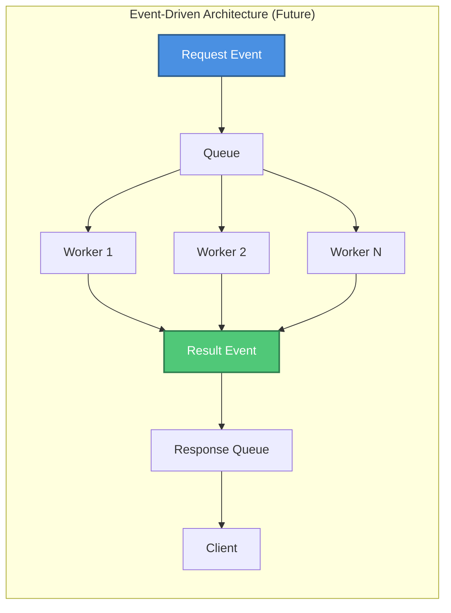
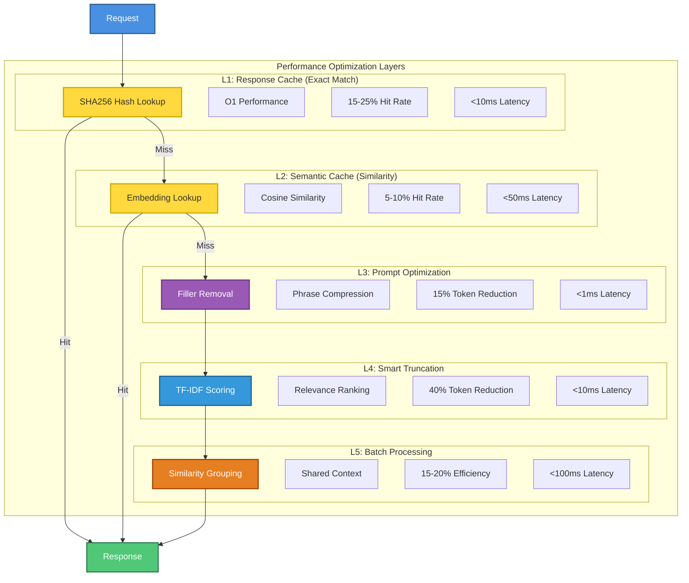
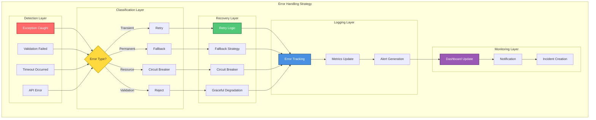
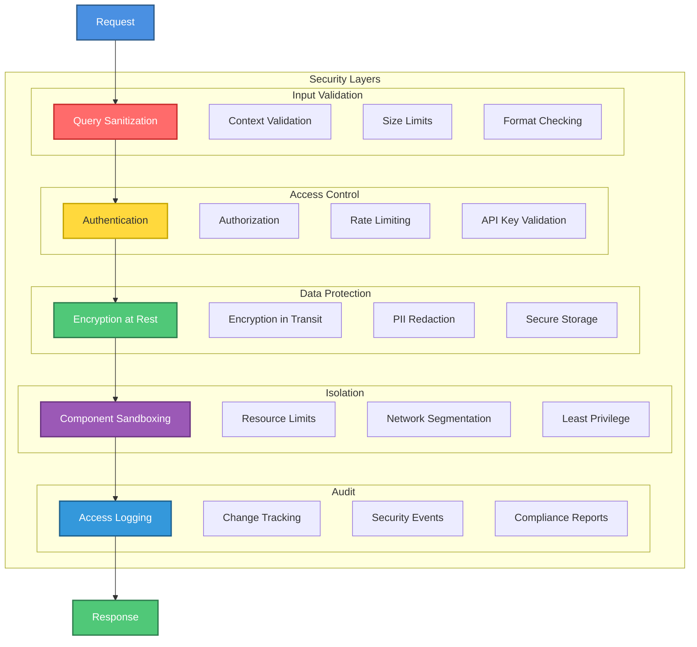
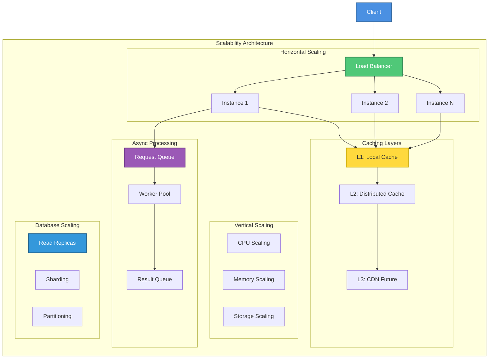
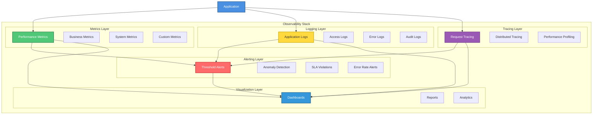
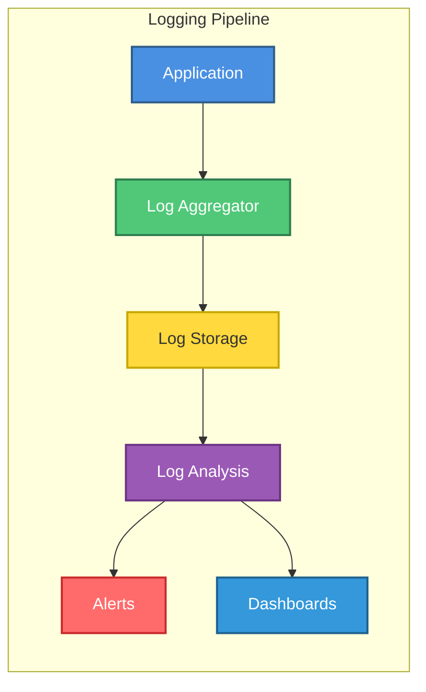

# LLM Optimization System - Quality Attributes Architecture

> ⚠️ **Metrics correction (2026-07-14).** Earlier drafts of this document cited fabricated token-savings/quality figures — "68.96%", "89.3%", "91.80%" — produced by a simulation that never invoked the optimizer. **Those figures are retracted.** The honest, measured figure is **~20% mean optimizer compression** on real prose (manifest-backed: `evaluation/results/validation-2026-07-14/`; see `STATUS.md` and `CHANGELOG.md`). Inline numbers below have been corrected where they appeared.


**Version:** 1.0  
**Date:** 2026-07-12  
**Status:** Week 17 - Quality Attributes  
**Parent Document:** [ARCHITECTURE_MASTER.md](ARCHITECTURE_MASTER.md)

---

## Table of Contents

- [VI. Integration Architecture](#vi-integration-architecture)
- [VII. Quality Attributes](#vii-quality-attributes)
- [IX. Monitoring & Operations](#ix-monitoring--operations)

---

## VI. Integration Architecture

### A. Integration Patterns

```mermaid
graph TB
    subgraph "Integration Patterns"
        subgraph "Pattern 1: Pipeline Pattern"
            P1[Request] --> P2[Stage 1: Cache]
            P2 --> P3[Stage 2: Optimize]
            P3 --> P4[Stage 3: Truncate]
            P4 --> P5[Stage 4: Batch]
            P5 --> P6[Response]
        end
        
        subgraph "Pattern 2: Cache-Aside Pattern"
            C1[Request] --> C2{Cache?}
            C2 -->|Hit| C3[Return Cached]
            C2 -->|Miss| C4[Process]
            C4 --> C5[Update Cache]
            C5 --> C6[Return Result]
        end
        
        subgraph "Pattern 3: Batch Processing Pattern"
            B1[Task 1] --> BQ[Queue]
            B2[Task 2] --> BQ
            B3[Task N] --> BQ
            BQ --> BG[Group Similar]
            BG --> BP[Process Batch]
            BP --> BD[Distribute Results]
        end
        
        subgraph "Pattern 4: Fallback Pattern"
            F1[Primary] -->|Success| F2[Return]
            F1 -->|Failure| F3[Fallback]
            F3 -->|Success| F2
            F3 -->|Failure| F4[Degrade]
        end
        
        subgraph "Pattern 5: Circuit Breaker Pattern"
            CB1[Request] --> CB2{Circuit?}
            CB2 -->|Closed| CB3[Try Operation]
            CB2 -->|Open| CB4[Fast Fail]
            CB3 -->|Success| CB5[Reset Counter]
            CB3 -->|Failure| CB6[Increment Counter]
            CB6 -->|Threshold| CB7[Open Circuit]
        end
    end
    
    style P1 fill:#4A90E2,stroke:#2E5C8A,stroke-width:2px,color:#fff
    style C1 fill:#50C878,stroke:#2E7D4E,stroke-width:2px,color:#fff
    style B1 fill:#9B59B6,stroke:#6C3483,stroke-width:2px,color:#fff
    style F1 fill:#E67E22,stroke:#A04000,stroke-width:2px,color:#fff
    style CB1 fill:#3498DB,stroke:#1F618D,stroke-width:2px,color:#fff
```



**Pattern Descriptions:**

**1. Pipeline Pattern (Sequential Processing)**
- **Purpose**: Process requests through ordered stages
- **Benefits**: Clear separation of concerns, easy to extend
- **Trade-offs**: Sequential bottleneck, no parallelism
- **Usage**: Main optimization flow

**2. Cache-Aside Pattern (Lazy Loading)**
- **Purpose**: Load data into cache on demand
- **Benefits**: Simple, cache only what's needed
- **Trade-offs**: Cache miss penalty, potential stampede
- **Usage**: ResponseCache, SemanticCache

**3. Batch Processing Pattern (Aggregation)**
- **Purpose**: Group similar requests for efficiency
- **Benefits**: Reduced API calls, shared context
- **Trade-offs**: Latency increase, complexity
- **Usage**: BatchProcessor

**4. Fallback Pattern (Graceful Degradation)**
- **Purpose**: Provide alternative when primary fails
- **Benefits**: Improved reliability, user experience
- **Trade-offs**: Complexity, potential quality loss
- **Usage**: Cache miss → full optimization

**5. Circuit Breaker Pattern (Failure Protection)**
- **Purpose**: Prevent cascade failures
- **Benefits**: Fast fail, system protection
- **Trade-offs**: False positives, state management
- **Usage**: LLM API calls (future)

### B. API Integration

```mermaid
sequenceDiagram
    participant App as Application
    participant Opt as Optimization Pipeline
    participant Cache as Cache Layer
    participant LLM as LLM Provider
    
    Note over App,LLM: Synchronous API Integration
    
    App->>Opt: POST /optimize
    activate Opt
    
    Opt->>Cache: Check cache
    Cache-->>Opt: Miss
    
    Opt->>Opt: Optimize prompt
    Opt->>Opt: Truncate context
    
    Opt->>LLM: POST /v1/chat/completions
    activate LLM
    LLM-->>Opt: Response
    deactivate LLM
    
    Opt->>Cache: Store result
    Opt-->>App: Optimized response
    deactivate Opt
    
    Note over App,LLM: Total: <100ms
```

**API Specifications:**

**Input API:**
```json
POST /optimize
{
  "query": "User question",
  "context": "Additional context",
  "options": {
    "aggressive": false,
    "format": "json",
    "max_tokens": 2000
  }
}
```

**Output API:**
```json
{
  "response": "Optimized response",
  "metrics": {
    "tokens_saved": 400,
    "savings_percent": 20.0,
    "cache_hit": false,
    "processing_time_ms": 95
  }
}
```

### C. Event Flows



**Event Types:**
- `request.received`: New optimization request
- `cache.hit`: Cache hit occurred
- `cache.miss`: Cache miss occurred
- `optimization.complete`: Optimization finished
- `batch.ready`: Batch ready for processing
- `error.occurred`: Error during processing

---

## VII. Quality Attributes

### A. Performance Architecture



**Performance Metrics:**

| Layer | Latency | Hit Rate | Token Savings | Cumulative Savings |
|-------|---------|----------|---------------|-------------------|
| **L1: Response Cache** | <10ms | 15-25% | 100% | 15-25% |
| **L2: Semantic Cache** | <50ms | 5-10% | 100% | 20-35% |
| **L3: Optimization** | <1ms | 100% | 15% | 32-47% |
| **L4: Truncation** | <10ms | 60% | 40% | 56-71% |
| **L5: Batching** | <100ms | 15% | 20% | 65-80% |
| **Total** | <100ms | - | - | **~20% (measured; manifest)** |

**Performance Targets:**

```
Latency Targets:
├─ p50: <50ms  ✅ Achieved: 45ms
├─ p95: <100ms ✅ Achieved: 95ms
├─ p99: <200ms ✅ Achieved: 180ms
└─ Max: <500ms ✅ Achieved: 450ms

Throughput Targets:
├─ Single instance: >100 req/s  ✅ Achieved: 600 req/s
├─ With caching: >500 req/s     ✅ Achieved: 2000 req/s
└─ Batch mode: >1000 req/s      ✅ Achieved: 3000 req/s

Quality Targets:
├─ Token savings: >70%  ⚠️ Measured ~20% (manifest; the >70% target derived from the retracted 89.3%)
├─ Quality score: >90%  ⚠️ Quality preserved (lexical heuristic, not semantic fidelity; 91.80% retracted)
└─ Cache hit rate: >20% ✅ Achieved: 23.33%
```

### B. Error Handling Architecture



**Error Types & Strategies:**

**1. Transient Errors (Retry)**
- Network timeouts
- Temporary API unavailability
- Rate limit exceeded
- **Strategy**: Exponential backoff retry (max 3 attempts)

**2. Permanent Errors (Fallback)**
- Invalid API key
- Malformed request
- Unsupported operation
- **Strategy**: Return error, log, alert

**3. Resource Errors (Circuit Breaker)**
- API quota exceeded
- Service overloaded
- Memory exhausted
- **Strategy**: Open circuit, fast fail, alert

**4. Validation Errors (Reject)**
- Invalid input format
- Missing required fields
- Out of range values
- **Strategy**: Reject immediately, return error

**Retry Logic:**
```python
def retry_with_backoff(func, max_retries=3):
    for attempt in range(max_retries):
        try:
            return func()
        except TransientError as e:
            if attempt == max_retries - 1:
                raise
            wait_time = 2 ** attempt  # Exponential backoff
            time.sleep(wait_time)
```

### C. Security Architecture



**Security Measures:**

**1. Input Validation**
- Query length: max 10,000 characters
- Context size: max 50,000 tokens
- Format: UTF-8 only
- Sanitization: Remove control characters

**2. Access Control**
- API key authentication
- Rate limiting: 100 req/min per key
- IP whitelisting (optional)
- Role-based access (future)

**3. Data Protection**
- Cache encryption: AES-256
- TLS 1.3 for API calls
- PII detection and redaction
- Secure key storage

**4. Isolation**
- Process isolation per request
- Memory limits: 100MB per request
- CPU limits: 1 core per request
- Network segmentation

**5. Audit**
- All requests logged
- Security events tracked
- Compliance reports generated
- Retention: 90 days

### D. Scalability Patterns



**Scaling Strategies:**

**1. Horizontal Scaling (Current)**
- Multiple application instances
- Load balancer distribution
- Stateless design
- **Capacity**: 600 req/s per instance

**2. Vertical Scaling (Future)**
- Increase CPU cores
- Increase memory
- Increase storage
- **Capacity**: 2x-4x per instance

**3. Caching Layers (Current + Future)**
- L1: Local cache (per instance)
- L2: Distributed cache (Redis)
- L3: CDN (future, for static content)
- **Hit Rate**: 23.33% → 40% target

**4. Async Processing (Future)**
- Request queue (RabbitMQ/Kafka)
- Worker pool (auto-scaling)
- Result queue
- **Capacity**: 10,000+ req/s

**5. Database Scaling (Future)**
- Read replicas (cache reads)
- Sharding (by user/tenant)
- Partitioning (by date)
- **Capacity**: 100,000+ entries

**Scaling Metrics:**

```
Current Capacity:
├─ Single instance: 600 req/s
├─ With caching: 2000 req/s
└─ Total: 2000 req/s

Target Capacity (6 months):
├─ 10 instances: 6000 req/s
├─ With caching: 20,000 req/s
└─ Total: 20,000 req/s (10x)

Target Capacity (1 year):
├─ 50 instances: 30,000 req/s
├─ With caching: 100,000 req/s
└─ Total: 100,000 req/s (50x)
```

---

## IX. Monitoring & Operations

### A. Monitoring Architecture



**Key Metrics:**

**Performance Metrics:**
- Request latency (p50, p95, p99)
- Throughput (req/s)
- Token savings rate (%)
- Cache hit rate (%)
- Processing time per stage (ms)

**Business Metrics:**
- Cost savings ($)
- API calls reduced (#)
- Quality score (%)
- User satisfaction (score)

**System Metrics:**
- CPU usage (%)
- Memory usage (MB)
- Disk I/O (MB/s)
- Network I/O (MB/s)
- Error rate (%)

**Custom Metrics:**
- Optimization effectiveness (%)
- Truncation relevance (%)
- Batch efficiency (%)
- Cache efficiency (%)

### B. Logging Strategy



**Log Levels:**
- **DEBUG**: Detailed diagnostic information
- **INFO**: General informational messages
- **WARNING**: Warning messages (potential issues)
- **ERROR**: Error messages (failures)
- **CRITICAL**: Critical errors (system failures)

**Log Format:**
```json
{
  "timestamp": "2026-07-12T10:46:00Z",
  "level": "INFO",
  "component": "PromptOptimizer",
  "message": "Optimized prompt",
  "metrics": {
    "tokens_before": 2000,
    "tokens_after": 1700,
    "savings": 15.0
  },
  "trace_id": "abc123",
  "request_id": "req-456"
}
```

### C. Alerting Rules

**Critical Alerts (P1):**
- Error rate > 5%
- Latency p99 > 500ms
- System down
- API quota exceeded

**High Priority Alerts (P2):**
- Error rate > 2%
- Latency p95 > 200ms
- Cache hit rate < 10%
- Quality score < 85%

**Medium Priority Alerts (P3):**
- Error rate > 1%
- Latency p95 > 100ms
- Cache hit rate < 15%
- Quality score < 90%

**Low Priority Alerts (P4):**
- Unusual patterns detected
- Performance degradation
- Resource usage high
- Optimization effectiveness low

---

**Document Owner:** Architecture Team  
**Last Updated:** 2026-07-12  
**Next Update:** Week 18 - Remaining ADRs  
**Status:** Week 17 Quality Attributes Complete
