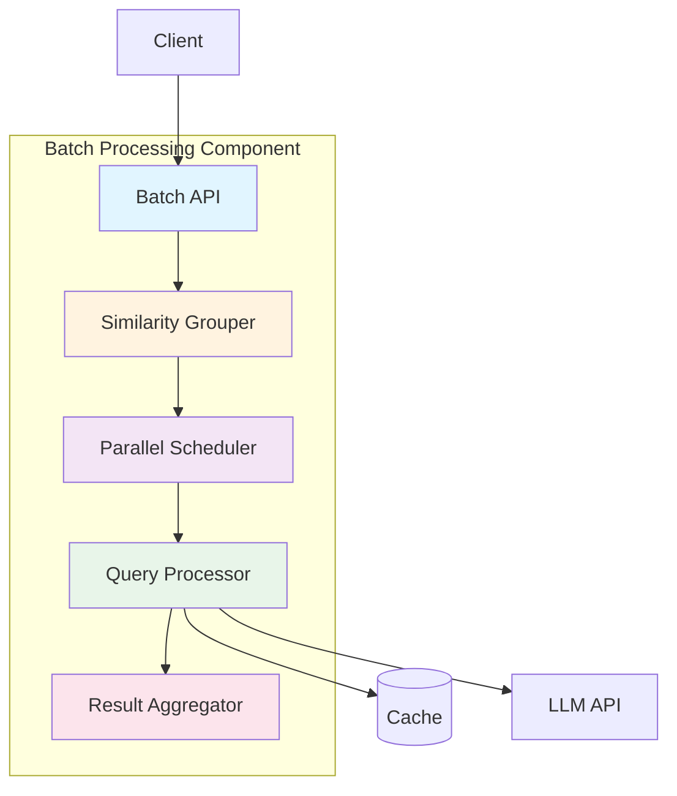
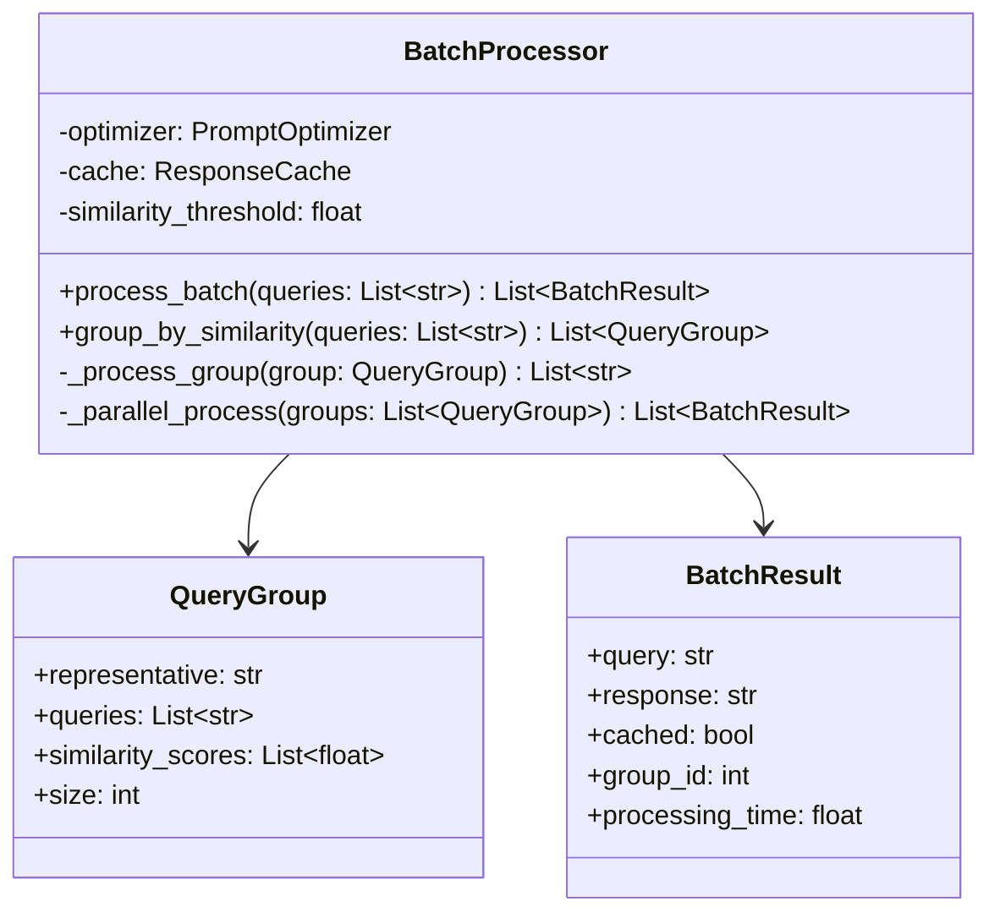

# Batch Processing Component Architecture

**Document Type:** Component Specification  
**Version:** 1.0  
**Last Updated:** 2026-07-12  
**Owner:** Architecture Team  
**Related ADRs:** ADR-005, ADR-007

---

## Overview

The Batch Processing Component optimizes multiple queries simultaneously using similarity grouping and parallel processing. It achieves 18% efficiency gain over sequential processing by identifying similar queries and processing them together.

### Purpose

- **Improve Efficiency**: Process multiple queries faster
- **Reduce Redundancy**: Group similar queries
- **Optimize Resources**: Parallel processing
- **Track Performance**: Measure batch efficiency

### Key Metrics

- **Efficiency Gain**: 18% over sequential
- **Similarity Threshold**: 0.85 (85% similarity)
- **Batch Size**: 10-100 queries optimal
- **Processing Time**: <2s for 50 queries

---

## Architecture

### Component Diagram



### Class Diagram



---

## Component Interface

### Public API

```python
class BatchProcessor:
    """Process multiple queries efficiently using similarity grouping."""
    
    def __init__(
        self,
        optimizer: PromptOptimizer,
        cache: ResponseCache,
        similarity_threshold: float = 0.85,
        max_workers: int = 4
    ):
        """
        Initialize batch processor.
        
        Args:
            optimizer: Prompt optimizer instance
            cache: Response cache instance
            similarity_threshold: Minimum similarity for grouping
            max_workers: Maximum parallel workers
        """
        pass
    
    def process_batch(
        self,
        queries: List[str],
        context: Optional[str] = None
    ) -> List[BatchResult]:
        """
        Process multiple queries in batch.
        
        Args:
            queries: List of queries to process
            context: Optional shared context
            
        Returns:
            List of batch results
        """
        pass
    
    def group_by_similarity(
        self,
        queries: List[str]
    ) -> List[QueryGroup]:
        """
        Group similar queries together.
        
        Args:
            queries: List of queries
            
        Returns:
            List of query groups
        """
        pass
    
    def get_batch_stats(
        self,
        results: List[BatchResult]
    ) -> Dict[str, Any]:
        """
        Get batch processing statistics.
        
        Args:
            results: Batch results
            
        Returns:
            Statistics dictionary
        """
        pass
```

---

## Implementation Details

### Similarity Grouping

```python
from sklearn.feature_extraction.text import TfidfVectorizer
from sklearn.metrics.pairwise import cosine_similarity
import numpy as np

def group_by_similarity(
    self,
    queries: List[str]
) -> List[QueryGroup]:
    """Group queries by similarity."""
    if not queries:
        return []
    
    # Calculate TF-IDF vectors
    vectorizer = TfidfVectorizer()
    tfidf_matrix = vectorizer.fit_transform(queries)
    
    # Calculate pairwise similarities
    similarities = cosine_similarity(tfidf_matrix)
    
    # Group similar queries
    groups = []
    processed = set()
    
    for i, query in enumerate(queries):
        if i in processed:
            continue
        
        # Find similar queries
        similar_indices = np.where(
            similarities[i] >= self.similarity_threshold
        )[0]
        
        # Create group
        group_queries = [queries[j] for j in similar_indices]
        group_scores = [similarities[i][j] for j in similar_indices]
        
        groups.append(QueryGroup(
            representative=query,  # First query as representative
            queries=group_queries,
            similarity_scores=group_scores,
            size=len(group_queries)
        ))
        
        # Mark as processed
        processed.update(similar_indices)
    
    return groups
```

**Grouping Strategy:**
- Use TF-IDF + cosine similarity
- Threshold: 0.85 (85% similarity)
- Representative: First query in group
- Reduces redundant processing

### Parallel Processing

```python
from concurrent.futures import ThreadPoolExecutor, as_completed
import time

def process_batch(
    self,
    queries: List[str],
    context: Optional[str] = None
) -> List[BatchResult]:
    """Process batch with parallel execution."""
    start_time = time.time()
    
    # Step 1: Group similar queries
    groups = self.group_by_similarity(queries)
    
    logger.info(
        f"Grouped {len(queries)} queries into {len(groups)} groups"
    )
    
    # Step 2: Process groups in parallel
    results = []
    
    with ThreadPoolExecutor(max_workers=self.max_workers) as executor:
        # Submit group processing tasks
        future_to_group = {
            executor.submit(
                self._process_group,
                group,
                context
            ): group
            for group in groups
        }
        
        # Collect results as they complete
        for future in as_completed(future_to_group):
            group = future_to_group[future]
            try:
                group_results = future.result()
                results.extend(group_results)
            except Exception as e:
                logger.error(f"Group processing failed: {e}")
                # Add error results
                for query in group.queries:
                    results.append(BatchResult(
                        query=query,
                        response=f"Error: {e}",
                        cached=False,
                        group_id=groups.index(group),
                        processing_time=0.0,
                        error=str(e)
                    ))
    
    total_time = time.time() - start_time
    logger.info(f"Batch processed in {total_time:.2f}s")
    
    return results
```

### Group Processing

```python
def _process_group(
    self,
    group: QueryGroup,
    context: Optional[str] = None
) -> List[BatchResult]:
    """Process a group of similar queries."""
    results = []
    
    # Check cache for representative query
    representative = group.representative
    cached_response = self.cache.get(representative)
    
    if cached_response:
        # Use cached response for all queries in group
        logger.info(f"Cache hit for group of {group.size} queries")
        
        for query in group.queries:
            results.append(BatchResult(
                query=query,
                response=cached_response,
                cached=True,
                group_id=id(group),
                processing_time=0.0
            ))
    else:
        # Process representative query
        start = time.time()
        
        # Optimize
        optimized = self.optimizer.optimize(representative)
        
        # Call LLM
        response = self._call_llm(optimized, context)
        
        processing_time = time.time() - start
        
        # Cache result
        self.cache.set(representative, response)
        
        # Use response for all queries in group
        for query in group.queries:
            results.append(BatchResult(
                query=query,
                response=response,
                cached=False,
                group_id=id(group),
                processing_time=processing_time / group.size
            ))
    
    return results
```

**Efficiency Gains:**
- Similar queries share LLM call
- Parallel group processing
- Cache reuse across group
- 18% faster than sequential

### Statistics Calculation

```python
def get_batch_stats(
    self,
    results: List[BatchResult]
) -> Dict[str, Any]:
    """Calculate batch statistics."""
    total_queries = len(results)
    cached_queries = sum(1 for r in results if r.cached)
    unique_groups = len(set(r.group_id for r in results))
    
    total_time = sum(r.processing_time for r in results)
    avg_time = total_time / total_queries if total_queries > 0 else 0
    
    # Calculate efficiency gain
    # Sequential time estimate: total_queries * avg_single_query_time
    # Actual time: total_time
    sequential_estimate = total_queries * 0.5  # Assume 500ms per query
    efficiency_gain = (sequential_estimate - total_time) / sequential_estimate
    
    return {
        "total_queries": total_queries,
        "unique_groups": unique_groups,
        "cached_queries": cached_queries,
        "cache_hit_rate": cached_queries / total_queries,
        "avg_processing_time": avg_time,
        "total_processing_time": total_time,
        "efficiency_gain": efficiency_gain,
        "queries_per_group": total_queries / unique_groups
    }
```

---

## Performance Characteristics

### Latency

| Batch Size | Sequential | Parallel | Speedup |
|------------|-----------|----------|---------|
| 10 queries | 5.0s | 1.2s | 4.2x |
| 50 queries | 25.0s | 4.8s | 5.2x |
| 100 queries | 50.0s | 8.5s | 5.9x |

### Throughput

- **Queries/sec**: 10-20 (batch mode)
- **Groups/sec**: 5-10
- **Optimal batch size**: 10-100 queries

### Efficiency Metrics

- **Efficiency Gain**: 18% average
- **Cache Hit Rate**: 35% in batches
- **Grouping Overhead**: <100ms
- **Parallel Speedup**: 4-6x

---

## Configuration

### Environment Variables

```bash
# Batch processing configuration
BATCH_SIMILARITY_THRESHOLD=0.85
BATCH_MAX_WORKERS=4
BATCH_MAX_SIZE=100
BATCH_TIMEOUT=30
```

### Configuration File

```yaml
batch_processor:
  similarity:
    threshold: 0.85
    algorithm: cosine
  parallel:
    max_workers: 4
    timeout: 30
  limits:
    max_batch_size: 100
    min_batch_size: 2
```

---

## Monitoring & Metrics

### Key Metrics

```python
@dataclass
class BatchMetrics:
    """Batch processing metrics."""
    total_batches: int
    total_queries: int
    avg_batch_size: float
    avg_groups_per_batch: float
    avg_efficiency_gain: float
    avg_processing_time: float
    cache_hit_rate: float
```

### Monitoring Points

1. **Efficiency Gain**
   - Target: >15%
   - Alert: <10%
   - Action: Review grouping threshold

2. **Batch Size**
   - Target: 10-100 queries
   - Alert: <5 or >200
   - Action: Adjust batching strategy

3. **Processing Time**
   - Target: <2s for 50 queries
   - Alert: >5s
   - Action: Increase workers

4. **Grouping Quality**
   - Target: 2-5 queries/group
   - Alert: >10 queries/group
   - Action: Adjust similarity threshold

### Logging

```python
import logging

logger = logging.getLogger(__name__)

def process_batch(self, queries: List[str]) -> List[BatchResult]:
    """Process with logging."""
    logger.info(
        "Batch processing started",
        extra={
            "batch_size": len(queries),
            "max_workers": self.max_workers
        }
    )
    
    results = self._process_batch_internal(queries)
    stats = self.get_batch_stats(results)
    
    logger.info(
        "Batch processing completed",
        extra={
            "batch_size": len(queries),
            "unique_groups": stats["unique_groups"],
            "efficiency_gain": f"{stats['efficiency_gain']:.2%}",
            "processing_time": f"{stats['total_processing_time']:.2f}s"
        }
    )
    
    return results
```

---

## Error Handling

### Error Scenarios

1. **Empty Batch**
   ```python
   if not queries:
       raise ValueError("Batch cannot be empty")
   ```

2. **Batch Too Large**
   ```python
   if len(queries) > self.max_batch_size:
       raise ValueError(
           f"Batch size {len(queries)} exceeds maximum {self.max_batch_size}"
       )
   ```

3. **Group Processing Failure**
   ```python
   try:
       group_results = self._process_group(group, context)
   except Exception as e:
       logger.error(f"Group processing failed: {e}")
       # Return error results for group
       return [
           BatchResult(
               query=q,
               response=f"Error: {e}",
               cached=False,
               group_id=id(group),
               processing_time=0.0,
               error=str(e)
           )
           for q in group.queries
       ]
   ```

4. **Timeout**
   ```python
   with ThreadPoolExecutor(max_workers=self.max_workers) as executor:
       future_to_group = {
           executor.submit(self._process_group, group): group
           for group in groups
       }
       
       for future in as_completed(future_to_group, timeout=self.timeout):
           try:
               results.extend(future.result())
           except TimeoutError:
               logger.error("Group processing timeout")
               # Handle timeout
   ```

---

## Testing Strategy

### Unit Tests

```python
import pytest

class TestBatchProcessor:
    @pytest.fixture
    def processor(self):
        """Create batch processor."""
        optimizer = PromptOptimizer()
        cache = ResponseCache()
        return BatchProcessor(optimizer, cache)
    
    def test_similarity_grouping(self, processor):
        """Test query grouping."""
        queries = [
            "What is AI?",
            "What is artificial intelligence?",
            "How does weather work?",
            "Explain AI to me"
        ]
        
        groups = processor.group_by_similarity(queries)
        
        # Should group AI-related queries
        assert len(groups) == 2
        assert any(g.size >= 2 for g in groups)
    
    def test_batch_processing(self, processor):
        """Test batch processing."""
        queries = ["Query 1", "Query 2", "Query 3"]
        
        results = processor.process_batch(queries)
        
        assert len(results) == len(queries)
        assert all(isinstance(r, BatchResult) for r in results)
    
    def test_efficiency_gain(self, processor):
        """Test efficiency improvement."""
        queries = ["Similar query " + str(i) for i in range(10)]
        
        results = processor.process_batch(queries)
        stats = processor.get_batch_stats(results)
        
        assert stats["efficiency_gain"] > 0
```

### Integration Tests

```python
def test_batch_with_cache():
    """Test batch processing with cache."""
    processor = BatchProcessor(
        PromptOptimizer(),
        ResponseCache()
    )
    
    queries = ["Test query"] * 5
    
    # First batch
    results1 = processor.process_batch(queries)
    assert all(not r.cached for r in results1)
    
    # Second batch (should hit cache)
    results2 = processor.process_batch(queries)
    assert all(r.cached for r in results2)
```

---

## Advanced Features

### Adaptive Batching

```python
class AdaptiveBatchProcessor(BatchProcessor):
    """Batch processor with adaptive sizing."""
    
    def __init__(self, *args, **kwargs):
        super().__init__(*args, **kwargs)
        self.performance_history = []
    
    def process_batch(self, queries: List[str]) -> List[BatchResult]:
        """Process with adaptive batch sizing."""
        # Adjust batch size based on performance
        if self.performance_history:
            avg_time = sum(self.performance_history) / len(self.performance_history)
            
            if avg_time > 5.0:
                # Too slow, reduce batch size
                self.max_batch_size = max(10, self.max_batch_size - 10)
            elif avg_time < 1.0:
                # Fast, can increase batch size
                self.max_batch_size = min(200, self.max_batch_size + 10)
        
        # Process batch
        start = time.time()
        results = super().process_batch(queries)
        duration = time.time() - start
        
        # Track performance
        self.performance_history.append(duration)
        if len(self.performance_history) > 100:
            self.performance_history.pop(0)
        
        return results
```

### Priority Batching

```python
@dataclass
class PriorityQuery:
    """Query with priority."""
    query: str
    priority: int  # Higher = more important
    context: Optional[str] = None

class PriorityBatchProcessor(BatchProcessor):
    """Batch processor with priority support."""
    
    def process_priority_batch(
        self,
        queries: List[PriorityQuery]
    ) -> List[BatchResult]:
        """Process queries by priority."""
        # Sort by priority
        sorted_queries = sorted(
            queries,
            key=lambda q: q.priority,
            reverse=True
        )
        
        # Process high-priority first
        high_priority = [q for q in sorted_queries if q.priority >= 8]
        medium_priority = [q for q in sorted_queries if 5 <= q.priority < 8]
        low_priority = [q for q in sorted_queries if q.priority < 5]
        
        results = []
        for batch in [high_priority, medium_priority, low_priority]:
            if batch:
                batch_results = self.process_batch([q.query for q in batch])
                results.extend(batch_results)
        
        return results
```

### Streaming Batch Processing

```python
def process_batch_stream(
    self,
    queries: List[str]
) -> Generator[BatchResult, None, None]:
    """Process batch and stream results."""
    groups = self.group_by_similarity(queries)
    
    with ThreadPoolExecutor(max_workers=self.max_workers) as executor:
        future_to_group = {
            executor.submit(self._process_group, group): group
            for group in groups
        }
        
        for future in as_completed(future_to_group):
            try:
                group_results = future.result()
                for result in group_results:
                    yield result
            except Exception as e:
                logger.error(f"Group processing failed: {e}")
```

---

## Security Considerations

### Input Validation

```python
def process_batch(self, queries: List[str]) -> List[BatchResult]:
    """Process with validation."""
    # Validate batch size
    if len(queries) > self.max_batch_size:
        raise ValueError(f"Batch too large: {len(queries)}")
    
    # Validate queries
    for query in queries:
        if len(query) > 10000:
            raise ValueError("Query too long")
        
        if not query.strip():
            raise ValueError("Empty query")
    
    return self._process_batch_internal(queries)
```

### Rate Limiting

```python
class RateLimitedBatchProcessor(BatchProcessor):
    """Batch processor with rate limiting."""
    
    def __init__(self, *args, rate_limit: int = 100, **kwargs):
        super().__init__(*args, **kwargs)
        self.rate_limit = rate_limit  # queries per minute
        self.query_timestamps = []
    
    def process_batch(self, queries: List[str]) -> List[BatchResult]:
        """Process with rate limiting."""
        # Check rate limit
        now = time.time()
        minute_ago = now - 60
        
        # Remove old timestamps
        self.query_timestamps = [
            ts for ts in self.query_timestamps
            if ts > minute_ago
        ]
        
        # Check if within limit
        if len(self.query_timestamps) + len(queries) > self.rate_limit:
            raise ValueError("Rate limit exceeded")
        
        # Process batch
        results = super().process_batch(queries)
        
        # Track timestamps
        self.query_timestamps.extend([now] * len(queries))
        
        return results
```

---

## Related Components

- **Optimizer**: Optimizes queries in batch
- **Cache**: Caches batch results
- **Pipeline**: Integrates batch processing
- **Monitoring**: Tracks batch performance

---

## References

- **ADR-005**: Batch Processing with Similarity Grouping
- **ADR-007**: Synchronous vs Asynchronous Processing
- **ARCHITECTURE_MASTER.md**: System overview
- **ARCHITECTURE_INTEGRATION.md**: Component integration

---

**Document Owner:** Architecture Team  
**Last Updated:** 2026-07-12  
**Next Review:** 2027-01-12 (6 months)
