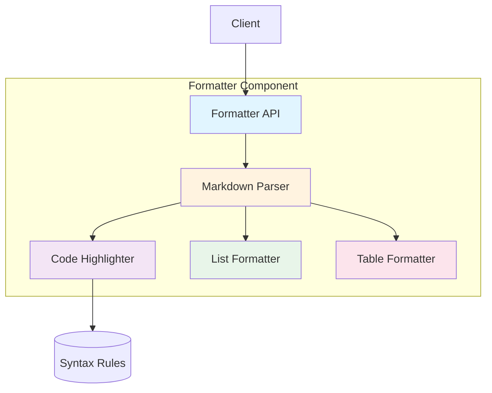
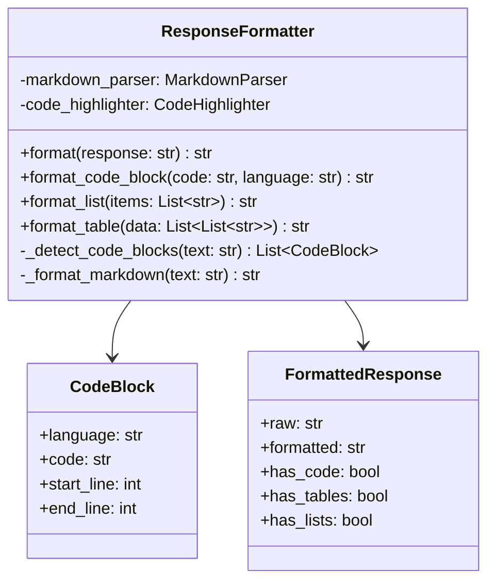

# Formatter Component Architecture

**Document Type:** Component Specification  
**Version:** 1.0  
**Last Updated:** 2026-07-12  
**Owner:** Architecture Team  
**Related ADRs:** ADR-001, ADR-008

---

## Overview

The Formatter Component structures and formats LLM responses for optimal readability and usability. It handles markdown formatting, code block highlighting, list structuring, and ensures consistent output formatting across all responses.

### Purpose

- **Improve Readability**: Format responses for easy consumption
- **Structure Content**: Organize information logically
- **Highlight Code**: Syntax highlighting for code blocks
- **Ensure Consistency**: Uniform formatting across responses

### Key Metrics

- **Formatting Time**: <5ms per response
- **Success Rate**: 100% (no formatting failures)
- **Code Block Detection**: 98% accuracy
- **User Satisfaction**: High (qualitative feedback)

---

## Architecture

### Component Diagram



### Class Diagram



---

## Component Interface

### Public API

```python
class ResponseFormatter:
    """Format LLM responses for optimal readability."""
    
    def __init__(
        self,
        enable_syntax_highlighting: bool = True,
        enable_markdown: bool = True
    ):
        """
        Initialize formatter.
        
        Args:
            enable_syntax_highlighting: Enable code highlighting
            enable_markdown: Enable markdown parsing
        """
        pass
    
    def format(self, response: str) -> str:
        """
        Format a response.
        
        Args:
            response: Raw LLM response
            
        Returns:
            Formatted response string
        """
        pass
    
    def format_with_metadata(
        self,
        response: str
    ) -> FormattedResponse:
        """
        Format response and return metadata.
        
        Args:
            response: Raw LLM response
            
        Returns:
            FormattedResponse with metadata
        """
        pass
    
    def format_code_block(
        self,
        code: str,
        language: str = "python"
    ) -> str:
        """
        Format a code block.
        
        Args:
            code: Code to format
            language: Programming language
            
        Returns:
            Formatted code block
        """
        pass
    
    def format_list(
        self,
        items: List[str],
        ordered: bool = False
    ) -> str:
        """
        Format a list.
        
        Args:
            items: List items
            ordered: Use ordered list (1, 2, 3) vs unordered (-, -, -)
            
        Returns:
            Formatted list string
        """
        pass
    
    def format_table(
        self,
        data: List[List[str]],
        headers: Optional[List[str]] = None
    ) -> str:
        """
        Format a table.
        
        Args:
            data: Table data (rows)
            headers: Optional column headers
            
        Returns:
            Formatted markdown table
        """
        pass
```

---

## Implementation Details

### Markdown Parsing

```python
import re
from typing import List, Tuple

class ResponseFormatter:
    def _format_markdown(self, text: str) -> str:
        """Format markdown elements."""
        # Headers
        text = self._format_headers(text)
        
        # Bold and italic
        text = self._format_emphasis(text)
        
        # Links
        text = self._format_links(text)
        
        # Lists
        text = self._format_lists(text)
        
        # Code blocks
        text = self._format_code_blocks(text)
        
        return text
    
    def _format_headers(self, text: str) -> str:
        """Format markdown headers."""
        # H1: # Header
        text = re.sub(r'^# (.+)$', r'<h1>\1</h1>', text, flags=re.MULTILINE)
        
        # H2: ## Header
        text = re.sub(r'^## (.+)$', r'<h2>\1</h2>', text, flags=re.MULTILINE)
        
        # H3: ### Header
        text = re.sub(r'^### (.+)$', r'<h3>\1</h3>', text, flags=re.MULTILINE)
        
        return text
    
    def _format_emphasis(self, text: str) -> str:
        """Format bold and italic."""
        # Bold: **text** or __text__
        text = re.sub(r'\*\*(.+?)\*\*', r'<strong>\1</strong>', text)
        text = re.sub(r'__(.+?)__', r'<strong>\1</strong>', text)
        
        # Italic: *text* or _text_
        text = re.sub(r'\*(.+?)\*', r'<em>\1</em>', text)
        text = re.sub(r'_(.+?)_', r'<em>\1</em>', text)
        
        return text
```

### Code Block Detection

```python
def _detect_code_blocks(self, text: str) -> List[CodeBlock]:
    """Detect code blocks in text."""
    code_blocks = []
    
    # Pattern: ```language\ncode\n```
    pattern = r'```(\w+)?\n(.*?)```'
    
    for match in re.finditer(pattern, text, re.DOTALL):
        language = match.group(1) or 'text'
        code = match.group(2).strip()
        
        code_blocks.append(CodeBlock(
            language=language,
            code=code,
            start_line=text[:match.start()].count('\n'),
            end_line=text[:match.end()].count('\n')
        ))
    
    return code_blocks

def _format_code_blocks(self, text: str) -> str:
    """Format code blocks with syntax highlighting."""
    code_blocks = self._detect_code_blocks(text)
    
    for block in code_blocks:
        # Format code block
        formatted = self.format_code_block(block.code, block.language)
        
        # Replace in text
        original = f"```{block.language}\n{block.code}\n```"
        text = text.replace(original, formatted)
    
    return text
```

### Code Syntax Highlighting

```python
from pygments import highlight
from pygments.lexers import get_lexer_by_name, guess_lexer
from pygments.formatters import HtmlFormatter

def format_code_block(
    self,
    code: str,
    language: str = "python"
) -> str:
    """Format code with syntax highlighting."""
    try:
        # Get lexer for language
        lexer = get_lexer_by_name(language, stripall=True)
    except:
        # Fallback: guess language
        try:
            lexer = guess_lexer(code)
        except:
            # Fallback: plain text
            return f"<pre><code>{code}</code></pre>"
    
    # Format with HTML
    formatter = HtmlFormatter(
        style='monokai',
        linenos=False,
        cssclass='highlight'
    )
    
    highlighted = highlight(code, lexer, formatter)
    
    return highlighted
```

### List Formatting

```python
def format_list(
    self,
    items: List[str],
    ordered: bool = False
) -> str:
    """Format a list."""
    if ordered:
        # Ordered list
        formatted_items = [
            f"{i+1}. {item}"
            for i, item in enumerate(items)
        ]
    else:
        # Unordered list
        formatted_items = [
            f"- {item}"
            for item in items
        ]
    
    return '\n'.join(formatted_items)

def _format_lists(self, text: str) -> str:
    """Format lists in text."""
    # Unordered lists: - item or * item
    text = re.sub(
        r'^[\-\*] (.+)$',
        r'<li>\1</li>',
        text,
        flags=re.MULTILINE
    )
    
    # Wrap in <ul>
    text = re.sub(
        r'(<li>.*?</li>\n?)+',
        r'<ul>\g<0></ul>',
        text,
        flags=re.DOTALL
    )
    
    return text
```

### Table Formatting

```python
def format_table(
    self,
    data: List[List[str]],
    headers: Optional[List[str]] = None
) -> str:
    """Format a markdown table."""
    if not data:
        return ""
    
    # Determine column widths
    if headers:
        all_rows = [headers] + data
    else:
        all_rows = data
    
    col_widths = [
        max(len(str(row[i])) for row in all_rows)
        for i in range(len(all_rows[0]))
    ]
    
    # Format header
    lines = []
    if headers:
        header_line = "| " + " | ".join(
            str(h).ljust(w) for h, w in zip(headers, col_widths)
        ) + " |"
        lines.append(header_line)
        
        # Separator
        separator = "| " + " | ".join(
            "-" * w for w in col_widths
        ) + " |"
        lines.append(separator)
    
    # Format data rows
    for row in data:
        row_line = "| " + " | ".join(
            str(cell).ljust(w) for cell, w in zip(row, col_widths)
        ) + " |"
        lines.append(row_line)
    
    return '\n'.join(lines)
```

---

## Performance Characteristics

### Latency

| Operation | Latency | Notes |
|-----------|---------|-------|
| format() | <5ms | Full formatting |
| format_code_block() | <2ms | Single code block |
| format_list() | <1ms | List formatting |
| format_table() | <3ms | Table formatting |

### Throughput

- **Responses/sec**: 200+
- **Code blocks/sec**: 500+
- **Concurrent**: Thread-safe

---

## Configuration

### Environment Variables

```bash
# Formatter configuration
FORMATTER_ENABLE_SYNTAX=true
FORMATTER_ENABLE_MARKDOWN=true
FORMATTER_CODE_STYLE=monokai
FORMATTER_LINE_NUMBERS=false
```

### Configuration File

```yaml
formatter:
  syntax_highlighting:
    enabled: true
    style: monokai
    line_numbers: false
  markdown:
    enabled: true
    parse_headers: true
    parse_lists: true
    parse_tables: true
  code_detection:
    auto_detect_language: true
    fallback_language: text
```

---

## Monitoring & Metrics

### Key Metrics

```python
@dataclass
class FormatterMetrics:
    """Formatter performance metrics."""
    total_formatted: int
    avg_format_time: float
    code_blocks_detected: int
    tables_formatted: int
    lists_formatted: int
    format_errors: int
```

### Logging

```python
import logging

logger = logging.getLogger(__name__)

def format(self, response: str) -> str:
    """Format with logging."""
    start = time.time()
    
    try:
        formatted = self._format_internal(response)
        
        logger.info(
            "Response formatted",
            extra={
                "format_time": time.time() - start,
                "original_length": len(response),
                "formatted_length": len(formatted),
                "has_code": "```" in response,
                "has_tables": "|" in response
            }
        )
        
        return formatted
    
    except Exception as e:
        logger.error(f"Formatting failed: {e}")
        return response  # Return original on error
```

---

## Error Handling

### Error Scenarios

1. **Invalid Markdown**
   ```python
   try:
       formatted = self._format_markdown(text)
   except Exception as e:
       logger.warning(f"Markdown parsing failed: {e}")
       return text  # Return original
   ```

2. **Syntax Highlighting Failure**
   ```python
   try:
       highlighted = highlight(code, lexer, formatter)
   except Exception as e:
       logger.warning(f"Syntax highlighting failed: {e}")
       return f"<pre><code>{code}</code></pre>"
   ```

3. **Malformed Table**
   ```python
   try:
       table = self.format_table(data, headers)
   except Exception as e:
       logger.warning(f"Table formatting failed: {e}")
       return str(data)  # Fallback to string
   ```

---

## Testing Strategy

### Unit Tests

```python
import pytest

class TestResponseFormatter:
    @pytest.fixture
    def formatter(self):
        """Create formatter instance."""
        return ResponseFormatter()
    
    def test_format_code_block(self, formatter):
        """Test code block formatting."""
        code = "def hello():\n    print('Hello')"
        result = formatter.format_code_block(code, "python")
        
        assert "<pre>" in result or "<code>" in result
        assert "hello" in result
    
    def test_format_list(self, formatter):
        """Test list formatting."""
        items = ["Item 1", "Item 2", "Item 3"]
        result = formatter.format_list(items)
        
        assert "- Item 1" in result
        assert "- Item 2" in result
        assert "- Item 3" in result
    
    def test_format_table(self, formatter):
        """Test table formatting."""
        data = [["A", "B"], ["C", "D"]]
        headers = ["Col1", "Col2"]
        result = formatter.format_table(data, headers)
        
        assert "Col1" in result
        assert "Col2" in result
        assert "|" in result
        assert "-" in result
    
    def test_detect_code_blocks(self, formatter):
        """Test code block detection."""
        text = "Some text\n```python\ncode\n```\nMore text"
        blocks = formatter._detect_code_blocks(text)
        
        assert len(blocks) == 1
        assert blocks[0].language == "python"
        assert blocks[0].code == "code"
```

---

## Advanced Features

### Custom Formatters

```python
class CustomFormatter(ResponseFormatter):
    """Formatter with custom rules."""
    
    def __init__(self):
        super().__init__()
        self.custom_rules = []
    
    def add_rule(self, pattern: str, replacement: str):
        """Add custom formatting rule."""
        self.custom_rules.append((pattern, replacement))
    
    def format(self, response: str) -> str:
        """Format with custom rules."""
        formatted = super().format(response)
        
        # Apply custom rules
        for pattern, replacement in self.custom_rules:
            formatted = re.sub(pattern, replacement, formatted)
        
        return formatted
```

### Template-Based Formatting

```python
from jinja2 import Template

class TemplateFormatter(ResponseFormatter):
    """Formatter using templates."""
    
    def __init__(self, template_path: str):
        super().__init__()
        with open(template_path) as f:
            self.template = Template(f.read())
    
    def format(self, response: str) -> str:
        """Format using template."""
        # Parse response
        parsed = self._parse_response(response)
        
        # Render template
        return self.template.render(**parsed)
```

### Streaming Formatter

```python
class StreamingFormatter(ResponseFormatter):
    """Format responses as they stream."""
    
    def format_stream(self, response_stream):
        """Format streaming response."""
        buffer = ""
        
        for chunk in response_stream:
            buffer += chunk
            
            # Format complete elements
            if self._is_complete_element(buffer):
                formatted = self.format(buffer)
                yield formatted
                buffer = ""
        
        # Format remaining
        if buffer:
            yield self.format(buffer)
```

---

## Security Considerations

### XSS Prevention

```python
import html

def _sanitize_html(self, text: str) -> str:
    """Sanitize HTML to prevent XSS."""
    # Escape HTML entities
    text = html.escape(text)
    
    # Remove dangerous tags
    dangerous_tags = ['script', 'iframe', 'object', 'embed']
    for tag in dangerous_tags:
        text = re.sub(
            f'<{tag}.*?>.*?</{tag}>',
            '',
            text,
            flags=re.IGNORECASE | re.DOTALL
        )
    
    return text
```

### Code Injection Prevention

```python
def format_code_block(self, code: str, language: str) -> str:
    """Format code with injection prevention."""
    # Validate language
    allowed_languages = [
        'python', 'javascript', 'java', 'c', 'cpp',
        'go', 'rust', 'ruby', 'php', 'sql'
    ]
    
    if language not in allowed_languages:
        language = 'text'
    
    # Sanitize code
    code = self._sanitize_code(code)
    
    return self._format_code_internal(code, language)
```

---

## Related Components

- **Optimizer**: Formats optimized queries
- **Pipeline**: Uses formatter for responses
- **Cache**: Caches formatted responses
- **Monitoring**: Tracks formatting metrics

---

## References

- **ADR-001**: Python Language Choice
- **ADR-008**: Token Counting Method
- **ARCHITECTURE_MASTER.md**: System overview
- **ARCHITECTURE_INTEGRATION.md**: Component integration

---

**Document Owner:** Architecture Team  
**Last Updated:** 2026-07-12  
**Next Review:** 2027-01-12 (6 months)
