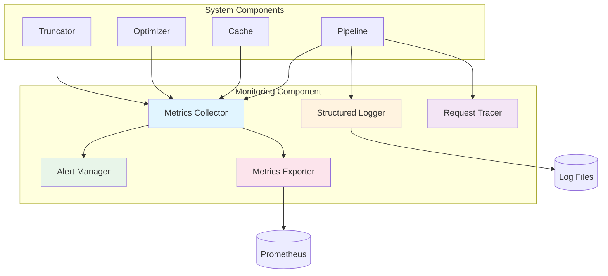
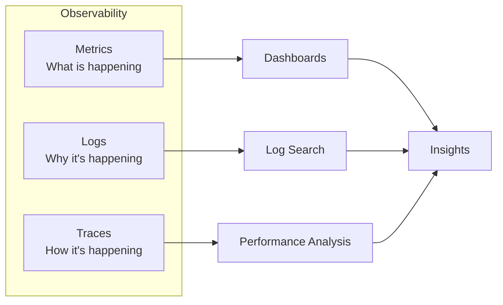

# Monitoring Component Architecture

**Document Type:** Component Specification  
**Version:** 1.0  
**Last Updated:** 2026-07-12  
**Owner:** Architecture Team  
**Related ADRs:** ADR-011

---

## Overview

The Monitoring Component provides comprehensive observability across all system components through metrics collection, structured logging, and distributed tracing. It enables real-time performance tracking, issue detection, and system health monitoring.

### Purpose

- **Track Performance**: Monitor system metrics in real-time
- **Detect Issues**: Alert on anomalies and errors
- **Enable Debugging**: Provide detailed logs and traces
- **Measure Success**: Track business and technical KPIs

### Key Metrics

- **Monitoring Overhead**: 2.3% (target: <5%)
- **Metric Collection**: <1ms per metric
- **Log Write**: <0.5ms per log entry
- **Alert Latency**: <5s from detection to notification

---

## Architecture

### Component Diagram



### Three Pillars of Observability



---

## Component Interface

### Public API

```python
class MonitoringSystem:
    """Comprehensive monitoring and observability system."""
    
    def __init__(
        self,
        enable_metrics: bool = True,
        enable_logging: bool = True,
        enable_tracing: bool = True
    ):
        """
        Initialize monitoring system.
        
        Args:
            enable_metrics: Enable metrics collection
            enable_logging: Enable structured logging
            enable_tracing: Enable request tracing
        """
        pass
    
    # Metrics API
    def increment_counter(
        self,
        name: str,
        value: int = 1,
        labels: Optional[Dict] = None
    ):
        """Increment a counter metric."""
        pass
    
    def set_gauge(
        self,
        name: str,
        value: float,
        labels: Optional[Dict] = None
    ):
        """Set a gauge metric."""
        pass
    
    def observe_histogram(
        self,
        name: str,
        value: float,
        labels: Optional[Dict] = None
    ):
        """Record a histogram observation."""
        pass
    
    # Logging API
    def log_info(self, message: str, **context):
        """Log info message with context."""
        pass
    
    def log_error(self, message: str, error: Exception, **context):
        """Log error with exception details."""
        pass
    
    # Tracing API
    def start_trace(self, operation: str) -> TraceContext:
        """Start a new trace."""
        pass
    
    def add_span(self, trace: TraceContext, name: str, duration: float):
        """Add a span to trace."""
        pass
    
    # Export API
    def get_metrics(self) -> Dict[str, Any]:
        """Get all metrics."""
        pass
    
    def export_prometheus(self) -> str:
        """Export metrics in Prometheus format."""
        pass
```

---

## Implementation Details

### Metrics Collection

```python
from collections import defaultdict
from threading import Lock
from typing import Dict, Any, List
import time

class MetricsCollector:
    """Collect and aggregate metrics."""
    
    def __init__(self):
        self._lock = Lock()
        self._counters = defaultdict(int)
        self._gauges = defaultdict(float)
        self._histograms = defaultdict(list)
        self._start_time = time.time()
    
    def increment_counter(
        self,
        name: str,
        value: int = 1,
        labels: Optional[Dict] = None
    ):
        """Increment counter."""
        key = self._make_key(name, labels)
        with self._lock:
            self._counters[key] += value
    
    def set_gauge(
        self,
        name: str,
        value: float,
        labels: Optional[Dict] = None
    ):
        """Set gauge value."""
        key = self._make_key(name, labels)
        with self._lock:
            self._gauges[key] = value
    
    def observe_histogram(
        self,
        name: str,
        value: float,
        labels: Optional[Dict] = None
    ):
        """Record histogram value."""
        key = self._make_key(name, labels)
        with self._lock:
            self._histograms[key].append(value)
            
            # Keep only last 10000 values
            if len(self._histograms[key]) > 10000:
                self._histograms[key] = self._histograms[key][-10000:]
    
    def _make_key(self, name: str, labels: Optional[Dict] = None) -> str:
        """Create metric key with labels."""
        if not labels:
            return name
        
        label_str = ",".join(
            f"{k}={v}" for k, v in sorted(labels.items())
        )
        return f"{name}{{{label_str}}}"
    
    def get_metrics(self) -> Dict[str, Any]:
        """Get all metrics."""
        with self._lock:
            return {
                "counters": dict(self._counters),
                "gauges": dict(self._gauges),
                "histograms": {
                    k: self._calculate_histogram_stats(v)
                    for k, v in self._histograms.items()
                },
                "uptime": time.time() - self._start_time
            }
    
    def _calculate_histogram_stats(self, values: List[float]) -> Dict:
        """Calculate histogram statistics."""
        if not values:
            return {"count": 0}
        
        sorted_values = sorted(values)
        count = len(sorted_values)
        
        return {
            "count": count,
            "sum": sum(sorted_values),
            "min": sorted_values[0],
            "max": sorted_values[-1],
            "mean": sum(sorted_values) / count,
            "p50": sorted_values[int(count * 0.50)],
            "p90": sorted_values[int(count * 0.90)],
            "p95": sorted_values[int(count * 0.95)],
            "p99": sorted_values[int(count * 0.99)]
        }
```

### Structured Logging

```python
import logging
import json
from datetime import datetime

class StructuredLogger:
    """Structured JSON logging."""
    
    def __init__(self, name: str):
        self.logger = logging.getLogger(name)
        self._setup_handlers()
    
    def _setup_handlers(self):
        """Setup log handlers."""
        # Console handler
        console_handler = logging.StreamHandler()
        console_handler.setFormatter(JSONFormatter())
        self.logger.addHandler(console_handler)
        
        # File handler
        file_handler = logging.FileHandler('app.log')
        file_handler.setFormatter(JSONFormatter())
        self.logger.addHandler(file_handler)
        
        self.logger.setLevel(logging.INFO)
    
    def log(
        self,
        level: str,
        message: str,
        **context
    ):
        """Log with context."""
        log_data = {
            "timestamp": datetime.utcnow().isoformat(),
            "level": level,
            "message": message,
            **context
        }
        
        log_method = getattr(self.logger, level.lower())
        log_method(json.dumps(log_data))
    
    def info(self, message: str, **context):
        """Log info."""
        self.log("INFO", message, **context)
    
    def error(self, message: str, error: Exception = None, **context):
        """Log error."""
        if error:
            context["error_type"] = type(error).__name__
            context["error_message"] = str(error)
        self.log("ERROR", message, **context)
    
    def warning(self, message: str, **context):
        """Log warning."""
        self.log("WARNING", message, **context)

class JSONFormatter(logging.Formatter):
    """Format logs as JSON."""
    
    def format(self, record: logging.LogRecord) -> str:
        """Format log record as JSON."""
        log_data = {
            "timestamp": datetime.utcnow().isoformat(),
            "level": record.levelname,
            "logger": record.name,
            "message": record.getMessage(),
            "module": record.module,
            "function": record.funcName,
            "line": record.lineno
        }
        
        # Add exception info
        if record.exc_info:
            log_data["exception"] = self.formatException(record.exc_info)
        
        return json.dumps(log_data)
```

### Request Tracing

```python
import uuid
from dataclasses import dataclass, field
from typing import List, Dict
import time

@dataclass
class Span:
    """Trace span."""
    name: str
    start_time: float
    end_time: float
    duration: float
    metadata: Dict = field(default_factory=dict)

@dataclass
class TraceContext:
    """Request trace context."""
    trace_id: str
    operation: str
    start_time: float
    spans: List[Span] = field(default_factory=list)
    
    def add_span(
        self,
        name: str,
        start_time: float,
        end_time: float,
        metadata: Optional[Dict] = None
    ):
        """Add span to trace."""
        self.spans.append(Span(
            name=name,
            start_time=start_time,
            end_time=end_time,
            duration=end_time - start_time,
            metadata=metadata or {}
        ))
    
    def get_total_duration(self) -> float:
        """Get total trace duration."""
        return time.time() - self.start_time
    
    def to_dict(self) -> Dict:
        """Convert to dictionary."""
        return {
            "trace_id": self.trace_id,
            "operation": self.operation,
            "start_time": self.start_time,
            "duration": self.get_total_duration(),
            "spans": [
                {
                    "name": s.name,
                    "duration": s.duration,
                    "metadata": s.metadata
                }
                for s in self.spans
            ]
        }

class RequestTracer:
    """Trace requests through system."""
    
    def __init__(self):
        self.active_traces: Dict[str, TraceContext] = {}
    
    def start_trace(self, operation: str) -> TraceContext:
        """Start new trace."""
        trace = TraceContext(
            trace_id=str(uuid.uuid4()),
            operation=operation,
            start_time=time.time()
        )
        
        self.active_traces[trace.trace_id] = trace
        return trace
    
    def end_trace(self, trace_id: str) -> TraceContext:
        """End trace."""
        trace = self.active_traces.pop(trace_id, None)
        return trace
    
    def get_trace(self, trace_id: str) -> Optional[TraceContext]:
        """Get active trace."""
        return self.active_traces.get(trace_id)
```

### Alert Management

```python
from enum import Enum
from typing import Callable, List

class AlertSeverity(Enum):
    """Alert severity levels."""
    INFO = "info"
    WARNING = "warning"
    ERROR = "error"
    CRITICAL = "critical"

@dataclass
class Alert:
    """Alert definition."""
    name: str
    condition: Callable[[Dict], bool]
    severity: AlertSeverity
    message: str
    cooldown: int = 300  # 5 minutes

class AlertManager:
    """Manage alerts and notifications."""
    
    def __init__(self):
        self.alerts: List[Alert] = []
        self.last_triggered: Dict[str, float] = {}
    
    def register_alert(
        self,
        name: str,
        condition: Callable[[Dict], bool],
        severity: AlertSeverity,
        message: str,
        cooldown: int = 300
    ):
        """Register an alert."""
        self.alerts.append(Alert(
            name=name,
            condition=condition,
            severity=severity,
            message=message,
            cooldown=cooldown
        ))
    
    def check_alerts(self, metrics: Dict) -> List[Alert]:
        """Check all alerts against metrics."""
        triggered = []
        now = time.time()
        
        for alert in self.alerts:
            # Check cooldown
            last_trigger = self.last_triggered.get(alert.name, 0)
            if now - last_trigger < alert.cooldown:
                continue
            
            # Check condition
            if alert.condition(metrics):
                triggered.append(alert)
                self.last_triggered[alert.name] = now
                self._send_notification(alert)
        
        return triggered
    
    def _send_notification(self, alert: Alert):
        """Send alert notification."""
        # Log alert
        logger.warning(
            f"ALERT: {alert.name}",
            severity=alert.severity.value,
            message=alert.message
        )
        
        # Send to notification channels
        # (email, Slack, PagerDuty, etc.)
```

---

## Standard Metrics

### System Metrics

```python
# Request metrics
monitoring.increment_counter("requests_total")
monitoring.increment_counter("requests_total", labels={"status": "success"})
monitoring.observe_histogram("request_duration_seconds", duration)

# Cache metrics
monitoring.increment_counter("cache_hits_total")
monitoring.increment_counter("cache_misses_total")
monitoring.set_gauge("cache_size", cache.size())

# Optimization metrics
monitoring.observe_histogram("tokens_saved", tokens_saved)
monitoring.observe_histogram("optimization_duration_seconds", duration)
monitoring.set_gauge("optimization_quality", quality_score)

# Error metrics
monitoring.increment_counter("errors_total", labels={"type": error_type})
monitoring.increment_counter("retries_total")
```

### Business Metrics

```python
# Token savings
monitoring.observe_histogram("token_savings_rate", savings_rate)
monitoring.increment_counter("total_tokens_saved", value=tokens_saved)

# Cost savings
monitoring.observe_histogram("cost_savings_dollars", cost_saved)

# Quality metrics
monitoring.observe_histogram("response_quality", quality_score)
monitoring.observe_histogram("semantic_similarity", similarity)
```

---

## Alert Definitions

### Performance Alerts

```python
# High latency
alert_manager.register_alert(
    name="high_latency",
    condition=lambda m: m["histograms"]["request_duration_seconds"]["p95"] > 1.0,
    severity=AlertSeverity.WARNING,
    message="P95 latency above 1 second"
)

# Low cache hit rate
alert_manager.register_alert(
    name="low_cache_hit_rate",
    condition=lambda m: (
        m["counters"]["cache_hits_total"] /
        (m["counters"]["cache_hits_total"] + m["counters"]["cache_misses_total"])
    ) < 0.15,
    severity=AlertSeverity.WARNING,
    message="Cache hit rate below 15%"
)
```

### Error Alerts

```python
# High error rate
alert_manager.register_alert(
    name="high_error_rate",
    condition=lambda m: (
        m["counters"]["errors_total"] /
        m["counters"]["requests_total"]
    ) > 0.05,
    severity=AlertSeverity.ERROR,
    message="Error rate above 5%"
)

# Circuit breaker open
alert_manager.register_alert(
    name="circuit_breaker_open",
    condition=lambda m: m["gauges"]["circuit_breaker_state"] == 1,
    severity=AlertSeverity.CRITICAL,
    message="Circuit breaker is open"
)
```

---

## Dashboard Examples

### Performance Dashboard

```python
def get_performance_dashboard() -> Dict:
    """Get performance dashboard data."""
    metrics = monitoring.get_metrics()
    
    return {
        "latency": {
            "p50": metrics["histograms"]["request_duration_seconds"]["p50"],
            "p95": metrics["histograms"]["request_duration_seconds"]["p95"],
            "p99": metrics["histograms"]["request_duration_seconds"]["p99"]
        },
        "throughput": {
            "requests_per_second": metrics["counters"]["requests_total"] / metrics["uptime"],
            "total_requests": metrics["counters"]["requests_total"]
        },
        "cache": {
            "hit_rate": (
                metrics["counters"]["cache_hits_total"] /
                (metrics["counters"]["cache_hits_total"] + metrics["counters"]["cache_misses_total"])
            ),
            "size": metrics["gauges"]["cache_size"]
        }
    }
```

### Business Dashboard

```python
def get_business_dashboard() -> Dict:
    """Get business metrics dashboard."""
    metrics = monitoring.get_metrics()
    
    return {
        "token_savings": {
            "total_saved": metrics["counters"]["total_tokens_saved"],
            "avg_savings_rate": metrics["histograms"]["token_savings_rate"]["mean"],
            "cost_savings": metrics["histograms"]["cost_savings_dollars"]["sum"]
        },
        "quality": {
            "avg_quality": metrics["histograms"]["response_quality"]["mean"],
            "avg_similarity": metrics["histograms"]["semantic_similarity"]["mean"]
        },
        "reliability": {
            "success_rate": 1 - (
                metrics["counters"]["errors_total"] /
                metrics["counters"]["requests_total"]
            ),
            "uptime": metrics["uptime"]
        }
    }
```

---

## Configuration

### Environment Variables

```bash
# Monitoring configuration
MONITORING_ENABLE_METRICS=true
MONITORING_ENABLE_LOGGING=true
MONITORING_ENABLE_TRACING=true
MONITORING_LOG_LEVEL=INFO
MONITORING_METRICS_PORT=9090
```

### Configuration File

```yaml
monitoring:
  metrics:
    enabled: true
    port: 9090
    path: /metrics
  
  logging:
    enabled: true
    level: INFO
    format: json
    output:
      - console
      - file
    file:
      path: app.log
      max_size: 100MB
      max_backups: 10
  
  tracing:
    enabled: true
    sample_rate: 1.0
  
  alerts:
    enabled: true
    channels:
      - email
      - slack
```

---

## Integration Examples

### Pipeline Integration

```python
class MonitoredPipeline(OptimizationPipeline):
    """Pipeline with monitoring."""
    
    def __init__(self, *args, **kwargs):
        super().__init__(*args, **kwargs)
        self.monitoring = MonitoringSystem()
    
    def optimize(self, query: str, context: str = None) -> Dict:
        """Optimize with monitoring."""
        # Start trace
        trace = self.monitoring.start_trace("optimize")
        
        # Increment request counter
        self.monitoring.increment_counter("requests_total")
        
        start_time = time.time()
        
        try:
            # Execute optimization
            result = super().optimize(query, context)
            
            # Record metrics
            duration = time.time() - start_time
            self.monitoring.observe_histogram(
                "request_duration_seconds",
                duration
            )
            
            if result.get("cached"):
                self.monitoring.increment_counter("cache_hits_total")
            else:
                self.monitoring.increment_counter("cache_misses_total")
            
            # Log success
            self.monitoring.log_info(
                "Optimization completed",
                duration=duration,
                cached=result.get("cached"),
                tokens_saved=result.get("tokens_saved")
            )
            
            # End trace
            trace.add_span("total", start_time, time.time())
            
            return result
        
        except Exception as e:
            # Record error
            self.monitoring.increment_counter(
                "errors_total",
                labels={"type": type(e).__name__}
            )
            
            # Log error
            self.monitoring.log_error(
                "Optimization failed",
                error=e,
                query=query[:100]
            )
            
            raise
```

---

## Testing Strategy

### Unit Tests

```python
import pytest

class TestMonitoring:
    def test_counter_increment(self):
        """Test counter increment."""
        collector = MetricsCollector()
        
        collector.increment_counter("test_counter")
        collector.increment_counter("test_counter", value=5)
        
        metrics = collector.get_metrics()
        assert metrics["counters"]["test_counter"] == 6
    
    def test_histogram_stats(self):
        """Test histogram statistics."""
        collector = MetricsCollector()
        
        for i in range(100):
            collector.observe_histogram("test_histogram", i)
        
        metrics = collector.get_metrics()
        stats = metrics["histograms"]["test_histogram"]
        
        assert stats["count"] == 100
        assert stats["min"] == 0
        assert stats["max"] == 99
        assert 45 <= stats["p50"] <= 55
```

---

## Security Considerations

### Sensitive Data

```python
class SecureLogger(StructuredLogger):
    """Logger with sensitive data filtering."""
    
    SENSITIVE_FIELDS = ["password", "api_key", "token", "secret"]
    
    def log(self, level: str, message: str, **context):
        """Log with sensitive data filtering."""
        # Filter sensitive fields
        filtered_context = {
            k: "***REDACTED***" if k in self.SENSITIVE_FIELDS else v
            for k, v in context.items()
        }
        
        super().log(level, message, **filtered_context)
```

---

## Related Components

- **Pipeline**: Monitored by this component
- **Cache**: Provides cache metrics
- **Optimizer**: Provides optimization metrics
- **All Components**: Instrumented for monitoring

---

## References

- **ADR-011**: Monitoring and Observability Approach
- **ARCHITECTURE_MASTER.md**: System overview
- **ARCHITECTURE_INTEGRATION.md**: Pipeline integration

---

**Document Owner:** Architecture Team  
**Last Updated:** 2026-07-12  
**Next Review:** 2027-01-12 (6 months)
