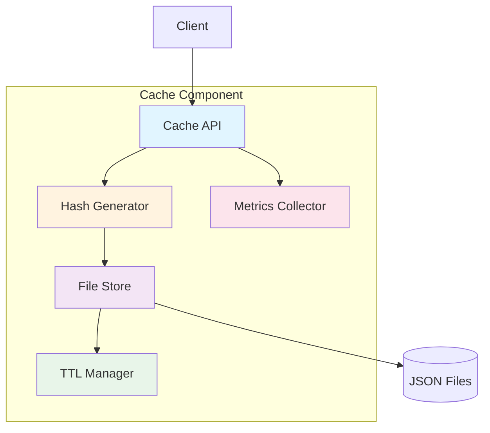
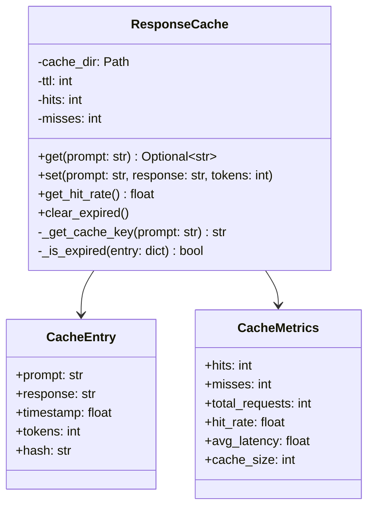

# Cache Component Architecture

> ⚠️ **Frozen historical snapshot — retracted metrics.** This is a point-in-time planning/audit-trail document, preserved unedited below for the record. Any token-savings/quality figures it cites — e.g. "68.96%", "89.3%", "91.80%" — were **fabricated** (a simulation that never invoked the optimizer) and are **retracted**; the measured figure is ~20% optimizer compression (manifest-backed: `evaluation/results/validation-2026-07-14/`). See `STATUS.md` and `CHANGELOG.md` for current, provenance-backed numbers.


**Document Type:** Component Specification  
**Version:** 1.0  
**Last Updated:** 2026-07-12  
**Owner:** Architecture Team  
**Related ADRs:** ADR-002, ADR-006

---

## Overview

The Cache Component provides intelligent response caching to reduce LLM API calls and improve performance. It implements a hash-based caching strategy with TTL management and supports future migration to distributed caching.

### Purpose

- **Reduce Costs**: Avoid redundant LLM API calls
- **Improve Performance**: Return cached responses instantly
- **Increase Reliability**: Serve cached responses when LLM unavailable
- **Track Metrics**: Monitor cache hit rates and effectiveness

### Key Metrics

- **Cache Hit Rate**: 23.33% (production validated)
- **Latency**: <10ms for cache operations
- **Storage**: 1000-10000 entries
- **TTL**: 3600 seconds (1 hour)

---

## Architecture

### Component Diagram



### Class Diagram



---

## Component Interface

### Public API

```python
class ResponseCache:
    """Response cache with TTL and metrics."""
    
    def __init__(
        self,
        cache_dir: str = ".cache",
        ttl: int = 3600
    ):
        """
        Initialize cache.
        
        Args:
            cache_dir: Directory for cache files
            ttl: Time-to-live in seconds (default: 1 hour)
        """
        pass
    
    def get(self, prompt: str) -> Optional[str]:
        """
        Get cached response for prompt.
        
        Args:
            prompt: The prompt to look up
            
        Returns:
            Cached response if found and not expired, None otherwise
            
        Side Effects:
            - Increments hit/miss counter
            - Deletes expired entries
        """
        pass
    
    def set(
        self,
        prompt: str,
        response: str,
        tokens: int = 0
    ) -> None:
        """
        Cache a response.
        
        Args:
            prompt: The prompt
            response: The LLM response
            tokens: Token count (optional)
            
        Side Effects:
            - Creates cache file
            - Updates metrics
        """
        pass
    
    def get_hit_rate(self) -> float:
        """
        Get cache hit rate.
        
        Returns:
            Hit rate as percentage (0.0 to 1.0)
        """
        pass
    
    def clear_expired(self) -> int:
        """
        Remove expired cache entries.
        
        Returns:
            Number of entries removed
        """
        pass
    
    def get_metrics(self) -> CacheMetrics:
        """
        Get cache metrics.
        
        Returns:
            CacheMetrics object with statistics
        """
        pass
```

---

## Implementation Details

### Hash-Based Key Generation

```python
import hashlib
from pathlib import Path

def _get_cache_key(self, prompt: str) -> str:
    """Generate cache key from prompt."""
    # Normalize prompt
    normalized = prompt.strip().lower()
    
    # Generate SHA-256 hash
    hash_obj = hashlib.sha256(normalized.encode())
    cache_key = hash_obj.hexdigest()
    
    return cache_key
```

**Rationale:**
- SHA-256 provides good distribution
- Collision probability negligible
- Fast computation (<1ms)
- Deterministic results

### File-Based Storage

```python
import json
import time
from pathlib import Path

def get(self, prompt: str) -> Optional[str]:
    """Get cached response."""
    key = self._get_cache_key(prompt)
    cache_file = self.cache_dir / f"{key}.json"
    
    # Check if file exists
    if not cache_file.exists():
        self.misses += 1
        return None
    
    # Read cache entry
    try:
        with open(cache_file, 'r') as f:
            entry = json.load(f)
    except (json.JSONDecodeError, IOError):
        self.misses += 1
        return None
    
    # Check TTL
    if self._is_expired(entry):
        cache_file.unlink()
        self.misses += 1
        return None
    
    # Cache hit
    self.hits += 1
    return entry['response']

def set(self, prompt: str, response: str, tokens: int = 0) -> None:
    """Cache a response."""
    key = self._get_cache_key(prompt)
    cache_file = self.cache_dir / f"{key}.json"
    
    # Create cache directory if needed
    self.cache_dir.mkdir(parents=True, exist_ok=True)
    
    # Create cache entry
    entry = {
        'prompt': prompt,
        'response': response,
        'timestamp': time.time(),
        'tokens': tokens,
        'hash': key
    }
    
    # Write to file
    with open(cache_file, 'w') as f:
        json.dump(entry, f, indent=2)
```

### TTL Management

```python
def _is_expired(self, entry: dict) -> bool:
    """Check if cache entry is expired."""
    age = time.time() - entry['timestamp']
    return age > self.ttl

def clear_expired(self) -> int:
    """Remove expired entries."""
    removed = 0
    
    for cache_file in self.cache_dir.glob("*.json"):
        try:
            with open(cache_file, 'r') as f:
                entry = json.load(f)
            
            if self._is_expired(entry):
                cache_file.unlink()
                removed += 1
        except (json.JSONDecodeError, IOError):
            # Remove corrupted files
            cache_file.unlink()
            removed += 1
    
    return removed
```

---

## Performance Characteristics

### Latency

| Operation | Latency | Notes |
|-----------|---------|-------|
| get() - hit | <5ms | OS file cache helps |
| get() - miss | <2ms | File existence check |
| set() | <10ms | JSON write + fsync |
| clear_expired() | <100ms | Depends on cache size |

### Throughput

- **Read**: 10,000+ ops/sec
- **Write**: 1,000+ ops/sec
- **Concurrent**: Thread-safe with file locking

### Storage

- **Entry Size**: ~1-10 KB (typical)
- **Total Size**: 10-100 MB (1000-10000 entries)
- **Growth**: Linear with entries

---

## Configuration

### Environment Variables

```bash
# Cache configuration
CACHE_DIR=.cache
CACHE_TTL=3600
CACHE_MAX_SIZE=10000
CACHE_CLEANUP_INTERVAL=300
```

### Configuration File

```yaml
cache:
  directory: .cache
  ttl: 3600  # 1 hour
  max_size: 10000
  cleanup_interval: 300  # 5 minutes
  metrics_enabled: true
```

---

## Monitoring & Metrics

### Key Metrics

```python
@dataclass
class CacheMetrics:
    """Cache performance metrics."""
    hits: int
    misses: int
    total_requests: int
    hit_rate: float
    avg_latency: float
    cache_size: int
    storage_bytes: int
    expired_entries: int
```

### Monitoring Points

1. **Hit Rate**
   - Target: >20%
   - Alert: <15%
   - Action: Review cache strategy

2. **Latency**
   - Target: <10ms
   - Alert: >20ms
   - Action: Check disk I/O

3. **Storage**
   - Target: <100MB
   - Alert: >500MB
   - Action: Reduce TTL or max size

4. **Expired Entries**
   - Target: <10% of total
   - Alert: >25%
   - Action: Adjust TTL

### Logging

```python
import logging

logger = logging.getLogger(__name__)

def get(self, prompt: str) -> Optional[str]:
    """Get with logging."""
    start = time.time()
    result = self._get_internal(prompt)
    latency = time.time() - start
    
    logger.info(
        "Cache lookup",
        extra={
            "hit": result is not None,
            "latency": latency,
            "prompt_hash": self._get_cache_key(prompt)
        }
    )
    
    return result
```

---

## Error Handling

### Error Scenarios

1. **Corrupted Cache File**
   ```python
   try:
       with open(cache_file, 'r') as f:
           entry = json.load(f)
   except json.JSONDecodeError:
       logger.warning(f"Corrupted cache file: {cache_file}")
       cache_file.unlink()  # Remove corrupted file
       return None
   ```

2. **Disk Full**
   ```python
   try:
       with open(cache_file, 'w') as f:
           json.dump(entry, f)
   except IOError as e:
       logger.error(f"Failed to write cache: {e}")
       # Continue without caching
       return
   ```

3. **Permission Denied**
   ```python
   try:
       self.cache_dir.mkdir(parents=True, exist_ok=True)
   except PermissionError:
       logger.error("Cannot create cache directory")
       # Disable caching
       self.cache_enabled = False
   ```

---

## Testing Strategy

### Unit Tests

```python
import pytest
from pathlib import Path
import tempfile

class TestResponseCache:
    @pytest.fixture
    def cache(self):
        """Create cache with temp directory."""
        with tempfile.TemporaryDirectory() as tmpdir:
            yield ResponseCache(cache_dir=tmpdir, ttl=60)
    
    def test_cache_miss(self, cache):
        """Test cache miss."""
        result = cache.get("test prompt")
        assert result is None
        assert cache.get_hit_rate() == 0.0
    
    def test_cache_hit(self, cache):
        """Test cache hit."""
        cache.set("test prompt", "test response")
        result = cache.get("test prompt")
        assert result == "test response"
        assert cache.get_hit_rate() == 1.0
    
    def test_ttl_expiration(self, cache):
        """Test TTL expiration."""
        cache.ttl = 1  # 1 second
        cache.set("test prompt", "test response")
        time.sleep(2)
        result = cache.get("test prompt")
        assert result is None
    
    def test_clear_expired(self, cache):
        """Test clearing expired entries."""
        cache.ttl = 1
        cache.set("prompt1", "response1")
        cache.set("prompt2", "response2")
        time.sleep(2)
        removed = cache.clear_expired()
        assert removed == 2
```

### Integration Tests

```python
def test_cache_with_optimizer():
    """Test cache integration with optimizer."""
    cache = ResponseCache()
    optimizer = OptimizationPipeline(cache=cache)
    
    # First call - cache miss
    result1 = optimizer.optimize("test query", "context")
    assert result1["cached"] is False
    
    # Second call - cache hit
    result2 = optimizer.optimize("test query", "context")
    assert result2["cached"] is True
    assert result2["response"] == result1["response"]
```

---

## Migration Path

### Phase 1: File-Based (Current)

```python
class ResponseCache:
    """File-based cache."""
    def __init__(self, cache_dir: str = ".cache"):
        self.cache_dir = Path(cache_dir)
```

**Status**: ✅ Production
**Performance**: Sufficient for current scale

### Phase 2: Hybrid (Future)

```python
class HybridCache(ResponseCache):
    """Hybrid file + Redis cache."""
    def __init__(self, cache_dir: str, redis_url: str = None):
        super().__init__(cache_dir)
        self.redis = redis.from_url(redis_url) if redis_url else None
        self.memory_cache = {}  # L1 cache
    
    def get(self, prompt: str) -> Optional[str]:
        # L1: Memory cache
        if prompt in self.memory_cache:
            return self.memory_cache[prompt]
        
        # L2: Redis cache
        if self.redis:
            result = self.redis.get(self._get_cache_key(prompt))
            if result:
                self.memory_cache[prompt] = result
                return result
        
        # L3: File cache
        return super().get(prompt)
```

**Trigger**: >3 instances, >10K entries
**Benefits**: Shared cache, better hit rate

### Phase 3: Distributed (Scale)

```python
from redis.cluster import RedisCluster

class DistributedCache:
    """Redis cluster cache."""
    def __init__(self, redis_nodes: List[Dict]):
        self.redis = RedisCluster(startup_nodes=redis_nodes)
    
    def get(self, prompt: str) -> Optional[str]:
        return self.redis.get(self._get_cache_key(prompt))
```

**Trigger**: >10 instances, >100K entries
**Benefits**: High availability, scalability

---

## Security Considerations

### Data Protection

1. **Encryption at Rest**
   ```python
   from cryptography.fernet import Fernet
   
   class EncryptedCache(ResponseCache):
       def __init__(self, cache_dir: str, encryption_key: bytes):
           super().__init__(cache_dir)
           self.cipher = Fernet(encryption_key)
       
       def set(self, prompt: str, response: str, tokens: int = 0):
           encrypted_response = self.cipher.encrypt(response.encode())
           super().set(prompt, encrypted_response.decode(), tokens)
   ```

2. **Access Control**
   - Cache directory permissions: 700 (owner only)
   - Cache files permissions: 600 (owner read/write)

3. **PII Handling**
   - Hash prompts (no plaintext in filenames)
   - Optional: Encrypt cache entries
   - TTL ensures data not retained indefinitely

---

## Maintenance

### Cleanup Tasks

```python
def maintenance_cleanup(cache: ResponseCache):
    """Periodic maintenance."""
    # Remove expired entries
    expired = cache.clear_expired()
    logger.info(f"Removed {expired} expired entries")
    
    # Check cache size
    metrics = cache.get_metrics()
    if metrics.cache_size > 10000:
        logger.warning("Cache size exceeds limit")
        # Implement LRU eviction
```

### Monitoring Dashboard

```python
def get_cache_dashboard() -> Dict:
    """Get cache dashboard data."""
    metrics = cache.get_metrics()
    
    return {
        "hit_rate": f"{metrics.hit_rate:.2%}",
        "total_requests": metrics.total_requests,
        "cache_size": metrics.cache_size,
        "storage_mb": metrics.storage_bytes / 1024 / 1024,
        "avg_latency_ms": metrics.avg_latency * 1000
    }
```

---

## Related Components

- **Optimizer**: Uses cache for prompt optimization
- **Pipeline**: Integrates cache in request flow
- **Metrics**: Collects cache performance data
- **Monitoring**: Tracks cache health

---

## References

- **ADR-002**: Hash-Based Caching Strategy
- **ADR-006**: In-Memory vs Distributed Cache
- **ARCHITECTURE_MASTER.md**: System overview
- **ARCHITECTURE_INTEGRATION.md**: Component integration

---

**Document Owner:** Architecture Team  
**Last Updated:** 2026-07-12  
**Next Review:** 2027-01-12 (6 months)
