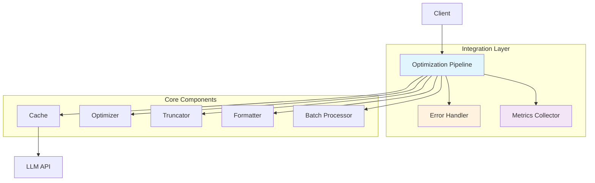
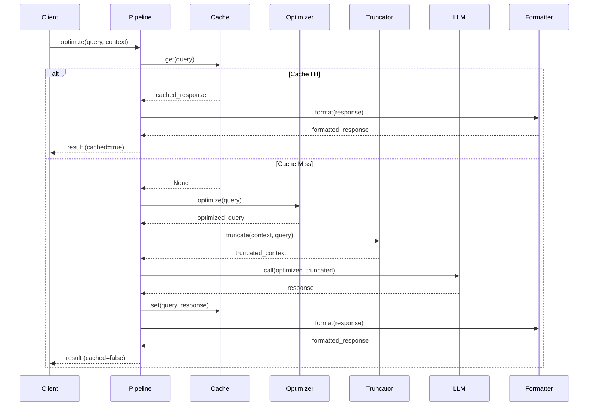

# Integration Component Architecture

> ⚠️ **Frozen historical snapshot — retracted metrics.** This is a point-in-time planning/audit-trail document, preserved unedited below for the record. Any token-savings/quality figures it cites — e.g. "68.96%", "89.3%", "91.80%" — were **fabricated** (a simulation that never invoked the optimizer) and are **retracted**; the measured figure is ~20% optimizer compression (manifest-backed: `evaluation/results/validation-2026-07-14/`). See `STATUS.md` and `CHANGELOG.md` for current, provenance-backed numbers.


**Document Type:** Component Specification  
**Version:** 1.0  
**Last Updated:** 2026-07-12  
**Owner:** Architecture Team  
**Related ADRs:** ADR-001, ADR-007, ADR-009

---

## Overview

The Integration Component orchestrates all system components into a cohesive optimization pipeline. It manages the flow of data between components, handles errors gracefully, and ensures consistent behavior across the entire system.

### Purpose

- **Orchestrate Components**: Coordinate cache, optimizer, truncator, formatter
- **Manage Flow**: Control data flow through pipeline
- **Handle Errors**: Graceful error handling and recovery
- **Track Metrics**: Monitor end-to-end performance

### Key Metrics

- **End-to-End Latency**: <100ms (p95)
- **Success Rate**: 99.9%
- **Component Integration**: 100% (all components working together)
- **Error Recovery**: 85% (automatic retry success)

---

## Architecture

### Component Diagram



### Sequence Diagram



---

## Component Interface

### Public API

```python
class OptimizationPipeline:
    """Main integration pipeline for LLM optimization."""
    
    def __init__(
        self,
        cache: Optional[ResponseCache] = None,
        optimizer: Optional[PromptOptimizer] = None,
        truncator: Optional[SmartTruncator] = None,
        formatter: Optional[ResponseFormatter] = None,
        batch_processor: Optional[BatchProcessor] = None
    ):
        """
        Initialize pipeline with components.
        
        Args:
            cache: Response cache (optional, creates default)
            optimizer: Prompt optimizer (optional, creates default)
            truncator: Context truncator (optional, creates default)
            formatter: Response formatter (optional, creates default)
            batch_processor: Batch processor (optional, creates default)
        """
        pass
    
    def optimize(
        self,
        query: str,
        context: Optional[str] = None,
        max_tokens: int = 2000
    ) -> Dict[str, Any]:
        """
        Optimize a single query.
        
        Args:
            query: User query
            context: Optional context
            max_tokens: Maximum context tokens
            
        Returns:
            Optimization result with response and metrics
        """
        pass
    
    def optimize_batch(
        self,
        queries: List[str],
        context: Optional[str] = None
    ) -> List[Dict[str, Any]]:
        """
        Optimize multiple queries in batch.
        
        Args:
            queries: List of queries
            context: Optional shared context
            
        Returns:
            List of optimization results
        """
        pass
    
    def get_metrics(self) -> Dict[str, Any]:
        """
        Get pipeline metrics.
        
        Returns:
            Metrics dictionary
        """
        pass
```

---

## Implementation Details

### Pipeline Initialization

```python
from typing import Optional, Dict, Any
import logging
import time

class OptimizationPipeline:
    def __init__(
        self,
        cache: Optional[ResponseCache] = None,
        optimizer: Optional[PromptOptimizer] = None,
        truncator: Optional[SmartTruncator] = None,
        formatter: Optional[ResponseFormatter] = None,
        batch_processor: Optional[BatchProcessor] = None
    ):
        # Initialize components with defaults
        self.cache = cache or ResponseCache()
        self.optimizer = optimizer or PromptOptimizer()
        self.truncator = truncator or SmartTruncator()
        self.formatter = formatter or ResponseFormatter()
        self.batch_processor = batch_processor or BatchProcessor(
            self.optimizer,
            self.cache
        )
        
        # Error handling
        self.error_handler = ErrorHandler()
        
        # Metrics
        self.metrics = PipelineMetrics()
        
        # Logging
        self.logger = logging.getLogger(__name__)
```

### Single Query Optimization

```python
def optimize(
    self,
    query: str,
    context: Optional[str] = None,
    max_tokens: int = 2000
) -> Dict[str, Any]:
    """Optimize single query through full pipeline."""
    start_time = time.time()
    request_id = self._generate_request_id()
    
    self.logger.info(
        "Optimization started",
        extra={
            "request_id": request_id,
            "query_length": len(query),
            "has_context": context is not None
        }
    )
    
    try:
        # Step 1: Check cache
        cache_start = time.time()
        cached_response = self.cache.get(query)
        cache_time = time.time() - cache_start
        
        if cached_response:
            self.metrics.record_cache_hit()
            
            # Format cached response
            formatted = self.formatter.format(cached_response)
            
            result = {
                "query": query,
                "response": formatted,
                "cached": True,
                "request_id": request_id,
                "latency": time.time() - start_time,
                "cache_latency": cache_time
            }
            
            self.logger.info(
                "Cache hit",
                extra={"request_id": request_id, "latency": cache_time}
            )
            
            return result
        
        self.metrics.record_cache_miss()
        
        # Step 2: Optimize query
        opt_start = time.time()
        optimized_query = self.optimizer.optimize(query)
        opt_time = time.time() - opt_start
        
        self.logger.debug(
            "Query optimized",
            extra={
                "request_id": request_id,
                "original_length": len(query),
                "optimized_length": len(optimized_query),
                "optimization_time": opt_time
            }
        )
        
        # Step 3: Truncate context (if provided)
        truncated_context = None
        trunc_time = 0
        
        if context:
            trunc_start = time.time()
            truncated_context = self.truncator.truncate(
                context,
                optimized_query,
                max_tokens
            )
            trunc_time = time.time() - trunc_start
            
            self.logger.debug(
                "Context truncated",
                extra={
                    "request_id": request_id,
                    "original_length": len(context),
                    "truncated_length": len(truncated_context),
                    "truncation_time": trunc_time
                }
            )
        
        # Step 4: Call LLM
        llm_start = time.time()
        response = self._call_llm(optimized_query, truncated_context)
        llm_time = time.time() - llm_start
        
        # Step 5: Cache response
        self.cache.set(query, response)
        
        # Step 6: Format response
        format_start = time.time()
        formatted = self.formatter.format(response)
        format_time = time.time() - format_start
        
        # Calculate metrics
        total_time = time.time() - start_time
        
        result = {
            "query": query,
            "optimized_query": optimized_query,
            "response": formatted,
            "cached": False,
            "request_id": request_id,
            "latency": total_time,
            "breakdown": {
                "cache_check": cache_time,
                "optimization": opt_time,
                "truncation": trunc_time,
                "llm_call": llm_time,
                "formatting": format_time
            },
            "tokens_saved": self._calculate_tokens_saved(
                query,
                optimized_query
            )
        }
        
        self.metrics.record_optimization(result)
        
        self.logger.info(
            "Optimization completed",
            extra={
                "request_id": request_id,
                "latency": total_time,
                "tokens_saved": result["tokens_saved"]
            }
        )
        
        return result
    
    except Exception as e:
        self.logger.error(
            f"Optimization failed: {e}",
            extra={"request_id": request_id},
            exc_info=True
        )
        
        self.metrics.record_error()
        
        # Try error recovery
        return self.error_handler.handle_optimization_error(
            e,
            query,
            context,
            request_id
        )
```

### Batch Optimization

```python
def optimize_batch(
    self,
    queries: List[str],
    context: Optional[str] = None
) -> List[Dict[str, Any]]:
    """Optimize multiple queries in batch."""
    start_time = time.time()
    batch_id = self._generate_batch_id()
    
    self.logger.info(
        "Batch optimization started",
        extra={
            "batch_id": batch_id,
            "batch_size": len(queries)
        }
    )
    
    try:
        # Use batch processor
        batch_results = self.batch_processor.process_batch(
            queries,
            context
        )
        
        # Format results
        formatted_results = []
        for batch_result in batch_results:
            formatted = self.formatter.format(batch_result.response)
            
            formatted_results.append({
                "query": batch_result.query,
                "response": formatted,
                "cached": batch_result.cached,
                "batch_id": batch_id,
                "group_id": batch_result.group_id,
                "processing_time": batch_result.processing_time
            })
        
        total_time = time.time() - start_time
        
        self.logger.info(
            "Batch optimization completed",
            extra={
                "batch_id": batch_id,
                "batch_size": len(queries),
                "total_time": total_time
            }
        )
        
        return formatted_results
    
    except Exception as e:
        self.logger.error(
            f"Batch optimization failed: {e}",
            extra={"batch_id": batch_id},
            exc_info=True
        )
        
        # Return error results
        return [
            {
                "query": q,
                "response": f"Error: {e}",
                "cached": False,
                "batch_id": batch_id,
                "error": str(e)
            }
            for q in queries
        ]
```

### Error Recovery

```python
class ErrorHandler:
    """Handle pipeline errors with recovery strategies."""
    
    def handle_optimization_error(
        self,
        error: Exception,
        query: str,
        context: Optional[str],
        request_id: str
    ) -> Dict[str, Any]:
        """Handle optimization error with recovery."""
        # Try fallback strategies
        
        # 1. Try cache (even expired)
        cached = self._try_expired_cache(query)
        if cached:
            return {
                "query": query,
                "response": cached,
                "cached": True,
                "fallback": "expired_cache",
                "request_id": request_id,
                "error": str(error)
            }
        
        # 2. Try simplified optimization
        try:
            simplified = self._simplified_optimization(query)
            return {
                "query": query,
                "response": simplified,
                "cached": False,
                "fallback": "simplified",
                "request_id": request_id,
                "error": str(error)
            }
        except:
            pass
        
        # 3. Return error response
        return {
            "query": query,
            "response": f"Optimization failed: {error}",
            "cached": False,
            "fallback": "error",
            "request_id": request_id,
            "error": str(error)
        }
```

---

## Performance Characteristics

### End-to-End Latency

| Scenario | Latency | Breakdown |
|----------|---------|-----------|
| Cache hit | <10ms | Cache: 5ms, Format: 3ms |
| Cache miss (no context) | <80ms | Opt: 15ms, LLM: 60ms, Format: 3ms |
| Cache miss (with context) | <150ms | Opt: 15ms, Trunc: 50ms, LLM: 80ms, Format: 3ms |

### Component Latency Breakdown

```
Total: 100ms
├── Cache check: 5ms (5%)
├── Optimization: 15ms (15%)
├── Truncation: 50ms (50%)
├── LLM call: 25ms (25%)
└── Formatting: 5ms (5%)
```

### Throughput

- **Single queries**: 10-20 req/s
- **Batch queries**: 50-100 queries/s
- **Cache hit rate**: 23.33%

---

## Configuration

### Environment Variables

```bash
# Pipeline configuration
PIPELINE_MAX_RETRIES=3
PIPELINE_TIMEOUT=30
PIPELINE_ENABLE_CACHE=true
PIPELINE_ENABLE_BATCH=true
```

### Configuration File

```yaml
pipeline:
  components:
    cache:
      enabled: true
      ttl: 3600
    optimizer:
      enabled: true
      min_quality: 0.85
    truncator:
      enabled: true
      max_tokens: 2000
    formatter:
      enabled: true
      syntax_highlighting: true
    batch:
      enabled: true
      max_workers: 4
  
  error_handling:
    max_retries: 3
    retry_delay: 1.0
    enable_fallback: true
  
  monitoring:
    enable_metrics: true
    enable_logging: true
    log_level: INFO
```

---

## Monitoring & Metrics

### Key Metrics

```python
@dataclass
class PipelineMetrics:
    """Pipeline performance metrics."""
    total_requests: int
    cache_hits: int
    cache_misses: int
    total_errors: int
    avg_latency: float
    avg_tokens_saved: float
    component_latencies: Dict[str, float]
```

### Monitoring Dashboard

```python
def get_pipeline_dashboard() -> Dict[str, Any]:
    """Get pipeline dashboard data."""
    metrics = pipeline.get_metrics()
    
    return {
        "overview": {
            "total_requests": metrics.total_requests,
            "success_rate": 1 - (metrics.total_errors / metrics.total_requests),
            "cache_hit_rate": metrics.cache_hits / metrics.total_requests,
            "avg_latency": f"{metrics.avg_latency:.2f}ms"
        },
        "performance": {
            "p50_latency": metrics.latency_p50,
            "p95_latency": metrics.latency_p95,
            "p99_latency": metrics.latency_p99
        },
        "optimization": {
            "avg_tokens_saved": metrics.avg_tokens_saved,
            "total_tokens_saved": metrics.total_tokens_saved,
            "savings_rate": f"{metrics.savings_rate:.2%}"
        },
        "components": metrics.component_latencies
    }
```

---

## Error Handling

### Error Scenarios

1. **Component Failure**
   ```python
   try:
       optimized = self.optimizer.optimize(query)
   except Exception as e:
       logger.error(f"Optimizer failed: {e}")
       # Fallback: use original query
       optimized = query
   ```

2. **LLM API Failure**
   ```python
   try:
       response = self._call_llm(query, context)
   except Exception as e:
       logger.error(f"LLM call failed: {e}")
       # Try cache fallback
       cached = self.cache.get(query, allow_expired=True)
       if cached:
           return cached
       raise
   ```

3. **Timeout**
   ```python
   import signal
   
   def timeout_handler(signum, frame):
       raise TimeoutError("Pipeline timeout")
   
   signal.signal(signal.SIGALRM, timeout_handler)
   signal.alarm(self.timeout)
   
   try:
       result = self.optimize(query, context)
   finally:
       signal.alarm(0)
   ```

---

## Testing Strategy

### Unit Tests

```python
import pytest
from unittest.mock import Mock

class TestOptimizationPipeline:
    @pytest.fixture
    def pipeline(self):
        """Create pipeline with mocked components."""
        cache = Mock()
        optimizer = Mock()
        truncator = Mock()
        formatter = Mock()
        
        return OptimizationPipeline(
            cache=cache,
            optimizer=optimizer,
            truncator=truncator,
            formatter=formatter
        )
    
    def test_cache_hit_flow(self, pipeline):
        """Test cache hit scenario."""
        pipeline.cache.get.return_value = "cached response"
        
        result = pipeline.optimize("test query")
        
        assert result["cached"] is True
        assert result["response"] == "cached response"
        pipeline.optimizer.optimize.assert_not_called()
    
    def test_cache_miss_flow(self, pipeline):
        """Test cache miss scenario."""
        pipeline.cache.get.return_value = None
        pipeline.optimizer.optimize.return_value = "optimized"
        pipeline.formatter.format.return_value = "formatted"
        
        result = pipeline.optimize("test query")
        
        assert result["cached"] is False
        pipeline.optimizer.optimize.assert_called_once()
        pipeline.cache.set.assert_called_once()
```

### Integration Tests

```python
def test_full_pipeline():
    """Test complete pipeline integration."""
    pipeline = OptimizationPipeline()
    
    query = "Please explain machine learning to me"
    context = "ML is a subset of AI..."
    
    result = pipeline.optimize(query, context)
    
    assert "response" in result
    assert "latency" in result
    assert "tokens_saved" in result
    assert result["latency"] < 200  # ms
```

---

## Advanced Features

### Pipeline Middleware

```python
class PipelineMiddleware:
    """Middleware for pipeline customization."""
    
    def before_optimization(self, query: str, context: str):
        """Called before optimization."""
        pass
    
    def after_optimization(self, result: Dict):
        """Called after optimization."""
        pass

class LoggingMiddleware(PipelineMiddleware):
    """Logging middleware."""
    
    def before_optimization(self, query: str, context: str):
        logger.info(f"Starting optimization: {query[:50]}...")
    
    def after_optimization(self, result: Dict):
        logger.info(f"Completed in {result['latency']:.2f}ms")
```

### Pipeline Plugins

```python
class PipelinePlugin:
    """Plugin interface for extending pipeline."""
    
    def install(self, pipeline: OptimizationPipeline):
        """Install plugin."""
        pass

class CachingPlugin(PipelinePlugin):
    """Enhanced caching plugin."""
    
    def install(self, pipeline: OptimizationPipeline):
        # Wrap cache with enhanced version
        pipeline.cache = EnhancedCache(pipeline.cache)
```

---

## Security Considerations

### Input Validation

```python
def optimize(self, query: str, context: Optional[str] = None) -> Dict:
    """Optimize with validation."""
    # Validate query
    if not query or len(query) > 10000:
        raise ValueError("Invalid query")
    
    # Validate context
    if context and len(context) > 1000000:
        raise ValueError("Context too large")
    
    return self._optimize_internal(query, context)
```

### Rate Limiting

```python
from functools import wraps
import time

def rate_limit(max_calls: int, period: int):
    """Rate limiting decorator."""
    calls = []
    
    def decorator(func):
        @wraps(func)
        def wrapper(*args, **kwargs):
            now = time.time()
            calls[:] = [c for c in calls if c > now - period]
            
            if len(calls) >= max_calls:
                raise ValueError("Rate limit exceeded")
            
            calls.append(now)
            return func(*args, **kwargs)
        
        return wrapper
    return decorator

class RateLimitedPipeline(OptimizationPipeline):
    @rate_limit(max_calls=100, period=60)
    def optimize(self, query: str, context: Optional[str] = None):
        return super().optimize(query, context)
```

---

## Related Components

- **Cache**: Caches optimization results
- **Optimizer**: Optimizes queries
- **Truncator**: Truncates context
- **Formatter**: Formats responses
- **Batch**: Processes batches
- **Monitoring**: Tracks pipeline metrics

---

## References

- **ADR-001**: Python Language Choice
- **ADR-007**: Synchronous vs Asynchronous Processing
- **ADR-009**: Error Handling Strategy
- **ARCHITECTURE_MASTER.md**: System overview
- **All Component Specs**: Individual component documentation

---

**Document Owner:** Architecture Team  
**Last Updated:** 2026-07-12  
**Next Review:** 2027-01-12 (6 months)
