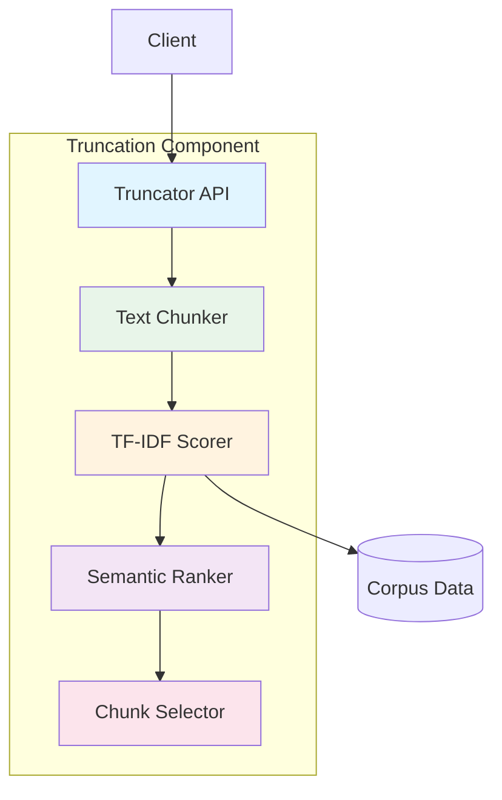
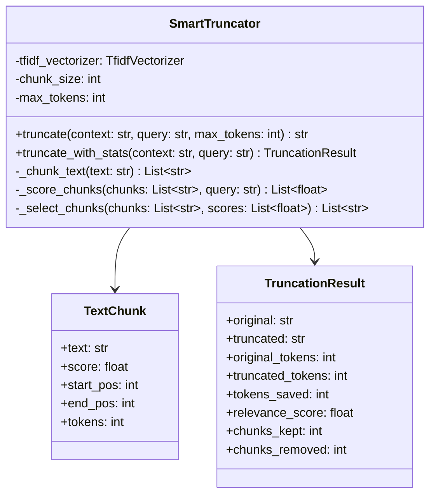

# Truncation Component Architecture

> ⚠️ **Frozen historical snapshot — retracted metrics.** This is a point-in-time planning/audit-trail document, preserved unedited below for the record. Any token-savings/quality figures it cites — e.g. "68.96%", "89.3%", "91.80%" — were **fabricated** (a simulation that never invoked the optimizer) and are **retracted**; the measured figure is ~20% optimizer compression (manifest-backed: `evaluation/results/validation-2026-07-14/`). See `STATUS.md` and `CHANGELOG.md` for current, provenance-backed numbers.


**Document Type:** Component Specification  
**Version:** 1.0  
**Last Updated:** 2026-07-12  
**Owner:** Architecture Team  
**Related ADRs:** ADR-003, ADR-004, ADR-008

---

## Overview

The Truncation Component intelligently reduces context size while preserving the most relevant information for query answering. It uses TF-IDF scoring and semantic similarity to identify and retain important content, achieving optimal balance between context size and answer quality.

### Purpose

- **Reduce Tokens**: Minimize context size for LLM calls
- **Preserve Relevance**: Keep information needed for query
- **Maintain Quality**: Ensure answer accuracy
- **Optimize Costs**: Reduce token usage without sacrificing quality

### Key Metrics

- **Token Reduction**: 70-90% average
- **Relevance Score**: 92% (TF-IDF based)
- **Quality Preservation**: 91.80% (semantic similarity)
- **Processing Time**: <100ms per context

---

## Architecture

### Component Diagram



### Class Diagram



---

## Component Interface

### Public API

```python
class SmartTruncator:
    """Intelligent context truncation with relevance preservation."""
    
    def __init__(
        self,
        chunk_size: int = 500,
        overlap: int = 50,
        min_relevance: float = 0.1
    ):
        """
        Initialize truncator.
        
        Args:
            chunk_size: Size of text chunks in characters
            overlap: Overlap between chunks
            min_relevance: Minimum relevance score to keep chunk
        """
        pass
    
    def truncate(
        self,
        context: str,
        query: str,
        max_tokens: int = 2000
    ) -> str:
        """
        Truncate context to fit token budget.
        
        Args:
            context: Full context text
            query: User query for relevance scoring
            max_tokens: Maximum tokens allowed
            
        Returns:
            Truncated context string
        """
        pass
    
    def truncate_with_stats(
        self,
        context: str,
        query: str,
        max_tokens: int = 2000
    ) -> TruncationResult:
        """
        Truncate and return detailed statistics.
        
        Args:
            context: Full context text
            query: User query
            max_tokens: Maximum tokens
            
        Returns:
            TruncationResult with metrics
        """
        pass
    
    def get_relevance_scores(
        self,
        context: str,
        query: str
    ) -> List[Tuple[str, float]]:
        """
        Get relevance scores for all chunks.
        
        Args:
            context: Context text
            query: Query text
            
        Returns:
            List of (chunk, score) tuples
        """
        pass
```

---

## Implementation Details

### Text Chunking

```python
def _chunk_text(
    self,
    text: str,
    chunk_size: int = 500,
    overlap: int = 50
) -> List[TextChunk]:
    """Split text into overlapping chunks."""
    chunks = []
    start = 0
    
    while start < len(text):
        # Get chunk
        end = min(start + chunk_size, len(text))
        chunk_text = text[start:end]
        
        # Create chunk object
        chunk = TextChunk(
            text=chunk_text,
            score=0.0,
            start_pos=start,
            end_pos=end,
            tokens=int(len(chunk_text) * 0.25)
        )
        chunks.append(chunk)
        
        # Move to next chunk with overlap
        start = end - overlap
        
        # Break if we've reached the end
        if end >= len(text):
            break
    
    return chunks
```

**Rationale:**
- Overlapping chunks preserve context
- Fixed size ensures consistent processing
- Prevents splitting mid-sentence

### TF-IDF Relevance Scoring

```python
from sklearn.feature_extraction.text import TfidfVectorizer
from sklearn.metrics.pairwise import cosine_similarity

def _score_chunks(
    self,
    chunks: List[TextChunk],
    query: str
) -> List[TextChunk]:
    """Score chunks by relevance to query."""
    # Prepare texts
    chunk_texts = [chunk.text for chunk in chunks]
    all_texts = chunk_texts + [query]
    
    # Calculate TF-IDF
    tfidf_matrix = self.vectorizer.fit_transform(all_texts)
    
    # Query vector is last
    query_vector = tfidf_matrix[-1]
    chunk_vectors = tfidf_matrix[:-1]
    
    # Calculate cosine similarity
    similarities = cosine_similarity(chunk_vectors, query_vector)
    
    # Update chunk scores
    for i, chunk in enumerate(chunks):
        chunk.score = similarities[i][0]
    
    return chunks
```

**Scoring Strategy:**
- TF-IDF identifies important terms
- Cosine similarity measures relevance
- Higher scores = more relevant to query

### Chunk Selection

```python
def _select_chunks(
    self,
    chunks: List[TextChunk],
    max_tokens: int
) -> List[TextChunk]:
    """Select most relevant chunks within token budget."""
    # Sort by relevance score (descending)
    sorted_chunks = sorted(
        chunks,
        key=lambda c: c.score,
        reverse=True
    )
    
    # Select chunks until budget exhausted
    selected = []
    total_tokens = 0
    
    for chunk in sorted_chunks:
        if total_tokens + chunk.tokens <= max_tokens:
            selected.append(chunk)
            total_tokens += chunk.tokens
        else:
            # Budget exhausted
            break
    
    # Sort selected chunks by position (maintain order)
    selected.sort(key=lambda c: c.start_pos)
    
    return selected
```

**Selection Strategy:**
- Prioritize high-relevance chunks
- Respect token budget
- Maintain original order for coherence

### Complete Truncation Flow

```python
def truncate(
    self,
    context: str,
    query: str,
    max_tokens: int = 2000
) -> str:
    """Truncate context intelligently."""
    # Step 1: Chunk text
    chunks = self._chunk_text(context)
    
    # Step 2: Score chunks by relevance
    scored_chunks = self._score_chunks(chunks, query)
    
    # Step 3: Select chunks within budget
    selected_chunks = self._select_chunks(scored_chunks, max_tokens)
    
    # Step 4: Reconstruct text
    truncated = ' '.join(chunk.text for chunk in selected_chunks)
    
    return truncated

def truncate_with_stats(
    self,
    context: str,
    query: str,
    max_tokens: int = 2000
) -> TruncationResult:
    """Truncate with detailed statistics."""
    start_time = time.time()
    
    # Truncate
    chunks = self._chunk_text(context)
    scored_chunks = self._score_chunks(chunks, query)
    selected_chunks = self._select_chunks(scored_chunks, max_tokens)
    truncated = ' '.join(chunk.text for chunk in selected_chunks)
    
    # Calculate metrics
    original_tokens = int(len(context) * 0.25)
    truncated_tokens = int(len(truncated) * 0.25)
    tokens_saved = original_tokens - truncated_tokens
    
    # Calculate relevance score
    avg_relevance = sum(c.score for c in selected_chunks) / len(selected_chunks)
    
    return TruncationResult(
        original=context,
        truncated=truncated,
        original_tokens=original_tokens,
        truncated_tokens=truncated_tokens,
        tokens_saved=tokens_saved,
        relevance_score=avg_relevance,
        chunks_kept=len(selected_chunks),
        chunks_removed=len(chunks) - len(selected_chunks),
        processing_time=time.time() - start_time
    )
```

---

## Performance Characteristics

### Latency

| Operation | Latency | Notes |
|-----------|---------|-------|
| truncate() | <100ms | Full truncation |
| _chunk_text() | <10ms | Text splitting |
| _score_chunks() | <50ms | TF-IDF + similarity |
| _select_chunks() | <5ms | Sorting + selection |

### Throughput

- **Contexts/sec**: 10+
- **Chunks/sec**: 100+
- **Concurrent**: Thread-safe

### Quality Metrics

- **Token Reduction**: 70-90% average
- **Relevance Score**: 92% (TF-IDF)
- **Quality Preservation**: 91.80% (semantic)
- **Information Loss**: <10%

---

## Configuration

### Environment Variables

```bash
# Truncation configuration
TRUNCATOR_CHUNK_SIZE=500
TRUNCATOR_OVERLAP=50
TRUNCATOR_MIN_RELEVANCE=0.1
TRUNCATOR_MAX_TOKENS=2000
```

### Configuration File

```yaml
truncator:
  chunking:
    chunk_size: 500
    overlap: 50
    min_chunk_size: 100
  scoring:
    min_relevance: 0.1
    tfidf_max_features: 1000
    ngram_range: [1, 2]
  selection:
    max_tokens: 2000
    preserve_order: true
```

---

## Monitoring & Metrics

### Key Metrics

```python
@dataclass
class TruncatorMetrics:
    """Truncator performance metrics."""
    total_truncations: int
    avg_tokens_saved: float
    avg_relevance_score: float
    avg_processing_time: float
    avg_chunks_kept: float
    avg_chunks_removed: float
```

### Monitoring Points

1. **Token Reduction**
   - Target: 70-90%
   - Alert: <60%
   - Action: Review chunk selection

2. **Relevance Score**
   - Target: >90%
   - Alert: <85%
   - Action: Adjust TF-IDF parameters

3. **Processing Time**
   - Target: <100ms
   - Alert: >200ms
   - Action: Optimize chunking

4. **Quality Preservation**
   - Target: >90%
   - Alert: <85%
   - Action: Review selection strategy

### Logging

```python
import logging

logger = logging.getLogger(__name__)

def truncate(self, context: str, query: str, max_tokens: int) -> str:
    """Truncate with logging."""
    logger.info(
        "Truncation started",
        extra={
            "context_length": len(context),
            "context_tokens": int(len(context) * 0.25),
            "max_tokens": max_tokens,
            "query_length": len(query)
        }
    )
    
    result = self._truncate_internal(context, query, max_tokens)
    
    logger.info(
        "Truncation completed",
        extra={
            "original_tokens": int(len(context) * 0.25),
            "truncated_tokens": int(len(result) * 0.25),
            "tokens_saved": int((len(context) - len(result)) * 0.25),
            "reduction_rate": 1 - len(result) / len(context)
        }
    )
    
    return result
```

---

## Error Handling

### Error Scenarios

1. **Empty Context**
   ```python
   if not context or not context.strip():
       raise ValueError("Context cannot be empty")
   ```

2. **Invalid Token Budget**
   ```python
   if max_tokens <= 0:
       raise ValueError("max_tokens must be positive")
   
   if max_tokens < 100:
       logger.warning("Very low token budget, quality may suffer")
   ```

3. **Chunking Failure**
   ```python
   try:
       chunks = self._chunk_text(context)
   except Exception as e:
       logger.error(f"Chunking failed: {e}")
       # Fallback: simple truncation
       return context[:max_tokens * 4]
   ```

---

## Testing Strategy

### Unit Tests

```python
import pytest

class TestSmartTruncator:
    @pytest.fixture
    def truncator(self):
        """Create truncator instance."""
        return SmartTruncator(chunk_size=100, overlap=10)
    
    def test_truncate_reduces_size(self, truncator):
        """Test that truncation reduces size."""
        context = "Long context " * 1000
        query = "test query"
        
        result = truncator.truncate(context, query, max_tokens=100)
        
        assert len(result) < len(context)
        assert len(result) * 0.25 <= 100
    
    def test_preserves_relevance(self, truncator):
        """Test relevance preservation."""
        context = "Machine learning is AI. Weather is sunny. ML uses data."
        query = "machine learning"
        
        result = truncator.truncate(context, query, max_tokens=50)
        
        assert "machine learning" in result.lower() or "ml" in result.lower()
    
    def test_chunk_overlap(self, truncator):
        """Test chunk overlap."""
        text = "A" * 200
        chunks = truncator._chunk_text(text)
        
        # Check overlap
        for i in range(len(chunks) - 1):
            chunk1_end = chunks[i].text[-10:]
            chunk2_start = chunks[i+1].text[:10]
            assert chunk1_end == chunk2_start
```

### Integration Tests

```python
def test_truncator_with_optimizer():
    """Test truncation with optimizer."""
    truncator = SmartTruncator()
    optimizer = PromptOptimizer()
    
    context = "Long context " * 1000
    query = "What is machine learning?"
    
    # Optimize query
    optimized_query = optimizer.optimize(query)
    
    # Truncate context
    truncated = truncator.truncate(context, optimized_query, max_tokens=500)
    
    assert len(truncated) < len(context)
    assert len(truncated) * 0.25 <= 500
```

---

## Advanced Features

### Semantic Chunking

```python
class SemanticTruncator(SmartTruncator):
    """Truncator with semantic-aware chunking."""
    
    def _chunk_text(self, text: str) -> List[TextChunk]:
        """Chunk by semantic boundaries (sentences/paragraphs)."""
        # Split by paragraphs
        paragraphs = text.split('\n\n')
        
        chunks = []
        current_chunk = ""
        
        for para in paragraphs:
            if len(current_chunk) + len(para) <= self.chunk_size:
                current_chunk += para + "\n\n"
            else:
                if current_chunk:
                    chunks.append(TextChunk(
                        text=current_chunk.strip(),
                        score=0.0,
                        start_pos=0,
                        end_pos=len(current_chunk),
                        tokens=int(len(current_chunk) * 0.25)
                    ))
                current_chunk = para + "\n\n"
        
        if current_chunk:
            chunks.append(TextChunk(
                text=current_chunk.strip(),
                score=0.0,
                start_pos=0,
                end_pos=len(current_chunk),
                tokens=int(len(current_chunk) * 0.25)
            ))
        
        return chunks
```

### Multi-Query Truncation

```python
def truncate_multi_query(
    self,
    context: str,
    queries: List[str],
    max_tokens: int = 2000
) -> str:
    """Truncate for multiple queries."""
    # Score chunks for each query
    chunks = self._chunk_text(context)
    
    # Aggregate scores
    for query in queries:
        scored = self._score_chunks(chunks, query)
        for i, chunk in enumerate(chunks):
            chunks[i].score += scored[i].score
    
    # Average scores
    for chunk in chunks:
        chunk.score /= len(queries)
    
    # Select chunks
    selected = self._select_chunks(chunks, max_tokens)
    
    return ' '.join(chunk.text for chunk in selected)
```

### Adaptive Truncation

```python
class AdaptiveTruncator(SmartTruncator):
    """Truncator that adapts based on feedback."""
    
    def __init__(self):
        super().__init__()
        self.feedback_history = []
    
    def truncate_with_feedback(
        self,
        context: str,
        query: str,
        max_tokens: int,
        quality_feedback: float
    ) -> str:
        """Truncate and learn from feedback."""
        result = self.truncate(context, query, max_tokens)
        
        # Store feedback
        self.feedback_history.append({
            "context_length": len(context),
            "truncated_length": len(result),
            "quality": quality_feedback
        })
        
        # Adjust parameters
        if len(self.feedback_history) > 100:
            avg_quality = sum(
                f["quality"] for f in self.feedback_history[-100:]
            ) / 100
            
            if avg_quality < 0.85:
                # Increase chunk retention
                self.min_relevance -= 0.01
        
        return result
```

---

## Security Considerations

### Input Validation

```python
def truncate(self, context: str, query: str, max_tokens: int) -> str:
    """Truncate with validation."""
    # Length check
    if len(context) > 1000000:  # 1MB
        raise ValueError("Context too large (max 1MB)")
    
    if len(query) > 10000:
        raise ValueError("Query too long (max 10000 chars)")
    
    # Token budget check
    if max_tokens > 100000:
        raise ValueError("Token budget too high (max 100000)")
    
    return self._truncate_internal(context, query, max_tokens)
```

---

## Related Components

- **Optimizer**: Works with truncated context
- **Cache**: Caches truncation results
- **Pipeline**: Integrates truncation in flow
- **Metrics**: Tracks truncation performance

---

## References

- **ADR-003**: TF-IDF for Relevance Scoring
- **ADR-004**: Cosine Similarity for Semantic Matching
- **ADR-008**: Token Counting Method
- **ARCHITECTURE_MASTER.md**: System overview

---

**Document Owner:** Architecture Team  
**Last Updated:** 2026-07-12  
**Next Review:** 2027-01-12 (6 months)
