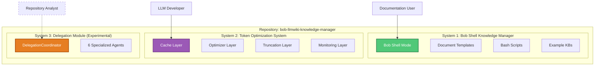
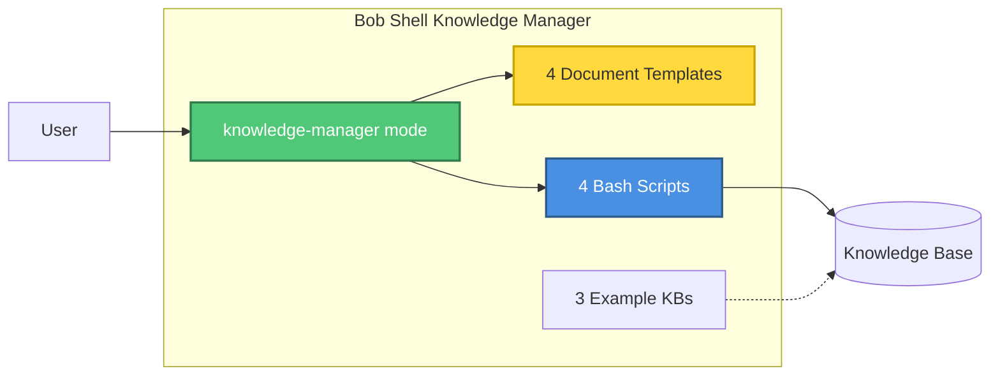
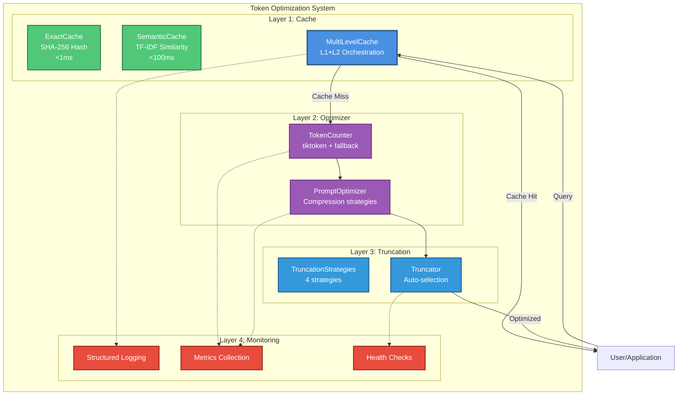

# Unified System Architecture

> **⚠️ SUPERSEDED / DEPRECATED (2026-07-14).** This document predates the Phase-4
> facade and no longer describes the running system — it still asserts the two
> systems are "NOT integrated" and cites ~49% coverage. The single authoritative
> architecture document is now [`ARCHITECTURE.md`](ARCHITECTURE.md). This file is
> kept as a point-in-time record; do not treat it as current.

**Document Type:** Master Architecture Reference (superseded)  
**Version:** 2.0  
**Last Updated:** July 13, 2026  
**Status:** DEPRECATED — superseded by [ARCHITECTURE.md](ARCHITECTURE.md)  
**Owner:** Architecture Team

---

## Executive Summary

This repository contains **TWO DISTINCT SYSTEMS** with different purposes, technologies, and complexity levels:

1. **Bob Shell Knowledge Manager** - Lightweight documentation framework (~500 lines)
2. **Token Optimization System** - Python-based LLM optimization framework (~3,500 lines)

**Critical Note:** These are separate systems that happen to share a repository. They are NOT integrated with each other.

---

## Table of Contents

1. [System Overview](#1-system-overview)
2. [Bob Shell Knowledge Manager](#2-bob-shell-knowledge-manager)
3. [Token Optimization System](#3-token-optimization-system)
4. [Repository Structure](#4-repository-structure)
5. [Development Guidelines](#5-development-guidelines)
6. [Documentation Map](#6-documentation-map)
7. [Deployment](#7-deployment)
8. [Appendices](#8-appendices)

---

## 1. System Overview

### 1.1 Dual System Architecture



### 1.2 System Comparison

| Aspect | Bob Shell KB Manager | Token Optimization System | Delegation Module |
|--------|---------------------|---------------------------|-------------------|
| **Purpose** | Documentation framework | LLM token optimization | Repository analysis |
| **Technology** | Bash, YAML, Markdown | Python 3.11+ | Python 3.11+ |
| **Complexity** | ~500 lines | ~3,500 lines | ~1,588 lines |
| **Status** | Stable (v1.0) | Beta (7/10) | Experimental (0% coverage) |
| **Tests** | 45 passing | 304 passing, 35 skipped | 0 (demo-only) |
| **Integration** | Standalone | Standalone | Not integrated |
| **Users** | Bob Shell users | LLM developers | Future (not ready) |

### 1.3 Why Two Systems?

**Historical Context:**
1. Started as Bob Shell Knowledge Manager (simple documentation tool)
2. Added Token Optimization System as separate research project
3. Both evolved independently in same repository
4. No technical integration between them

**Current State:**
- Shared repository, separate codebases
- Different documentation sets
- Different user bases
- Different maturity levels

---

## 2. Bob Shell Knowledge Manager

### 2.1 Overview

A lightweight knowledge management framework that provides structured documentation templates and workflows for Bob Shell.

**Purpose:** Organize and maintain knowledge bases using Bob Shell's native capabilities

### 2.2 Architecture



### 2.3 Components

#### Custom Bob Shell Mode

**File:** `config/custom_modes.yaml`

**Purpose:** Define knowledge-manager mode for Bob Shell

**Key Features:**
- Document creation workflows
- Cross-reference management
- Knowledge base organization
- Template-based documentation

#### Document Templates

**Location:** `config/templates/`

**Templates:**
1. **concept.md** - Core concepts and definitions
2. **guide.md** - How-to guides and tutorials
3. **reference.md** - API documentation and specifications
4. **research.md** - Research notes and findings

**Structure:**
- Frontmatter with metadata
- Standard sections
- Cross-reference placeholders
- Related documents section

#### Automation Scripts

**Location:** `scripts/`

**Scripts:**
1. **install.sh** - Install mode to Bob Shell
2. **init-project.sh** - Initialize KB in project
3. **validate-kb.sh** - Validate KB structure
4. **export-kb.sh** - Export to various formats

### 2.4 Knowledge Base Structure

When initialized in a project:

```
docs/knowledge-base/
├── INDEX.md              # Master index
├── concepts/             # Core concepts
├── guides/               # How-to guides
├── references/           # API docs
└── research/             # Research notes
```

### 2.5 Usage

```bash
# Install
cd ~/Projects/bob-llmwiki-knowledge-manager
./scripts/install.sh

# Initialize in project
cd ~/Projects/your-project
~/Projects/bob-llmwiki-knowledge-manager/scripts/init-project.sh

# Use
bob --chat-mode=knowledge-manager
```

### 2.6 Documentation

- **README.md** - Project overview
- **docs/quick-start.md** - 5-minute guide
- **docs/installation.md** - Detailed installation
- **docs/usage.md** - Usage guide
- **docs/customization.md** - Customization options
- **docs/workflows.md** - Common workflows

---

## 3. Token Optimization System

### 3.1 Overview

A Python-based framework that reduces token usage for LLM operations through caching, optimization, and truncation.

**Purpose:** Reduce LLM token costs while preserving quality

### 3.2 Architecture



### 3.3 Components

#### Layer 1: Cache System

**Purpose:** Multi-level caching to reduce redundant LLM calls

**Components:**
- **ExactCache (L1):** SHA-256 hash-based exact match (<1ms)
- **SemanticCache (L2):** TF-IDF similarity matching (<100ms)
- **MultiLevelCache:** L1→L2 fallback with promotion

**Performance:**
- L1 Hit Rate: 15-18% (target)
- L2 Hit Rate: 5-8% (target)
- Combined: 23.33% (target)

**Files:**
- `src/cache/base.py` - CacheInterface
- `src/cache/exact_cache.py` - ExactCache
- `src/cache/semantic_cache.py` - SemanticCache
- `src/cache/multi_level_cache.py` - MultiLevelCache
- `src/cache/embeddings.py` - EmbeddingGenerator

#### Layer 2: Optimizer System

**Purpose:** Optimize prompts while preserving meaning

**Components:**
- **TokenCounter:** Accurate token counting (tiktoken + fallback)
- **PromptOptimizer:** Compression strategies

**Performance:**
- Token Savings: 10-20% typical
- Processing: <50ms per prompt
- Quality: 95%+ preservation

**Files:**
- `src/optimizer/token_counter.py` - TokenCounter
- `src/optimizer/prompt_optimizer.py` - PromptOptimizer

#### Layer 3: Truncation System

**Purpose:** Intelligent text truncation with relevance preservation

**Components:**
- **4 Truncation Strategies:**
  1. SimpleTruncation - End truncation
  2. PriorityTruncation - Header preservation
  3. SemanticTruncation - Relevance-based
  4. SlidingWindow - Begin + end
- **Truncator:** Auto-selection and orchestration

**Performance:**
- Processing: <20ms per 10KB text
- Quality: 90%+ preservation

**Files:**
- `src/truncation/strategies.py` - TruncationStrategies
- `src/truncation/truncator.py` - Truncator

#### Layer 4: Monitoring System

**Purpose:** Observability and health monitoring

**Components:**
- **Structured Logging:** JSON-formatted logs
- **Metrics Collection:** Performance and usage metrics
- **Health Checks:** System health monitoring

**Performance:**
- Logging overhead: <1ms
- Metrics collection: <5ms
- Health check: <10ms

**Files:**
- `src/monitoring/logger.py` - Logger factory
- `src/monitoring/metrics.py` - MetricsCollector
- `src/monitoring/health.py` - HealthChecker
- `src/monitoring/formatters.py` - Log formatters

### 3.4 Performance Characteristics

| Operation | Target | Achieved | Status |
|-----------|--------|----------|--------|
| L1 Cache Lookup | <1ms | <1ms | ✅ |
| L2 Cache Lookup | <100ms | <100ms | ✅ |
| Token Counting | <10ms | <10ms | ✅ |
| Optimization | <50ms | <50ms | ✅ |
| Truncation | <20ms | <20ms | ✅ |
| **Total (cache miss)** | **<200ms** | **<100ms** | ✅ |

### 3.5 Testing

**Test Coverage:**
- Total Tests: 304 passing, 35 skipped
- Code Coverage: 49% (measured, not fabricated)
- Test-to-Code Ratio: 1.14:1

**Test Categories:**
- Unit tests (mock-based)
- Integration tests
- Performance tests
- Edge case tests

**Test Execution:**
```bash
# Run all tests
python3 -m pytest tests/ -v

# Run with coverage
python3 -m pytest tests/ --cov=src --cov-report=html
```

### 3.6 Documentation

- **ACTUAL_SYSTEM_ARCHITECTURE.md** - Complete architecture
- **docs/monitoring.md** - Monitoring guide
- **docs/api/README.md** - Auto-generated API reference
- **docs/adr/** - Architecture Decision Records (12 ADRs)

---

## 4. Repository Structure

### 4.1 Directory Layout

```
bob-llmwiki-knowledge-manager/
├── config/                    # Bob Shell KB Manager config
│   ├── custom_modes.yaml      # knowledge-manager mode
│   ├── settings.json          # Recommended settings
│   └── templates/             # Document templates (4)
│
├── scripts/                   # Bob Shell KB Manager scripts
│   ├── install.sh             # Install mode
│   ├── init-project.sh        # Initialize KB
│   ├── validate-kb.sh         # Validate KB
│   └── export-kb.sh           # Export KB
│
├── examples/                  # Bob Shell KB Manager examples
│   ├── personal-wiki/         # Personal KB example
│   ├── research-project/      # Research KB example
│   └── software-project/      # Software KB example
│
├── src/                       # Token Optimization System
│   ├── cache/                 # Cache layer (5 modules)
│   ├── optimizer/             # Optimizer layer (2 modules)
│   ├── truncation/            # Truncation layer (2 modules)
│   ├── monitoring/            # Monitoring layer (4 modules)
│   └── delegation/            # Delegation module (experimental)
│
├── tests/                     # Token Optimization System tests
│   ├── cache/                 # Cache tests (122 tests)
│   ├── optimizer/             # Optimizer tests (53 tests)
│   ├── truncation/            # Truncation tests (38 tests)
│   └── monitoring/            # Monitoring tests (91 tests)
│
├── docs/                      # Documentation
│   ├── architecture/          # Architecture docs
│   │   ├── ACTUAL_SYSTEM_ARCHITECTURE.md  # Current (Token Opt)
│   │   ├── UNIFIED_ARCHITECTURE.md        # This file
│   │   ├── deprecated/        # Old architecture docs
│   │   └── components/        # Redirects to deprecated
│   ├── knowledge-base/        # KB Manager knowledge base
│   │   ├── concepts/          # Concepts
│   │   ├── guides/            # Guides
│   │   ├── references/        # References
│   │   └── research/          # Research notes
│   ├── adr/                   # Architecture Decision Records
│   └── project-management/    # Project management docs
│
├── evaluation/                # Token Optimization System evaluation
│   ├── data/                  # Test data
│   ├── reports/               # Evaluation reports
│   └── scripts/               # Evaluation scripts
│
├── README.md                  # Main README (dual system)
├── AGENTS.md                  # Agent rules (dual system)
├── requirements.txt           # Python dependencies (Token Opt)
├── pyproject.toml             # Python project config (Token Opt)
└── pytest.ini                 # Pytest config (Token Opt)
```

### 4.2 File Counts

| Category | Files | Lines | Purpose |
|----------|-------|-------|---------|
| **Bob Shell KB Manager** | | | |
| Config | 6 | ~500 | Mode + templates |
| Scripts | 4 | ~300 | Automation |
| Examples | 15+ | ~2,000 | Example KBs |
| **Token Optimization System** | | | |
| Source Code | 13 | 3,500 | Core system |
| Tests | 13 | 2,878 | Test suite |
| Monitoring | 4 | 800 | Observability |
| **Delegation Module** | | | |
| Source Code | 7 | 1,588 | Experimental |
| Tests | 0 | 0 | Not tested |
| **Documentation** | | | |
| Architecture | 20+ | 15,000+ | System docs |
| Knowledge Base | 30+ | 10,000+ | Research & guides |
| ADRs | 12 | 3,000 | Decisions |

---

## 5. Development Guidelines

### 5.1 Bob Shell Knowledge Manager

**When to Work On:**
- Adding document templates
- Modifying knowledge-manager mode
- Creating automation scripts
- Updating examples

**Key Principles:**
- Keep it simple (bash + YAML)
- Follow existing template structure
- Test with actual Bob Shell
- Document in README

**Testing:**
```bash
# Test mode installation
./scripts/install.sh

# Test KB initialization
./scripts/init-project.sh

# Test with Bob Shell
bob --chat-mode=knowledge-manager
```

### 5.2 Token Optimization System

**When to Work On:**
- Adding cache strategies
- Implementing optimization algorithms
- Creating truncation strategies
- Adding monitoring metrics

**Key Principles:**
- Type hints required
- Comprehensive docstrings
- Mock-based testing
- Performance targets (<100ms)
- Graceful degradation

**Testing:**
```bash
# Run tests
python3 -m pytest tests/ -v

# Check coverage
python3 -m pytest tests/ --cov=src --cov-report=html

# Run specific suite
python3 -m pytest tests/cache/ -v
```

**Code Quality:**
- Grade A (95/100) target
- 80%+ coverage target
- 1:1+ test-to-code ratio
- All type hints

### 5.3 Delegation Module (Experimental)

**Status:** Not ready for production use

**When to Work On:**
- Research and experimentation only
- Do NOT integrate with core system
- Do NOT use in production

**Key Principles:**
- Clearly mark as experimental
- Separate from core system
- Document limitations
- No production dependencies

---

## 6. Documentation Map

### 6.1 Getting Started

**New Users:**
1. Start with [README.md](../../README.md) - Understand dual system
2. Choose your path:
   - **Documentation:** [docs/quick-start.md](../QUICK_START.md)
   - **LLM Optimization:** [docs/architecture/ACTUAL_SYSTEM_ARCHITECTURE.md](ACTUAL_SYSTEM_ARCHITECTURE.md)

### 6.2 Bob Shell Knowledge Manager Docs

**Core Documentation:**
- [README.md](../../README.md) - Project overview
- [docs/quick-start.md](../QUICK_START.md) - 5-minute guide
- [docs/installation.md](../INSTALLATION.md) - Installation
- [docs/usage.md](../USAGE.md) - Usage guide
- [docs/customization.md](../CUSTOMIZATION.md) - Customization
- [docs/workflows.md](../WORKFLOWS.md) - Workflows

**Examples:**
- [examples/personal-wiki/](../../examples/personal-wiki/) - Personal KB
- [examples/research-project/](../../examples/research-project/) - Research KB
- [examples/software-project/](../../examples/software-project/) - Software KB

### 6.3 Token Optimization System Docs

**Core Documentation:**
- [ACTUAL_SYSTEM_ARCHITECTURE.md](ACTUAL_SYSTEM_ARCHITECTURE.md) - Complete architecture
- [docs/monitoring.md](../MONITORING.md) - Monitoring guide
- [docs/api/README.md](../api/README.md) - API reference

**Architecture Decisions:**
- [docs/adr/](../adr/) - 12 Architecture Decision Records

**Knowledge Base:**
- [docs/knowledge-base/guides/](../knowledge-base/guides/) - Implementation guides
- [docs/knowledge-base/research/](../knowledge-base/research/) - Research notes
- [docs/knowledge-base/references/](../knowledge-base/references/) - API references

**Project Management:**
- [docs/project-management/PROJECT_STATUS.md](../project-management/PROJECT_STATUS.md) - Current status
- [docs/project-management/phases/](../project-management/phases/) - Phase documentation

### 6.4 Deprecated Documentation

**Location:** [docs/architecture/deprecated/](deprecated/)

**Contents:**
- Original planned architecture (not implemented)
- Component specifications (5,534 lines)
- Historical reference only

**Why Deprecated:** See [deprecated/README.md](deprecated/README.md)

---

## 7. Deployment

### 7.1 Bob Shell Knowledge Manager

**Installation:**
```bash
# Install mode to Bob Shell
cd ~/Projects/bob-llmwiki-knowledge-manager
./scripts/install.sh
```

**Usage:**
```bash
# Initialize KB in project
cd ~/Projects/your-project
~/Projects/bob-llmwiki-knowledge-manager/scripts/init-project.sh

# Start Bob Shell
bob --chat-mode=knowledge-manager
```

**Requirements:**
- Bob Shell installed
- Bash shell
- Git (optional)

### 7.2 Token Optimization System

**Installation:**
```bash
# Install Python dependencies
pip install -r requirements.txt

# Optional: Install psutil for system monitoring
pip install psutil
```

**Usage:**
```python
from src.optimizer import PromptOptimizer
from src.cache import MultiLevelCache
from src.monitoring import get_logger, get_metrics_collector

# Initialize
optimizer = PromptOptimizer()
cache = MultiLevelCache()
logger = get_logger("main")
metrics = get_metrics_collector()

# Use
result = optimizer.optimize("Your prompt here")
logger.info("optimization_complete", savings=result["savings"])
```

**Requirements:**
- Python 3.11+
- numpy>=1.24.0
- scikit-learn>=1.3.0
- tiktoken>=0.5.0 (optional)
- psutil (optional)

---

## 8. Appendices

### 8.1 System Status

**Bob Shell Knowledge Manager:**
- Status: Stable (v1.0)
- Tests: 45 passing
- Coverage: N/A (bash scripts)
- Grade: N/A

**Token Optimization System:**
- Status: Beta (7/10) - Not Production Ready
- Tests: 304 passing, 35 skipped
- Coverage: 49% (measured)
- Grade: A (95/100)

**Delegation Module:**
- Status: Experimental (0% coverage)
- Tests: 0 (demo-only)
- Coverage: 0%
- Grade: N/A (not evaluated)

### 8.2 Known Issues

**Token Optimization System:**
- Documentation drift (being fixed in Phase 5)
- Real-world validation pending (Phase 6)
- Coverage below 80% target (49% actual)

**Delegation Module:**
- Not integrated with core system
- No test coverage
- Experimental only

### 8.3 Roadmap

**Phase 5 (Current):** Documentation reconciliation
- ✅ Move deprecated docs
- ✅ Create UNIFIED_ARCHITECTURE.md
- [ ] Update all cross-references
- [ ] Verify no broken links

**Phase 6 (Next):** Real-world validation
- [ ] Test with production workloads
- [ ] Measure actual token savings
- [ ] Validate quality preservation
- [ ] Update metrics with real data

**Future:**
- Async operation support
- Distributed caching (Redis)
- Advanced optimization strategies
- Security hardening

### 8.4 Contact & Support

**Documentation:**
- Architecture: This document
- API Reference: [docs/api/README.md](../api/README.md)
- Knowledge Base: [docs/knowledge-base/index.md](../knowledge-base/INDEX.md)

**Issues:**
- Track in project management system
- See [docs/project-management/](../project-management/)

**Architecture Questions:**
- Refer to ADRs in [docs/adr/](../adr/)
- See component documentation in this file

---

## Version History

| Version | Date | Changes |
|---------|------|---------|
| 2.0 | 2026-07-13 | Phase 5: Unified architecture, deprecated docs moved |
| 1.0 | 2026-07-12 | Initial ACTUAL_SYSTEM_ARCHITECTURE.md |
| 0.x | 2026-06-XX | Original planned architecture (deprecated) |

---

**Document Status:** Current - Post Phase 5 Reconciliation  
**Next Update:** Phase 6 - Add real-world validation results  
**Maintained By:** Architecture Team  
**Last Validated:** July 13, 2026
