# Bob Shell Knowledge Manager — Architecture

**Version:** 2.1 (authoritative)
**Last updated:** 2026-07-16
**Standard:** arc42 / ISO/IEC 42010 · Tier-1 Software Vendor bar
**Scope:** The Bash/YAML/Markdown product in this repository (~500 lines). Bob IDE-compatible
implementation: `.bob/skills/knowledge-manager/SKILL.md` and `.bob/custom_modes.yaml`
(workspace entry, `execute`/`skill` groups, verified on Bob IDE 1.121.0+bob2.0.1).
Not to be confused with the Python token-optimization system (`src/`), which is documented in
[`docs/architecture/ARCHITECTURE.md`](../architecture/ARCHITECTURE.md).

---

## Table of Contents

1. [Context and Goals](#1-context-and-goals)
2. [Constraints](#2-constraints)
3. [Solution Strategy](#3-solution-strategy)
4. [Component Architecture](#4-component-architecture)
5. [Runtime Views](#5-runtime-views)
6. [Deployment View](#6-deployment-view)
7. [Directory Structure](#7-directory-structure)
8. [Document Lifecycle](#8-document-lifecycle)
9. [Cross-Cutting Concepts](#9-cross-cutting-concepts)
10. [Architecture Decision Records](#10-architecture-decision-records)
11. [Quality Scenarios](#11-quality-scenarios)
12. [Risks and Technical Debt](#12-risks-and-technical-debt)
13. [Glossary](#13-glossary)

---

## 1. Context and Goals

### Problem statement

Developers and researchers using Bob Shell accumulate knowledge across sessions, but
that knowledge lives only in Bob's memory or in unstructured notes. When the context
window ends, or when switching projects, that knowledge is lost or inaccessible.

### Goal

Provide a **zero-dependency, portable knowledge-management framework** that runs
entirely within Bob Shell's native capabilities: structured Markdown files under
version control, a custom Bob mode that understands the KB schema, templates that
enforce consistency, and Bash scripts that automate setup, validation, and export.

### Context diagram

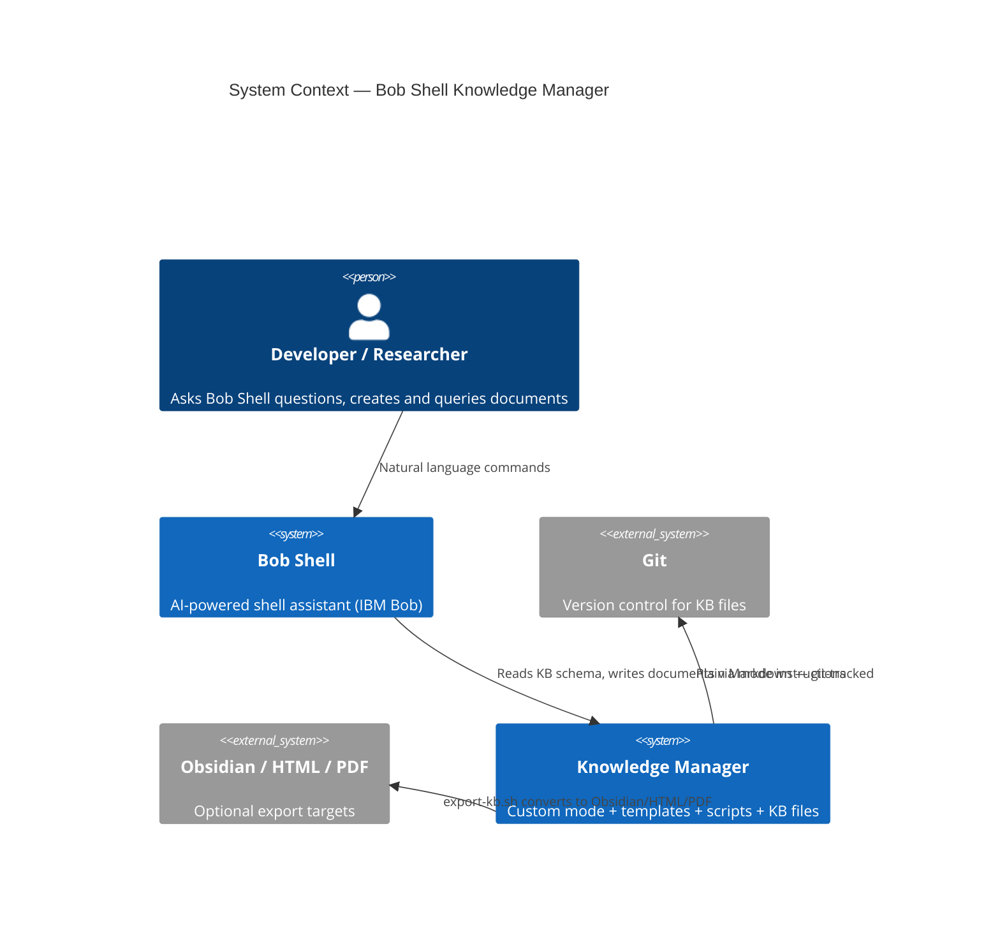

### Primary use cases

| Use case | Natural language trigger | Output |
|---|---|---|
| Research and document | "Research X and create a concept document" | New `.md` in `concepts/` |
| Author a guide | "Create a guide for [task]" | New `.md` in `guides/` |
| Query the KB | "What do we know about [topic]?" | Inline answer + source citations |
| Update a document | "Update [document] with [new information]" | Updated `.md` |
| Validate the KB | Run `validate-kb.sh` | Pass/fail + broken-link report |
| Export to another format | `export-kb.sh obsidian` | Obsidian vault, HTML, or PDF |

---

## 2. Constraints

| Constraint | Value | Rationale |
|---|---|---|
| **Runtime** | Bob Shell only — no Python, no Node, no Docker | Zero-friction install; runs anywhere Bob runs |
| **Language** | Bash (scripts), YAML (mode config), Markdown (content) | No additional runtime dependencies |
| **Persistence** | Plain files under `docs/knowledge-base/` | Git-trackable; human-readable; tool-agnostic |
| **Search** | Bob Shell's native `search_file_content` | No external index or database required |
| **Memory** | Bob Shell CLI: `save_memory` tool. Bob IDE: file persistence via `write_file` only (`save_memory` not available in Bob IDE). | Cross-session persistence of key facts |
| **Platform** | macOS, Linux (Bash ≥ 3.2) | Windows only via WSL |
| **Optional tools** | `pandoc` for HTML/PDF export only | Core functionality works without it |
| **Bob Shell version** | Any version that supports `customModes` in `custom_modes.yaml` | Tested on current release |

---

## 3. Solution Strategy

The system is built on **three layered concerns**, each with one mechanism:

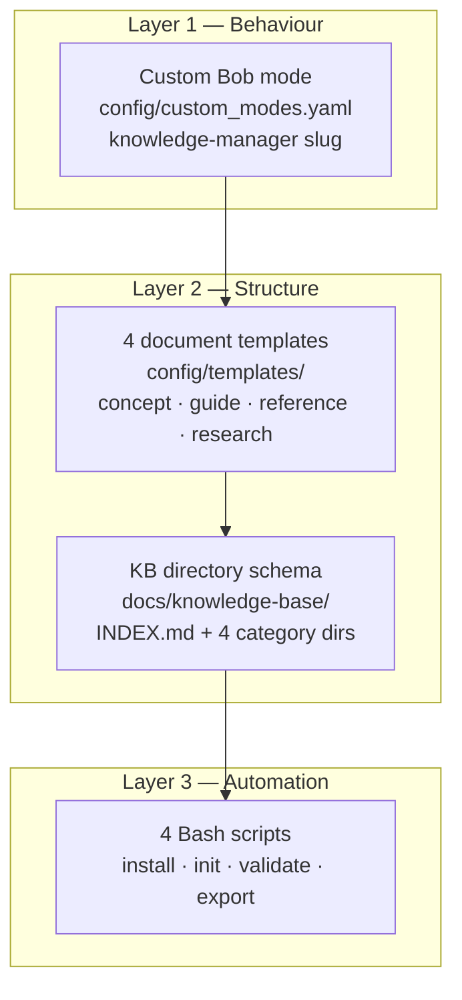

**Layer 1 (Behaviour):** The custom mode injects KB-aware instructions into every Bob Shell
session: document creation workflow, naming conventions, cross-referencing rules, and
memory persistence. The mode is the only component that requires Bob Shell.

**Layer 2 (Structure):** Templates enforce a consistent section layout per document type.
The `docs/knowledge-base/` directory schema (one `INDEX.md` + four category directories)
is the runtime contract — scripts and the mode both depend on it.

**Layer 3 (Automation):** Bash scripts handle the four lifecycle operations that are
tedious to do by hand: install, initialise, validate, and export.

---

## 4. Component Architecture

### Static component view

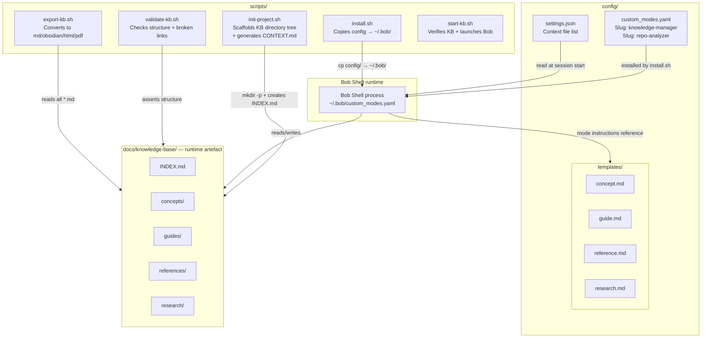

### Component responsibilities

| Component | File(s) | Responsibility | Lines |
|---|---|---|---|
| **knowledge-manager mode** | `config/custom_modes.yaml:158-211` | Defines Bob's KB-aware behaviour: creation workflow, naming conventions, cross-reference rules, memory persistence | ~54 |
| **repo-analyzer mode** | `config/custom_modes.yaml:1-156` | Separate mode for repository analysis; uses different scripts | ~156 |
| **settings.json** | `config/settings.json` | Declares `INDEX.md` as auto-loaded context file at every session start | 8 |
| **concept.md template** | `config/templates/concept.md` | Standard layout: Overview, Key Points, Details, Examples, Related Documents, References | 38 |
| **guide.md template** | `config/templates/guide.md` | Standard layout: Overview, Prerequisites, Steps, Verification, Troubleshooting, Related | 57 |
| **reference.md template** | `config/templates/reference.md` | Standard layout for API/spec documents | ~40 |
| **research.md template** | `config/templates/research.md` | Standard layout: Hypothesis, Methodology, Findings, Conclusions | ~40 |
| **install.sh** | `scripts/install.sh` | Detects `~/.bob` or `~/.config/bob`; backs up existing config; copies `custom_modes.yaml` and (optionally) `settings.json` | 48 |
| **init-project.sh** | `scripts/init-project.sh` | Creates `docs/knowledge-base/{concepts,guides,references,research}/`; writes `INDEX.md`; creates `.bob/settings.json`; generates `CONTEXT.md`; updates `.gitignore` | ~175 |
| **start-kb.sh** | `scripts/start-kb.sh` | Session launcher: verifies KB exists, prints doc count, confirms `CONTEXT.md` present, then `exec bob --chat-mode=knowledge-manager` | 51 |
| **validate-kb.sh** | `scripts/validate-kb.sh` | Asserts `INDEX.md` exists, 4 category dirs exist, no broken relative links; prints document count per category | 60 |
| **export-kb.sh** | `scripts/export-kb.sh` | Converts KB to: flat Markdown, Obsidian vault, HTML (pandoc), or PDF (pandoc) | 131 |

---

## 5. Runtime Views

### Sequence: Installing the mode

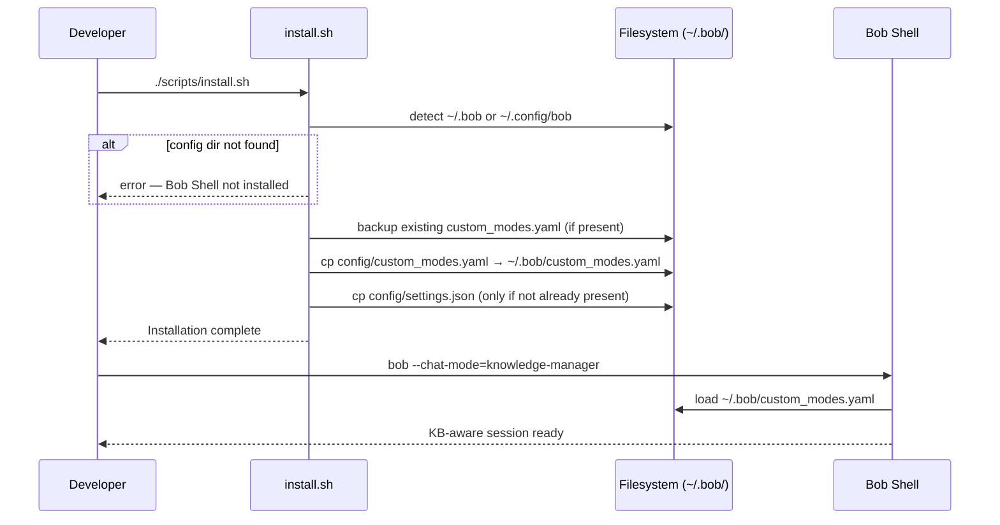

### Sequence: Initialising a project KB

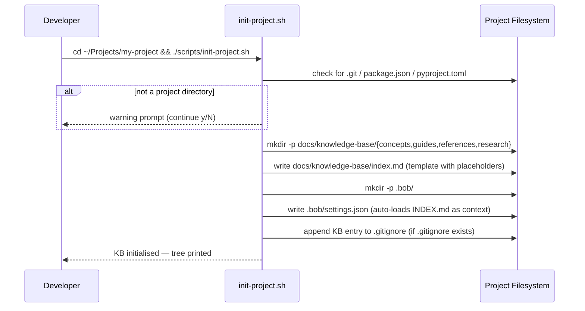

### Sequence: Creating a document (Bob Shell session)

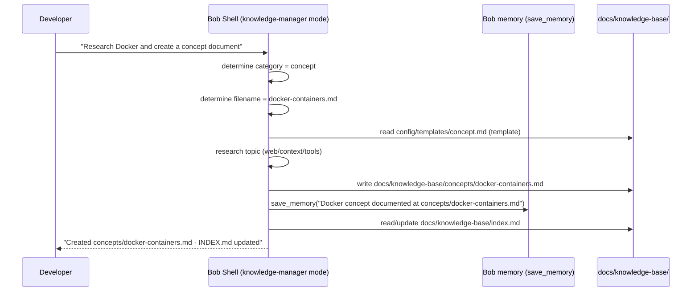

### Sequence: Querying the knowledge base

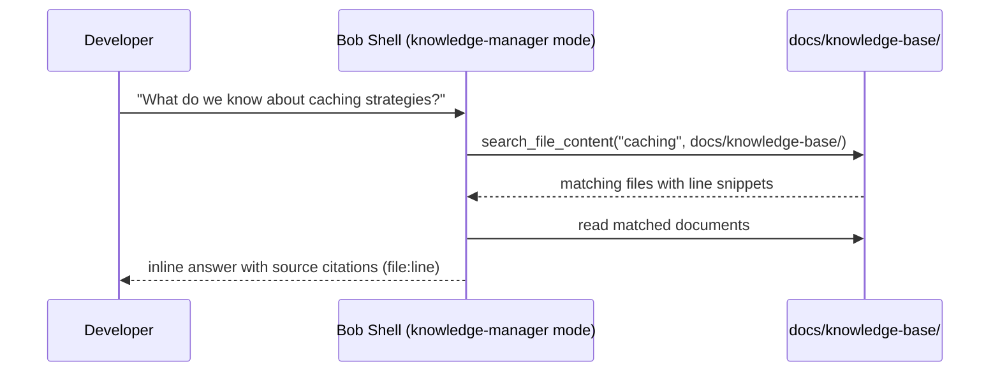

### Sequence: Validating the KB

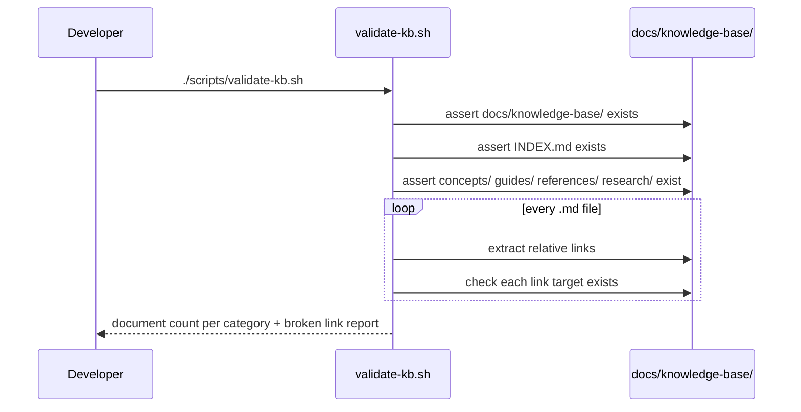

### Sequence: Exporting the KB

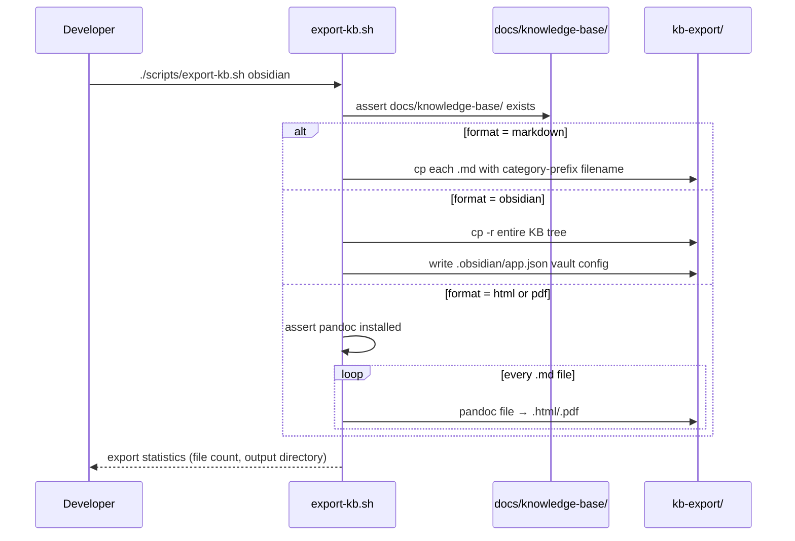

---

## 6. Deployment View

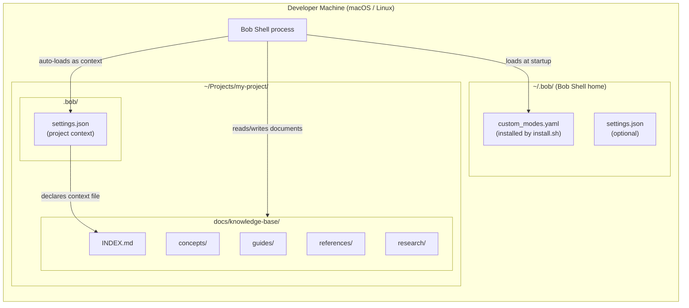

**Deployment constraints:**

| Constraint | Value |
|---|---|
| Bob Shell config home | `~/.bob/` (primary) or `~/.config/bob/` (detected by `install.sh`) |
| Project KB location | `<project-root>/docs/knowledge-base/` (created by `init-project.sh`) |
| Context injection | `.bob/settings.json` declares `INDEX.md` so Bob auto-loads it each session |
| Bash requirement | Bash ≥ 3.2 (macOS default: 3.2 on older systems; 5.x recommended) |
| Pandoc requirement | Only for `export-kb.sh html` and `export-kb.sh pdf` |
| Git requirement | Optional; plain files work without git |
| Multi-project | Install once globally (`install.sh`); `init-project.sh` per project |
| Network | None — fully offline |

---

## 7. Directory Structure

### Repository layout (this project)

```
bob-llmwiki-knowledge-manager/
├── config/
│   ├── custom_modes.yaml          # Bob mode definitions (knowledge-manager + repo-analyzer)
│   ├── settings.json              # Recommended Bob settings (context file list)
│   └── templates/
│       ├── concept.md             # Template: core concepts and definitions
│       ├── guide.md               # Template: how-to guides and tutorials
│       ├── reference.md           # Template: API docs and specifications
│       └── research.md            # Template: research notes and findings
├── scripts/
│   ├── install.sh                 # Install mode → ~/.bob/
│   ├── init-project.sh            # Scaffold KB + generate CONTEXT.md
│   ├── start-kb.sh                # Session launcher (daily driver)
│   ├── validate-kb.sh             # Validate KB structure + broken links
│   └── export-kb.sh               # Export KB to md/obsidian/html/pdf
├── examples/
│   ├── personal-wiki/             # Example KB: personal developer notes
│   ├── research-project/          # Example KB: academic research
│   └── software-project/          # Example KB: software engineering project
└── docs/
    ├── ARCHITECTURE.md            # ← This file (KB Manager architecture)
    ├── architecture/
    │   └── ARCHITECTURE.md        # Python token-optimizer architecture (separate system)
    ├── QUICK_START.md
    ├── USAGE.md
    └── …
```

### Runtime KB layout (target project, after `init-project.sh`)

```
<project-root>/
├── CONTEXT.md                     # Auto-loaded context: project orientation + resume prompts
├── .bob/
│   └── settings.json              # Declares CONTEXT.md + INDEX.md as auto-loaded context
└── docs/
    └── knowledge-base/
        ├── INDEX.md               # Master index — updated by the KB Manager mode
        ├── concepts/              # Core concepts: concept-name.md
        │   └── docker-containers.md
        ├── guides/                # How-to guides: task-name-guide.md
        │   └── git-workflow-guide.md
        ├── references/            # API / spec docs: api-name-reference.md
        │   └── cli-commands.md
        └── research/              # Research notes: topic-YYYY-MM.md
            └── caching-strategies-2026-07.md
```

---

## 8. Document Lifecycle

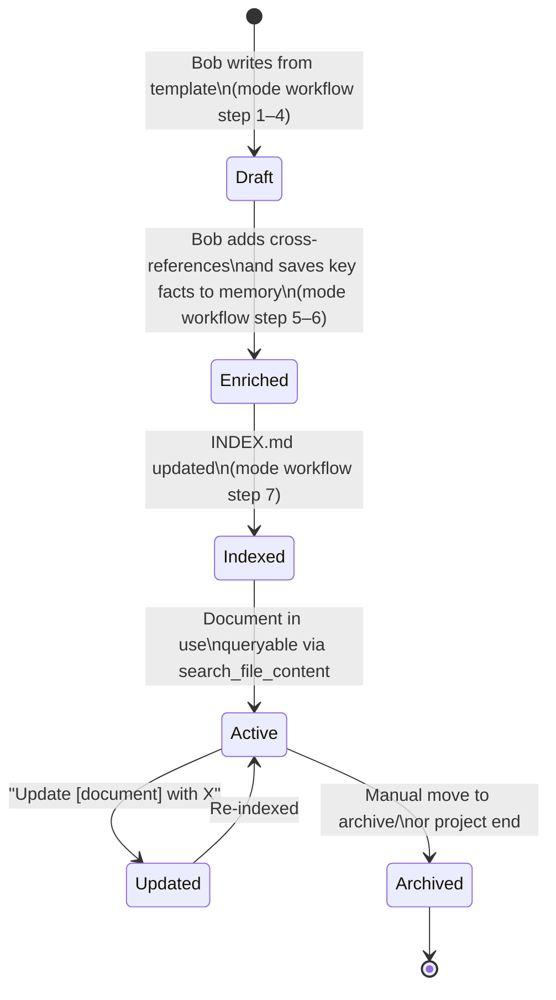

### Document naming conventions (enforced by mode)

| Category | Convention | Example |
|---|---|---|
| `concepts/` | `concept-name.md` | `docker-containers.md` |
| `guides/` | `task-name-guide.md` | `git-workflow-guide.md` |
| `references/` | `api-name-reference.md` | `cli-commands.md` |
| `research/` | `topic-YYYY-MM.md` | `caching-strategies-2026-07.md` |

### Template structure (all 4 document types)

Each template enforces a consistent section layout:

```
concept.md    → Overview · Key Points · Details · Examples · Related Documents · References
guide.md      → Overview · Prerequisites · Steps · Verification · Troubleshooting · Related
reference.md  → Overview · Quick Reference · Detailed Reference · Examples · Related
research.md   → Overview · Hypothesis · Methodology · Findings · Conclusions · Related
```

---

## 9. Cross-Cutting Concepts

### Natural language interface

The mode's `customInstructions` (`config/custom_modes.yaml:180-203`) define the full
document creation workflow in plain English. No special syntax is required from the user.
The mode:
1. Determines document category from context
2. Selects the correct template
3. Applies the `lowercase-with-hyphens.md` naming convention
4. Adds cross-references to related existing documents
5. Calls `save_memory` with the document's location *(Bob Shell CLI only — Bob IDE skips this step)*
6. Updates `INDEX.md`

### Memory persistence

`save_memory` (Bob Shell built-in) is called after every document creation. This
persists the document's key facts and location across sessions, so a future query
("What do we know about Docker?") can return results even before `search_file_content`
finds the file.

### Context injection

[`config/settings.json`](../config/settings.json) (copied to `.bob/settings.json` by
`init-project.sh`) declares both `CONTEXT.md` and `INDEX.md` as context files. Bob Shell
auto-loads both at session start: `CONTEXT.md` provides project orientation and the
standard resume prompts; `INDEX.md` provides the current document registry.

### Session activation

`scripts/start-kb.sh` is the recommended daily-driver for starting a KB session. It
verifies the KB is initialised, prints the document count, and then `exec`s
`bob --chat-mode=knowledge-manager`. See
[`docs/usage.md §0`](USAGE.md#0-starting-a-session) for all activation paths and the
standard resume prompt.

### Version control compatibility

All KB content is plain Markdown under `docs/knowledge-base/`. There are no binary
files, no databases, no generated artefacts — the entire KB can be committed, diffed,
branched, and merged with standard git. The `.gitignore` entry added by `init-project.sh`
excludes only macOS `.DS_Store` files.

### Zero external dependencies

The core functionality (create, query, update documents) requires only Bob Shell. The
Bash scripts use only POSIX-compatible tools (`find`, `grep`, `mkdir`, `cp`, `cat`).
The only optional dependency is `pandoc`, needed only for HTML/PDF export.

---

## 10. Architecture Decision Records

The Knowledge Manager's decisions are not yet in the `docs/adr/` ADR system (which is
used by the Python token-optimizer). They are recorded here inline.

### KM-ADR-001: Bash over Python for scripts

**Decision:** Scripts are written in Bash, not Python.  
**Context:** The KB Manager must run on any machine that has Bob Shell, without requiring
a Python environment (which the token-optimizer system does require).  
**Rationale:** Bash is available on all macOS/Linux systems; the operations needed
(directory creation, file copy, find, grep) are trivially expressible in Bash with no
dependencies. A Python CLI would add a bootstrap dependency and version coupling.  
**Consequence:** Scripts are limited to POSIX shell operations; complex logic
(e.g., graph-based link checking) would be harder to implement.  
**Status:** Accepted.

### KM-ADR-002: Markdown over a database or wiki engine

**Decision:** KB content is plain Markdown files, not a database, not a wiki engine.  
**Context:** Knowledge managers like Confluence, Notion, or Obsidian require external
services or local apps. The goal is "zero external dependencies."  
**Rationale:** Markdown is universally readable, git-compatible, and supported natively
by every text editor and GitHub. Export to richer formats is available via `export-kb.sh`.  
**Consequence:** No built-in search index; relies on Bob Shell's `search_file_content`
and filesystem `find/grep`.  
**Status:** Accepted.

### KM-ADR-003: Four fixed document categories

**Decision:** The KB uses exactly four top-level categories: `concepts/`, `guides/`,
`references/`, `research/`.  
**Context:** A flat structure is too hard to navigate; a deep hierarchy adds friction
when creating documents (which category?).  
**Rationale:** These four categories match the Diátaxis documentation framework
(concepts = explanation, guides = how-to, references = reference, research = background).
Four categories are few enough to hold in working memory; most documents fit cleanly
into one category.  
**Consequence:** Edge cases exist (e.g., a document that is both a concept and a
reference). The mode instructions encourage placing in the primary category and
cross-referencing the other.  
**Status:** Accepted.

### KM-ADR-004: Custom Bob mode over a separate CLI tool

**Decision:** Knowledge management behaviour is delivered as a Bob Shell custom mode,
not as a separate CLI tool.  
**Context:** Users already interact with Bob Shell; adding another CLI would split
attention.  
**Rationale:** A custom mode injects KB-awareness into every Bob Shell session
transparently. The user does not need to learn a new tool — the existing natural
language interface works.  
**Consequence:** The system is entirely dependent on Bob Shell. Without Bob Shell,
the KB files exist but are just static Markdown.  
**Status:** Accepted.

### KM-ADR-005: INDEX.md as auto-loaded context

**Decision:** `settings.json` declares `docs/knowledge-base/index.md` as a context
file that Bob Shell loads at every session start.  
**Context:** Without the index in context, Bob would need to search the filesystem at
the start of every query to know what documents exist.  
**Rationale:** Pre-loading the index means "What do we know about X?" queries start
with a directory of documents, reducing latency and improving quality.  
**Consequence:** `INDEX.md` must be kept current (the mode's step 7 does this).
A stale `INDEX.md` degrades query quality.  
**Status:** Accepted.

---

## 11. Quality Scenarios

| ID | Stimulus | Response | Measurable target |
|---|---|---|---|
| QS-1 | Developer asks "Research Docker and create a concept document" | Bob creates `concepts/docker-containers.md` using the template, saves memory, updates INDEX.md | Document created in < 2 tool calls after research |
| QS-2 | Developer asks "What do we know about caching?" | Bob searches KB and returns answer with file citations | Response cites at least one KB document if one exists |
| QS-3 | Developer runs `validate-kb.sh` on a clean KB | All checks pass; 0 broken links | Exit code 0; report shows correct document counts |
| QS-4 | Developer runs `validate-kb.sh` with a broken link | Broken link is reported with file and target | `broken_links` counter > 0; specific file named |
| QS-5 | Developer runs `export-kb.sh obsidian` | Obsidian vault created at `kb-export/` | `kb-export/.obsidian/app.json` exists; all `.md` files copied |
| QS-6 | Developer installs on a new machine | `install.sh` completes without errors; `bob --chat-mode=knowledge-manager` starts | Exit code 0; mode appears in Bob's mode selector |
| QS-7 | Developer adds a document not listed in INDEX.md | Next query for that topic may miss the document | Known limitation; mode instructions require INDEX.md update at creation time |
| QS-8 | KB has 1,000 documents | `search_file_content` latency increases | No structural limit; degradation is a Bob Shell / filesystem concern, not a KB Manager concern |

---

## 12. Risks and Technical Debt

| ID | Risk | Severity | Status | Mitigation |
|---|---|---|---|---|
| R-1 | **INDEX.md staleness** — if a document is created outside the KB Manager mode (e.g., manual file copy), INDEX.md is not updated automatically | Medium | Accepted | `validate-kb.sh` reports document counts; periodic re-index is a manual step |
| R-2 | **Bob Shell dependency** — the mode requires Bob Shell; if Bob's API changes (e.g., `customModes` schema), the mode may break | High | Accepted | No mitigation beyond tracking Bob Shell release notes |
| R-3 | **No automated link repair** — `validate-kb.sh` detects broken links but does not fix them | Low | Accepted | Links are relative; renaming a file manually breaks references. Mitigation: use cross-references sparingly or use stable filenames |
| R-4 | **No full-text search index** — relies on Bob Shell `search_file_content` which scans files at query time | Low | Accepted | Acceptable at current KB scale (~100 documents); a future ADR could add an index if needed |
| R-5 | **Bash 3.2 compatibility** — macOS ships Bash 3.2 by default; some Bash 4+ features are unavailable | Low | Accepted | Scripts use only POSIX-compatible constructs; tested on macOS |
| R-6 | **`$(date)` heredoc bug fixed** — `init-project.sh` now uses an unquoted heredoc delimiter (`INDEXEOF` not `'INDEXEOF'`) so `$(date +%Y-%m-%d)` expands correctly into `INDEX.md` and `CONTEXT.md` | — | Fixed (2026-07-14) | — |

---

## 13. Glossary

| Term | Definition |
|---|---|
| **Bob Shell** | IBM Bob — an AI-powered shell assistant. The runtime host for the Knowledge Manager mode. |
| **Custom mode** | A Bob Shell feature defined in `custom_modes.yaml` that gives Bob a specialised role, persona, and instructions for a session. |
| **knowledge-manager slug** | The `slug: knowledge-manager` identifier used to activate the KB mode: `bob --chat-mode=knowledge-manager`. |
| **Knowledge Base (KB)** | The runtime artefact: the `docs/knowledge-base/` directory tree with `INDEX.md` and four category subdirectories. |
| **INDEX.md** | Master index of the KB. Lists all documents by category. Auto-loaded as context by Bob Shell. Updated by the mode after every document creation. |
| **save_memory** | Bob Shell built-in tool. Persists a key-value fact across sessions. Used by the mode to record document locations and key facts. |
| **search_file_content** | Bob Shell built-in tool. Full-text grep across files. Used for KB queries. |
| **template** | One of four Markdown files in `config/templates/` that define the standard section layout for each document category. |
| **Diátaxis** | A documentation framework (by Daniele Procida) with four categories: tutorials, how-to guides, reference, explanation. The KB's four categories (guides, references, research, concepts) are a deliberate mapping to Diátaxis. |
| **context file** | A file declared in `.bob/settings.json` that Bob Shell auto-loads into its context window at session start. Both `CONTEXT.md` and `INDEX.md` are declared as context files. |
| **CONTEXT.md** | Project-level orientation file generated by `init-project.sh` at the project root. Auto-loaded by Bob at every session start. Contains project name, KB location, standard resume prompts, and a KB document-count summary. |
| **start-kb.sh** | Session launcher script (`scripts/start-kb.sh`). Verifies the KB is initialised, prints document count, confirms `CONTEXT.md` is present, then launches `bob --chat-mode=knowledge-manager`. Recommended daily driver. |
| **resume prompt** | The standard first message to orient Bob at the start of any session: *"What did we document most recently? Summarise the KB and suggest what to work on next."* |
| **export format** | One of: `markdown` (flat), `obsidian` (vault), `html` (pandoc), `pdf` (pandoc). Chosen as argument to `export-kb.sh`. |

---

*Authoritative architecture document for the Bob Shell Knowledge Manager component.*  
*Python token-optimization system: see [`docs/architecture/ARCHITECTURE.md`](../architecture/ARCHITECTURE.md).*
*Maintained by: Architecture Team · Last reviewed: 2026-07-14*
