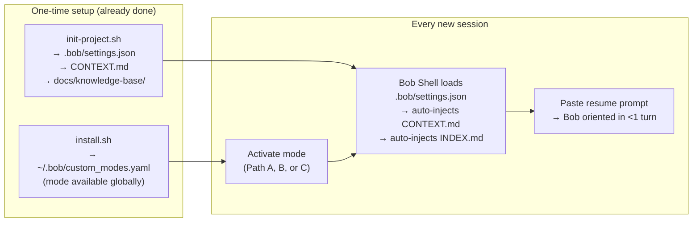

# Activating the Knowledge Manager in a New Session

Bob Shell sessions start fresh — the mode does not persist between restarts. This guide explains the three activation paths, how automatic context loading works, and what to type first to orient Bob immediately.

---

## How session activation works

Two independent mechanisms combine to give Bob full context at the start of every session:



| Mechanism | File | What it does |
|---|---|---|
| **Mode** | `~/.bob/custom_modes.yaml` | Injects the 7-step KB workflow and tool bindings into Bob |
| **Context auto-load** | `.bob/settings.json` | Pre-loads `CONTEXT.md` + `INDEX.md` at every session start |
| **CONTEXT.md** | `CONTEXT.md` (project root) | Project orientation, KB summary, standard prompts |

---

## The three activation paths

### Path A — Wrapper script (recommended, daily driver)

```bash
cd ~/your-project
~/Projects/bob-llmwiki-knowledge-manager/scripts/start-kb.sh
```

What it does (see [`scripts/start-kb.sh`](../../scripts/start-kb.sh)):
1. Verifies `docs/knowledge-base/` exists — exits with a helpful error if not
2. Prints document count and confirms `CONTEXT.md` is present
3. Launches `bob --chat-mode=knowledge-manager`

Start a session in a different project without `cd`:

```bash
~/Projects/bob-llmwiki-knowledge-manager/scripts/start-kb.sh ~/Projects/other-project
```

Add a shell alias for one-word activation:

```bash
# In ~/.zshrc or ~/.bashrc
alias kb='~/Projects/bob-llmwiki-knowledge-manager/scripts/start-kb.sh'

# Then every day:
kb                          # start in current dir
kb ~/Projects/other-project # start in another project
```

### Path B — Direct CLI flag

```bash
cd ~/your-project
bob --chat-mode=knowledge-manager
```

### Path C — In-session mode switch

Already in a Bob session and want to switch:

```
/mode knowledge-manager
```

### Path D — No mode installed (prompt injection)

If `install.sh` has not been run, the mode is unavailable. Use any Bob mode and paste:

```
You are acting as the knowledge manager for this project.
KB location: docs/knowledge-base/  (INDEX.md is loaded in context)
Resume: summarise what exists in the KB, what was most recently documented, and suggest what to work on next.
Workflow: follow the 7-step document creation process:
  1. Determine category (concept/guide/reference/research)
  2. Select template from config/templates/
  3. Apply naming convention (lowercase-with-hyphens.md)
  4. Write content using the template sections
  5. Add cross-references to related documents
  6. Save key facts with save_memory
  7. Update INDEX.md
```

---

## Standard first message (orient Bob in one turn)

After activating via any path, open with:

```
What did we document most recently? Summarise the KB and suggest what to work on next.
```

Bob will:
1. Read `INDEX.md` (already in context window via `.bob/settings.json`)
2. Recall `save_memory` facts from prior sessions
3. Propose next documents or updates based on gaps

---

## What `CONTEXT.md` is and why it matters

`init-project.sh` generates `CONTEXT.md` at the project root. Bob Shell auto-loads it at every session start because `.bob/settings.json` declares it as a context file:

```json
{
  "context": {
    "fileName": ["CONTEXT.md", "docs/knowledge-base/index.md"]
  }
}
```

`CONTEXT.md` contains:
- Project name and KB location
- Four standard quick-start prompts
- A KB summary section (`Concepts: N documents`, etc.)

**Keep it current.** As the KB grows, update the document counts in `CONTEXT.md`. Bob reads this before the first prompt, so accurate counts give it immediate situational awareness without a full KB scan.

---

## Troubleshooting

| Symptom | Cause | Fix |
|---|---|---|
| `mode not found` when using `/mode knowledge-manager` | Mode not installed globally | Run `cd ~/Projects/bob-llmwiki-knowledge-manager && ./scripts/install.sh` |
| Mode activates but KB seems empty | Wrong directory | `cd ~/your-project-with-kb` before starting Bob |
| `start-kb.sh` exits with "Knowledge base not found" | `init-project.sh` not run for this project | Run `~/Projects/bob-llmwiki-knowledge-manager/scripts/init-project.sh` |
| `CONTEXT.md` not auto-loaded | `.bob/settings.json` missing or not updated | Re-run `init-project.sh` (will skip existing files) or add `CONTEXT.md` to `.bob/settings.json` manually |
| Bob doesn't recall previous work | `save_memory` facts are session-scoped | Use the resume prompt — Bob reads `INDEX.md` and `CONTEXT.md` which persist as files |

---

## Quick reference

| Task | Command |
|---|---|
| Start KB session (recommended) | `~/Projects/bob-llmwiki-knowledge-manager/scripts/start-kb.sh` |
| Start Bob directly | `bob --chat-mode=knowledge-manager` |
| Switch mode in running session | `/mode knowledge-manager` |
| Check mode installed | `ls ~/.bob/custom_modes.yaml` |
| Install mode | `cd ~/Projects/bob-llmwiki-knowledge-manager && ./scripts/install.sh` |
| Initialise KB in new project | `~/Projects/bob-llmwiki-knowledge-manager/scripts/init-project.sh` |
| Resume prompt | `What did we document most recently? Summarise the KB and suggest what to work on next.` |

---

## Related documentation

- [USAGE.md §0 — Starting a Session](../../USAGE.md#0-starting-a-session) — full session activation reference with Mermaid flowchart
- [INSTALLATION.md](../../INSTALLATION.md) — installing the mode globally
- [quick-start.md](../../quick-start.md) — 5-minute onboarding from scratch
- [WORKFLOWS.md §2 — Morning Research Session](../../WORKFLOWS.md) — daily workflow including session start

---

**Last Updated:** 2026-07-14  
**Status:** Complete
