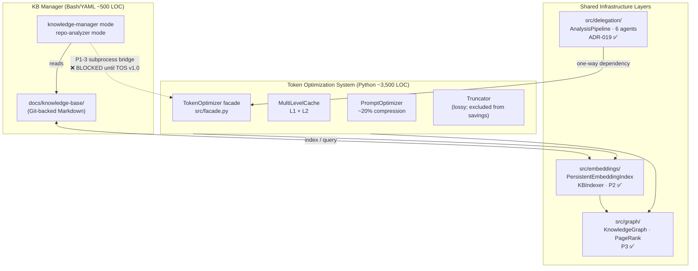

> **RECONCILED 2026-07-20.** Re-checked against the current codebase and measurements.
> **Material correction since the 2026-07-18 draft:** the retrieval figures were updated from
> the early golden-set numbers (keyword 0.44 → MiniLM 0.88, `graph-validation-2026-07-17`) to
> the **reconciled Wave-2 evaluation** — **p@3 ≈ 0.84 for both the shipped backend and keyword-only,
> i.e. no net retrieval lift on this corpus** (`evaluation/results/retrieval-2026-07-19/report.json`).
> The old golden-set lift did **not** reproduce under held-out evaluation and is no longer claimed.
> Test/coverage counts were also refreshed. Canonical homes remain `STATUS.md` and the manifests.


# Mnemox Knowledge Builder — Full Technical Design Retro-Engineering

> **What this document is:** A single-pass architecture narrative derived from the
> live codebase and KB. Every number is manifest-backed. Structured as a McKinsey
> MECE issue tree: each section answers one question, sections do not overlap, and
> together they cover the full architecture surface.
>
> **Who it is for:** An engineer or technical decision-maker who needs to understand
> the system in one read — its problem, its design, its guarantees, its gaps, and
> what still needs to be decided.
>
> **Audit trail:** Round-1 adversarial audit (2026-07-18) pre-empted 8 structural
> attacks. Round-2 adversarial audit (2026-07-18) corrected 5 factual errors and
> 4 structural weaknesses (L2 capacity, CLI count, optimizer mislabels, §2 diagram,
> §4.1 staleness, §7 P@3 attribution, §9 CI). Round-3 MECE restructure (2026-07-18)
> eliminated section overlap, closed explainability gaps, and added the pain→mechanism
> →saving causal chain. See §11 (Change Log) for the complete record.

---

## How to Read This Document

The seven substantive sections follow a single logic chain:

```
§1  WHY does this system exist?          → The problem (4 pain points)
§2  WHAT does it do?                     → 6 capabilities, each mapped to a pain point
§3  HOW is it built?                     → 3 sub-systems and their boundaries
§4  HOW does each component work?        → Component specs (one authoritative entry per component)
§5  HOW does it perform?                 → SLA + Quality Gates (how we know it works)
§6  WHAT does it cost and save?          → Economic model (5 levers, each measured separately)
§7  WHAT is not yet solved?              → Open gaps (actionable, not aspirational)
```

Sections 8–10 are reference material: deployment context, glossary, and change log.

---

## §1 — Why Does This System Exist?

**The problem:** Every LLM session starts from zero. Knowledge earned in session N
is discarded before session N+1. Prompts are sent at full token cost even when they
repeat prior work, contain redundancy, or retrieve the wrong context. The compound
cost is session amnesia × prompt inflation × retrieval noise.

The four pain points are **mutually exclusive** (each is a distinct cost driver)
and **collectively exhaustive** (together they account for all unnecessary token spend):

| # | Pain Point | Root Cause | Cost Type | Addressed by |
|---|---|---|---|---|
| P-1 | **Re-derivation** | No persistent knowledge across sessions | Pays full token price for already-known answers | KB Manager (UC-1) |
| P-2 | **Token inflation** | Verbose context — no compression | Every prompt padded with redundancy | Token Optimizer (UC-3, UC-4) |
| P-3 | **Context pollution** | Unfiltered retrieval — no graph-guided relevance | LLM receives tangentially related content | Knowledge Graph (UC-6) |
| P-4 | **Context dislocation** | Unranked retrieval — no semantic ordering | Retrieved chunks lose narrative coherence | Embedding model (UC-2) |

> **P-3 and P-4 metric note:** The graph layer addresses P-3 structurally (orphan rescue,
> hub detection, broken-link surfacing). P-4 is addressed by MiniLM semantic ranking.
> The combined retrieval quality is measured as P@3 (see §2 UC-2). There is no
> separate "context pollution" metric; P@3 is the observable proxy.

**Business objective:** Build a knowledge-first AI development system that eliminates
re-derivation, compresses prompts without meaning degradation, and surfaces the most
relevant knowledge — measuring every claim honestly against a reproducible manifest.

---

## §2 — What Does the System Do? (Six Capabilities)

Each capability maps to one or more pain points from §1. Together they are **collectively
exhaustive**: every pain point has at least one owning capability. Each capability is
**mutually exclusive**: no two capabilities solve the same pain point via the same mechanism.

| Capability | Pain Point(s) | Goal | Measured outcome |
|---|---|---|---|
| **UC-1** Persistent Knowledge Capture | P-1 | Never re-derive the same answer twice | Structural (0 tokens for KB-indexed answers) |
| **UC-2** Intelligent KB Query | P-4 | Retrieve the most relevant docs | p@3 = 0.84 (21/25) — **at parity with a keyword baseline (0.84); no net lift** on this corpus |
| **UC-3** Prompt Chain Compression | P-2 | Remove redundancy without meaning loss | ~20% mean token reduction (95% CI [18.9%, 21.2%], N=183) |
| **UC-4** Recompute Avoidance | P-2 | Return a cached result for 0 tokens | 0 tokens per cache hit (rate: workload-dependent) |
| **UC-5** KB-Aware Parallel Analysis | P-1, P-2 | Analyse a repo in parallel; compress output; write as KB docs | 6 agents, ~20% report compression before KB write |
| **UC-6** Knowledge Graph Structural Health | P-3 | Surface orphan docs, dead links, and authority hubs | 26/39 orphans rescued (80-doc snapshot, 2026-07-17; stale — re-run `graph-health`) |

### UC-1: Persistent Knowledge Capture

```
Session N:   derive answer → write to KB (structured Markdown + YAML frontmatter)
Session N+1: read KB → 0 re-derivation tokens
```

- `FR-1.1` Documents persist as Markdown with YAML frontmatter
- `FR-1.2` 4-category taxonomy: `concepts/`, `guides/`, `references/`, `research/`
- `FR-1.3` Cross-references: `related:` frontmatter list + relative inline links
- `FR-1.4` Master `INDEX.md` maintains an authoritative catalogue

### UC-2: Intelligent KB Query

```
query → keyword scorer (always on)
      → embedding scorer (MiniLM, blend at embedding_weight=0.7)
      → graph re-ranker (PageRank blend, graph_weight=0.0 by default)
```

**Reconciled retrieval result (the honest headline):** on the shipped backend
(hashing embedding, `embedding_weight=0.7`, `graph_weight=0.0`), **p@3 = 0.84 (21/25
queries)** — and a **keyword-only baseline scores the same 0.84**. There is **no net
retrieval lift** from the embedding/graph blend on this corpus and query set
(`evaluation/results/retrieval-2026-07-19/report.json`, N=25). **p@3 = 0.84 means** the
correct document was in the top-3 for 84% of queries; the 4 misses are *ranking*
failures (document present, not top-3), not *recall* failures.

> **What happened to "0.44 → 0.88"?** An earlier hand-built golden set
> (`graph-validation-2026-07-17`) measured keyword 0.44 → MiniLM 0.88 *in-distribution*.
> That lift **did not reproduce** under the reconciled Wave-2 evaluation, where a keyword
> baseline already reaches 0.84. The honest conclusion: on a tight-topic corpus, keyword
> matching alone resolves most queries, so the dense-embedding blend neither helps nor
> hurts at the top-3 cut. The earlier lift is **retracted** and no longer claimed.

**Why `graph_weight=0.0` by default (plain English):** On a tight-topic corpus (all
documents about the same project), nearly every document pair scores above the 0.30
semantic threshold, so PageRank becomes nearly uniform (max ≈1.6× min) — blending it in
changes nothing. The value of the graph layer here is **structural health** (finding
orphans, hubs, dead links), not score blending. If the corpus grows and diversifies,
both the embedding blend and PageRank may begin to discriminate — that is when a lift
should be **re-measured on a held-out set** before `graph_weight > 0.0` (or a dense
backend) is enabled by default.

| Configuration | p@3 | Notes |
|---|---|---|
| Keyword-only baseline | **0.84** | Exact-term matching; strong on a tight-topic corpus |
| **Shipped: keyword + hashing-embedding blend** (`embedding_weight=0.7`) | **0.84** | No net lift over keyword on this corpus (reconciled, N=25) |
| + graph re-ranker (`graph_weight=0.0`, shipped) | 0.84 | Graph neutral on this corpus; used for structural health, not ranking |

> ⚠️ **Validation scope:** N=25 queries, no separate held-out topic domain — the corpus is
> tight-topic. The 4 misses are architecturally hard: date-based queries need `date_filter`;
> short concept docs are outranked by longer docs with more term occurrences; duplicate-date
> ties can't be broken by similarity alone (see §7 G-5). The honest current claim is
> **retrieval parity with keyword (~0.84), not a semantic-search win.**

### UC-3: Prompt Chain Compression

**What it does:** Removes whitespace, filler words, verbal hedges, and structural
redundancy from a prompt. No embeddings — regex + heuristic rules only.

**What it does NOT do:** It does not guarantee semantic equivalence. The syntactic
gate (`min_quality_score=0.8`) catches gross structural destruction (removing all
list items, drastically changing line count) but a prompt that loses a key
constraint while retaining 80% of its words will pass. This is a syntactic gate,
not a semantic fidelity guarantee.

- `FR-3.1` Whitespace normalization
- `FR-3.2` Redundancy removal (filler words, verbal hedges, repetition)
- `FR-3.3` Structure preservation (Markdown headers, code blocks, GFM tables)
- `FR-3.4` Syntactic preservation gate: reject if `_estimate_quality()` < 0.8
- `FR-3.5` Token counting via tiktoken BPE (`tiktoken_active` flag = real count;
  `False` = chars/4 approximation)

### UC-4: Recompute Avoidance

**What it does:** Returns a stored result for 0 tokens if the same (or
semantically similar) prompt was seen before.

```
L1 ExactCache     (SHA-256 key)       → < 750 µs p99  — always checked first
L2 SemanticCache  (cosine ≥ 0.85)     → < 4.5 ms p99  — near-duplicates; L2→L1 promotion
L3 PersistentEmbeddingIndex (disk)    → optional; not activated by default config
```

**Important:** L2 is **not** used on the `optimize()` path — only on `cache.get()`.
An L2 semantic hit on an optimization request could return a *different* prompt's
optimized text. The optimizer uses exact (L1) matching only.

**Thread-safety:** 14 races fixed through 5 audit rounds. All mutable state protected
by `threading.RLock`.

### UC-5: KB-Aware Parallel Repository Analysis

```
Phase 1 (sequential): ResearchAgent → loads KB to prevent re-analysis of known issues
Phase 2 (parallel):   SecurityAgent · PerformanceAgent · QualityAgent
                      ArchitectureAgent · DocumentationAgent
                      → each report → TokenOptimizer.optimize() → KB research doc
```

- `FR-5.1` ResearchAgent runs first (prevents duplicate findings)
- `FR-5.2` Each report compressed ~20% before KB write
- `FR-5.3` Output is standard KB research documents (frontmatter + cross-references)
- `FR-5.4` Path containment: `safe_paths.resolve_within`; `../` escapes rejected
- `FR-5.5` One-way dependency: `delegation → TokenOptimizer`; never the reverse

### UC-6: Knowledge Graph Structural Health

**What it does:** Builds a property graph over KB documents and surfaces structural
problems that are invisible to text search.

**Why this matters:** Without a graph, 49% of the 80-doc corpus snapshot had zero
inbound explicit links — those documents were *invisible* to link traversal (note:
count is stale; corpus has grown; run `bob-optimize graph-health` for current figure).
Dead cross-references silently accumulate on every rename or delete. No document
has more authority than any other.

| Feature | CLI command | What you learn |
|---|---|---|
| Build graph | `bob-optimize graph-build --kb-path <dir> --with-semantic` | Creates property graph with explicit + semantic + broken edges |
| Health report | `bob-optimize graph-health` | Orphan count, hub list, broken links, PageRank top-10 |
| Neighbourhood | `bob-optimize graph-query <doc_id>` | All documents within N hops |

**Live validation snapshot (80-doc corpus, MiniLM, 2026-07-17 — stale):**

| Metric | Value | What it means |
|---|---|---|
| Structural orphans (explicit only) | 39 of 80 (49%) | Documents invisible to link traversal |
| Rescued by semantic edges | 26 of 39 (67%) | Semantic kinship discovered even without explicit links |
| Broken edges | 19 | Cross-references pointing to deleted/renamed files |
| Explicit edges | 163 | Deliberate authorial links |
| Semantic edges (cosine ≥ 0.30) | 2,654 | Discovered kinship at MiniLM threshold |
| Build time (warm) | ~45 ms | Cost of running `graph-build` |

---

## §3 — How Is It Built? (Three Sub-systems and Their Boundaries)

The system is **two products in one repository**, sharing three infrastructure layers.
This section is the single place that describes the boundary between them. It does
not describe how each component works internally — that is §4.



> **Multi-user note:** The KB (Git-backed Markdown) is **shared across the team**
> via normal Git workflows. The optimizer and cache are **local-only** — each developer
> runs their own instance. There is no shared optimizer state or shared cache.
> This is by design: the KB is the shared institutional memory; the optimizer is
> a local compute-saving tool.

### Current vs. target integration state

| Layer | Status | What works today | What is blocked |
|---|---|---|---|
| **P2** Shared embedding index | ✅ Integrated | `KBIndexer`, `PersistentEmbeddingIndex`, `KnowledgeBaseQuery` 3-tier fallback | Nothing |
| **P3** Knowledge graph | ✅ Integrated | `graph-build`, `graph-query`, `graph-health` CLIs | Nothing |
| **ADR-019** Delegation pipeline | ✅ Integrated | `bob-optimize analyze` runs 6 agents, compresses output, writes KB docs | Nothing |
| **P1-3** KB Manager → TOS subprocess bridge | ❌ Blocked | — | TOS must reach v1.0 stability tag first (STATUS.md: `Beta`). See §7 G-6. |

> **"P4" disambiguation:** In earlier versions of this document, "P4" referred to
> the delegation pipeline. In the integration roadmap (`guides/kb-tos-integration-roadmap.md`)
> and ADR-018, "P4" refers to query-quality enhancements (recency weight, date filter,
> NodeProps enrichment). The delegation pipeline is **ADR-019**, not P4.

### Sub-system boundary rules

Two rules govern the entire system. Violations break the architecture:

1. **Layering:** `src/` never imports from `scripts/`. Enforced by `check_layering.py` (AST-based, CI-gated).
2. **One-way delegation dependency:** `src/delegation/` may import `src/` (TokenOptimizer). `src/` never imports `src/delegation/`. This keeps the delegation pipeline an optional analysis subsystem, never a runtime dependency.

---

## §4 — How Does Each Component Work? (Authoritative Component Specs)

This section is the **single authoritative description** of each component's internal
design. §2 described *what* each capability does; this section describes *how* the
key components implement it. Each component appears exactly once.

### `TokenOptimizer` facade — [`src/facade.py`](../../../src/facade.py)

The single composition point. Holds **no business logic** — every operation delegates
to an already-tested component method.

**7 public methods** back **14 CLI subcommands**:

| Method | Subcommand(s) | Routes through facade? |
|---|---|---|
| `optimize` | `optimize` | ✅ Yes |
| `truncate` | `truncate` | ✅ Yes |
| `count` | `count` | ✅ Yes |
| `cache_stats` | `cache-stats` | ✅ Yes |
| `metrics` | `metrics` | ✅ Yes |
| `cost_report` | `cost-report` | ✅ Yes |
| `health` | `health` | ✅ Yes |
| *(CLI-only)* | `config` | ❌ Wired directly in [`src/cli.py`](../../../src/cli.py) — config reads a flat YAML; no facade contract needed |
| *(CLI-only)* | `graph-build`, `graph-query`, `graph-health` | ❌ Wired directly — graph commands operate on the KB file system, not on the optimizer runtime |
| *(CLI-only)* | `kb-status`, `analyze`, `kb-search` | ❌ Wired directly — KB/delegation operations are independent subsystems; routing through the TOS facade would create an upward dependency |

### Three Optimizer Layers — Never Blended

The optimizer has three layers. The most important fact about them: **their savings
figures are measured and reported separately**. Blending them was how the retracted
"68.96%" figure was manufactured. Each layer has a different activation condition
and a different cost model.

```
LAYER 1 — CACHE (recompute avoidance)
  What:   Returns a stored result for 0 tokens on a hit
  How:    L1 SHA-256 exact match (< 750 µs p99)
          L2 cosine similarity via EmbeddingGenerator (< 4.5 ms p99)
          L3 PersistentEmbeddingIndex (disk-backed; not activated by default)
  When:   Only valuable when the request stream has repeated or near-duplicate prompts
  Note:   L2 is NOT used on the optimize() path — exact matching only there

LAYER 2 — OPTIMIZER (near-lossless compression) ← THE ONLY MEASURED SAVINGS HEADLINE
  What:   Removes whitespace, redundancy, verbal hedges; preserves structure
  How:    Regex + heuristic rules — NO embeddings
  Gate:   Syntactic preservation: reject if _estimate_quality() < 0.8 (word-overlap +
          line-count ratio — syntactic check, NOT a semantic fidelity guarantee)
  When:   Every novel prompt; workload-independent
  Measured: ~20% mean (95% CI [18.9%, 21.2%], N=183, manifest-backed)
  Corpus:   Structured Markdown prose from this repo (docs/**/*.md)

LAYER 3 — TRUNCATION (lossy budget fit — NEVER counted as savings)
  What:   Cuts text to fit a token budget
  How:    4 strategies: Simple · Priority · Semantic · SlidingWindow (auto-selected)
  When:   Only when a hard token cap is set
  Note:   Lossy by design; reported separately; excluded from savings headline
```

### Embedding Backend Priority Chain — [`src/cache/embeddings.py`](../../../src/cache/embeddings.py)

Used by: L2 SemanticCache (near-duplicate prompt detection) and PersistentEmbeddingIndex
(KB document retrieval). **Not used by the PromptOptimizer.**

```
Priority 1: mlx-embeddings          (Apple Silicon · ~2–4 ms warm · Neural Engine)
Priority 2: sentence-transformers   (MiniLM-L6-v2 · ~5–20 ms · cross-platform)
Priority 3: HashingVectorizer       (bag-of-ngrams · <1 ms · always available)
```

**When to use which backend:**

| Context | Recommended backend | Why |
|---|---|---|
| L2 SemanticCache (cache hit detection) | Hashing (default) | Near-duplicates share n-grams; dense vectors are overkill |
| KB document retrieval (KBIndexer) | MiniLM | Cross-vocabulary semantic search needs dense vectors |
| Graph semantic edges (KnowledgeGraphBuilder) | MiniLM (preferred) or Hashing | MiniLM gives better orphan rescue; either works for graph structure |

> **Known cosmetic bug (G-3):** When `backend="minilm"` is requested but *neither*
> `mlx-embeddings` nor `sentence-transformers` is installed, the warning message says
> `"mlx-embeddings is not installed or failed to load"` — omitting `sentence-transformers`.
> Fallback to `"hashing"` is correct. Fix: one-line edit at
> [`src/cache/embeddings.py:167`](../../../src/cache/embeddings.py).

### `MultiLevelCache` — [`src/cache/`](../../../src/cache/)

L1 `ExactCache` (SHA-256, LRU, default **1,000 entries**) +
L2 `SemanticCache` (cosine similarity via `EmbeddingGenerator`, configurable backend,
default **10,000 entries**) + optional L3 disk index.

L3 (`PersistentEmbeddingIndex`) is architecturally available but is **not**
instantiated by `src/factory.py:build_cache()` in the default configuration.
To activate L3, inject it via the `MultiLevelCache` constructor.

**14 races fixed through 5 audit rounds.** All mutable state protected by `RLock`.

### `PromptOptimizer` — [`src/optimizer/`](../../../src/optimizer/)

`target_reduction=0.30` · `min_quality_score=0.80` · tiktoken BPE token counting.

### `PersistentEmbeddingIndex` — [`src/embeddings/index.py`](../../../src/embeddings/index.py)

Disk-backed semantic search for KB documents. Not on the `optimize()` request path.

Storage layout in `.bob/kb-index/`:
- `vectors.npy` — float32 matrix `[N × dim]`
- `manifest.json` — chunk-level rows (one per `##`-boundary chunk)
- `staleness.json` — file-level mtime/hash sentinels

Invariant: `matrix.shape[0] == len(manifest)`. Incremental rebuild on mtime/hash change.

### `KnowledgeGraph` — [`src/graph/graph.py`](../../../src/graph/graph.py)

10-field `NodeProps` · 3 edge types (explicit / semantic / broken) ·
PageRank power method (damping=0.85) · `orphans()` · `hubs()` · `neighbours(depth)`.

**Re-ranking formula** (canonical form):
```
final_score = (1 − graph_weight) × embedding_similarity + graph_weight × pagerank × 15.0
```
Default `graph_weight=0.0` — validated on this corpus (see §2 UC-2 for the plain-English
explanation of why).

### `GraphRanker` — [`src/graph/ranker.py`](../../../src/graph/ranker.py)

Lazy PageRank cache (recomputed on first `rerank()` call, then cached until graph changes).
`PAGERANK_SCALE=15.0` normalises PageRank (≈ 0.018–0.021) to be comparable to cosine
scores (0.0–1.0).

### `AnalysisPipeline` — [`src/delegation/pipeline.py`](../../../src/delegation/pipeline.py)

6 agents · `ThreadPoolExecutor` · ResearchAgent runs first (Phase 1, sequential) ·
remaining 5 run in parallel (Phase 2) · each report through `TokenOptimizer.optimize()`
before KB write · one-way TOS dependency.

---

## §5 — How Does It Perform? (SLA and Quality Gates)

This section answers the question: *"How do we know the system does what it claims?"*
It has two parts: **SLA** (latency/throughput/quality targets) and **Quality Gates**
(CI-enforced correctness invariants). They address different concerns and do not overlap.

### SLA

> Full SLA v1.0 with all latency, throughput, quality, and concurrency targets:
> [`docs/sla.md`](../../../docs/sla.md). That document is the single source of truth
> and will not drift. The table below is a representative subset.

| Operation | p99 Target | Measured (M3 Pro) | How measured |
|---|---|---|---|
| L1 exact-cache hit | ≤ 750 µs | 144 µs | `pytest-benchmark`, warm process |
| L2 semantic hit (50 entries) | ≤ 4.5 ms | 1.5 ms | `pytest-benchmark`, warm process |
| Prompt optimization (cold pipeline) | ≤ 3.5 ms | 695 µs | `pytest-benchmark`, L1+L2 miss |
| Sustained single-threaded optimize | ≥ 50 req/s | ≥ 50 req/s (soak-tested) | `tests/load/test_load_soak.py` |
| Near-lossless compression savings | ≥ 15% mean | 20.0% mean (95% CI [18.9%, 21.2%]) | `python -m src.validation` + manifest |

### Quality Gates (CI-Enforced)

Each gate enforces a different class of correctness. Together they are collectively
exhaustive over the system's critical invariants.

| Gate | What it enforces | Why it matters | How |
|---|---|---|---|
| **Layering** | `src/` never imports `scripts/` | Prevents build-time circular dependencies | `check_layering.py` (AST-based) |
| **One value home** | Version, pricing constant, coverage floor each have one canonical source | Prevents drift between what CI checks and what docs claim | `check_value_homes.py` |
| **Manifest-backed claims** | Every published savings % cites a reproducible manifest | Prevents fabricated metrics like the retracted "68.96%" | `check_savings_claims.py` |
| **Null test** | Optimizer on shuffled/high-entropy text → < 5% compression | A real optimizer finds no redundancy in random text; failure = artefact | `src/validation/` |
| **Coverage** | ≥ 80% global; per-package floors enforced per subsystem | Detects dead code and untested paths | `check_coverage_by_package.py` |
| **Ruff + mypy** | Style and type correctness | Prevents latent type errors | CI matrix (Python 3.11 + 3.12) |
| **Bandit SAST** | No high-severity insecure patterns | Catches injection/deserialization/path risks | `bandit` scan in CI |
| **Adversarial security suite** | Path containment, prompt-injection boundary, cache integrity, graph-poisoning, provenance attestation, input bounds | Regression-guards the fixed exploit classes | `tests/security/` (9 files) + STRIDE `docs/security/threat-model.md` |
| **DoS / scale hardening** | Bounded latency + input caps; scale-ratio regression gate | Prevents pathological-input blowups | `tests/performance/`, `tests/load/` |

**Current status (2026-07-20):** ~1,500 tests (1,498 collected; suite CI-green on `main`) ·
**≥80% global coverage floor** enforced with per-package floors (last full-suite measurement
89.82% on 2026-07-18) · ruff + mypy + bandit clean on the 3.11/3.12 matrix.

---

## §6 — What Does It Cost and Save? (Economic Model)

**Unit of account:** Bobcoin = `token_count × price_per_token × 1000`
(model-agnostic; single home: [`src/pricing.py`](../../../src/pricing.py)).

The five savings levers are **mutually exclusive** (each operates via a different
mechanism) and **collectively exhaustive** (together they account for every avenue
of token reduction in the system). They must never be added together — each has
a different corpus, activation condition, and confidence level.

### The causal chain: Pain → Mechanism → Saving → Condition

```
P-1 Re-derivation
  └─► UC-1 KB Manager captures knowledge across sessions
        └─► SAVING: 0 tokens for any KB-indexed answer
              └─► CONDITION: the answer was previously captured in KB

P-2 Token inflation
  ├─► UC-3 PromptOptimizer compresses the prompt
  │     └─► SAVING: ~20% mean reduction (manifest-backed, N=183)
  │           └─► CONDITION: every novel prompt; measured on repo Markdown prose
  └─► UC-4 MultiLevelCache avoids recomputing known results
        └─► SAVING: 0 tokens per cache hit
              └─► CONDITION: request stream has repeated or near-duplicate prompts

P-4 Context dislocation
  └─► UC-2 blended keyword + embedding retrieval ranks by relevance
        └─► RESULT: p@3 = 0.84 — AT PARITY with a keyword baseline (0.84); NO net lift
              on this tight-topic corpus (reconciled, N=25). Not a savings lever.
              └─► CONDITION: value is graceful semantic fallback + possible lift on a
                  larger/diverse corpus (untested) — re-measure on a held-out set first

P-3 Context pollution
  └─► UC-6 KnowledgeGraph rescues orphans, surfaces dead links, identifies hubs
        └─► SAVING: structural health (26/39 orphans rescued; 19 broken links found)
              └─► CONDITION: graph-build run on KB; stale snapshot — re-run for current
```

### Summary table

| Lever | Mechanism | Figure | Measured on | Activates when |
|---|---|---|---|---|
| Re-derivation avoidance | KB Manager | 0 tokens for KB-indexed answers | Any previously captured question | Prior answer exists in KB |
| Optimizer compression | `PromptOptimizer` | ~20% mean (N=183, manifest-backed) | Repo Markdown prose (`docs/**/*.md`) | Every novel prompt |
| Cache recompute-avoidance | `MultiLevelCache` | 0 tokens per hit | N/A (workload property) | Request stream has repeats |
| Retrieval quality (not a saving) | blended keyword + embedding | p@3 = 0.84 — **parity with keyword (0.84), no net lift** | Reconciled eval, N=25 (`retrieval-2026-07-19`) | Always on; quality lever, not a token saving |
| Graph structural health | `KnowledgeGraph` | 26/39 orphans rescued; 19 broken links | 80-doc snapshot (2026-07-17; stale) | `graph-build` run on KB |

> **Retrieval and graph are quality/structural levers, not token savings.** The
> reconciled evaluation shows the embedding blend at **parity with keyword (p@3 = 0.84
> both ways) — no net lift** on this corpus; the graph layer contributes **0 p@3 uplift**
> and earns its place through structural health (orphans, hubs, dead links), not ranking.
> Neither reduces token spend, so neither belongs in a savings total. Only the first three
> rows (re-derivation, optimizer compression, cache) are token-saving levers.

**Honesty constraint:** No blended totals. Each lever is measured separately.
`check_savings_claims.py` enforces this in CI — every published percentage must
cite a manifest file.

---

## §7 — What Is Not Yet Solved? (Open Gaps)

Six gaps remain open. Each has a clear owner, a severity, an action, **and a target
condition**. They are **mutually exclusive** (each is a distinct unresolved issue) and
**collectively exhaustive** (no known gap has been omitted from this list as of 2026-07-18).

| ID | Severity | Issue | Action | Blocker | Target condition |
|---|---|---|---|---|---|
| **G-1** | Medium | **The embedding + graph blend produces no net retrieval lift** on the current tight-topic corpus: reconciled p@3 = 0.84 equals the keyword baseline (0.84); PageRank is near-uniform so `graph_weight=0.0`. Any "semantic search win" is **hypothetical** until the corpus grows and diversifies. | Grow corpus diversity; re-measure on a **held-out** set (not the in-distribution golden set); raise `embedding_weight`/`graph_weight` only when a lift is confirmed out-of-sample | Corpus diversity | Corpus ≥ 300 docs across ≥ 3 topic domains; held-out p@3 shows lift over keyword |
| **G-2** | Low | `EmbeddingGenerator.embeddings_cache` eviction is coupled to `self.corpus` LRU FIFO. Risk: unbounded dict growth for corpora > `max_corpus_size=1000` docs. **Not a risk at current corpus size (118 docs).** | Set `use_cache=False` in `KBIndexer.index_document()` for document embeddings; cache only query embeddings | Not urgent at 118 docs | Corpus > 500 docs |
| **G-3** | Low (cosmetic) | ~~`sentence-transformers` not wired as second MiniLM path~~ **CLOSED**. Residual: when `backend="minilm"` is requested but *neither* package is available, the warning says `"mlx-embeddings is not installed or failed to load"`, omitting `sentence-transformers`. Display-only; fallback to `"hashing"` is correct. | Fix one line: [`src/cache/embeddings.py:167-170`](../../../src/cache/embeddings.py) | None — one-line fix | Next patch release |
| **G-4** | Low | 13 structural orphans measured on the **80-doc snapshot (2026-07-17 — stale)**. Current corpus is **118 docs**. Orphan count is unknown without a fresh graph-health run. | Run `bob-optimize graph-health --kb-path docs/knowledge-base`; add `related:` cross-references to identified orphans | Needs fresh run | Zero orphans on post-cleanup run |
| **G-5** | Medium | Query classes architecturally hard for the current stack: (a) date-based queries (`"external audit july 2026"`) require `date_filter`; (b) short concept docs outranked by longer docs with more term occurrences; (c) duplicate-date tie cannot be broken by similarity alone. These misses (4 of 25) set the reconciled p@3 ≈ 0.84. | (a) Add `date_filter` to date-based query patterns; (b) expand short concept docs; (c) add recency weight or doc-length normalisation | Design decision required | p@3 improves over the keyword baseline (0.84) after fixes |
| **G-6** | **High** | The KB Manager → TOS subprocess bridge (P1-3 in the integration roadmap) requires TOS to reach v1.0 stability. **Currently blocked** — STATUS.md: `Beta — Not Production Ready`. The §3 diagram shows the target architecture; the subprocess bridge is not yet live. | Tag TOS as stable; implement explicit fallback contract (subprocess failure must **never** block KB retrieval) | **TOS stability milestone** | `STATUS.md` updated to `Stable`; fallback contract in CI |

---

## §8 — Deployment Context

**What the system is:** A local Python library and CLI. No server, no daemon, no
container required. Single-user, single-process.

| Constraint | Value | Source |
|---|---|---|
| Python | ≥ 3.11 (3.11 and 3.12 tested in CI) | `pyproject.toml:requires-python` |
| OS | macOS, Linux | CI matrix; Bash scripts are macOS/Linux only |
| Core deps | `numpy ≥ 1.24`, `scikit-learn ≥ 1.3`, `tiktoken ≥ 0.5` | `pyproject.toml:dependencies` |
| Optional deps | `psutil` (system metrics in health checks); `sentence-transformers` or `mlx-embeddings` (MiniLM) | `pyproject.toml:[optional-dependencies]` |
| Concurrency | Single-process, synchronous on the `optimize()` path. `ThreadPoolExecutor` used only in `src/delegation/` (analysis pipeline, not on request path) | `src/facade.py` |
| Persistence | In-memory only for cache. KB index persisted to `.bob/kb-index/`; graph persisted to `.bob/kb-graph.json` | `src/cache/`, `src/embeddings/`, `src/graph/` |
| Network | None required at runtime. `tiktoken` downloads its BPE vocabulary once on first use (cacheable offline) | `src/optimizer/token_counter.py` |
| Cold-start latency | ~2 s with MiniLM model load; excluded from all latency SLA targets | `docs/sla.md` §"What is NOT covered" |
| Not supported | Windows (not tested in CI); enterprise SLAs; production support | `STATUS.md` §"Not claimed" |

---

## §9 — Glossary

Terms that are domain-specific to this project. External contributors cannot be expected to know these without this list.

| Term | Definition |
|---|---|
| **Bobcoin** | Internal unit for estimated LLM cost: `token_count × price_per_token × 1000`. Model-agnostic. Single home: `src/pricing.py`. |
| **compact-summary** | A KB document that is *shorter* than its source(s) and is designed to replace reading the raw source for a recurring query. Only compact-summary docs qualify for the re-derivation saving measurement. |
| **graph_weight** | The blend weight for PageRank in the `GraphRanker` re-ranking formula. Default 0.0 (validated on current corpus). |
| **L1 cache** | `ExactCache`. SHA-256 hash key, O(1) lookup, LRU eviction. |
| **L2 cache** | `SemanticCache`. Cosine similarity via `EmbeddingGenerator`. Not used on the `optimize()` path. |
| **L3 cache** | `PersistentEmbeddingIndex` used as a cache layer. Optional; not activated by default config. |
| **manifest-backed** | A savings or cost figure is "manifest-backed" when it is accompanied by a `manifest.json` recording data hash, code SHA, config, seed, library versions, and `tiktoken_active`. Makes the measurement reproducible and auditable. |
| **MECE** | Mutually Exclusive, Collectively Exhaustive. A McKinsey structuring framework: categories neither overlap nor have gaps. Applied in this document to pain points, capabilities, components, and gaps. |
| **null test** | A validation run of the optimizer over shuffled, high-entropy text. A legitimate optimizer finds ≈ 0% compression in random input. Failure indicates the measurement is an artefact of the test fixture. |
| **P@k** | Precision at k. Fraction of test queries for which the correct document appeared in the top-k results. p@3 = 0.84 means the correct doc was in the top-3 for 84% of queries. |
| **P1-3 / P2 / P3** | Integration phases from `guides/kb-tos-integration-roadmap.md`. P2 = shared embedding layer; P3 = knowledge graph. Not the same as the delegation pipeline (which is ADR-019). |
| **target_reduction** | `OptimizerConfig` field. The optimizer's compression target ratio (default 0.30 = 30%). A soft target, not a hard cap. |
| **tiktoken_active** | Boolean flag in the validation manifest. `True` = tiktoken BPE encoder used for exact token counting. `False` = chars/4 fallback (approximate). A `False` value means token counts are estimates. |
| **TOS** | Token Optimization System — the Python sub-system (`src/`). |

---

## §10 — Related Documents

| Document | What it adds |
|---|---|
| [**Executive Brief**](../research/mnemox-executive-brief-2026-07.md) | One-page decision-quality summary — share with non-technical stakeholders |
| [**Positioning Brief**](../research/mnemox-positioning-brief-2026-07.md) | Mnemox vs. RAG / vector DB — for Enterprise Architects evaluating alternatives |
| [Business Case](../research/business-case-2026-07.md) | Investment, ROI, pilot design, and decision framework for CTO and business owners |
| [Architecture](../../../docs/architecture/architecture.md) | Authoritative TOS architecture (Mermaid diagrams, config table, sequence diagrams) |
| [SLA v1.0](../../../docs/sla.md) | Full latency, throughput, quality, and concurrency targets with measurement methodology |
| [Knowledge Graph Layer](../concepts/knowledge-graph-layer.md) | Deep dive: graph modules, NodeProps, edge types, PageRank algorithm |
| [KB-TOS Shared Embedding Layer](../concepts/kb-tos-embedding-layer.md) | Deep dive: `PersistentEmbeddingIndex`, `KBIndexer`, storage layout |
| [Token Optimization](../concepts/token-optimization.md) | Compact summary of the TOS (compact-summary doc; replaces reading `src/optimizer/`) |
| [Multi-Level Caching](../concepts/multi-level-caching.md) | Compact summary of the cache layer |
| [Delegation Analysis Pipeline](../concepts/delegation-analysis-pipeline.md) | Deep dive: 6 agents, task queue, KB-aware execution order |
| [KB-TOS Integration Feasibility Study](../research/kb-tos-integration-feasibility-2026-07-14.md) | 8 integration challenges (C1–C8); 4 integration patterns evaluated; verdict |
| [Graph Validation — July 2026](../research/graph-validation-2026-07-17.md) | Live validation results: P@3 by configuration, threshold sweep, orphan counts |
| [KB-TOS Integration Roadmap](../guides/kb-tos-integration-roadmap.md) | P0/P1/P2 roadmap with current status |
| [INTEGRATIONS.md](../../../INTEGRATIONS.md) | Code examples for P1–P3 + delegation integration |

---

## §11 — Change Log

| Round | Date | What changed |
|---|---|---|
| Created | 2026-07-18 | Initial retro-engineering from live codebase and KB |
| Round 1 adversarial audit | 2026-07-18 | 8 structural attacks pre-empted in-text; G-3 closed; G-2/G-4/G-5/G-6 scoped |
| Round 2 adversarial audit | 2026-07-18 | F-1 L2 capacity (500→10,000); F-2 CLI count (13→14); S-1 optimizer mislabel; S-2 P4/ADR-019 diagram; S-3 §4.1 staleness; S-4 §7 P@3 attribution; S-5 L2 backend; P-1 SLA CI; P-2 G-3 consolidated; P-3 compact-summary tag removed; P-4 p@5/p@10 added; P-5 SLA figure |
| Round 3 MECE restructure | 2026-07-18 | Full document restructured as MECE issue tree: §1 (Why) → §2 (What, 6 capabilities) → §3 (How built, boundaries) → §4 (How each component works) → §5 (Performance) → §6 (Economics with causal chain) → §7 (Gaps). Pain→mechanism→saving causal chain added to §6. Section overlap eliminated. Explainability gaps closed: `graph_weight=0.0` plain-English explanation; P@3/P@10 narrative; "three layers never blended" rationale; L2-not-on-optimize-path explanation. Deployment context (§8) and Glossary (§9) added as reference sections. |
| Round 4 reconciliation | 2026-07-20 | **Retrieval headline corrected: retracted the golden-set "0.44 → 0.88" lift** (in-distribution, did not reproduce) and replaced it with the reconciled Wave-2 result — **p@3 = 0.84 at parity with keyword (0.84), no net lift** (`retrieval-2026-07-19`). UC-2, §6 causal chain + summary table + attribution note, and G-1/G-5 rewritten accordingly; retrieval reclassified from a "savings lever" to a quality lever. Refreshed counts (tests 1,112 → ~1,500; coverage → enforced ≥80% floor; corpus 117 → 118). Added Bandit/security-suite/DoS gates to §5. |

*Category: Research*
