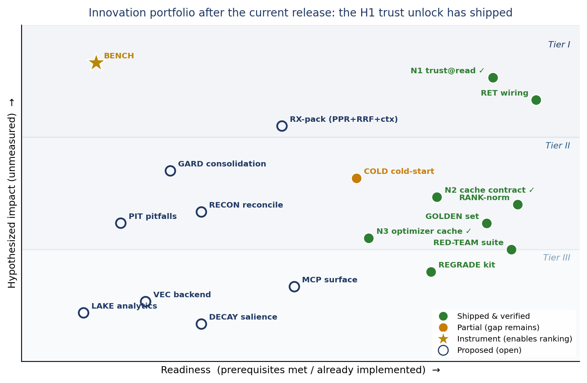

# Innovation Portfolio v2 — Re-Scored After the Current Release

> **Current-release update (post wave 2).** Since the first re-score, a second remediation wave shipped and was independently re-verified by re-running the original exploits. **The flagship item — N1, verify-at-read — has shipped:** the retrieval trust decision now verifies the HMAC signature (`kb_query._tier_grants_trust → verify_document`), so a hand-forged `trust_tier: verified` document is withheld on both read paths. The **N2 cache-contract** residuals (L2 collision / TTL / metadata) and the **N3 budget-honest optimizer cache** are also closed. The trust layer is therefore no longer "one enforcement point away" — it is *load-bearing today*. My independent score moved **2.9 → 3.8 → 4.2/5**, clearing the GO bar on the security-relevant dimensions. Three LOW/cosmetic defects and one documentation-hygiene gate remain open; a formal independent re-grade is pending. The rows below are updated accordingly.

**What this is.** The 2026-07-19 Innovation Portfolio was written against the *pre-remediation* codebase. Across two disciplined remediation waves the team closed the work this portfolio identified, each wave verified by re-running the original exploits. That verification **changes the status of roughly half of the portfolio**: many items that were *proposed* on 2026-07-19 are now *shipped* or *partial*, the retrieval-quality pack moved from *blocked* to *reachable*, and the three new opportunities the re-audit surfaced (N1/N2/N3) have **all shipped**. This document re-scores accordingly. **The opportunity theses and the six MECE opportunity spaces are unchanged — only readiness and status move.** The full concept briefs remain valid in `innovation-portfolio-2026-07-19.md`.

---

## 1. Executive Summary

### 1.1 The headline change

On 2026-07-19 the portfolio's central tension was that Mnemox's differentiated assets (graph, embeddings, trust design) were **built but unwired**, so the highest-leverage innovations were really *remediations*. **That tension is now resolved.** Retrieval is wired into production; ranking is normalized; the integrity gates, golden set, poisoning red-team suite, compound-loop demo, and re-grade kit shipped in wave 1; and **wave 2 shipped the flagship trust unlock (N1, verify-at-read) plus the cache-contract (N2) and optimizer-cache (N3) items.** The portfolio is therefore no longer "unblock the assets" and no longer "make the trust layer load-bearing" — the trust layer *is* load-bearing. What remains is **"compound quality on the now-trusted retrieval path (RX-pack), and measure impact so the ranking becomes empirical (BENCH)."**

### 1.2 Three movements (updated)

1. **Shipped & verified (across both waves):** retrieval wiring (RET), ranking normalization (RANK-norm), the golden set (GOLDEN), the poisoning red-team suite (RED-TEAM, now 51 tests), the write→retrieve→compound demo (COMPOUND), the re-grade kit (REGRADE), **and — new in wave 2 — N1 verify-at-read, N2 cache-contract, and N3 optimizer-budget cache.** Cold-start bounding (COLD) remains **partial** (bounded/budget-gated, but the "<3k-token" target is unmet at ~11.3k).
2. **Newly reachable, still open (top quality lever):** the **Retrieval-Excellence Pack** (RX-pack) — query-seeded Personalized PageRank, reciprocal-rank fusion, and contextual chunking. None is in the code yet (the blend is a weighted sum with global PageRank), but its prerequisite — a wired *and now trusted* retrieval path — is satisfied, so it is *build-ready*. Now that trust and wiring are done, this is the single highest-value open item for *quality*.
3. **The re-audit's three new opportunities have all shipped:** N1 (verify-at-read), N2 (multi-tier cache contract — L2 collision/TTL/metadata closed), and N3 (budget-honest optimizer cache). What replaces them as the leading open work is RX-pack (quality) and BENCH (measurement).

### 1.3 The one-sentence re-prioritization (updated)

*The flagship differentiator — auditable, trust-tiered memory — is now **real and verified** (N1 shipped); the biggest remaining quality lever is RX-pack, now buildable on a wired-and-trusted retrieval path; and the top instrument (BENCH) is unchanged as \#1, because nothing yet measures **cost-per-resolved-task** — until it does, everything else is ranked by hypothesized, not measured, impact.*

---

## 2. Status Register (re-scored)

Legend: ✔ **Shipped** (verified against the current tree by re-running the exploit) · ◐ **Partial** (shipped with a named gap) · ○ **Proposed** (open) · ★ **Instrument**. "Evidence" cites the 2026-07-20 re-audits and the current-release re-verification.

| Code / item | v1 tier | Status now | Evidence (verified today) |
|---|---|---|---|
| **RET** — reconnect semantic retrieval (index+graph into production) | Tier I (proposed) | **✔ Shipped** | `KnowledgeBaseQuery(index=, graph=, graph_weight=0.3)`; `research_agent.py` constructs it wired; `#slug` bug fixed; index path used, not full-scan (CODE-01/02 FIXED) |
| **RANK-norm** — ranking normalization / anti-gaming | Tier I/II (proposed) | **✔ Shipped** | BM25 TF saturation (400 occ→2.49, cap 2.5); gaming ratio 18×→1.48× (ATK-MEM-03 FIXED) |
| **GOLDEN** — committed golden retrieval set in CI (C14) | Tier II (proposed) | **✔ Shipped** | `tests/retrieval/test_golden_set.py`, `test_wiring.py`, `test_ranking_normalization.py` present and passing (14 tests) |
| **RED-TEAM** — poisoning red-team suite (C16) | Tier II (proposed) | **✔ Shipped** | `tests/security/` (path containment, cache integrity, prompt-injection boundary, graph poisoning, trust tier, provenance attestation) — **51 tests passing** |
| **N1** — verify-at-read (trust from signature, not plaintext tier) | — (new, was flagship open) | **✔ Shipped (wave 2)** | `kb_query._tier_grants_trust` → `verify_document`; forged / bogus-sig / tamper-after-sign `trust_tier: verified` all **withheld**, genuine signed doc served — on both scan and index read paths (ATK-MEM-02 CLOSED) |
| **TRUST/provenance** — trust tier + quarantine + review gate (C15) | Tier I (proposed) | **✔ Shipped** | `src/provenance.py` (HMAC sign, quarantine, `kb-promote`) + read-boundary verification (N1). The differentiator is now load-bearing, not decorative |
| **N2 cache contract** — unified L1/L2 semantics + collision-resistant keys | — (new) | **✔ Shipped (wave 2)** | ATK-FS-02/04/05 CLOSED: L2 no longer serves a colliding payload, `contains()` honours TTL, `set()` copies caller metadata (re-verified by re-running the exploits) |
| **N3** — budget-honest optimizer cache | — (new) | **✔ Shipped (wave 2)** | cache key folds `max_tokens`; a stricter cap is no longer served the earlier looser result (NEW-1 CLOSED) |
| **COMPOUND** — foreign-repo / compound-loop demonstration (C's R17) | Tier III (proposed) | **✔ Shipped (seed)** | commit "reproducible write→retrieve→compound demo (MEM-13)"; `--allow-external` enables out-of-cwd analysis |
| **REGRADE** — commission independent re-grade (C's R14) | H2 (proposed) | **✔ Shipped (kit); verdict pending** | re-grade kit + independent-grader handoff committed; A+ withdrawn in STATUS; *the 2026-07-20 re-audits are inputs; a formal external verdict is pending* |
| **COLD** — compact cold-start index (C2) | Tier II (proposed) | **◐ Partial** | `src/cold_start.py` bounds + budget-gates the map (MEM-08); **but "<3k" target not met — map ~11.3k tokens today** |
| **RX-pack** — query-seeded PPR + RRF fusion + contextual chunking (C1) | Tier I (blocked) | **○ Proposed — now reachable (top quality lever)** | No RRF, no seeded PPR, no contextual chunking in `src/` today; blend is weighted-sum with global PageRank. Prerequisites (wired **and trusted** retrieval) now met |
| **BENCH** — end-to-end cost/benefit benchmark | Tier I (proposed) | **★ Proposed (unchanged #1)** | No cost-per-resolved-task / with-vs-without-memory / ablation harness found; re-grade kit measures grade, not benefit |
| **GARD** — sleep-time consolidation (C5) | Tier II | **○ Proposed** | curation primitives seeded (archived trust tier, `kb-promote`) but no dedup/distill/supersession pass |
| **RECON** — write-time add/update/delete/no-op reconciliation (C6) | Tier II | **○ Proposed** | `kb-promote` is a manual promote, not reconciliation |
| **PIT** — failure/pitfalls memory (C10) | Tier II | **○ Proposed** | not present |
| **MCP** — Mnemox MCP server surface (C18) | Tier III | **○ Proposed** | no Mnemox MCP server in `src/` (only `.bob` skill refs + `mcp.json.example`) |
| **VEC / LAKE / PORT / DECAY / LLMS** — enterprise vector backend, lakehouse analytics, portable exporter, salience, llms.txt index | Tier III | **○ Proposed** | none present (Docling ingestion likewise not implemented — the `ingest` matches are the existing `analyze_and_ingest` pipeline, not document ingestion) |

---

## 3. The Three New Opportunities — Now All Shipped

The 2026-07-20 re-audit surfaced three high-leverage opportunities from its residuals. In wave 2 the team **shipped all three**, each re-verified by re-running the original exploit.

**N1 — Make trust load-bearing at the read boundary (✔ shipped).** The retrieval path now decides trust on the **HMAC signature**, not the plaintext `trust_tier:` field: `kb_query._tier_grants_trust()` calls `verify_document()`, so a hand-forged, bogus-signature, or tamper-after-sign `trust_tier: verified` document is **withheld** (content replaced by a placeholder) while a genuinely signed document is served — confirmed on both the full-scan and index read paths (ATK-MEM-02 CLOSED). This converts the "auditable, trust-tiered memory" differentiator from decorative to real and delivers the "memory whose write path is a security control" positioning the v1 portfolio identified as the enterprise moat. It was the flagship open item; it is now done.

**N2 — A consistent multi-tier cache contract (✔ shipped).** The L1-only cache fixes were pushed into L2: the semantic cache no longer serves a colliding attacker payload for a distinct victim query, `contains()` honours TTL, and `set()` copies the caller's metadata dict (ATK-FS-02/04/05 CLOSED, re-verified). The residual class that shared the "fix-the-vulnerable-layer" root cause is closed.

**N3 — A budget-honest optimizer cache (✔ shipped).** The optimizer cache key now folds `max_tokens`, so a later `optimize()` with a stricter cap no longer returns the earlier looser result (NEW-1 CLOSED). The optimizer is now safe for the use case it exists for — fitting a context window.

**What remains (minor).** Three LOW/cosmetic defects are still open (date filter fail-open on the index path; per-node edge cap counts only originated edges, global cap holds; a spurious clean-checkout staleness warning), plus one documentation-hygiene gate (a savings figure published without a manifest citation). These are cleanup, not opportunities.

---

## 4. Re-Prioritized Roadmap

The horizons are re-cut around the current release: **H1 ("Make it real") is essentially delivered** — the trust unlock and cache/optimizer items shipped.

| Horizon | Contents | Rationale |
|---|---|---|
| **H1 — Make it real (days)** | ✔ **N1 trust@read** · ✔ **N2 cache contract** · ✔ **N3 optimizer-budget cache** — *done*. Remaining: **COLD** finish (hit the <3k target) · close the 3 LOW/cosmetic residuals · clear the doc-hygiene gate | The flagship trust unlock and the residual-class fixes are shipped and verified; only minor cleanup and the cold-start target remain. |
| **H2 — Compound quality (weeks)** | **RX-pack** (seeded PPR + RRF + contextual chunking) — now the top open item · **BENCH** (the cost/benefit instrument) · **GARD** consolidation · **PIT** pitfalls memory · **RECON** reconciliation | With trust and wiring done, RX-pack is the biggest remaining quality lever. BENCH remains \#1-by-principle: nothing else can be *ranked by impact* until it exists. |
| **H3 — Reach & scale (months)** | **MCP** surface · **VEC** enterprise vector backend · **LAKE** lakehouse analytics · Docling ingestion · **PORT** exporter · **DECAY** salience | Ecosystem/scale items; unchanged from v1, still gated on H2. |

**Sequencing note.** With no open HIGH remaining, the pending independent re-grade can now score a security-clean tree. RX-pack should be measured against BENCH once BENCH exists — otherwise its precision claims are, per this project's own methodology, unranked hypotheses.

---

## 5. Reconciliation With the Two Integrated Deliverables — Now Aligned

Both integrated deliverables have been updated to the current release and are consistent with this re-score:

- **arXiv paper (`paper/mnemox.tex`) — updated.** The paper now frames the work as a two-wave audit→remediate→re-verify loop (score 2.9 → 3.8 → 4.2/5); §8 Security reports verify-at-read as *enforced* (forged tier withheld); the retrieval result is stated honestly at keyword parity on the default backend; and the §9 agenda table marks N1, the cache contract, and the optimizer cache as *shipped*, leaving RX-pack and BENCH as the leading open items. The scorecard and impact-readiness figures were regenerated to the current state.
- **Proposed README (`README.proposed.md`) — updated.** §14 Roadmap and §13 Security reflect shipped-vs-partial-vs-proposed and foreground RX-pack/BENCH as the remaining work now that the trust layer is enforced.

---

## 6. Bottom Line

The two remediation waves did not invalidate the innovation portfolio — they **delivered its highest-value tier.** The flagship trust differentiator is now real and verified (N1 shipped: a forged trust tier is withheld); the cache-contract and optimizer-cache items are closed; roughly half the roadmap is now delivered; and what remains is a genuine quality lever (RX-pack, now buildable on a wired-and-trusted path) and the measurement instrument (BENCH) that would let the rest be ranked by real impact. The re-scored portfolio is smaller, sharper, and — because every "shipped" here was re-verified by re-running the exploit against the current code — trustworthy in exactly the way this project has taught itself to demand.

*Companion to `innovation-portfolio-2026-07-19.md` (concept briefs, full 24-candidate register) and `master-engagement-reaudit-2026-07-20.md` (the verification basis). STATUS.md remains canonical for maturity.*
