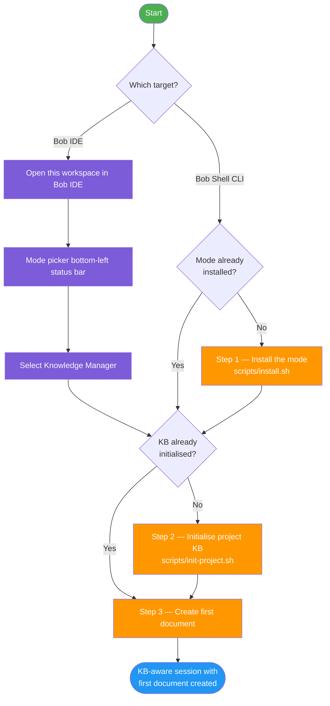

# Quick Start Guide

**Version:** 2.1
**Last updated:** 2026-07-16
**Standard:** arc42 / Tier-1
**Scope:** 5-minute onboarding guide — Bob Shell CLI and Bob IDE

---

## Table of Contents

1. [What this guide achieves](#1-what-this-guide-achieves)
2. [Prerequisites](#2-prerequisites)
3. [Step 1: Install the mode (~2 min)](#3-step-1-install-the-mode-2-min)
4. [Step 2: Initialise your project KB (~1 min)](#4-step-2-initialise-your-project-kb-1-min)
5. [Step 3: Your first document (~2 min)](#5-step-3-your-first-document-2-min)
6. [Verify your setup](#6-verify-your-setup)
7. [Troubleshooting](#7-troubleshooting)
8. [Next steps](#8-next-steps)
9. [Glossary](#9-glossary)

---

## 1. What this guide achieves

By the end of this guide you will have a **KB-aware session with your first document created** — whether you are using Bob Shell CLI or Bob IDE.

The installation steps are independent: if you have already completed an earlier step, the flowchart below shows you exactly where to re-enter. **Bob IDE users skip Step 1 entirely.**



---

## 2. Prerequisites

| Dependency | Required for | Minimum version | Purpose |
|---|---|---|---|
| Bob Shell CLI | Bob Shell CLI path | Any version with `customModes` support | Runs the knowledge-manager mode via terminal |
| Bob IDE | Bob IDE path | Bob IDE 1.121.0+ with bob2.0.1+ | VS Code / Cursor extension with mode picker |
| Bash | Bob Shell CLI path | 3.2 | Executes all scripts |
| Git | Both | Any | Project-directory detection in `init-project.sh` |
| Pandoc | Bob Shell CLI path | Any | KB export to HTML/PDF |

### Verify your environment

Run each command below before proceeding. A missing dependency will be reported with an error; all others print a version string.

```bash
# Bob Shell — must print a version; must support customModes
bob --version

# Bash — must be 3.2 or higher
bash --version | head -1

# Git — optional, but recommended for project detection
git --version

# Pandoc — optional, only needed for export
pandoc --version | head -1
```

---

## 3. Step 1: Install the mode (~2 min)

> **Bob IDE users — no install needed.**
> Open this workspace (`bob-llmwiki-knowledge-manager`) in Bob IDE. Click the **mode picker** in the bottom-left status bar, scroll to and select **🧠 Mnemox Knowledge Builder**. The mode is already registered in `.bob/custom_modes.yaml`. **Skip directly to [Step 3](#5-step-3-your-first-document-2-min).** See [BOB-IDE-GUIDE.md](BOB-IDE-GUIDE.md) for full Bob IDE details.

---

### Command (Bob Shell CLI)

Run this from inside the `bob-llmwiki-knowledge-manager` repository root:

```bash
cd ~/Projects/bob-llmwiki-knowledge-manager
./scripts/install.sh
```

### Expected terminal output

```
🚀 Installing Bob Shell Knowledge Manager...
📁 Bob Shell config: /Users/<you>/.bob
📝 Installing knowledge-manager mode...
📝 Installing recommended settings...

✅ Installation complete!

Next steps:
1. Initialize a knowledge base in your project:
   cd ~/Projects/your-project
   ~/Projects/bob-llmwiki-knowledge-manager/scripts/init-project.sh

2. Start Bob Shell in knowledge-manager mode:
   bob --chat-mode=knowledge-manager
```

> **If `custom_modes.yaml` already exists** the script backs it up automatically before overwriting:
> ```
> ⚠️  custom_modes.yaml already exists
> Backing up to custom_modes.yaml.backup
> ```

### What was created

| Path | Description |
|---|---|
| `~/.bob/custom_modes.yaml` | Mode definition — consumed by Bob Shell on every startup |
| `~/.bob/settings.json` | Recommended global settings (only if not already present) |

### Architectural context

This step copies the [knowledge-manager mode definition](../config/custom_modes.yaml) into Bob Shell's **global configuration directory** (`~/.bob/` or `~/.config/bob/`, whichever exists). After this step, **all Bob Shell sessions on this machine** can use the `knowledge-manager` mode — no per-project setup is required. The mode definition grants read + markdown-edit + command + browser tool groups to the Bob Shell agent.

---

## 4. Step 2: Initialise your project KB (~1 min)

### Command

Navigate to **your own project** (not the `bob-llmwiki-knowledge-manager` repo) and run:

```bash
cd ~/your-project
~/Projects/bob-llmwiki-knowledge-manager/scripts/init-project.sh
```

### Expected terminal output

```
📚 Initializing Knowledge Base...
📁 Creating directory structure...
📝 Creating INDEX.md...
📁 Creating .bob directory...
📝 Creating .bob/settings.json...

✅ Knowledge base initialized!

Directory structure:
  docs/knowledge-base/
  ├── INDEX.md
  ├── concepts/
  ├── guides/
  ├── references/
  └── research/

Next steps:
1. Start Bob Shell: bob --chat-mode=knowledge-manager
2. Try: 'Research [topic] and create a concept document'
```

> **If your project root contains no `.git`, `package.json`, or `pyproject.toml`** the script will warn you and ask for confirmation before continuing.

### What was created

| # | Path | Description |
|---|---|---|
| 1 | `docs/knowledge-base/concepts/` | Category directory for core concepts |
| 2 | `docs/knowledge-base/guides/` | Category directory for how-to guides |
| 3 | `docs/knowledge-base/references/` | Category directory for API docs and specs |
| 4 | `docs/knowledge-base/research/` | Category directory for research notes |
| 5 | `docs/knowledge-base/index.md` | Master index — auto-updated by the mode |
| 6 | `.bob/settings.json` | Auto-loads `INDEX.md` into Bob Shell's context |

### Expected directory tree

```
your-project/
├── .bob/
│   └── settings.json          ← tells Bob Shell to auto-load INDEX.md
└── docs/
    └── knowledge-base/
        ├── INDEX.md            ← master index
        ├── concepts/           ← core concepts and definitions
        ├── guides/             ← how-to guides and tutorials
        ├── references/         ← API docs and specifications
        └── research/           ← research notes and findings
```

### Architectural context

This step creates the **KB directory contract** — the fixed directory layout that all `scripts/*.sh` scripts, the `validate-kb.sh` validator, and the `knowledge-manager` mode's `customInstructions` depend on. Changing the layout breaks these consumers. The `.bob/settings.json` file uses the `context.fileName` key to ensure `INDEX.md` is always present in the Bob Shell context window, enabling the agent to maintain cross-references automatically.

---

## 5. Step 3: Your first document (~2 min)

### Option A — Bob Shell CLI (recommended)

1. **Activate the mode** in your project directory:
   ```bash
   bob --chat-mode=knowledge-manager
   ```

2. **Send an example prompt:**
   ```
   Research "microservices architecture" and create a concept document
   ```

**What Bob will do — the 7-step document-creation workflow:**

| Step | Action | Output |
|---|---|---|
| 1 | Determine category | `concepts/` (concept document) |
| 2 | Select template | `concept.md` template applied |
| 3 | Apply naming convention | `microservices-architecture.md` |
| 4 | Populate all standard sections | Full markdown document written |
| 5 | Save key facts to memory | `save_memory` tool called *(Bob Shell CLI only)* |
| 6 | Add cross-references | Links to related documents inserted |
| 7 | Update INDEX.md | Entry added under `### Concepts` |

> This workflow is defined verbatim in the `customInstructions` of the [`knowledge-manager` mode](../config/custom_modes.yaml:180).

---

### Option A2 — Bob IDE mode picker

1. **Select the mode** using the mode picker (bottom-left status bar → **🧠 Mnemox Knowledge Builder**).

2. **Activate the skill** at the start of your session:
   ```
   use_skill("knowledge-manager")
   ```
   This loads the full document templates, cross-reference protocol, and INDEX.md maintenance instructions from [`.bob/skills/knowledge-manager/SKILL.md`](../.bob/skills/knowledge-manager/SKILL.md).

3. **Send an example prompt:**
   ```
   Research "microservices architecture" and create a concept document
   ```

> **Persistence note:** Bob IDE does not have `save_memory`. All knowledge is persisted by writing markdown files to `docs/knowledge-base/`. Commit to Git to make changes durable.

---

### Option B — Manual template copy

If you prefer not to use Bob Shell for the first document:

```bash
# Copy the concept template into the KB
cp ~/Projects/bob-llmwiki-knowledge-manager/config/templates/concept.md \
   docs/knowledge-base/concepts/microservices-architecture.md

# Open the file and fill in the sections
# Then update docs/knowledge-base/index.md manually
```

---

## 6. Verify your setup

Run through each item below in order. Every command prints its expected output on success.

### Checklist

**① Mode file exists**
```bash
ls -1 ~/.bob/custom_modes.yaml
```
Expected output:
```
/Users/<you>/.bob/custom_modes.yaml
```

---

**② Four KB category directories exist**
```bash
ls -1 docs/knowledge-base/
```
Expected output (order may vary):
```
INDEX.md
concepts
guides
references
research
```

---

**③ INDEX.md is present and non-empty**
```bash
wc -l docs/knowledge-base/index.md
```
Expected output: a line count greater than 0, e.g.:
```
      71 docs/knowledge-base/index.md
```

---

**④ validate-kb.sh passes with zero errors**
```bash
~/Projects/bob-llmwiki-knowledge-manager/scripts/validate-kb.sh
```
Expected output (when at least one document has been created):
```
🔍 Validating Knowledge Base...
✅ INDEX.md exists
✅ Directory exists: concepts
✅ Directory exists: guides
✅ Directory exists: references
✅ Directory exists: research

🔗 Checking for broken links...
✅ No broken links found

📊 Knowledge Base Statistics:
  Concepts:    1
  Guides:      0
  References:  0
  Research:    0
  Total:       2
```

---

**⑤ First document exists (Option A) or was copied (Option B)**
```bash
ls -1 docs/knowledge-base/concepts/
```
Expected output:
```
microservices-architecture.md
```

---

## 7. Troubleshooting

### T0 — Bob IDE: 🧠 Mnemox Knowledge Builder not in mode picker

| Field | Detail |
|---|---|
| **Symptom** | The mode picker does not show **🧠 Mnemox Knowledge Builder** |
| **Cause** | Bob IDE has not picked up `.bob/custom_modes.yaml`, or the workspace was opened before the file was written |
| **Fix 1** | Reload the Bob IDE window: **Cmd+Shift+P → Developer: Reload Window** |
| **Fix 2** | Make a trivial edit to [`.bob/custom_modes.yaml`](../.bob/custom_modes.yaml) (add and remove a space), then save — Bob IDE hot-reloads on file change |
| **Fix 3** | Confirm the file exists: `ls .bob/custom_modes.yaml` and contains the `knowledge-manager` slug: `grep knowledge-manager .bob/custom_modes.yaml` |

See [BOB-IDE-GUIDE.md — Troubleshooting](BOB-IDE-GUIDE.md#10-troubleshooting) for additional Bob IDE issues.

---

### T1 — `❌ Bob Shell config directory not found`

| Field | Detail |
|---|---|
| **Symptom** | `install.sh` exits with this message |
| **Cause** | Neither `~/.bob/` nor `~/.config/bob/` exists — Bob Shell is not installed or has never been started |
| **Fix** | Install Bob Shell and start it at least once so it creates its config directory, then re-run `./scripts/install.sh` |

---

### T2 — Mode does not appear in Bob Shell after install

| Field | Detail |
|---|---|
| **Symptom** | `knowledge-manager` is absent from the mode selector |
| **Cause** | Bob Shell loaded its config before `install.sh` ran; or `custom_modes.yaml` was written to the wrong directory |
| **Fix** | Confirm the file exists: `cat ~/.bob/custom_modes.yaml \| grep knowledge-manager`. If the file is present, restart Bob Shell completely. If absent, re-run `install.sh` from inside the repository root. |

---

### T3 — `❌ Knowledge base directory not found: docs/knowledge-base`

| Field | Detail |
|---|---|
| **Symptom** | `validate-kb.sh` exits with this message |
| **Cause** | `init-project.sh` has not been run in the current working directory |
| **Fix** | `cd` into your project directory and run `~/Projects/bob-llmwiki-knowledge-manager/scripts/init-project.sh` |

---

### T4 — `⚠️  Warning: This doesn't look like a project directory`

| Field | Detail |
|---|---|
| **Symptom** | `init-project.sh` pauses and prompts for confirmation |
| **Cause** | The current directory contains no `.git`, `package.json`, or `pyproject.toml` |
| **Fix** | Either run the script from inside a recognised project root, or type `y` to proceed anyway (safe to do so — the script only creates files under `docs/knowledge-base/` and `.bob/`) |

---

### T5 — `❌ Broken link in …: ./some-file.md`

| Field | Detail |
|---|---|
| **Symptom** | `validate-kb.sh` reports one or more broken internal links |
| **Cause** | A document contains a relative markdown link to a file that does not exist (e.g. a cross-reference to a document that was deleted or renamed) |
| **Fix** | Open the reported file, find the broken link, and either update the link target or remove the reference. Re-run `validate-kb.sh` to confirm. |

---

## 8. Next steps

| Goal | Resource |
|---|---|
| Understand all available prompts and workflows | [docs/USAGE.md](USAGE.md) |
| See end-to-end scenario walkthroughs | [docs/WORKFLOWS.md](WORKFLOWS.md) |
| Customise templates, categories, or mode behaviour | [docs/CUSTOMIZATION.md](CUSTOMIZATION.md) |
| Browse worked KB examples | [`examples/`](../examples/) directory |

---

## 9. Glossary

**knowledge-manager mode**  
A named Bob Shell operating mode defined in `config/custom_modes.yaml` (slug: `knowledge-manager`). When active, the Bob Shell agent follows the 7-step document-creation workflow and is constrained to read, markdown-edit, command, and browser tool groups.

---

**custom_modes.yaml**  
A YAML file placed in the Bob Shell global config directory (`~/.bob/custom_modes.yaml` or `~/.config/bob/custom_modes.yaml`). It declares one or more custom modes — each with a slug, display name, role definition, usage criteria, and tool-group restrictions — that Bob Shell loads on startup.

---

**KB directory contract**  
The fixed four-category directory layout under `docs/knowledge-base/` (`concepts/`, `guides/`, `references/`, `research/`) plus `INDEX.md`. All scripts in `scripts/` and the mode's `customInstructions` assume this layout. Altering it without updating those consumers will break validation and cross-reference maintenance.

---

**INDEX.md**  
The master index file at `docs/knowledge-base/index.md`. It is automatically loaded into the Bob Shell context window (via `.bob/settings.json`) and is updated by the agent at the end of every document-creation workflow (Step 7 of 7). It serves as the agent's primary navigation map for cross-referencing.

---

**save_memory** *(Bob Shell CLI only)*  
A Bob Shell built-in tool called by the `knowledge-manager` mode during document creation (Step 5 of 7). It persists key facts extracted from a document into the agent's long-term memory store, making those facts retrievable in future sessions without re-reading the source file.
