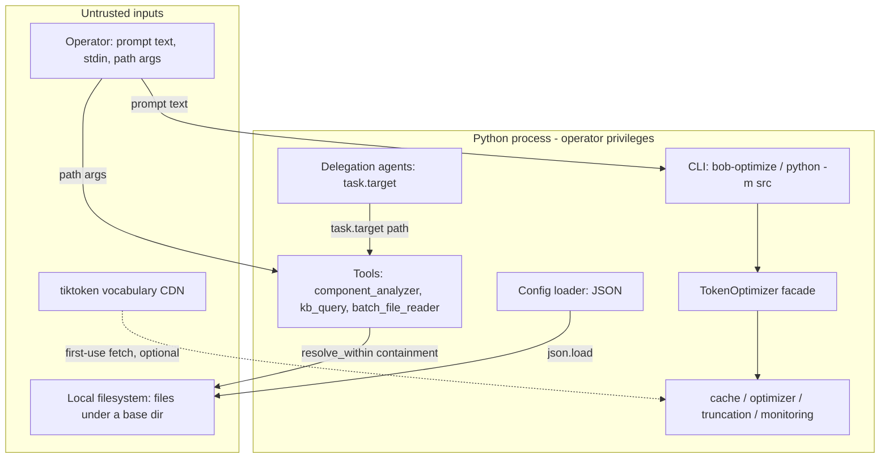

# Threat Model (STRIDE)

**Status:** Active
**Date:** 2026-07-14
**Method:** STRIDE, grounded in a full read of the codebase
**Supersedes:** the informal "Threat Model" section of
[`docs/adr/012-security-model.md`](../adr/012-security-model.md) (which
described a security stack that was never implemented — see that file's
retraction banner)

This document is the canonical security analysis for
`bob-llmwiki-knowledge-manager`. It is deliberately grounded in what the code
actually does, with `path:line` citations, rather than an aspirational control
list. Where a STRIDE category does not apply, it says so and why — an honest
"not applicable" is more useful than a fabricated mitigation.

## Deployment context (read this first)

The system is a **local Python library and CLI** — `bob-optimize` /
`python -m src` over the `TokenOptimizer` facade, plus a set of local
knowledge-base tools under `src/tools/`. It runs **with the invoking user's own
privileges**. It:

- opens **no listening socket** and exposes **no network service**;
- has **no authentication, authorization, session, or user model** — there is
  one local user, the operator;
- reads and stores **no credentials, API keys, or secrets**
  (`src/config/manager.py:149` is the only `os.environ` access, and it reads
  only `CONFIG_`-prefixed overrides);
- makes **no outbound network calls** from `src/` except tiktoken's optional
  first-use vocabulary download (`src/optimizer/token_counter.py:38-46`);
- persists the cache **entirely in memory** (`src/cache/exact_cache.py:66`,
  `src/cache/semantic_cache.py:86`) — no disk writes, no serialization.

Severities below are stated in this local-CLI frame. Several would rise if the
library were ever wrapped in a hosted, multi-tenant service — that is called
out where relevant, and any such deployment must re-run this analysis.

## Trust boundaries

The boundaries that matter — where untrusted data crosses into the process:

1. **CLI prompt text / stdin** (`src/cli.py:27-29,59-72`) — the primary input.
   It flows into a pure string/integer pipeline (count, optimize, truncate).
2. **Path arguments to the tools** (`component_analyzer`, `kb_query`,
   `batch_file_reader`) and, transitively, the delegation agents' `task.target`.
3. **Config file** (`src/config/manager.py:116-134`) — JSON, not on the default
   CLI path; only reached if a caller invokes `load_from_file`.
4. **tiktoken vocabulary fetch** — the sole outbound path.

## Assets

- **Local files** the operator did *not* intend a tool to read (the target of
  the path-traversal finding below).
- **Availability** of the local process (the DoS considerations).
- There are **no confidentiality assets inside the process** in the usual sense:
  no secrets, no other users' data, no persisted cache.

## STRIDE analysis

| Category | Applies? | Finding | Status |
| --- | --- | --- | --- |
| **S**poofing | No | No identity, authentication, or session exists — single local operator. Nothing to spoof. | N/A |
| **T**ampering | Low | Library APIs write to caller-supplied paths (`config/manager.py:374`, `monitoring/cost_reporting.py:161-176`); not reachable from the `bob-optimize` CLI. Cache is in-memory (`exact_cache.py:66`) — no on-disk cache to poison, no deserialization anywhere (no `pickle`/`eval`/unsafe-YAML). | Residual (accepted) |
| **R**epudiation | No | No multi-user actions to attribute. Logging hashes cache keys (`monitoring/logger.py:140`) and records only token counts/latency/strategy — no prompt text or secrets are logged. | N/A |
| **I**nformation disclosure | **Yes** | **Path-traversal reads** in the tool layer — (a) an unbounded `base / user_path` join let `../`/absolute paths escape the base, and (b) `rglob`-discovered leaves (including a symlink planted inside a validated directory) were read without a second containment check (`component_analyzer.py`, `kb_query.py`, `batch_file_reader.py`). | **FIXED** (entry paths + discovered leaves) |
| **D**enial of service | Low–Med | Unbounded input / cache growth (issues H-19, L-1): the pipeline does not cap prompt length, and the in-memory cache grows with distinct keys. tiktoken's first-use fetch can fail, but degrades gracefully (`token_counter.py:73-74`, falls back to `chars/4`). | Residual (documented) |
| **E**levation of privilege | No | No privilege model to elevate within. The only subprocess is a hardened, static-argv `git` call (`src/validation/manifest.py:45-58`, list argv, no `shell=True`); no `os.system`/`Popen`/`shell=True` anywhere else. | N/A |

## Information disclosure — the one concrete finding (fixed)

**What it was.** `ComponentAnalyzer`, `KnowledgeBaseQuery`, and
`BatchFileReader` each joined a caller-supplied path onto a fixed base with a
bare `self.base_path / user_path` and then read the result. A value like
`../../../../etc/passwd` (or an absolute path) escaped the intended base and
disclosed arbitrary files. The paths reach these tools untrusted — directly
from each tool's CLI, and for the delegation agents via `task.target`
(`src/delegation/agents/*.py`). Read-only information disclosure; **low severity
in the local-CLI context** (the operator already has filesystem access), but it
would become significant if any of these tools were exposed to untrusted input
behind a service.

**Fix (this phase).** A shared containment helper,
`src/tools/safe_paths.resolve_within(base, untrusted)`, joins, fully resolves
(following `..` and symlinks), and returns the path only if it stays inside the
resolved base — raising `ValueError` otherwise. All three join sites now route
through it and return their existing error dict on refusal. Regression coverage
is in `tests/tools/test_safe_paths.py` (parent-traversal, deep traversal,
absolute-path, and symlink-escape cases at both the helper and each tool).
Committed with the `Phase 7 (A)` change.

**Leaf-level containment (Phase 8 follow-up, 2026-07-14).** Validating only the
*entry* path is not sufficient: `rglob` follows symlinks, so a link planted
inside an already-validated directory could still point outside the base and be
read. Two paths needed the second check:
- `DocumentationAgent` (`src/delegation/agents/documentation_agent.py`) routes
  its untrusted `task.target` through `resolve_within` *before* its `rglob("*.py")`
  scan; coverage in `tests/delegation/test_documentation_agent_containment.py`.
- `ComponentAnalyzer` (`src/tools/component_analyzer.py`) — reached from its own
  CLI and from the security/quality/performance/architecture delegation agents —
  now filters every `rglob`ed leaf through `resolve_within` in
  `_contained_files()`, dropping any whose resolved target escapes the base
  before it is opened. Coverage in
  `tests/tools/test_component_analyzer.py::TestSymlinkContainment` (a symlink to a
  secret outside the base is not enumerated or disclosed; reverting the filter
  turns the test red). `BatchFileReader` already re-checked each file, so all
  three tool read paths now contain both the entry path and the discovered leaves.

## Residual risks (documented and accepted)

These are recorded deliberately, not fixed in this phase. They are acceptable in
the local-CLI deployment context; a hosted deployment must revisit them.

1. **DoS via oversized input / cache growth (H-19, L-1).** The optimize/count
   pipeline does not enforce a maximum input size, and the in-memory cache is
   bounded only by available memory. On a local CLI this is self-inflicted (the
   OS memory limits apply, and the process is the operator's own). A hosted
   wrapper should add an input-length cap and a cache eviction/size bound before
   accepting untrusted volume. Round-2 review classified H-19 as a deployment
   concern rather than a code defect.
2. **Arbitrary-write library APIs.** `ConfigManager.save_to_file`
   (`config/manager.py:364-374`) and the cost exporter
   (`monitoring/cost_reporting.py:161-176`) write to a caller-supplied path.
   Neither is reachable from the `bob-optimize` CLI; both are library calls
   where the caller already chooses the destination. Left as-is; flagged so a
   future service layer does not expose them to untrusted path input.
3. **tiktoken supply-chain / first-use fetch.** `tiktoken` may download its BPE
   vocabulary from a public CDN on first use. The dependency is version-pinned
   (`pyproject.toml`), the SBOM + `pip-audit` supply-chain tooling covers it,
   and the call is wrapped so that a failure degrades to a `chars/4` estimate
   rather than crashing. Accepted.

## Non-risks worth recording (scoping wins)

An honest model is as much about what is *absent* as what is present. Verified
absent across `src/`:

- **No deserialization attack surface** — no `pickle`, `marshal`, `shelve`,
  `eval`, `exec`, `__import__`, or unsafe YAML. Config is JSON-only.
- **No secrets in the process** — no API keys/tokens are read, stored, or
  logged.
- **No network server and no outbound calls** except the tiktoken fetch above.
- **No shell execution** — the only subprocess is the static-argv `git` call.
- **No on-disk cache** — nothing to poison or traverse via cache keys (SHA-256
  keys are dict keys, never file paths).

## Relationship to ADR-012

[`docs/adr/012-security-model.md`](../adr/012-security-model.md) proposed an
authentication/encryption/RBAC/rate-limiting/audit-logging stack and its
Validation section asserted it had been implemented and passed a security
audit. **None of that code exists in `src/`.** That ADR is retained as an audit
trail (with a retraction banner) but is **not** a description of this system's
security posture. This document supersedes it.

## Maintenance

Re-run this analysis when: a network interface or persistence layer is added;
any deserialization, subprocess, or secret-handling is introduced; the tool
layer accepts input from a new untrusted source; or the project is wrapped in a
hosted/multi-tenant service. Security-relevant code (`src/tools/safe_paths.py`,
new I/O boundaries) is owned per `.github/CODEOWNERS`.
